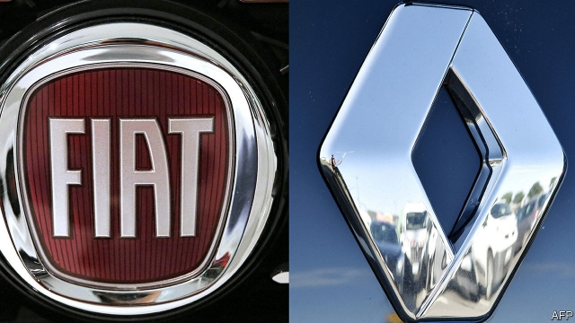

###### Braking bad

# A merger of Fiat Chrysler Automobiles and Renault is no more 

 

> print-edition iconPrint edition | Business | Jun 6th 2019 

SUDDEN, SURPRISING and “transformative”. The description could apply both to the proposed merger between Fiat Chrysler Automobiles (FCA) and Renault announced on May 27th and its demise only ten days later. Late in the evening of June 5th the Italian-American firm, which had approached its French counterpart with the offer, announced that it was withdrawing the proposal. The share prices of both companies fell on the news. The rapid implosion of a deal that was intended to secure the futures of both carmakers as the industry undergoes fundamental change is a huge blow for its architects. It shows that the much-needed consolidation of the car industry will be fiendishly hard to pull off. 

The deal looked like a winner for both parties. Their complementary strengths in regions and products, plus a chance to share investment in electrification and self-driving cars, had convinced John Elkann, the chairman of FCA (who sits on the board of The Economist’s parent company), and Jean-Dominique Senard, his counterpart at Renault, of the wisdom of combining the two firms. This would create the world’s third-biggest carmaker. If Renault’s Japanese partners, Nissan and Mitsubishi, got on board, the firm would become a colossus making 15m cars a year—almost half as much again as their closest competitors. 

So what went so wrong, so quickly, to compel FCA to pull out? The deal, born out of reportedly convivial talks between Mr Elkann and Mr Senard, was greeted with approval by investors. The French government, which has a 15% stake in Renault, seemed amenable. Nissan, Renault’s main alliance partner in which the French firm has a 43% stake, made reassuring noises. 

But, it then emerged, Nissan had been kept in the dark about the deal until the last minute. It worried that the deal’s structure as a 50-50 partnership between shareholders of Renault and FCA did not properly acknowledge Renault’s stake in Nissan, worth some $13bn. And the Japanese firm felt rushed into making a huge strategic decision, not long after it had rejected Renault’s plan for a full merger under Carlos Ghosn, the firm’s former boss who is now fighting charges of financial wrongdoing at Nissan (which he denies). Under the terms of the agreement governing the alliance, a change of control would have allowed Nissan to renegotiate the partnership. It had apparently called for a strategic review. The cost savings of €5bn ($6bn) that FCA claimed for the deal were partly predicated on the continuation of Renault’s alliance with Nissan and Mitsubishi. 

Despite its misgivings, Nissan could have been brought on board, FCA believed. For FCA the main stumbling-block was the French government, which has a habit of being a tricky counterparty in deals involving national champions. Without French support, and acceptance of a 7.5% stake in the merged firm, the deal would not have got this far. But the French wanted control. Sources close to FCA say that the government was constantly second-guessing and renegotiating every aspect of the deal. For FCA this portended future interference. When France pointed the finger at Nissan as a roadblock, FCA lost patience. 

The question is what happens now? Yet another car-industry mega-merger has collapsed—this time before it even got off the ground. It seems unlikely that the deal can be revived. FCA’s disillusionment with the French government seems too great. The rocky relationship between Renault and Nissan is unlikely to be improved by the French government’s finger-wagging. FCA will lick its wounds and may seek another deal. One often mooted partner is PSA Group, the maker of Peugeots and Citroëns. But it was the damning verdict on the now-dead merger issued last week by PSA’s boss, Carlos Tavares, who called it a “virtual takeover” of Renault, that may have thrown a spanner in the works. Engineering the consolidation of the car industry is looking harder than ever.◼ 
<<<<<<< HEAD

-- 

 单词注释:

1.merger['mә:dʒә]:n. 合并, 归并 [经] 购并 

2.fiat['faiæt]:n. 命令, 严命, 许可 [医] 制成, 作成 

3.Chrysler[]:[经] 克莱斯勒 

4.renault[rә'nәu]:n. 法国雷诺公司；雷诺（姓氏） 

5.Jun[dʒʌn]:六月 

6.transformative[træns'fɔ:mәtiv]:a. 有改革能力的, 起改造作用的 

7.FCA[]:[计] 纠错数组, 功能配置审查 

8.demise[di'maiz]:n. 崩, 薨, 死亡 vt. 让渡, 遗赠, 转让 

9.counterpart['kauntәpɑ:t]:n. 副本, 复本, 配对物, 相应物 [经] 副本, 正副二份中之一 

10.implosion[im'plәuʒәn]:[化] 爆聚; 内向爆炸 

11.carmaker['kɑ:,meikә(r)]:n. 汽车制造商 

12.consolidation[kәn.sɒli'deiʃәn]:n. 巩固, 团结, 合并, 加强 [医] 实变 

13.fiendishly['fi:ndiʃli]:adv. 恶魔似, 极坏, 残忍, 凶恶, (非正式)非常聪明, 不简单, 不平凡 

14.complementary[.kɒmpli'mentәri]:a. 补充的, 补足的 [经] 补足的, 补充的 

15.electrification[i.lektrifi'keiʃәn]:n. 起电, 带电, 电气化 [化] 起电 

16.john[dʒɔn]:n. 盥洗室, 厕所, 嫖客 

17.elkann[]:[网络] 埃尔坎 

18.nissan[]:n. 尼桑（日产汽车名） 

19.Mitsubishi[mi'tsubiʃi]:[经] 三菱 

20.colossus[kә'lɒsәs]:n. 巨像, 巨人 

21.quickly['kwikli]:adv. 很快地 

22.reportedly[ri'pɒ:tidli]:adv. 根据传说, 根据传闻, 据报道 

23.convivial[kәn'viviәl]:a. 酒宴的, 欢宴的, 欢乐的 

24.investor[in'vestә]:n. 投资者 [经] 投资者 

25.amenable[ә'mi:nәbl]:a. 服从的, 会接纳的, 有义务的 [法] 服从的, 有责任的, 有服从义务的 

26.alliance[ә'laiәns]:n. 联盟, 联合 [法] 同盟, 联盟, 联姻 

27.reassure[.ri:ә'ʃuә]:vt. 使...安心, 向...再保证 [法] 重新保证, 再保险, 使清除疑虑 

28.partnership['pɑ:tnәʃip]:n. 合伙, 合股, 合作关系 [经] 合伙(合作)关系, 全体合伙人 

29.shareholder['ʃєә.hәuldә]:n. 股东 [法] 股东, 股票持有人 

30.carlo[]:n. 卡洛（男子名） 

31.ghosn[]:[网络] 戈森 

32.wrongdoing['rɒŋ'du:iŋ]:n. 干坏事, 坏事 

33.renegotiate[.ri:ni'gәuʃieit]:vt. 重新谈判 

34.apparently[ә'pærәntli]:adv. 表面上, 清楚地, 显然地 

35.predicate['predikәt]:n. 谓语, 谓项 a. 谓语的 vt. 断定为, 使基于, 意味着, 预言 vi. 断言 [计] 谓词; 判定; 断定 

36.continuation[kәn.tinju'eiʃәn]:n. 继续, 续集, 补编 [医] 连续 

37.misgiving[mis'^iviŋ]:n. 疑虑, 不安, 害怕, 担扰, 疑惧 

38.tricky['triki]:a. 狡猾的, 机敏的 

39.counterparty['kauntə,pɑ:ti]: 合同的一方; 对手方 

40.merge[mә:dʒ]:vt. 使合并, 使消失, 吞没 vi. 合并, 渐渐消失 [计] 合并 

41.constantly['kɒnstәntli]:adv. 不变地, 不断地, 时常地 

42.portend[pɒ:'tend]:vt. 成为...的前兆, 预知, 给与...的警告 

43.roadblock['rәudblɒk]:n. 障碍, 障碍物 

44.revive[ri'vaiv]:vt. 使苏醒, 使复兴, 使振奋, 回想起, 重播 vi. 苏醒, 复活, 复兴, 恢复精神 

45.disillusionment[,disi'lju:ʒәnmәnt]:n. 幻灭,觉醒 

46.rocky['rɒki]:a. 岩石的, 多石的, 像岩石的, 无情的, 摇动的, 摇晃的 

47.moot[mu:t]:n. 大会, 模拟案件, 辩论会 a. 未决议的, 无实际意义的 vt. 讨论, 争论 

48.PSA[]:[化] 酞磺醋胺; 酞磺胺醋酰 [医] 酞酰磺乙酰胺, 酞[酰]磺醋胺, 羟苯甲酰磺乙酰胺 

49.maker['meikә]:n. 制造者, 上帝 [经] 制造者, 出票人 

50.peugeot[]:n. 法国标致（法国汽车公司） 

51.damn[dæm]:n. 一点, 诅咒, 丝毫 interj. 该死, 该死的 vt. 诅咒, 罚...下地狱 vi. 指责, 谴责, 骂...该死, 证明...有罪 

52.verdict['vә:dikt]:n. 裁决, 判决, 判断性意见, 定论, 结论 [法] 定论, 判断, 意见 

53.takeover[]:n. 接管, 接收 [经] 接收 

54.spanner['spænә]:n. 扳手 [化] 扳手; 紧固扳手; 紧固器 
=======
>>>>>>> 50f1fbac684ef65c788c2c3b1cb359dd2a904378

