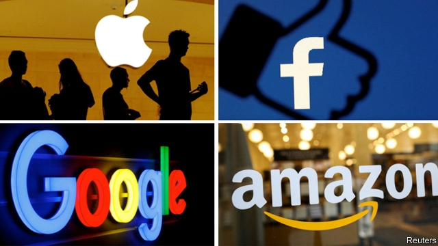
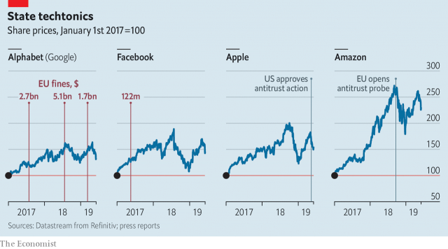

###### Fine by US

# American trustbusters are rattling Google, Amazon, Facebook and Apple 

 

> print-edition iconPrint edition | Business | Jun 6th 2019 

SHARES IN THE biggest internet firms took a nasty tumble on June 3rd, after weekend reports suggested American authorities were limbering up to scrutinise their business models. Just four —Amazon, Facebook, Apple and Alphabet—lost $134bn in market capitalisation in a day, not far off the entire worth of Netflix (which also fell). 

Dealing with competition quibbles is hardly new for Big Tech. European trustbusters have been on their case for two decades. Even whopping fines there have barely registered with investors (see chart). Alphabet, which owns Google, has coughed up $9.5bn across three cases over the past two years (it is appealing). Its valuation rose each time. News of a preliminary probe into Amazon in September dented its share price much less than poor earnings unveiled soon after. 

 

This time is different. The 4.5% drop in the four giants’ market value suggests investors are more worried. Possibly meatier American fines are not the reason: the billions Google has been forced to pay represent less than a tenth of the $134bn in profits it has generated since the first case was opened in November 2010. Even higher penalties can be written off as a cost of doing business. 

More likely, shareholders fret that American authorities could force the firms to change their money-spinning business models. In his confirmation hearing William Barr, America’s attorney-general, said he wanted to “find out more” about how Apple and others had grown so big. Elizabeth Warren, a senator and Democratic presidential hopeful, has said that Facebook should be broken up. If America is picking up where Europe left off, investors are right to be concerned. 

-- 

 单词注释:

1.trustbuster['trʌstbʌstә]:n. 要求解散托拉斯的人 

2.rattle['rætl]:vt. 使嘎嘎响, 喋喋不休地说 vi. 格格响, 喋喋不休 n. 格格声, 拨浪鼓, 喋喋不休的话 

3.google[]:谷歌；搜索引擎技术；谷歌公司 

4.amazon['æmәzɒn]:n. 亚马孙河 [医] 无乳腺者 

5.facebook[]:n. 脸谱网 

6.Jun[dʒʌn]:六月 

7.limber['limbә]:a. 柔软的, 敏捷的, 富于弹性的 vt. 使柔软 vi. 做准备活动 

8.scrutinise[]:vt.vi. 细看, 仔细检查, 审查, 细阅 [经] 详细检查, 细细地看 

9.capitalisation[,kæpitәlai'zeiʃən;-li'z-]:n. <主英>=capitalization 

10.netflix[]:n. 全球十大视频网站中唯一收费站点 

11.quibble['kwibl]:n. 遁词, 双关语 vi. 吹毛求疵, 争吵, 说模棱两可的话 vt. 对...诡辩 

12.tech[tek]:n. 技术学院或学校 

13.whop[hwɒp]:v. 打, 抽出, 打败, 征服 n. 重击, 打击声 

14.investor[in'vestә]:n. 投资者 [经] 投资者 

15.valuation[.vælju'eiʃәn]:n. 评价, 估价, 价值判断 [经] 估价, 计价, 评价 

16.probe[prәub]:n. 探索, 调查, 探针, 探测器 v. 用探针探测, 调查, 探索 

17.dent[dent]:n. 凹痕 vt. 使凹下, 削弱 vi. 塌陷 

18.les[lei]:abbr. 发射脱离系统（Launch Escape System） 

19.earning['ә:niŋ]:n. 收入（earn的现在分词） 

20.unveil[.ʌn'veil]:vt. 揭开, 揭幕, 除去...的面纱 vi. 显露, 除去面纱 

21.meaty['mi:ti]:a. 肉的, 似肉的, 多肉的 

22.penalty['penәlti]:n. 处罚, 刑罚, 罚款, 罚球, 报应, 不利结果, 妨碍 [经] 罚金(款), 违约金 

23.shareholder['ʃєә.hәuldә]:n. 股东 [法] 股东, 股票持有人 

24.fret[fret]:n. 烦躁, 磨损, 焦急, 网状饰物 vi. 烦恼, 不满, 磨损 vt. 使烦恼, 腐蚀, 使磨损, 使起波纹 

25.confirmation[.kɒnfә'meiʃәn]:n. 证实, 证明, 批准, 确认 [计] 确认 

26.william['wiljәm]:n. 威廉（男子名）；[常作W-][美俚]钞票, 纸币 

27.barr[]:abbr. 翻转形态（Bump and Run Reversal） 

28.elizabeth[i'lizәbәθ]:n. 伊丽莎白（女子名） 

29.warren['wɒrәn]:n. 养兔场, 拥挤的地区 

30.senator['senәtә]:n. 参议员, (某些大学的)理事 [法] 参议员, 上议员 

31.presidential[.prezi'denʃәl]:a. 总统制的, 总统的, 首长的, 统辖的 [法] 总统的, 议长的, 总经理的 

