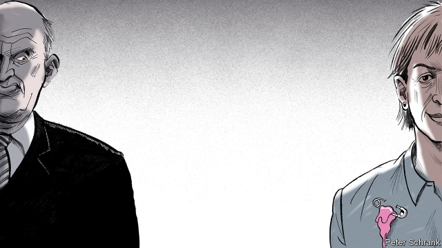

###### Slime of the times

# Estonians are protesting populism by wearing “pink slime” 

 

> print-edition iconPrint edition | Europe | Jun 6th 2019 

ALL OVER Tallinn, people are sporting the same strange accessory: a pink blob the consistency of used chewing gum. It dangles from lapels in libraries, at foreign-policy conferences and in bars in Telliskivi, Bohemian quarter of the Estonian capital. 

Estonians call it “pink slime”. This is not to be confused with the meat slurry used in cheap sausages. In Estonia, “pink slime” started as an insult aimed at liberalism. The Estonian Conservative People’s Party (EKRE), a nationalist outfit, opposes multiculturalism, immigration and gay marriage. Its leader, Mart Helme, says he does not believe in liberal democracy and thinks globalists in Brussels want to erase the identities of Estonia and other countries, turning them all into a uniform post-national mush. The party’s epithet for the ideology it detests is roosa ila, or “pink slime”—a reference to feminism and gay rights, and by extension the rest of the liberal worldview. 

EKRE cannot be ignored. It has been a junior partner in government since April, following an election in which it won 18% of the vote. “Rahva Oma Kaitse”, a satirical radio show, joked that roosa ila would soon be outlawed. On hearing this, Liina Lelov, a jewellery designer, decided to create something for those who identify with it. The pins, which she makes by hand and sells for €5 ($5.50) each, have sold out multiple times. 

In April Kersti Kaljulaid, the president, made a sartorial statement of her own, attending the government’s swearing-in ceremony in a top bearing the words “speech is free”. Days earlier Martin Helme, the incoming finance minister (and son of Mart), had called for “biased” presenters to be removed from the state broadcaster. In the same week Vilja Kiisler, a journalist, quit the country’s largest newspaper, saying she had been asked to tone down her criticism of EKRE by the editor-in-chief—the nephew of the elder Mr Helme. 

Before the swearing-in ceremony was over, there was a new reason to take offence. Mart and Martin Helme posed for photographers making an “OK” hand gesture, which has become associated with white supremacism. (The younger Mr Helme has stated that he wants to “keep Estonia white”.) EKRE seems to be furnishing liberals with fodder for outrage faster than their fashion designers can keep up. 
<<<<<<< HEAD

-- 

 单词注释:

1.slime[slaim]:n. 烂泥, 粘液 vt. 涂上泥 vi. 变粘滑 

2.Estonian[es'tәuniәn]:a. 爱沙尼亚的 n. 爱沙尼亚人, 爱沙尼亚语 

3.Populism['pɒpjulizm]:n. 平民主义, 民粹主义 

4.slime[slaim]:n. 烂泥, 粘液 vt. 涂上泥 vi. 变粘滑 

5.Jun[dʒʌn]:六月 

6.Tallinn['tælin]:塔林[爱沙尼亚共和国首都] 

7.blob[blɒb]:n. 一滴, 小斑点 vt. 溅污 

8.consistency[kәn'sistәnsi]:n. 坚硬性, 黏稠度, 一致性 [化] 稠度; 一致性 

9.dangle['dæŋgl]:vi. 摇晃地悬挂着, 追求 vt. 使摇晃地悬挂 n. 悬垂 

10.lapel[lә'pel]:n. 翻领 

11.bohemian[bәu'hi:mjәn]:n. 波希米亚人, 波希米亚语, 放浪者 a. 波希米亚人的, 放浪的, 波希米亚语的 

12.Estonian[es'tәuniәn]:a. 爱沙尼亚的 n. 爱沙尼亚人, 爱沙尼亚语 

13.slurry['slә:ri. 'slʌ-]:n. 泥浆；悬浮液 

14.Estonia[es'tәuniә]:n. 爱沙尼亚 

15.liberalism['libәrәlizm]:n. 自由主义 

16.nationalist['næʃәnәlist]:n. 国家主义者, 民族主义者 

17.outfit['autfit]:n. 用具, 配备, 机构 vt. 配备, 供应 vi. 得到装备 

18.multiculturalism[ˌmʌltiˈkʌltʃərəlɪzəm]:n. 多元文化 

19.mart[mɑ:t]:n. 商业中心, 市场 [经] 商业中心, 市场 

20.Helme[]:赫尔母 

21.globalists[]:[网络] 全球主义者；全球化分子；环球主义者 

22.Brussel[]:n. 布鲁塞尔（比利时首都） 

23.erase[i'reis]:vt. 抹去, 擦掉 [计] 清洗; 擦除; 抹除; DOS内部命令:从磁盘上删除一个或多个文件 

24.mush[mʌʃ]:n. 浓粥, 感伤的话, 软块 vi. 带狗撬在雪上前进 interj. 走, 前进 

25.epithet['epiθet]:n. 浑名, 绰号, 称号 

26.ideology[.aidi'ɒlәdʒi]:n. 思想体系, 意识形态, 观念学, 空论 [医] 观念学, 观念形态 

27.detest[di'test]:vt. 厌恶, 憎恨 

28.roosa[]: [人名] 鲁萨 

29.ILA['i:lә]:abbr.International Longshoremen's Association国际码头工人联合会 

30.feminism['feminizm]:n. 女权主义, 男女平等主义 [医] 男子女性 

31.worldview['wɜ:ldvju:]:n. 看; 视力; 观点; 目的 

32.cannot['kænɒt]:aux. 无法, 不能 

33.oma['әjmә]:abbr. 有秩序的市场销售协定（orderly marketing agreement） 

34.Kaitse[]:[网络] 谢佳 

35.satirical[sә'tirik(ә)l]:a. 讽刺的, 讥讽的, 好挖苦的, 写讽刺作品的 

36.outlaw['autlɒ:]:n. 被剥夺法律保护的人, 罪犯 vt. 使...失去法律保护, 将...逐出社会, 宣告非法, 取缔 

37.jewellery['dʒu:әlri]:n. 宝石, 贵重饰物, 珠宝, 宝石饰物, 受珍视的人/物, 宝贝, 有价值的人/物 

38.designer[di'zainә]:n. 设计者, 谋划者, 制图者 [计] 设计员 

39.sartorial[sɑ:'tɒ:riәl]:a. 裁缝匠的, 缝工的, 裁缝的 

40.Martin['mɑ:tin]:n. 马丁, 圣马丁鸟 

41.incoming['inkʌmiŋ]:a. 进来的, 刚开始的, 新来的 n. 进来 

42.bias['baiәs]:n. 偏见, 斜纹 a. 偏斜的 adv. 偏斜 vt. 使有偏见 [计] 偏流; 偏压; 偏磁; 偏离 

43.presenter[pri'zentә]:n. 节目主持人, 奉献者, 提出者 [法] 告发者, 提出者, 推荐者 

44.broadcaster['brɒ:dkæstә]:n. 播送者, 广播装置, 播种机 

45.supremacism[sʊp'reməsɪzəm]:n. 至上主义 

46.fodder['fɒdә]:n. 饲料, 草料, 素材, 弹药 vt. 喂 

47.outrage['autreidʒ]:n. 暴行, 侮辱, 愤怒 vt. 凌辱, 虐待, 触犯 
=======
>>>>>>> 50f1fbac684ef65c788c2c3b1cb359dd2a904378

