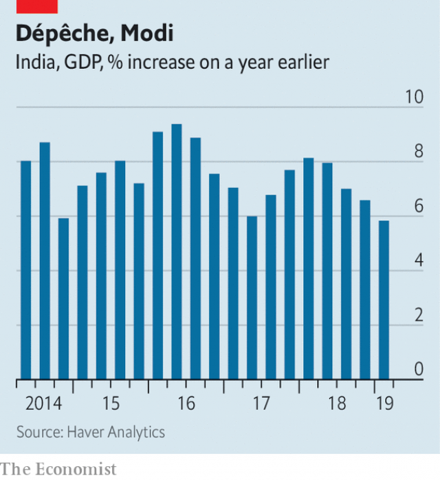

###### Time for a makeover

# In its second term, will India’s ruling coalition be bolder about reform? 

 

> print-edition iconPrint edition | Finance and economics | Jun 6th 2019 

INDIA’S NEW finance minister, Nirmala Sitharaman (pictured below), is an unusual figure in the country’s politics. She is the first woman to head the finance ministry since Indira Gandhi seized the post (while also serving as prime minister) 50 years ago, after nationalising many of India’s banks. She is an economist. But unlike most in her Bharatiya Janata Party (BJP) she hails from the country’s south, having grown up in Tamil Nadu, one of the few big states to resist the BJP’s advances in the recent election. She claims a humbler background than her predecessor, Arun Jaitley. Her father worked for India’s railways and she spent a month selling home furnishings at Habitat, a shop in London. 

Ms Sitharaman thus embodies the BJP’s broadening appeal to aspirational Indians outside its traditional heartlands. But will she help it fulfil those aspirations? On the day she was appointed, India’s statistical authority reported that growth in the first quarter of the year had slipped to 5.8%, its slowest since Narendra Modi was elected prime minister in 2014 (see chart). The government also belatedly released a report it had withheld showing that unemployment had risen to 6.1% in the year ending June 2018. In India, the jobless are often not the poorest, who cannot afford not to work, but the newly educated, qualified for better jobs that have yet to arrive. 

 

The prospects for a quick economic recovery depend partly on the banks Ms Gandhi nationalised. They are responsible for most of the bad loans that have long clogged lenders’ balance-sheets. Optimists point out that the share of bad loans has begun to fall. And several troubled banks have been permitted to expand credit after a more lenient official was put in charge of their regulator, the Reserve Bank of India (RBI), the country’s central bank. 

The RBI cut interest rates for the third time this year on June 6th. It must also keep a close eye on India’s lightly regulated “nonbank” lenders. They have kept credit flowing to households and industry in recent years, financing themselves by selling bonds and commercial paper to yield-hungry mutual funds, until one lender defaulted in September 2018. 

The prospects for a cyclical recovery seem brighter than the chances of deeper reform. Ms Sitharaman is unlikely to enjoy the same autonomy given to Mr Jaitley, a cabinet heavyweight who helped pave Mr Modi’s path into national politics. His departure due to ill health may mean his boss takes a closer interest in economic affairs. That is not necessarily a good thing. 

As chief minister of Gujarat, Mr Modi excelled at drumming up investment from big corporations and breathing down civil servants’ necks. But that approach has translated less well to the role of prime minister, which requires more indirect methods, such as creating the right incentives and delegating to the right people. A bureaucrat quoted in “The Lost Decade”, a new book by Puja Mehra, talks of long, tedious meetings, in which Mr Modi would monitor his policies’ implementation and the civil servant would scoff the peanuts and chickpeas. 

After Mr Modi’s first victory in 2014, liberals hoped the pro-business tub-thumper would become a pro-market prime minister, encouraging investment by liberalising labour and land laws, relying on statecraft, not stagecraft. Instead he became what Indians call “pro-poor”, providing a multitude of redistributive welfare schemes, such as cash handouts for small farmers. 

These schemes seemed inspired by the government’s lingering fear of being outflanked on the left. It largely abandoned its efforts to ease the acquisition of land for industrial purposes after Rahul Gandhi, the leader of the opposition Congress party, accused it of being a “suit-boot ki sarkar”—a government for suited-and-booted corporations. It was slow to help public-sector banks write off their bad loans, in part because it did not want to appear soft on crony capitalists. 

Since this timidity helped win it a second landslide, Mr Modi would seem to have little reason to abandon it. But perhaps his victory has finally killed his fear of the opposition. Ms Sitharaman was described as a “one-person demolition squad” after her impassioned response in parliament to Mr Gandhi’s accusations of government cronyism. Having bulldozed the opposition, perhaps Mr Modi will now feel emboldened not to copy it. ◼ 
<<<<<<< HEAD

-- 

 单词注释:

1.makeover[]:n. 化妆美容；大转变 

2.coalition[.kәuә'liʃәn]:n. 结合体, 结合, 联合 [经] 联合, 联盟 

3.Jun[dʒʌn]:六月 

4.nirmala[]:[网络] 修女酒店；马拉修女；玛拉修女 

5.politic['pɒlitik]:a. 精明的, 明智的, 策略的 

6.Indira[]:n. (Indira)人名；(印、毛里求)英迪拉 

7.Gandhi['gændi:]:n. 甘地 

8.nationalise['næʃәnәlaiz]:vt. 把...收归国有, 使具有某国国籍, 使国有化 

9.economist[i:'kɒnәmist]:n. 经济学者, 经济家 [经] 经济学家 

10.Bharatiya[]:[网络] 巴拉蒂亚 

11.Janata['dʒʌnətɑ:]:n. （印度）人民团体；人民党（印度联合政党） 

12.bjp[]: [医][=Bence Jones protein]本周（氏）蛋白，凝溶蛋白 

13.hail[heil]:n. 冰雹, 致敬, 欢呼, 招呼 vt. 向...欢呼, 致敬, 招呼, 使象下雹样落下 vi. 招呼, 下雹 interj. 万岁, 欢迎 

14.Tamil['tæmil]:n. 泰米尔人, 泰米尔语 

15.Nadu[]:n. (Nadu)人名；(罗)纳杜 abbr. 海军航空研制单位（naval air development unit） 

16.humbler[ˈhʌmblə(r)]: 自感低卑的 

17.predecessor[.predi'sesә]:n. 前任, 先辈, 前身 [医] 初牙, 前辈, 祖先 

18.Arun[]:n. 阿伦（姓氏） 

19.furnishing['fә:niʃiŋ]:n. 家具, 服饰品, 陈设品, 设备 

20.habitat['hæbitæt]:n. 栖息地, 居留地, 自生地, 聚集处 [医] 习生地, 产地, 生境, 栖所 

21.embody[im'bɒdi]:vt. 具体表达, 使具体化 [经] 合并, 具体化, 具体表现 

22.broaden['brɒ:dn]:vi. 变宽, 扩大 vt. 放宽, 使扩大 

23.aspirational[ˌæspəˈreɪʃənl]: 志同的, 有抱负的 

24.heartland['hɑ:tlænd]:n. 心脏地区, 中心地带 

25.narendra[]:[网络] 纳伦德拉；纳兰德；纳然陀 

26.MODI['mәudai]:[计] 模块化光学数字接口 

27.belatedly[bi'leitidli]:adv. 延迟地；延续地 

28.withhold[wið'hәuld]:vt. 使停止, 扣留, 保留, 拒给 vi. 克制, 忍住 

29.jobless['dʒɔblis]:a. 失职的, 无职业的 [经] 失业的 

30.cannot['kænɒt]:aux. 无法, 不能 

31.clog[klɒg]:n. 障碍, 脚坠 v. 障碍, 阻塞 

32.optimist['ɔptimist]:n. 乐观者, 乐观主义者 

33.lenient['li:njәnt]:a. 宽大的, 温和的, 慈悲为怀的 [法] 宽大的, 仁慈的 

34.regulator['regjuleitә]:n. 调整者, 校准者, 校准器, 调整器, 标准钟 [化] 调节剂; 调节器 

35.RBI[,ɑ:bi:'ai,'ribi]:abbr.[棒球] Run Batted In ,打点 

36.nonbank['nɔn'bæŋk]:a. (机构等)非银行的, 与银行无关的, 不由银行办理的 

37.lender['lendә]:n. 出借人, 贷方 [经] 出借者, 贷方, 贷款人 

38.default[di'fɒ:lt]:n. 违约, 不履行责任, 缺席, 默认值 v. 疏怠职责, 缺席, 拖欠, 默认 [计] 默认; 默认值; 缺省值 

39.cyclical['siklik(e)l]:a. 周期的, 轮转的, 循环的, 轮列的, 轮卷的, 环状的, 环的, 组诗的, 始末的 [计] 循环的 

40.autonomy[ɒ:'tɒnәmi]:n. 自治, 自治权 [医] 自主性 

41.heavyweight['heviweit]:n. 重量级拳击运动员, (非正式)有影响的要人 a. 最重量级的 

42.Gujarat[,ɡu:dʒe'rɑ:t]:n. 古吉拉特邦（印度西部的邦） 

43.excel[ik'sel]:vt. 胜过, 优于, 擅长 vi. 胜过其他 

44.les[lei]:abbr. 发射脱离系统（Launch Escape System） 

45.incentive[in'sentiv]:n. 动机 a. 激励的 

46.bureaucrat['bjuәrәukræt]:n. 官僚作风的人, 官僚, 官僚主义者 [法] 官僚, 官僚作风的人 

47.puja['pu:dʒɑ:]:<梵> n.(印度教的)礼拜 

48.mehra[]:n. (Mehra)人名；(印)梅赫拉；(英)梅拉 

49.implementation[.implimen'teiʃәn]:n. 安装启用, 实行, 履行 [计] 实施; 实现 

50.scoff[skɒf]:n. 嘲笑, 愚弄, 笑柄, 食品 v. 嘲笑, 嘲弄, 贪吃, 狼吞虎咽地吃 

51.peanut['pi:nʌt]:n. 花生, 小人物, 极小的数额 a. 渺小的, 微不足道的 

52.chickpea['tʃikpi:]:n. 鹰嘴豆 

53.liberalise['lɪbərəlaɪz]:vt. 使自由化 

54.statecraft['steitkræft]:n. 治国才能 

55.stagecraft['steidʒkrɑ:ft; -kræft]:n. 演剧技巧 

56.multitude['mʌltitju:d]:n. 多数, 群众 

57.redistributive[ˌri:dɪ'strɪbjətɪv]: 重新分配的 

58.handout['hændaut]:n. 施舍物, 救济品, 分发的印刷品资料, 广告物品 

59.linger['liŋgә]:vi. 逗留, 消磨, 徘徊 vt. 消磨 

60.outflank[.aut'flæŋk]:vt. 包抄, 迂回, 智胜 

61.rahul[]:n. 拉胡尔（人名） 

62.opposition[.ɒpә'ziʃәn]:n. 反对, 敌对, 相反, 在野党 [医] 对生, 对向, 反抗, 反对症 

63.KI[]:abbr. 基瓦尼斯国际（Kiwanis International）；爆震输入装置（Knoch Input）；碘化钾的分子式（Potassium iodide） 

64.crony['krәuni]:n. 密友, 亲密伙伴, 好朋友 

65.capitalist['kæpitәlist]:n. 资本家, 资本主义者 a. 资本主义的 

66.timidity[ti'miditi]:n. 胆小, 胆怯, 羞怯 

67.landslide['lændslaid]:n. 山崩 [化] 滑坡 

68.demolition[.demә'liʃәn]:n. 破坏, 毁坏, 撤销 [经] 拆毁(除,破坏) 

69.squad[skwɒd]:n. 班, 小队, 小集团 vt. 编成班 

70.impassioned[im'pæʃәnd]:a. 充满激情的, 狂热的, 热烈的 

71.accusation[ækju:'zeiʃәn]:n. 控告, 指控, 指责 [法] 控告, 起诉, 告发 

72.cronyism['krәjniizəm]:n. 任人唯亲 

73.bulldoze['buldәuz]:vt. 强迫, 用推土机推平/削平, 用推土机清除, 压倒, 威胁 

74.embolden[im'bәuldn]:vt. 使大胆, 使有胆量 
=======
>>>>>>> 50f1fbac684ef65c788c2c3b1cb359dd2a904378

