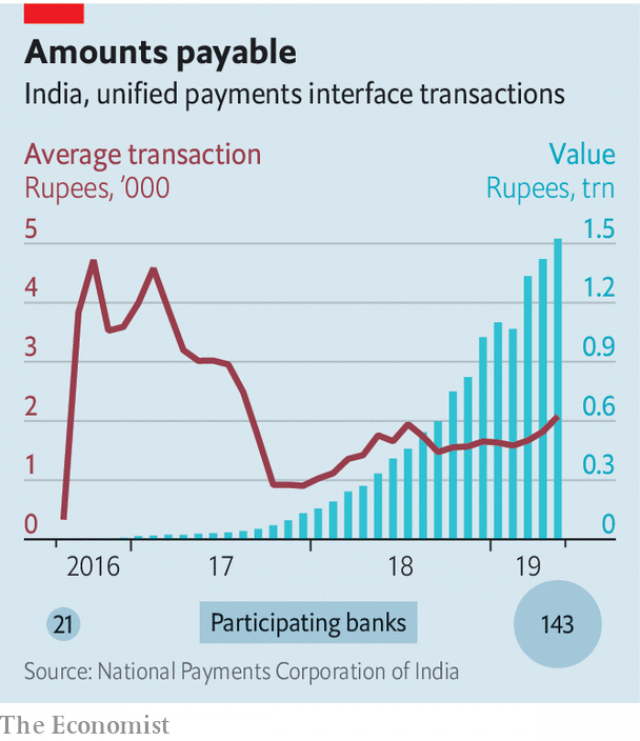

###### E-rupification

# Indians are switching to digital payments in droves 

 

> print-edition iconPrint edition | Finance and economics | Jun 6th 2019 

THE ALLEYS of the 150-year-old Chor (Thieves’) Bazaar, a colourfully named flea market in Mumbai, are crammed with goats, used tyres, speakers, drills and other assorted ephemera. But even in this unlikely place, modern payment methods are gaining a foothold. In stalls abutting the market, bags of sand can be paid for by providing a phone number or scanning a QR (quick response) code. Many countries have seen digital payments take off in the past few years; in India, where little over a decade ago a cheque could take more than two weeks to clear, it feels like a revolution. 

It is one that has been shaped, not always intentionally, by government policies. September 2010 saw the arrival of Aadhaar, a system of biometric IDs that could be used to open a bank account. After becoming prime minister in 2014, Narendra Modi chivvied bankers to open accounts for everyone. Around 360m basic “Jan Dhan” (people’s wealth) accounts were opened, adding to the 243m accounts already in existence. But many sat empty, or held just a rupee or two put in by banks under government pressure to reduce the number of zero-balance accounts.  

Two further developments gave those unused accounts a purpose. The first was the launch in 2016 of the Unified Payments Interface (UPI), an interbank money-transfer system. The second was “demonetisation” later that year, when 86% of banknotes in circulation were recalled. That caused economic carnage—but also gave digital payments a galvanic boost. Paytm, India’s largest digital-wallet firm, took out ads thanking Mr Modi for the move. 

 

Paytm now claims 371m users. PhonePe, a subsidiary of Walmart-owned Flipkart, claims more than 150m, and BHIM, run by a government-led bank co-operative, 46m. The value of digital transactions has risen more than 50-fold in the past two years, with many more smaller payments (see chart). Even the drivers of Mumbai’s three-wheeled auto-rickshaws have begun accepting payments that go through UPI to their (presumably new) bank accounts. 

China’s giant payment apps, WeChat and Alipay, send transfers between their digital wallets, going through an official clearing house. Cryptocurrencies, which some tout as a possible future for digital money, touch the regulated financial system only when they are bought and sold. By contrast India’s pioneers, which started with digital wallets, are fast becoming interoperable with UPI, which sends money directly between bank accounts. The result is both well integrated with the banking system and flexible enough to allow innovation in serving customers. 

Regulators are happy with the system, says Saurabh Tripathi of BCG, a consultancy, since it protects deposits, increases financial inclusion and cuts tax evasion from unreported cash deals. It also suits banks, since they get fine-grained information on transactions that can be used for credit analysis and product customisation. 

The global tech giants like the look of it, too. Google Pay is already available in India and Amazon Pay plans to launch soon. WhatsApp, which has 300m Indian users, has run a trial of a payments service with 1m of them, though the government’s requests regarding privacy and data-localisation are delaying it going nationwide. The success of other dominant chat apps that have moved into payments, such as WeChat Pay in China and Kakao Pay in South Korea, suggests that whenever its launch happens, it will go with a bang. ◼ 

-- 

 单词注释:

1.drove[drәuv]:n. 畜群 drive的过去式 

2.Jun[dʒʌn]:六月 

3.chor[]:n. （汉）楚；楚吾尔（一种乐器） 

4.bazaar[bә'zɑ:]:n. 集市, 市场, 义卖市场 

5.colourfully[]:色彩斑斓地 丰富多彩地 

6.flea[fli:]:n. 跳蚤 [医] 蚤 

7.mumbai[]:n. 孟买（印度城市） 

8.cram[kræm]:vt. 塞满, 填满, 猛吃 vi. 贪吃 n. 极度拥挤, 死记硬背 

9.assort[ә'sɒ:t]:vt. 把...分类, 把...归为一类 vi. 协调, 交往 

10.ephemera[i'femәrә]:n. 生命短促的人(或物), 蜉蝣 

11.foothold['futhәuld]:n. 立足处, 据点, 根据地 

12.stall[stɒ:l]:n. 厩, 停车处, 牧师职位, 货摊, 托辞, 拖延 vt. 关入厩, 停顿, 推托, 支吾, 使陷于泥中 vi. 被关在厩内, 陷于泥中, 停止, 支吾 

13.abut[ә'bʌt]:v. 邻接, 毗邻 

14.QR[]:[计] 商, 二次余数 

15.alway['ɔ:lwei]:adv. 永远；总是（等于always） 

16.intentionally[]:adv. 故意地, 有意地 

17.biometric[ˌbaɪəʊˈmetrɪk]: 计量生物学 

18.id[id]:n. 遗传素质, 本能冲动 [计] 识别, 标识符, 项目说明 

19.narendra[]:[网络] 纳伦德拉；纳兰德；纳然陀 

20.MODI['mәudai]:[计] 模块化光学数字接口 

21.chivvy['tʃivi]:v. (使)烦扰, 耍花招 

22.banker['bæŋkә]:n. 银行家, 庄家 [经] 银行业者, 银行家 

23.dhan[]:[网络] 郸；郸族；弹坛檀 

24.rupee[ru:'pi:]:n. 卢比(印、巴等国货币单位) 

25.unused[.ʌn'ju:zd]:a. 不用的, 不在使用的, 从未用过的 

26.unify['ju:nifai]:v. 统一, 使成一体 

27.interface['intәfeis]:n. 分界面, 接触面, 界面 [计] 接口, 界面 

28.UPI[]:合众国际社(美国) [计] 通用外部设备接口, 用户程序设计语言 

29.interbank[,intә'bæŋk]:管排间的, 管束间的 

30.demonetisation[di:-,mʌnitai'zeiʃən; -ti'z-]:n. demonetise的变形 

31.banknote['bæŋknәut]:n. 钞票 

32.circulation[.sә:kju'leiʃәn]:n. 流通, 循环, 发行量 [化] 环流 

33.galvanic[gæl'vænik]:a. 电流的, 电流引起的, 使人震惊的 [医] 伽伐尼的, 流电的 

34.subsidiary[sәb'sidiәri]:n. 子公司, 附件, 辅助者 a. 辅助的, 次要的, 津贴的 

35.Flipkart[]:[网络] 印度 

36.bhim[]:[网络] 比姆；比姆森寺；比蒙 

37.transaction[træn'sækʃәn]:n. 交易, 办理, 学报, 和解协议 [计] 事务处理 

38.APP[]:[计] 应用, 应用程序; 相联并行处理器 

39.WeChat[]:[网络] 微信；微讯；腾讯微信 

40.alipay[]:n. 支付宝 

41.cryptocurrencies[]:加密数字货币（cryptocurrency的复数形式） 

42.tout[taut]:vi. 招徕顾客, 兜售物品 vt. 招徕, 刺探...情报 n. 兜售者, 侦查者 

43.interoperable[,intәr'ɔpərәbl]:[计] 可互用的, 相互作用的, 相互配合的 

44.innovation[.inәu'veiʃәn]:n. 改革, 创新 [法] 创新, 改革, 刷新 

45.regulator['regjuleitә]:n. 调整者, 校准者, 校准器, 调整器, 标准钟 [化] 调节剂; 调节器 

46.tripathi[]:n. (Tripathi)人名；(英、尼、德、印)特里帕蒂 

47.BCG[]:卡介苗 [化] 卡介苗 

48.consultancy[]:n. 商量, 协商, 磋商, 会诊, 与...商量, 咨询, 请教, 找(医生)看病, 查阅, 考虑 [经] 咨询业务, 咨询服务 

49.inclusion[in'kluʒәn]:n. 包含, 内含物 [计] 蕴含 

50.evasion[i'veiʒәn]:n. 逃避, 藉口 [法] 回避, 规避, 逃避 

51.unreported[,ʌnri'pɔ:tid]:[法] 未告发的, 未揭发的, 未引起的 

52.customisation['krstemi'seifen]: 定制化服务 

53.tech[tek]:n. 技术学院或学校 

54.google[]:谷歌；搜索引擎技术；谷歌公司 

55.amazon['æmәzɒn]:n. 亚马孙河 [医] 无乳腺者 

56.WhatsApp[]:[网络] 智能手机；联络电话；每月活跃用 

57.privacy['praivәsi]:n. 隐私, 隐居, 秘密 [计] 个人保密权 

58.dominant['dɒminәnt]:a. 占优势的, 支配的 [医] 优性的, 显性的 

59.Kakao[]:[网络] 可可；可可粉；可可豆 

60.Korea[kә'riә]:n. 朝鲜, 韩国 

