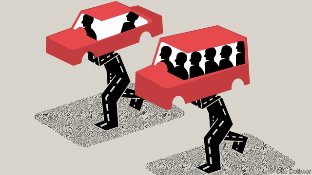
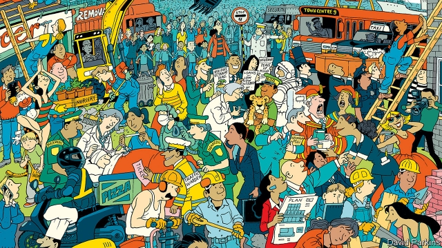

###### On climate change, Uber, foreign policy, abortion, David Cameron, labour markets, Unilever, sheep

# Letters to the editor 

> print-edition iconPrint edition | Letters | Jun 8th 2019 

 

“How climate change can fuel wars” (May 25th) focused on one direction of the connection between conflict and global warming, and not the most direct. 

The primary concern of the International Committee of the Red Cross is that people living in places already affected by conflict are among those most vulnerable to climate risks. This is true in countries such as Nigeria, Somalia, South Sudan and Yemen through the heightened consequences of droughts and floods in conflict areas. 

At the same time, discussions on climate finance in the context of the Paris agreement are intended to consider the most vulnerable, but in practice exclude conflict settings. International support for adaptation must increase, but also avoid marginalising people living in conflict areas. Humanitarian systems must adjust. 

YVES DACCORDDirector-generalInternational Committee of the Red CrossGeneva 

PROFESSOR MAARTEN VAN AALSTDirectorRed Cross Red CrescentClimate CentreThe Hague 

 

Your comprehensive analysis of loss-making companies in the ride-hailing industry (Free exchange, May 11th) ignored one significant factor: the actual income drivers get to keep after expenses. Recent studies show the typical Uber driver in America receives net income of $9 an hour before income tax. This barely meets the legal minimum wage. In new markets like India, drivers are staging protests over their low (and falling) income. And yet you identified payments to drivers as “the juiciest target” for these companies to cut costs. 

The ride-hailing industry’s strategy of predatory pricing cannot be maintained for long. Investors’ goodwill (and deep pockets) will dry up sooner rather than later, and fares will have to rise. The real answer lies in mass-transit systems. 

ACHAL RAGHAVANAdjunct/visiting professorIndian Institute of Management Udaipur 

 

Though Lexington’s evidence on the prospects for America’s Middle East peace plan was solid, his conclusion was questionable (May 11th). It is true that Saudi-Iranian tensions and the rise of China should have American foreign-policy wonks looking in different directions. But the Israeli-Palestinian conflict will remain centre stage for politicians, simply because of the number of interests at play. 

For the Republicans, Israeli-backed lobbyists will continue to play an important role in crafting political strategy. On the Democratic side, the rise of the social-justice movement and a morals-backed foreign policy, espoused by Elizabeth Warren in a recent article in Foreign Affairs, will keep the plight of the Palestinians in the spotlight. As they say, all politics is local. 

EVAN NEBELBethesda, Maryland 

 

Contrary to your article on the Democrats’ new thinking on foreign policy, there is nothing radical or fresh in their ideas (“There’s something happening here”, May 4th). At best, calls for a foreign policy of “greater restraint” and focus on inequality and corruption are a reversion to Barack Obama’s strategy of leading from behind and the human-development priorities presented in his speech in Cairo. In reality, the desire for restraint and rational goals reflects the strong isolationist strand that cuts across party lines and has marked debates about America’s role in the world since the earliest days of the republic. 

There is room for a healthy debate about America’s strategic role post-Donald Trump. But to the degree that discussion is in need of original ideas because the old ones have been found wanting, I suppose nobody’s right if everybody’s wrong. 

KAMAL SIDHUSingapore 

 

Regarding the “law” on abortion in America (“Supremely wrong”, May 18th), many conservatives have a problem with Roe v Wade precisely because the courts, and not the legislature, have set the policy. As the late Antonin Scalia once said: “You want a right to abortion? Persuade your fellow citizens and enact it”. However imperfect the political system may be, at least Alabama’s abortion law has been passed by the state legislature. 

DAN BRENDELAlexandria, Virginia 

Denis MacShane suggested that David Cameron donned Nigel Farage’s mantle and blames the former prime minister for conceding ground to “simplistic anti-Europeanism” (Letters, May 18th). It was not Mr Cameron’s job to sacrifice his career in the cause of protecting the EU from the voters. I certainly think a comparison with Lord North is unfair. Perhaps Cardinal Wolsey would be better, for a prime minister ultimately blown ashore by a European headwind impossible to tack against. 

WILLIAM PALFREMANLeeds 

 

“Working it” (May 25th) toys briefly with David Graeber’s idea of “Bullshit Jobs” before deciding that it isn’t useful in explaining low unemployment. To make your case you use two examples which might symbolise inefficiency; not to be confused with bullshit. 

The suitcase-straightener at Haneda airport can immediately see what they contribute: they could also surmise what would happen without them. Second, the three bartenders mixing an outstanding gin martini together and then watching the customer drink it. Talk about witnessing the fruits of one’s labours! The scale of bullshit jobs might still be unclear, but the glee with which you seized upon these examples, muddling efficiency with notions of usefulness and value, suggests that there might well be some bullshit involved after all. 

SUNIL MITRA KUMARLecturer in economicsIndia Institute and DFIDKing’s College London 

 

Schumpeter stated as an apparent fact that Unilever’s “pursuit of environmental and social responsibility”, which is admirable, “helps win customers” (May 4th). Is there evidence of this? I would confidently hazard a guess that more than 95% of those who buy Unilever’s variously branded products have no idea of the conglomerate behind them, nor do they care. 

PETER EDWARDSHarpenden, Hertfordshire 

 

I was about to complain that the “shear madness” that people will pay for fancy lambs in Senegal (“Golden fleeces”, May 18th) was a spelling error, when I realised it was probably an intentional pun. As was the reference to armed men who “rammed into” a friend’s house”. I’m now feeling a little sheepish. 

ROLLO PRENDERGASTBerkhamstead, Hertfordshire 

“Shear madness”? How do ewe sleep at night? 

JOE JENKINSONBristol 

-- 

 单词注释:

1.uber['ju:bә]:[医] 乳房 

2.david['deivid]:n. 大卫；戴维（男子名） 

3.cameron['kæmәrәn]:n. 卡梅伦/隆（男子名） 

4.Unilever[]:n. 联合利华（财富500强公司之一, 总部位于荷兰和英国, 主要经营食品和洗涤用品） 

5.Jun[dʒʌn]:六月 

6.vulnerable['vʌlnәrәbl]:a. 易受伤害的, 有弱点的, 易受影响的, 脆弱的, 成局的 [医] 易损的 

7.Nigeria[nai'dʒiriә]:n. 尼日利亚 

8.Somalia[sәu'mɑ:liә]:n. 索马里 

9.Sudan[su:'dæn]:n. 苏丹 [化] 苯偶氮间苯二酚; 苏丹 

10.yeman[]:[网络] 也门；叶门；园艺业的普及则始于也门 

11.heighten['haitn]:vt. 增高, 提高, 加强 vi. 升高, 变大 

12.context['kɒntekst]:n. 上下文, 背景, 来龙去脉 n. 上下文 [计] 上下文 

13.marginalise['mɑ:dʒɪnəlaɪz]:v. 使显得微不足道；使处于边缘；使无实权 

14.humanitarian[hju:.mæni'tєәriәn]:n. 人道主义者, 博爱者, 基督凡人论者 a. 人道主义的, 博爱的, 凡人论的 

15.yve[]: [男子名] 伊夫日耳曼的法语同源词, 含义是“紫杉, 弓”(yew,bow) 

16.maarten[]:[网络] 马腾；荷兰；马尔滕 

17.Hague[hei^]:[法] 海牙 

18.predatory['predәtәri]:a. 掠夺成性的, 捕食生物的, 掠夺的 [医] 捕食的 

19.cannot['kænɒt]:aux. 无法, 不能 

20.goodwill[^jd'wil]:n. 友好, 好意, 善意, 亲善, (企业享有的)信誉, 声誉 [经] (企业的)商誉, 信誉 

21.Achal[]:[网络] 女性 

22.udaipur[]: [地名] [印度] 乌代布尔 

23.questionable['kwestʃәnәbl]:a. 可疑的 [法] 可疑的, 有问题的, 不可靠的 

24.wonk[wɔŋk]:[俚]书呆子, 死用功的学生 

25.lobbyist['lɔbiist]:n. 说客 [法] 院外活动集团成员 

26.espouse[i'spauz]:vt. 支持, 赞成, 嫁, 娶 [法] 娶, 出嫁, 信奉 

27.elizabeth[i'lizәbәθ]:n. 伊丽莎白（女子名） 

28.warren['wɒrәn]:n. 养兔场, 拥挤的地区 

29.plight[plait]:n. 困境, 窘境 vt. 宣誓, 保证 

30.Palestinian[,pælis'tiniәn]:[经] 巴勒斯坦的 

31.spotlight['spɒtlait]:n. 照明灯, 反光灯, 聚光灯 

32.politic['pɒlitik]:a. 精明的, 明智的, 策略的 

33.evan['evən]:n. 埃文（男子名） 

34.Maryland['merilәnd]:n. 马里兰州 

35.inequality[.ini'kwɒliti]:n. 不平等, 不同, 不平坦, 不平均 n. 不平等, 不等式 [计] 不等式 

36.corruption[kә'rʌpʃәn]:n. 腐败, 堕落, 贪污 [计] 论误 

37.reversion[ri'vә:ʃәn]:n. 回复, 复原, 归还, 继承权 [化] 返硫 

38.barack[bɑ:'ræk]:n. 巴拉克（男子名） 

39.Cairo['kaiәrәu]:n. 开罗 

40.isolationist[.aisә'leiʃәnist]:n. 孤立主义者 

41.strand[strænd]:n. (绳索的)股, 绳, 串, 海滨, 河岸 vi. 搁浅 vt. 使搁浅, 使落后, 使陷于困境, 弄断, 搓 

42.Kamal[]:n. （印度语）卡马尔（男子名, 涵义为莲花） 

43.supremely[]:adv. 崇高地；至上地 

44.roe[rәu]:n. 狍, 鱼子, 鱼卵 [医] 鱼卵, 牝鹿 

45.V[vi:]:[计] 溢出, 变量, 向量, 检验, 虚拟, 垂直 [医] 钒(23号元素) 

46.wade[weid]:vi. 跋涉 vt. 涉水 n. 跋涉, 浅滩 

47.precisely[pri'saisli]:adv. 精确地, 明确地, 刻板地, 拘泥地, 正好, 恰恰, 对, 正是如此, 确实如此, 不错 

48.legislature['ledʒisleitʃә]:n. 立法机关, 议会, 立法院 [法] 立法机构, 立法机关 

49.Antonin[]:n. 安东尼（人名） n. (Antonin)人名；(塞、西、俄)安东宁；(法)安托南 

50.scalia[]:斯卡利亚（人名） 

51.enact[i'nækt]:vt. 制定法律, 扮演, 颁布 [法] 法令, 法规, 条例 

52.imperfect[im'pә:fikt]:a. 不完美的, 不完整的, 减弱的, 未完成过去时的 n. 未完成体 

53.dan[dæn]:n. 段(柔道、围棋运动员的等级) [建] 小车, 空中吊运车, 杓 

54.Virginia[vә'dʒinjә]:n. 弗吉尼亚 

55.deni[]:n. (Deni)人名；(俄)杰尼；(意、阿拉伯)德尼 十数的 

56.don[dɒn]:n. 西班牙贵族(或绅士), 先生, 阁下 vt. 穿上 

57.nigel['naidʒәl]:n. 奈杰尔（男子名） 

58.mantle['mæntl]:n. 斗篷, 罩子, 披风 vt. 罩住, 覆盖 vi. 覆盖, 脸红 

59.concede[kәn'si:d]:vt. 承认, 退让 vi. 让步 

60.simplistic[sim'plistik]:a. 过分简单化的 

61.EU[]:[化] 富集铀; 浓缩铀 [医] 铕(63号元素) 

62.voter['vәutә]:n. 选民, 投票人 [法] 选民, 选举人, 投票人 

63.cardinal['kɑ:dinәl]:n. 红衣主教, 鲜红色 a. 主要的, 深红色的 

64.Wolsey['wulzi]:沃尔西(姓氏) 

65.ashore[ә'ʃɒ:]:adv. 向岸, 在岸上 

66.headwind[]:n. 逆风, 顶风 

67.tack[tæk]:n. 平头钉, 大头钉, 粗缝针脚, 行动方针, 食物 vt. 以大头针钉住, 附加 

68.william['wiljәm]:n. 威廉（男子名）；[常作W-][美俚]钞票, 纸币 

69.briefly['brifli]:adv. 简短地, 扼要地, 简明地, 简单地 

70.bullshit['bulʃit]:n. 胡说 

71.symbolise['simbәlaiz]:vt. 象征, 代表, 作为...的象征 vt.vi. 用符号表示, 使用符号 

72.inefficiency[.ini'fiʃәnsi]:n. 无效率, 无能 [化] 效率低; 效率差 

73.bullshit['bulʃit]:n. 胡说 

74.haneda[]:羽田（日本机场名） 

75.surmise['sә:maiz]:n. 推测, 猜测 v. 推测, 臆测 

76.bartender['bɑ:.tendә]:n. 酒保, 酒吧侍者 

77.gin[dʒin]:n. 杜松子酒, 轧棉机, 陷阱 vt. 轧棉, 用陷阱捕 

78.martini[mɑ:'ti:ni]:n. 马提尼（一种鸡尾酒, 等于Martini） 

79.unclear[.ʌn'kliә]:a. 不易了解的, 不清楚的, 含混的 

80.glee[gli:]:n. 欢乐, 高兴 

81.muddle['mʌdl]:vt. 混合, 使微醉, 使咬字不清晰 vi. 胡乱对付 n. 困惑, 混浊状态 

82.usefulness['ju:sfjlnis]:n. 有用, 有益 [经] 有用, 有用性 

83.Sunil[]:n. 苏尼尔（男子名） 

84.Mitra['maitrә]:笔螺属 

85.Schumpeter[]:n. 熊彼特（美籍奥匈帝国经济学家, 当代资产阶级经济学代表人物之一） 

86.environmental[in.vaiәrәn'mentәl]:a. 周围的, 环境的 [经] 环境的, 环保的 

87.confidently[]:adv. 自信地；安心地 

88.variously['veәriәsli]:adv. 各种各样, 种种, 不同, 多方面, 多才多艺, 许多, 各个, 个别, 杂色, 彩色 

89.conglomerate[kәn'glɒmәrit]:a. 聚成球形的, 砾岩性的 n. 集成物, 混合体, 砾岩 v. (使)凝聚成团 

90.peter['pi:tә]:vi. 逐渐消失, 逐渐减少 

91.Hertfordshire['hɑ:(t)fәdʃә(r)]:n. 赫特福德郡(位于英国英格兰东南部) 

92.madness['mædnis]:n. 疯狂, 愚蠢的行为 [医] 狂, 疯狂 

93.Senegal[,seni'^ɔ:l]:n. 塞内加尔 

94.fleece[fli:s]:n. 羊毛, 羊毛制的覆盖物 vt. 剪下羊毛, 诈取 

95.pun[pʌn]:n. 双关语, 俏皮话 vi. 说双关语, 说俏皮话 vt. 用双关语说服, 捣实 

96.ram[ræm]:n. 公羊, 撞锤 vi. 猛击, 撞 vt. 猛击, 填塞, 反复灌输 n. 只读内存, 随机存取内存, 随机存取存储器 [计] 随机存取存储器 

97.sheepish['ʃi:piʃ]:a. 懦弱的, 羞怯的 

98.Rollo['rɔlәu]:(=Rolf)罗洛(男子名) 

99.ewe[ju:]:n. 母羊 

100.joe[dʒәu]:n. 乔（男子名） 

