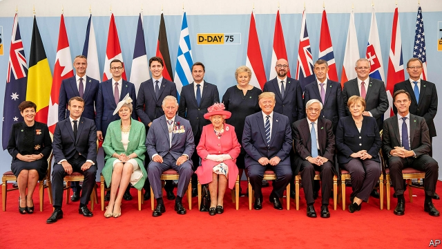
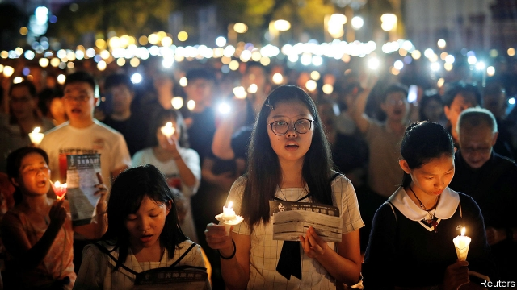

###### Weapons of mass disruption

# Politics this week 

 

> print-edition iconPrint edition | The world this week | Jun 8th 2019 

Two days of ceremonies commemorated the 75th anniversary of the Normandy landings of 1944. The queen and Theresa May, Britain’s prime minister, were joined by President Donald Trump of America, President Emmanuel Macron of France and many other national leaders from across the world. The events followed a state visit by Mr Trump to Britain, which included a state banquet at Buckingham Palace. However, the visit was also greeted by mass protests on the streets of London. See article. 

Rodrigo Duterte, the president of the Philippines, said his former wife had “cured” him of homosexuality. He then accused a critical senator of being gay. Gay-rights groups decried the implication that homosexuality was both a disease and a slur. 

Thailand’s parliament chose the incumbent, Prayuth Chan-ocha, as prime minister. As army chief, Mr Prayuth launched a coup and disbanded the previous parliament in 2014, before pushing through a new constitution that shores up the junta he heads. One opposition MP likened his selection to “making someone who set fire to a temple the abbot of that temple”. See article. 

All nine Muslim ministers in Sri Lanka’s government, as well as two Muslim provincial governors, resigned. Sri Lanka has been suffering from a wave of anti-Muslim violence after jihadist suicide-bombers killed some 250 people in April. A prominent Buddhist monk had demanded that two of the ministers be dismissed, claiming, without any evidence, that they had links to the bombers. The other ministers and governors resigned in sympathy. See article. 

The Trump administration banned cruises and other tourism trips by American citizens to Cuba, in an attempt to press the communist government to stop supporting Venezuela’s embattled dictator, Nicolás Maduro. 

Colombia’s constitutional court rejected changes proposed by President Ivan Duque to a tribunal created to prosecute former rebels and military officials for war crimes. The tribunal was created after a peace deal was signed in 2016 with the Revolutionary Armed Forces of Colombia, a leftist rebel group. 

A Canadian inquiry described the high rate at which indigenous women are murdered, often by their partners, as a “race-based genocide”. It denounced the government for failing to protect them. 

Sudanese security forces slaughtered pro-democracy protesters in Khartoum—by coincidence, just before the 30th anniversary of the Tiananmen massacre in China. At least 100 people were killed; many more were injured. The killings suggest that the military junta that took charge after the ousting of President Omar al-Bashir in April has no intention of allowing free elections. Other Arab autocracies, such as Saudi Arabia, are giving the junta money and encouragement not to back down. See article. 

The council that oversees elections in Algeria said a presidential poll would not be held as planned on July 4th due to a lack of eligible candidates. Protesters pushed for the delay, fearing the election would prolong the old regime. Demonstrations continue two months after they helped topple Abdelaziz Bouteflika, the long-serving president. It is up to the interim president to name a new date for the vote. 

Hundreds of members of Cameroon’s opposition were arrested during protests against President Paul Biya. The protesters were demanding the release of hundreds of others arrested following previous demonstrations, including Maurice Kamto, the opposition leader. They also called for an end to the fighting between the government and separatists in English-speaking parts of the country. 

The authorities in Bahrain took their suppression of dissent to a new level, warning that people who “follow” anti-government social-media accounts could face legal consequences. Most of the regime’s critics are already in prison or have fled abroad. 

The European Commission found Italy in violation of EU fiscal rules over a proposed budget that fails to shrink its debt, currently 132% of GDP. The finding could lead to disciplinary action including multi-billion-euro fines. See article. 

Turkey said it would go ahead with its purchase of Russian-made S-400 anti-aircraft missiles. America has said it will block the planned export of F-35 fighters to Turkey, a NATO ally, if it does not axe the deal. 

Tens of thousands of demonstrators in Prague called for the resignation of Andrej Babis, the Czech prime minister, who is a business magnate. The police have recommended charging him with fraud, and a European Commission audit found he had a conflict of interest involving a company he once owned, Agrofert. 

Andrea Nahles stepped down as head of Germany’s Social Democratic Party, destabilising the country’s coalition government, led by Angela Merkel and the Christian Democrats. The party may take months to select a new leader. Some in the party want to pull out of the coalition, which would mean new elections this autumn. See article. 

Lars Lokke Rasmussen, the leader of Denmark’s governing centre-right coalition, conceded defeat in the country’s general election. The centre-left bloc led by Mette Frederiksen won 91 of the 179 seats in parliament. See article. 

China and Russia agreed to upgrade their relationship to what they called a “comprehensive strategic partnership of co-ordination for a new era”. This was announced after a meeting in Moscow between China’s president, Xi Jinping, and his Russian counterpart, Vladimir Putin. Tass, a Russian news agency, quoted Mr Putin as saying the partnership had reached “an unprecedentedly high level”. Mr Xi told Russian media that Mr Putin was his “best and bosom friend”. 

 

In China, censorship of the internet was stepped up and tight security maintained around Tiananmen Square to prevent any attempt to commemorate the crushing of pro-democracy protests in the square on June 4th 1989. The measures appeared largely effective in Beijing, but in Hong Kong about 180,000 people joined a candlelit vigil to mark the bloodshed, organisers said. China’s defence minister, Wei Fenghe, said the army’s “resolute measures” in 1989 were “correct” and had “preserved stability”. China has never given an official figure for how many people died. 

-- 

 单词注释:

1.disruption[dis'rʌpʃәn]:n. 分裂, 崩溃, 瓦解 

2.politic['pɒlitik]:a. 精明的, 明智的, 策略的 

3.Jun[dʒʌn]:六月 

4.commemorate[kә'memәreit]:vt. 纪念 

5.Normandy['nɒ:mәndi]:n. 诺曼底 

6.theresa[ti'ri:zә]:n. 特丽萨（女子名） 

7.emmanuel[i'mænjuәl]:n. 以马内利（耶稣基督的别称）；伊曼纽尔（男子名, 等于Immanuel） 

8.macron['mækrәn]:n. 长音符号 

9.banquet['bæŋkwit]:n. 宴会 

10.Buckingham['bʌkiŋәm]:白金汉郡[英国英格兰郡名] 

11.Rodrigo[]:n. 罗德里戈（歌曲名称） 

12.duterte[]:[网络] 迪泰特 

13.Philippine['filipi:n]:a. 菲律宾(群岛)的, 菲律宾人的 

14.homosexuality[-'æliti]:n. 同性恋 [医] 同性性欲, 同性恋爱 

15.senator['senәtә]:n. 参议员, (某些大学的)理事 [法] 参议员, 上议员 

16.decry[di'krai]:vt. 反对, 责难, 诽谤, 诋毁 

17.slur[slә:]:n. 连音符, 诽谤, 玷污, 印刷模糊 vt. 草率地看过, 忽略, 含糊地念 vi. 模糊不清 

18.incumbent[in'kʌmbәnt]:a. 现任的, 依靠的, 负有义务的 n. 领圣俸者, 在职者 

19.Prayuth[]:[网络] 巴狱 

20.coup['ku:]:n. 砰然的一击, 妙计, 出乎意料的行动, 政变 [医] 发作, 中, 击 

21.disband[dis'bænd]:vt. 解散, 遣散 vi. 被解散 

22.junta['dʒʌntә]:n. 以武力政变上台的(军)政府, 私党, 阴谋小集团, 政务会 

23.opposition[.ɒpә'ziʃәn]:n. 反对, 敌对, 相反, 在野党 [医] 对生, 对向, 反抗, 反对症 

24.MP[]:国会议员, 下院议员 [计] 宏处理程序, 维护程序, 线性规划, 微程序, 多处理器 

25.liken['laikәn]:vt. 比喻, 比拟 

26.abbot['æbәt]:n. 男修道院院长, 大寺院男住持 

27.Muslim['mjzlim; (?@) 'mʌzlem]:n. 伊斯兰教, 伊斯兰教教徒 

28.sri[sri]:n. 斯里兰卡（Sri Lanka）；（拉）神圣罗马帝国（Sacrum Romanum Imperium） 

29.provincial[prә'vinʃәl]:n. 外地人, 粗野的人 a. 省的, 外地的, 偏狭的 

30.lanka[]:n. 兰卡；楞伽 

31.jihadist[]:n. 伊斯兰圣战士 

32.monk[mʌŋk]:n. 修道士, 僧侣, 和尚 

33.bomber['bɒmә]:n. 轰炸机, 投弹手 

34.cruise[kru:z]:n. 巡航, 巡弋, 漫游 v. 巡航, 巡弋, 漫游 

35.Cuba['kju:bә]:n. 古巴 

36.embattle[im'bætl]:vt. 列阵, 布阵, 整军备战, 严阵以待 

37.dictator['dikteitә]:n. 命令者, 独裁者 

38.maduro[mә'duәrәu]:a. 色深味浓的烟草做的, (雪茄)色深味浓的 

39.constitutional[.kɒnsti'tju:ʃәnl]:a. 宪法的, 立宪的, 体质的 [医] 全身的; 体质的 

40.ivan['aivәn]:n. 伊凡（男子名） 

41.duque[]: [人名] 杜凯 

42.tribunal[trai'bju:nl]:n. 法庭, 法官席, 裁决 [法] 法庭, 裁判所, 裁判 

43.prosecute['prɒsikju:t]:vt. 告发, 起诉, 彻底进行, 执行, 从事 vi. 告发, 起诉, 作检察官 

44.Colombia[kә'læmbiә]:n. 哥伦比亚 

45.leftist['leftist]:n. 左翼的人, 左派 a. 左派的 

46.indigenous[in'didʒinәs]:a. 本土的, 国产的, 固有的 [医] 原产的, 本土的 

47.genocide['dʒenәu,said]:n. 种族灭绝, 灭绝整个种族的大屠杀 [医] 种族灭绝(侵略军队加害居民的罪行) 

48.denounce[di'nauns]:vt. 告发, 抨击, 谴责 [法] 谴责, 斥责, 告发 

49.Sudanese[su:dә'ni:z]:a. 苏丹的, 苏丹人的 n. 苏丹人 

50.slaughter['slɒ:tә]:n. 残杀, 屠杀, 杀戮 vt. 残杀, 屠杀, 亏本出售 

51.protester[]:n. 抗议者, 持异议者, 拒付者 [经] 反对者 

52.massacre['mæsәkә]:n. 大屠杀 vt. 大屠杀, 残杀 

53.killing['kiliŋ]:n. 谋杀, 杀戮 a. 杀害的, 疲惫的, 迷人的 

54.oust[aust]:vt. 逐出, 罢黜, 剥夺, 驱逐 [法] 驱逐, 剥夺, 免职 

55.omar['әjmɑ:(r)]:n. 奥马尔（男子名） 

56.autocracy[ɒ:'tɒkrәsi]:n. 独裁统治, 独裁统治的国家 [法] 独裁政治, 专制政治, 独裁政府 

57.saudi['sajdi]:a. 沙乌地阿拉伯（人或语）的 

58.Arabia[ә'reibiә]:n. 阿拉伯半岛 

59.oversee[.әuvә'si:]:vt. 向下看, 了望, 监督, 偷看到 [法] 监察, 监督, 俯瞰 

60.Algeria[æl'dʒiәriә]:n. 阿尔及利亚 

61.presidential[.prezi'denʃәl]:a. 总统制的, 总统的, 首长的, 统辖的 [法] 总统的, 议长的, 总经理的 

62.eligible['elidʒәbl]:a. 有资格当选的, 合格的 n. 有资格者, 合格者, 适任者 

63.prolong[prәu'lɒŋ]:vt. 延长, 拖延, 拖长 [化] 冷凝管 

64.regime[rei'ʒi:m]:n. 政权, 当权期间, 政体, 社会制度, 体制, 情态 [医] 制度, 生活制度 

65.demonstration[.demәn'streiʃәn]:n. 示范, 实证 [医] 示教, 实物教授 

66.topple['tɒpl]:vt. 推翻, 颠覆 vi. 倒塌, 摇摇欲坠 

67.abdelaziz[]:n. (Abdelaziz)人名；(阿拉伯)阿卜杜勒-阿齐兹 

68.bouteflika[]:[网络] 布特弗利卡；阿尔及利亚总统布特弗利卡；布特佛里卡 

69.interim['intәrim]:a. 暂时的, 临时的, 间歇的 n. 过渡时期 

70.paul[pɔ:l]:n. 保罗（男子名） 

71.biya[]: [地名] [俄罗斯] 比亚河 

72.maurice['mɔ:ris]:n. 莫里斯（男人名） 

73.separatist['sepәreitist]:n. 分离主义者, 独立派 

74.Bahrain[]:n. 巴林岛 

75.suppression[sә'preʃәn]:n. 抑压, 镇压, 抑制 [计] 抑制 

76.dissent[di'sent]:n. 异议 vi. 持异议, 不同意 

77.violation[.vaiә'leiʃәn]:n. 违反, 违背, 妨碍 [法] 违犯, 违背, 违反 

78.EU[]:[化] 富集铀; 浓缩铀 [医] 铕(63号元素) 

79.fiscal['fiskәl]:a. 财政的, 国库的 [经] 财政上的, 会计的, 国库的 

80.currently['kʌrәntli]:adv. 现在, 当前, 一般, 普通 [计] 当前 

81.disciplinary['disiplinәri]:a. 训练的, 纪律的, 训诫的 [法] 纪律的, 惩戒性的 

82.NATO['neitәj]:北大西洋公约组织, 北约组织 [经] 北大西洋公约组织 

83.ally['ælai. ә'lai]:n. 同盟者, 同盟国, 助手 vt. 使联盟, 使联合, 使有关系 vi. 结盟 

84.axe[]:n. 斧, 斧头 vt. 削减(人员、经费、计划、机构等) 

85.tens[]:十位 

86.demonstrator['demәnstreitә]:n. 论证者, 证明者, 指示者, 示威者 [医] 示教者 

87.Prague[prɑ:g]:n. 布拉格 

88.andrej[]:n. (Andrej)人名；(捷、塞、波)安德烈 

89.Babis[ˈbɑ:bi:z]:n. 巴比教徒 [网络] 巴维斯；巴布派 

90.Czech[tʃek]:n. 捷克人, 捷克语 a. 捷克的, 捷克语的, 捷克人的 

91.magnate['mægneit]:n. 大官, 巨头 [法] 大官, 权贵, 大资本家 

92.fraud[frɒ:d]:n. 欺骗, 欺诈, 诡计, 骗子 [经] 欺诈, 舞弊, 骗子 

93.audit['ɒ:dit]:n. 审计, 查帐 vt. 查(帐), 旁听 vi. 查账 [计] 查帐; 审查; 检查 

94.andrea['ændriә,ɑ:n'dreiә]:n. 安德里亚（男子名） 

95.Nahles[]:纳勒斯 

96.destabilise[di:'steɪbɪlaɪz]:vt. 破坏政府的稳定 

97.coalition[.kәuә'liʃәn]:n. 结合体, 结合, 联合 [经] 联合, 联盟 

98.angela['ændʒilә]:n. 安吉拉（女子名） 

99.merkel[]: [人名] 默克尔; [地名] [美国] 默克尔 

100.democrat['demәkræt]:n. 民主人士, 民主主义者, 民主党党员 [经] 民主党 

101.lar[lɑ:]:n. 家庭守护神 

102.lokke[]:[网络] 老街市 

103.Rasmussen[]:拉斯马森（人名） 

104.concede[kәn'si:d]:vt. 承认, 退让 vi. 让步 

105.bloc[blɒk]:n. 集团 

106.mette[]:n. (Mette)人名；(中非)梅泰；(德、俄、意、芬、捷、丹)梅特 

107.frederiksen[]:[网络] 弗雷泽里克森 

108.upgrade['ʌpgreid]:n. 上坡, 升级, 上升 adv. 往上 vt. 使升级, 提升, 改良品种 vi. 升级 [计] 升级 

109.partnership['pɑ:tnәʃip]:n. 合伙, 合股, 合作关系 [经] 合伙(合作)关系, 全体合伙人 

110.counterpart['kauntәpɑ:t]:n. 副本, 复本, 配对物, 相应物 [经] 副本, 正副二份中之一 

111.Vladimir[vlɑ'dimɪr]:n. 弗拉基米尔（古罗斯弗拉基米尔-苏兹达里公国的古都） 

112.putin['putin]:n. 普京（人名） 

113.tas[]:abbr. 旅游者援助协会（Traveler ' s Aid Society）；电话接听系统（Telephone Answering System）；实际空速（True Airspeed）；印字电报机自动换接（Teleprinter Automatic Switching） 

114.unprecedentedly[ʌn'presɪdentɪdlɪ]:adv. 空前地 

115.censorship['sensәʃip]:n. 检查制度 [医] 督察, 监察 

116.hong[hɔŋ]:n. （中国、日本的）行, 商行 

117.kong[kɔŋ]:n. 含锡砾石下的无矿基岩；钢 

118.candlelit[ˈkændllɪt]:a. （房间、饭桌）点蜡烛的, 用烛光照明的 

119.vigil['vidʒil]:n. 警戒, 监视, 守夜 [医] 不眠, 警醒 

120.bloodshed['blʌdʃed]:n. 流血 

121.wei[]:n. 魏（姓氏）；魏（朝代）；渭河 

122.resolute['rezәlu:t]:n. 果断的人 a. 坚决的, 刚毅的, 毅然的 

