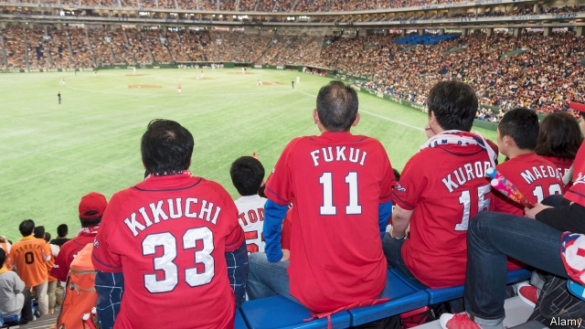

###### Flipping out

# Japanese debate how foreigners should refer to them 

 

> print-edition iconPrint edition | Asia | Jun 15th 2019 

THE WORLD calls the leader of China Xi Jinping. His North Korean counterpart is known as Kim Jong Un. The man who led North Vietnam to independence is almost always dubbed Ho Chi Minh. In all three instances, the surname comes first, and then the given names, as is customary in China, Korea and Vietnam. That is the custom in Japan, too. Yet English-speakers refer to the Japanese prime minister as Shinzo Abe, rather than Abe Shinzo. Why the inconsistency, asks Japan’s foreign minister, Taro Kono—or rather Kono Taro, as he would like to be known. He says he plans to ask foreign media to start conforming to Japanese practice. 

The oddity that upsets Mr Kono does not stem from the West attempting to impose its norms on Japan. When Matthew Perry, an American naval officer, forced Japan to end its self-imposed isolation in 1854, he had no qualms about referring to the Japanese officials he was threatening as they referred to themselves. Instead it was local elites who, after the Meiji Restoration of 1868, when Japan was rapidly modernising by imitating Western institutions and mores, took it upon themselves to reverse the order of their names for foreign consumption. The intention was to disassociate Japan from the rest of Asia and signal its advanced status to Westerners. 

Mr Kono is no nationalist firebrand. He speaks fluent English and is hearteningly open-minded. Indeed, the cause is not really a nationalist one: even at the height of Japanese expansionism during the second world war, Japanese stuck to the convention he is now challenging. The cabinet and the wider population are split on the issue. Some organisations, such as Japan’s national football team, already put family names first in English. 

The debate is an illustration of Japanese culture’s unique, and sometimes awkward, blend of east and west, which stems not only from the Meiji era but also from the American occupation after the second world war. The Japanese love both baseball and shogi (Japanese chess); sushi and doughnuts. Mr Kono argues that the switch to indigenous practice should occur in time for an impending series of showcase events including the Olympics, which Tokyo is hosting next year. But others would argue that Japan’s relaxed and largely unselfconscious blending of foreign and local customs should be the main exhibit.◼ 

-- 

 单词注释:

1.flip[flip]:vt. 掷, 弹, 轻击, 空翻 vi. 用指轻弹, 抽打, 蹦跳 n. 抛, 弹, 筋斗 a. 无礼的 [计] 翻转 

2.Jun[dʒʌn]:六月 

3.Korean[kә'riәn]:n. 朝鲜人, 朝鲜语 a. 朝鲜人的, 朝鲜语的 

4.counterpart['kauntәpɑ:t]:n. 副本, 复本, 配对物, 相应物 [经] 副本, 正副二份中之一 

5.kim[]:n. 金姆（人名） 

6.jong[jɔŋ]:n. 小伙子；（旧时的）青年男奴 

7.UN[ʌn]:pron. 家伙, 东西 [经] 联合国 

8.Vietnam[.vjet'næm]:n. 越南 

9.alway['ɔ:lwei]:adv. 永远；总是（等于always） 

10.dub[dʌb]:vt. 配音, 轻点, 授予称号, 击 n. 一下击鼓声, 笨蛋 

11.HO[hәu]:interj. 嗬(表示惊讶或引人注意) [医] 钬(67号元素) 

12.chi[kai, ki:]:n. 希腊语的第22个字母 [医] 卡, χ(希腊文的第二十二个字母) 

13.Minh[]:n. (Minh)人名；(老、柬)明 

14.customary['kʌstәmәri]:a. 习惯的, 惯常的 [经] 通常的, 习惯的 

15.Korea[kә'riә]:n. 朝鲜, 韩国 

16.shinzo[]:[网络] 晋三；爆裂战士战蓝宝；神像 

17.abe[eib]:n. 亚伯（男子名, 等于Abraham） 

18.inconsistency[.inkәn'sistәnsi]:n. 不一致, 易变, 前后矛盾的事物 [法] 前后矛盾, 不一致 

19.taro['tɑ:rәu]:n. 芋头 [医] 芋根(含淀粉可供食用) 

20.kono[]:n. (Kono)人名；(乍)科诺 

21.conform[kәn'fɒ:m]:vt. 使一致, 使遵守, 使符合 vi. 一致, 符合, 适应 

22.oddity['ɒditi]:n. 奇异, 奇特, 怪人, 怪事, 怪僻 

23.norm[nɒ:m]:n. 基准, 模范, 标准, 准则, 平均数 [化] 定额 

24.Matthew['mæθju:]:n. 马太, 马太福音 

25.perry['peri]:n. 梨子酒 

26.isolation[.aisә'leiʃәn]:n. 隔绝, 孤立, 隔离 [化] 分离; 生物分离 

27.qualm[kwɒ:m]:n. 晕眩, 不安, 疑虑 [法] 疑虑, 不安, 内疚 

28.elite[ei'li:t]:n. 精华, 精锐, 中坚分子 

29.meiji['meidʒi:]:n. 明治（日本明治天皇睦仁） 

30.restoration[.restә'reiʃәn]:n. 恢复, 归还, 复位 [医] 恢复, 康复, 复位, 回复, 修复 

31.modernise['mɔdәnaiz]:vt.vi. (使)现代化, (使)适应现代需要 vi. 用现代方法 

32.disassociate[.disә'sәuʃieit]:v. (使)分离 

33.statu[]:[网络] 状态查看；雕像；特级雪花白 

34.nationalist['næʃәnәlist]:n. 国家主义者, 民族主义者 

35.firebrand['faiәbrænd]:n. 火把, 在燃烧的木柴, 煽动叛乱者 

36.hearteningly[]:adv. heartening的变形 

37.expansionism[ik'spænʃәnizm]:n. 膨胀主义, 领土扩张政策 [法] 扩张主义, 膨胀主义者 

38.organisation[,ɔ: ^әnaizeiʃən; - ni'z-]:n. 组织, 团体, 体制, 编制 

39.shogi[]:[网络] 将棋；日本的将棋；日本将棋 

40.sushi['su:ʃi]:n. 寿司（生鱼片冷饭团） 

41.doughnut['dәunʌt]:n. 油炸圈饼, 环状物 [计] 圆环图 

42.indigenous[in'didʒinәs]:a. 本土的, 国产的, 固有的 [医] 原产的, 本土的 

43.impend[im'pend]:vi. 迫近, 威胁, 悬挂 

44.sery[]:n. (Sery)人名；(俄)谢雷；(科特)塞里 

45.showcase['ʃәukeis]:n. 陈列橱 [经] 商品陈列所, 货物陈列架 

46.unselfconscious[ʌnself'kɔnʃәs]:a. 自然的, 不装腔作势的 

