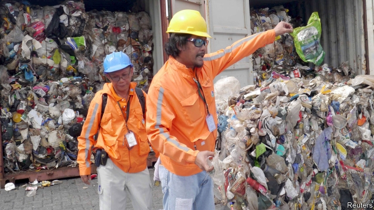

###### Refusing refuse

# South-East Asian countries are banning imports of waste for recycling 

 

> print-edition iconPrint edition | Asia | Jun 15th 2019 

THERE IS NO point collecting recyclable waste unless someone is willing to buy it and actually do the recycling. Until late 2017 China was the world’s biggest importer of scrap by far. This made sense. Like most other forms of manufacturing, recycling is cheaper there. Moreover, Chinese factories consumed lots of the resulting plastic and pulp, whereas developed economies, which tend to be net importers of goods, had plenty of plastic bottles and cardboard boxes to spare. It also helped that shipping to China was cheap, since ships would often otherwise return to the country with empty containers. 

All this came to a halt when the Chinese government banned the import of all but the purest scrap material in 2017, killing a trade worth $24bn a year. Waste dealers in the rich world had to scramble to find new buyers. South-East Asia soon emerged as the pre-eminent destination for foreign waste. Unfortunately, the region’s recycling industry is much smaller than China’s; its processing plants were quickly overwhelmed. Plastics from America and Europe have piled up in landfills. Lots of toxic rubbish has simply been torched. 

South-East Asian governments are not pleased. They have begun to ban or crimp imports themselves, abruptly diminishing a booming business (see chart). On May 28th Yeo Bee Yin, Malaysia’s environment minister, complaining that “garbage [was] being traded under the pretext of recycling”, announced that her government would be sending back 3,000 tonnes of foreign plastic. Much of it was of poor quality, she noted, and hence unrecyclable. 

 

Thailand plans to ban plastic-waste imports by 2021. Vietnam’s government has similar ideas. Kate O’Neill of the University of California, Berkeley, reckons these bans are motivated not only by environmental concerns but also by pride: Asia does not want to be the world’s dumping ground. 

Rodrigo Duterte, the president of the Philippines, recently threatened to go to war with Canada if it did not take back a shipment of plastic scrap. Canada agreed to take it away, and Mr Duterte stopped blustering after an election had passed. All the same, rich-world exporters might want to start work on Plan C.◼ 
<<<<<<< HEAD

-- 

 单词注释:

1.recycling[]:[电] 再循环 

2.Jun[dʒʌn]:六月 

3.recyclable[ˌri:ˈsaɪkləbl]:a. 可循环再用的 

4.importer[im'pɒ:tә]:n. 输入者, 进口商 [法] 进口商, 输入者 

5.scrap[skræp]:n. 碎片, 残余物, 些微, 片断, 铁屑, 吵架 vt. 扔弃, 敲碎, 拆毁 vi. 互相殴打 a. 零碎拼凑成的, 废弃的 

6.manufacturing[.mænju'fæktʃәriŋ]:n. 制造业 a. 制造业的 

7.pulp[pʌlp]:n. 果肉, 纸浆 vt. 使化成纸浆, 除去...果肉 vi. 变成纸浆 

8.cardboard['kɑ:dbɒ:d]:n. 薄纸板 [化] 咭纸; 特等纸板; 卡纸板; 卡片纸板 

9.dealer['di:lә]:n. 经销商, 商人 [经] 交易员, 贩卖商 

10.scramble['skræmbl]:n. 攀缘, 爬行, 抢夺, 混乱, 紧急起飞 vi. 攀缘, 杂乱蔓延, 争夺, 拼凑, 匆忙 vt. 攀登, 扰乱, 使混杂 

11.buyer['baiә]:n. 买主, 买方 [经] 买主, 买方, 买手 

12.quickly['kwikli]:adv. 很快地 

13.overwhelm[.әuvә'hwelm]:vt. 淹没, 受打击, 制服, 压倒, 使不知所措 [法] 打翻, 倾覆, 覆盖 

14.landfill['lændfil]:n. 垃圾堆；垃圾填埋地 

15.toxic['tɒksik]:a. 有毒的, 中毒的 [医] 中毒的, 毒物的 

16.crimp[krimp]:n. 诱人当兵的人, 拳曲, 鬈发 vt. 诱...去当兵, 使拳曲, 使有褶 

17.abruptly[ә'brʌptli]:adv. 突然地, 唐突地 

18.diminish[di'miniʃ]:v. (使)减少, (使)变小 

19.Yeo[jәu]:int. 唷(水手拉绳时一道发出的叫声) 

20.yin[jin]:n. 中国思想里的“阴”（与“阳”相对）；中国的殷代；（苏格兰）一个（等于one） 

21.pretext['pri:tekst]:n. 借口, 托词 v. 以...为借口 

22.tonne[tʌn]:n. 吨, 公吨 [经] 吨 

23.unrecyclable[]:na. 不可回收 [网络] 不可回收的 

24.Thailand['tailәnd]:n. 泰国 

25.kate[keit]:n. 凯特（女子名, 等于Catherine） 

26.California[.kæli'fɒ:njә]:n. 加利福尼亚 

27.berkeley['bɑ:kli, 'bә:kli]:n. 伯克利（姓氏）；贝克莱（爱尔兰主教及哲学家）；伯克利（美国港市） 

28.reckon['rekәn]:vt. 计算, 总计, 估计, 认为, 猜想 vi. 数, 计算, 估计, 依赖, 料想 

29.environmental[in.vaiәrәn'mentәl]:a. 周围的, 环境的 [经] 环境的, 环保的 

30.Rodrigo[]:n. 罗德里戈（歌曲名称） 

31.duterte[]:[网络] 迪泰特 

32.Philippine['filipi:n]:a. 菲律宾(群岛)的, 菲律宾人的 

33.shipment['ʃipmәnt]:n. 装船, 出货 [经] 运送, 运送(寄出)货物, 装载 

34.bluster['blʌstә]:vt. 风狂吹, 咆哮, 汹涌 vi. 咆哮着说出, 恐吓 n. 狂风声, 巨浪声, 夸口, 大话 

35.exporter[ik'spɒ:tә]:n. 出口商, 输出者, 出口公司 [经] 出口商, 输出者 
=======
>>>>>>> 50f1fbac684ef65c788c2c3b1cb359dd2a904378

