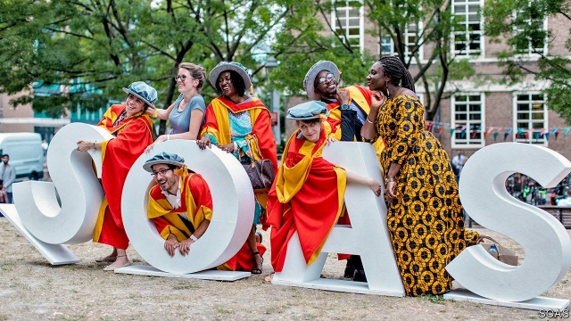

###### Sending out an SOS

# SOAS, one of Britain’s most unusual universities, is in trouble 

 

> print-edition iconPrint edition | Britain | Jun 13th 2019 

FOR YOUNG folk in search of a grounding in Austronesian languages, say, or perhaps Sinhalese or Tibetan, London’s School of Oriental and African Studies (SOAS) has long been the place to go. Founded in 1916 to train colonial administrators, military officers and the odd spy, the university came to be home to scholars with knowledge of the most obscure corners of the globe, as well as experts on rising countries like China and India. Its academics have composed the Swazi national anthem and written sweeping histories of the Meiji restoration; they have also been killed by the Khmers Rouges. In the words of a former director, “They must have formed the single biggest bunch of eccentrics in Europe.” 

Today 4,345 students from more than 130 countries study courses ranging from global pop music to accounting and finance. Since the 1960s the erstwhile colonial training centre has been a hub of radical politics (a recent campaign by students sought to “decolonise our minds” by changing the curriculum). It also represents a type of university—small, specialist and focused on languages—that has struggled in recent years. Since 2016 SOAS’s undergraduate admissions have fallen by 37%. In a warning seen by Times Higher Education, the school’s director wrote at the end of last year that without action SOAS would “exhaust [its] cash reserves” in another two years. 

It is not that the university is frozen in time. There has been growth over the past two decades in the number of students taking degrees in social sciences and law, which have the advantage of being cheap to teach, and can thus subsidise niche language courses. Nevertheless, while uptake of languages such as Japanese, Chinese and Arabic has risen, some less popular ones have fallen by the wayside. As Ian Brown, a SOAS expert on South-East Asia, notes in a history of the university, there are no longer teaching posts in Bengali, Punjabi or Tamil, and social scientists do not need to master a non-Western language, as was once expected. 

The main problem is that SOAS has struggled in a more competitive environment. The old system of state grants helped support universities that did a lot of language teaching. Nowadays in England most of their funding comes from tuition fees, and since 2015 universities have been free to recruit as many students as they want. In the words of an internal SOAS memo, rival institutions “went growth-mad”, with King’s College and Queen Mary University London hoovering up students. SOAS initially responded by lowering its admission standards to attract more applicants. It has since changed tack, raising the bar in order to maintain its position in league tables. Insiders say the school has been slow to tap donors to make up the shortfall. “It’s not a terribly capitalist institution,” is the verdict of one. 

The university promises measures to turn things round, including investments in the estate, better teaching and more overseas education. It says that applications for next year are looking perkier. Yet after last year’s disastrous admissions cycle, an extra £2.6m ($3.3m) had to be cut from academic staffing costs by 2021-22, on top of planned cuts of £3.4m since 2017-18. 

If things don’t improve, SOAS may have to lay on fewer courses, or perhaps even be absorbed by another institution. “There’s no way of teaching languages like Burmese or Zulu profitably,” accepts Justin Watkins, a linguistics professor at the university. But if the school ends up going under, “something will have been lost that will be very hard to reacquire.” ◼ 
<<<<<<< HEAD

-- 

 单词注释:

1.SOS[esәj'es]:紧急呼救信号 [计] 独立操作系统 

2.soa[]:abbr. 前进速度（speed of advance ）；工艺技术水准（state of the art）；进场著陆速度（speed of approach）；工艺现状（State of the Art） 

3.Jun[dʒʌn]:六月 

4.grounding['graundiŋ]:n. 基础教学, 基础训练 [经] 搁浅 

5.Austronesian[,ɔ:strәu'ni:ʒiәn]:a. Austronesia 的 n. Austronesia 语族 

6.Sinhalese[siŋhә'li:z]:n. 僧伽罗人(语) 

7.Tibetan[ti'betn]:a. 西藏的 n. 藏语, 西藏人 

8.colonial[kә'lәunjәl]:a. 殖民的, 殖民地的 [法] 殖民地居民 

9.administrator[әd'ministreitә]:n. 管理人, 行政官 [经] 遗产管理人员 

10.Swazi['swɑ:zi]:(非洲东南部)斯威士人 

11.anthem['ænθәm]:n. 圣歌, 赞美诗 

12.meiji['meidʒi:]:n. 明治（日本明治天皇睦仁） 

13.restoration[.restә'reiʃәn]:n. 恢复, 归还, 复位 [医] 恢复, 康复, 复位, 回复, 修复 

14.Khmer[kmєә]:n. 高棉人, 高棉语 

15.rouge[ru:ʒ]:n. 口红, 胭脂 v. 擦口红 

16.eccentric[ik'sentrik]:n. 怪人, 偏心圆 a. 古怪的, 反常的, 不同圆心的 

17.erstwhile['ә:stwail]:adv. 以前, 往昔地 a. 以前的, 往昔的 

18.hub[hʌb]:n. 毂, 木片, 中心 [计] 插座; 插孔; 集线器, 集中器, 连接器, 中继站 

19.politic['pɒlitik]:a. 精明的, 明智的, 策略的 

20.decolonise[]:使非殖民化 

21.subsidise[]:vt. 给...补助金, 津贴, 资助 

22.niche[nitʃ]:n. 壁龛 vt. 放入壁龛, 安顿 

23.uptake['ʌpteik]:n. 举起, 拿起, 理解, 上风井, 摄入, 吸收 [化] 摄取 

24.les[lei]:abbr. 发射脱离系统（Launch Escape System） 

25.ian[iәn]:n. 伊恩（男子名） 

26.Bengali[beŋ'^ɔ:li]:n. 孟加拉人 a. 孟加拉的 

27.Punjabi[.pʌn'dʒɑ:bi]:n. 旁遮普人, 旁遮普语 a. 旁遮普的, 旁遮普人的, 旁遮普语的 

28.Tamil['tæmil]:n. 泰米尔人, 泰米尔语 

29.memo['memәu]:n. 备忘录 [经] 备忘录 

30.mary['meәri]:n. 玛丽（女子名） 

31.hoover['hu:vә]:n. 胡佛电动吸尘器 vi. 用真空吸尘器打扫 

32.initially[i'niʃәli]:adv. 最初, 开头 

33.tack[tæk]:n. 平头钉, 大头钉, 粗缝针脚, 行动方针, 食物 vt. 以大头针钉住, 附加 

34.insider['in'saidә]:n. 内部的人, 权威人士, 知道内情的人 [经] 熟悉内情者 

35.donor['dәunә]:n. 捐赠人 [化] 给体; 供体 

36.shortfall['ʃɒ:tfɒ:l]:n. 不足, 不足量 [经] 缺少, 不足, 亏舱运费 

37.terribly['terәbli]:adv. 可怕地, 甚为, 非常 

38.capitalist['kæpitәlist]:n. 资本家, 资本主义者 a. 资本主义的 

39.verdict['vә:dikt]:n. 裁决, 判决, 判断性意见, 定论, 结论 [法] 定论, 判断, 意见 

40.oversea['әuvә'si:]:adv. 海外, 向国外, 向海外, 国外 a. 外国的, 在国外的, 在海外的, 舶来的 

41.perky['pә:ki]:a. 得意洋洋的, 快活的, 敏捷的, 美观的, 傲慢的, 神气的 

42.disastrous[di'zɑ:strәs]:a. 损失惨重的, 悲伤的 

43.staffing['stɑ:fiŋ]:[计] 人员指挥 [经] 配备职工 

44.Burmese[.bә:'mi:z]:n. 缅甸人, 缅甸语 a. 缅甸的, 缅甸人的, 缅甸语的 

45.zulu['zu:lu:]:n. 祖鲁语；祖鲁人 

46.profitably['prɒfitәbli]:adv. 有利地, 有益地 

47.justin['dʒʌstin]:n. 贾斯廷（男子名） 

48.Watkin[]:n. (Watkin)人名；(英)沃特金 

49.linguistic[liŋ'^wistik]:a. 语言的, 语言学的 [计] 语言的, 语言学的 

50.reacquire[ˌrɪə'kwaɪə]: [医]再获得, 再得到 
=======
>>>>>>> 50f1fbac684ef65c788c2c3b1cb359dd2a904378

