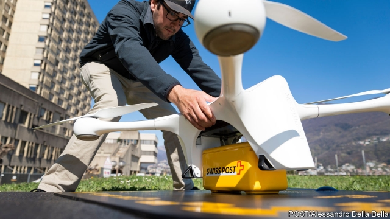

###### Flying start

# Drone deliveries are advancing in health care 

 

> print-edition iconPrint edition | Business | Jun 15th 2019 

A  FEW YEARS ago Jeff Bezos made a prediction. By 2018 his e-commerce empire, Amazon, would be delivering items by drone. Prime Air has yet to launch. But startups are making progress—mostly in health care, where they are vying to tap into a lucrative, $70bn global market in health-care logistics. As they deal with regulators and investors, these firms are charting the course for other aerial deliveries. 

One of the best known is Zipline, based in San Francisco. It took off in Rwanda in 2016, where it is now a national on-demand medical drone network, delivering 150 medical products, mostly blood and vaccines, to hard-to-reach places. Maternal mortality rates are declining thanks to the delivery of blood. Other firms have used drones to supply medicines in Bhutan, Malawi and Papua New Guinea. Patients in many Swiss hospitals can receive results on the day a sample is taken. Zipline is expanding into Ghana and, later this year, into North Carolina, an American state with many out-of-the-way rural medical facilities. It wants to serve 700m people in the next three to four years. 

For governments and regulators nervous about allowing drones to roam the skies, health-care deliveries offer a compelling reason to give it a go. Drones can fall out of the sky, collide with other air traffic, create perceived privacy concerns and make a noise. All this is hard to justify when they are delivering a light bulb. When they carry life-saving medicines the calculation is different. It is also easier, says Ben Marcus, founder of AirMap, a drone-technology firm, because health-care deliveries typically happen between a limited number of fixed sites, not to and from innumerable doorsteps. 

Like most fast-growing startups, drone firms are coy about profitability but say they are generating revenue. Investors look convinced. On May 17th Zipline announced $190m in new financing, which values it at $1.2bn. Like its competitors, it sees lucrative opportunities. For one thing, medical parcels are lightweight but valuable, so drone costs would make up a relatively small portion of the final bill. Drones can also replace the stocks of expensive medicines hospitals keep just in case they are needed, by flying them quickly to hospital beds from a central hub. Lightweight electric drones are likely to be less expensive than car or motorcycle couriers, and faster. Andreas Raptopoulos, boss of Matternet, another drone-delivery firm, thinks that this could save hospitals millions in lab and pharmacy costs. 

The prospect of such efficiency gains (as well as eco-friendliness) was factor in the partnership between Swiss Post and Matternet. Drones now serve three cities in Switzerland. Swiss Post says journeys of 45 minutes have been reduced to flights of a few minutes only. Matternet is, like Zipline, moving into North Carolina, where the local transport authority has championed drone delivery. UPS, a big delivery company, is using Matternet’s drones to replace some courier cars to move medical samples across the state. UPS lags behind Swiss Post in drone delivery, but hopes that experience in health care will lay the groundwork for national expansion. 

The future of drone deliveries of all kinds in America, and elsewhere, rests with regulators. In less developed countries the skies are empty and permission to fly can be granted by a single person. In developed countries, with their more crowded airspace and thicker rule books, everything takes longer. 

The buzz in America stems from a pilot programme by the Federal Aviation Administration (FAA), which is using it to help develop a regulatory framework. As part of the project, Zipline is expected next week to announce its plans for health-care deliveries directly to the consumer. Some expect that by the time the FAA pilot ends in November 2020, Mr Bezos will finally have his way. ◼ 
<<<<<<< HEAD

-- 

 单词注释:

1.drone[drәun]:n. 雄蜂, 懒惰者, 嗡嗡的声音, 无人驾驶飞机(或船) vi. 嗡嗡作声, 混日子 vt. 低沉地说 

2.Jun[dʒʌn]:六月 

3.jeff[dʒef]:n. 杰夫（男子名, 等于Jeffrey） 

4.bezos[]:贝索斯（人名） 

5.prediction[pri'dikʃәn]:n. 预言, 预报 [化] 预测 

6.amazon['æmәzɒn]:n. 亚马孙河 [医] 无乳腺者 

7.drone[drәun]:n. 雄蜂, 懒惰者, 嗡嗡的声音, 无人驾驶飞机(或船) vi. 嗡嗡作声, 混日子 vt. 低沉地说 

8.startup[]:[计] 启动 

9.vie[vai]:vi. 争, 竞争, 争胜 vt. 提出...来竞争, 以...作较量 

10.lucrative['lu:krәtiv]:a. 有利益的, 获利的, 合算的 

11.logistic[lәu'dʒistik]:a. 逻辑的, 后勤学的 

12.regulator['regjuleitә]:n. 调整者, 校准者, 校准器, 调整器, 标准钟 [化] 调节剂; 调节器 

13.investor[in'vestә]:n. 投资者 [经] 投资者 

14.aerial['єәriәl]:a. 空中的, 航空的, 空气的, 空想的 n. 天线 

15.zipline[]:[网络] 滑索；高空飞索；高空滑缆 

16.san[sɑ:n]:abbr. 存储区域网（Storage Area Networking） 

17.francisco[fræn'siskәu]:n. 弗朗西斯科（男子名, 等于Francis） 

18.rwanda[rj'ændә]:n. 卢旺达（东非国家）；卢旺达语 

19.vaccine['væksi:n]:n. 牛痘苗, 疫苗 a. 疫苗的, 牛痘的 

20.maternal[mә'tә:nl]:a. 母亲的, 母系的, 母方的 [医] 属母的, 母的, 母性的 

21.mortality[mɒ:'tælәti]:n. 必死的命运, 死亡数目, 死亡率 [医] 必死性, 死亡率 

22.Bhutan[bu:'tæn]:n. 不丹 

23.Malawi[mә'lɑ:wi]:n. 马拉维 

24.Papua['pæpjuә]:n. 巴布亚岛 

25.guinea['gini]:n. 几内亚 

26.Ghana['gɑ:nә]:n. 加纳 

27.Carolina[.kærә'lainә]:n. 北(或南)卡罗来纳州 

28.roam[rәum]:v. 漫游, 闲逛, 徜徉 n. 漫步, 漫游 

29.collide[kә'laid]:vi. 碰撞, 互撞, 抵触 

30.privacy['praivәsi]:n. 隐私, 隐居, 秘密 [计] 个人保密权 

31.ben[ben]:n. 内室 [医] 贝昂(俗名,一般指辣木Moringa oleifera,有时也指一些不同属的植物) 

32.Marcus['mɑ:kәs]:n. 马库斯（男子名） 

33.founder['faundә]:n. 创立者, 建立者 vt. 使沉没, 使摔倒, 弄跛, 浸水, 破坏 vi. 沉没, 摔到, 变跛, 倒塌, 失败 

34.typically['tipikәli]:adv. 代表性地；作为特色地 

35.innumerable[i'nju:mәrәbl]:a. 无数的, 数不清的 

36.doorstep['dɒ:step]:n. 门阶 

37.coy[kɒi]:a. 腼腆的, 怕羞的, 羞怯的 

38.profitability[.prɒfitә'biliti]:n. 收益性, 利益率 [经] 可获利润率 

39.lightweight['laitweit]:n. 不到平均重量的人/物, 轻量级, 无足轻重的人, 性格不够强的人 a. 平均重量以下的, 重量轻的 [计] 轻便的, 轻量的 

40.quickly['kwikli]:adv. 很快地 

41.hub[hʌb]:n. 毂, 木片, 中心 [计] 插座; 插孔; 集线器, 集中器, 连接器, 中继站 

42.lightweight['laitweit]:n. 不到平均重量的人/物, 轻量级, 无足轻重的人, 性格不够强的人 a. 平均重量以下的, 重量轻的 [计] 轻便的, 轻量的 

43.les[lei]:abbr. 发射脱离系统（Launch Escape System） 

44.courier['kuriә]:n. 送快信的人, 伴游服务员 [法] 信使, 送急件者 

45.andrea['ændriә,ɑ:n'dreiә]:n. 安德里亚（男子名） 

46.matternet[]:[网络] 互联网 

47.pharmacy['fɑ:mәsi]:n. 药房, 配药学, 制药业 [医] 药学, 药剂学, 调剂学, 药房 

48.partnership['pɑ:tnәʃip]:n. 合伙, 合股, 合作关系 [经] 合伙(合作)关系, 全体合伙人 

49.groundwork['graundwә:k]:n. 地基, 基础, 根据 

50.buzz[bʌz]:n. 嗡嗡声, 流言 vi. 发出嗡嗡声, 说闲话 vt. 使嗡嗡叫, 散布 

51.FAA[]:一切海损均不赔偿 

52.regulatory['regjulәtәri]:a. 受控制的, 统制的, 调整的 [经] 规则的 
=======
>>>>>>> 50f1fbac684ef65c788c2c3b1cb359dd2a904378

