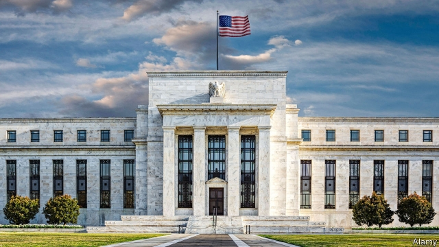

###### Monetary policy

# The market believes the Fed will cut rates by September. Should it? 

 

> print-edition iconPrint edition | Finance and economics | Jun 13th 2019 

THE FEDERAL RESERVE is changing direction. In December it predicted that it would raise the federal funds rate twice in 2019, to 2.75-3.0%. In March it thought it would hold rates steady instead. Investors now think there is a one-in-five chance that it will cut rates at its meeting on June 19th, and a 95% chance that it will do so by September (see chart). Jerome Powell, the Fed’s chairman, has said it is “ready to act”. 

The reason for the change is a darkening world economy, caused primarily by the failure of America and China to strike a deal to bring their trade war to an end. Yet for all the ructions, the visible impact on America’s hard economic data has so far been relatively small. True, American firms hired only 75,000 workers in May, on first estimate, well below the recent monthly average. But jobs data are volatile, and the unemployment rate is a very low 3.6%. 

Where the pain of the trade war has shown up is mainly in financial markets. The ten-year Treasury yield, for instance, was 2.5% in early May but has since fallen to 2.1% as investors have rushed to safety and anticipated rate cuts. Large moves like these raise an uncomfortable question for the Fed. Should it yield to the market, thereby risking the appearance that monetary policy is set by traders? Or should it consider only backward-looking economic data, which move slowly? 

 

Markets provide the aggregated wisdom of a crowd of individuals with money on the line. In most contexts their forecasts will outperform those of a financially disinterested committee, even one made up of experts. But there are other reasons why an apparent discrepancy between the two may endure. 

The first is that there is not really a discrepancy at all. Suppose the Fed and the market make the same judgment about the risk of an economic shock such as a trade war. “The Fed has the luxury of more time,” says Torsten Slok, an economist at Deutsche Bank. It can wait to see what happens before changing policy, whereas investors must hedge their bets immediately to account for even unlikely events. 

The second is that markets agree with the central bank about the economic outlook, but are confused about how it will act. “The Fed might have failed to communicate well,” says Frederic Mishkin, a former rate-setter. 

Only if these possibilities can be ruled out can central bankers conclude that markets are telling them something they need to hear about growth and inflation. Discerning this signal becomes trickier the more the Fed appears to respond to the market. To see why, suppose that the Fed ignores market movements completely, and instead sets policy in an entirely predictable way, responding only to hard data on growth and inflation. Any change in market expectations about Fed policy would then reflect only changes in investors’ perception of the outlook for those variables. “If Fed policy is clear and systematic,” says Charles Calomiris of Columbia University, “policymakers can glean useful information from markets.” The more the Fed responds to the market, however, the more it is “looking in the mirror”, as Alan Greenspan, a former Fed chairman, supposedly once quipped. 

If monetary policy were entirely automated, however, the information embodied in markets would be useful but unused. What is more, reacting only to real data is like driving while looking only in the rear-view mirror. Central bankers often say that monetary policy works only with a lag of 18 months or two years. Many economists believe that flat-footedness at the Fed has been to blame for numerous post-war American recessions. 

If the Fed wants to glean useful information from markets, it cannot pander to them. “The Fed needs to be the dog that wags the tail,” says Mr Mishkin. But when market movements have a fairly clear cause—in today’s case, the trade war—and the reaction is severe, it is likely that a rate cut will eventually be necessary. The short-term risk of moving in anticipation of events is that the outlook brightens and the rate cut then sparks inflation. Yet to the extent that economic data are telling a clear story, it is that inflation is contained. Consumer-price inflation, for example, slowed to 1.8% in May. That suggests it would be better for the Fed to get on with the rate cuts that the market expects. ◼ 

-- 

 单词注释:

1.monetary['mʌnitәri]:a. 货币的, 金钱的 [经] 货币的, 金融的 

2.Jun[dʒʌn]:六月 

3.investor[in'vestә]:n. 投资者 [经] 投资者 

4.jerome[dʒә'rәum]:n. 杰罗姆（男子名） 

5.powell['pәuәl, 'pauәl]:n. 鲍威尔（英国物理学家） 

6.darken['dɑ:kn]:vt. 弄暗, 使模糊 vi. 暗下来, 颜色变深 

7.ruction['rʌkʃәn]:n. 吵闹, 骚动 

8.datum['deitәm]:n. 论据, 材料, 资料, 已知数 [医] 材料, 资料, 论据 

9.volatile['vɒlәtail]:a. 挥发性的, 可变的, 不稳定的, 飞行的, 轻快的, 爆炸性的 n. 有翅动物, 挥发物 [计] 易失的 

10.treasury['treʒәri]:n. 国库, 宝库, 财政部, 国库券 [经] 库存, 国库, 金库 

11.monetary['mʌnitәri]:a. 货币的, 金钱的 [经] 货币的, 金融的 

12.aggregate['ægrigәt]:n. 合计, 总计, 聚集体 a. 合计的, 聚集的 v. 聚集, 集合, 合计达 [计] 聚合体; 聚集 

13.context['kɒntekst]:n. 上下文, 背景, 来龙去脉 n. 上下文 [计] 上下文 

14.outperform[.autpә'fɔ:m]:vt. 胜过；做得比……好 

15.financially[]:adv. 金融上；财政上 

16.disinterested[dis'intristid]:a. 无私欲的, 廉洁的, 公平的 

17.discrepancy[dis'krepәnsi]:n. 不符合, 差异, 不相符之处 [化] 不符值; 偏差值 

18.judgment['dʒʌdʒmәnt]:n. 裁判, 宣告, 判决书 [医] 判断 

19.torsten[]:n. (Torsten)人名；(德、芬、瑞典)托尔斯滕 

20.economist[i:'kɒnәmist]:n. 经济学者, 经济家 [经] 经济学家 

21.deutsche[]:n. 德意志联邦共和国马克 

22.frederic['fredәrik]:n. 弗雷德里克（男性名） 

23.mishkin[]:n. (Mishkin)人名；(英、俄、塞)米什金 

24.banker['bæŋkә]:n. 银行家, 庄家 [经] 银行业者, 银行家 

25.inflation[in'fleiʃәn]:n. 胀大, 夸张, 通货膨胀 [化] 充气吹胀; 膨胀 

26.discern[di'zә:n]:v. 辨别, 看清楚, 了解 

27.tricky['triki]:a. 狡猾的, 机敏的 

28.entirely[in'taiәli]:adv. 完全, 全然, 一概 

29.predictable[pri'diktәbl]:a. 可预言的 

30.perception[pә'sepʃәn]:n. 知觉, 感觉, 领悟力, 获取 [医] 知觉 

31.charle[]:n. 查理（男子名）；查理（姓氏） 

32.Columbia[kә'lʌmbiә]:n. 哥伦比亚 

33.policymaker['pɔlisi.meikә]:n. 政策制定者；决策人 

34.glean[gli:n]:v. 拾落穗, 收集 

35.alan['ælәn]:n. 艾伦（男子名） 

36.Greenspan[]:[经] 格林斯班 

37.supposedly[sә'pәuzidli]:adv. 想象上, 看上去像, 被认为是, 恐怕, 按照推测 

38.quip[kwip]:n. 妙语, 遁辞, 讽刺 v. 说讽刺话, 嘲弄 

39.automate['ɔ:tәmeit]:vt.vi. (使)自动化 [计] 自动化 

40.embody[im'bɒdi]:vt. 具体表达, 使具体化 [经] 合并, 具体化, 具体表现 

41.unused[.ʌn'ju:zd]:a. 不用的, 不在使用的, 从未用过的 

42.recession[ri'seʃәn]:n. 后退, 凹处, 衰退, 归还 [医] 退缩 

43.cannot['kænɒt]:aux. 无法, 不能 

44.pander['pændә]:vi. 勾引, 怂恿, 卑劣地迎合 n. 拉皮条者, 怂恿者, 助恶者 

45.anticipation[æn.tisi'peiʃәn]:n. 预期, 预料 [医] 提前出现(如遗传病) 

