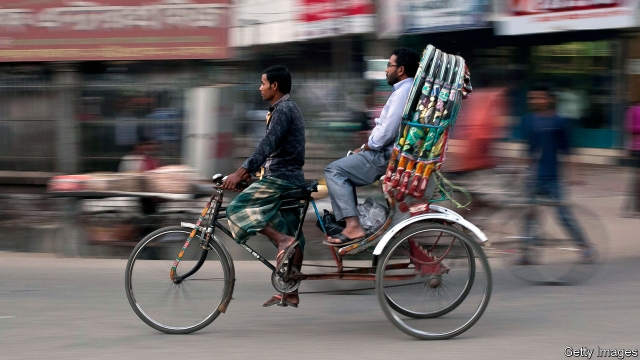

###### More is less

# Why an anti-poverty programme in Bangladesh failed 

 

> print-edition iconPrint edition | Finance and economics | Jun 15th 2019 

A YEAR AND a half ago The Economist wrote about a promising approach to cutting poverty in Bangladesh (“On their bikes”, January 27th 2018). RDRS, a charity, was offering small loans to more than 100,000 poor farmers on the condition that they migrated temporarily to a city for work. Everything seemed to be set fair. Smaller randomised controlled trials had shown that many men could be persuaded to move while the rice crop is growing, when there is not much work to be done at home. Although the migrants found only low-paid jobs, as rickshaw drivers, building labourers and the like, their fortunes had greatly improved. It looked like a true poverty cure. 

Sadly, things soon began to go wrong. Evidence Action, the charity overseeing the scheme, heard rumours that somebody involved with the project may have sought to bribe a government official, though it could not substantiate them. More damningly, as the data came in, it became clear that in 2017 few men had been persuaded to migrate. On June 6th Evidence Action announced it was shutting down the scheme. What looked like a miracle cure for poverty now seems like a warning about the pitfalls of development projects. 

Do-gooding schemes that work brilliantly in trials often fail when they are scaled up, says Justin Sandefur of the Centre for Global Development, a think-tank. Trials are often overseen by determined PhD students. When large charities or government officials take over, as they must if a project is to be done at scale, much changes. Rules and regulations multiply; bad behaviour becomes more likely. Big schemes can attract hefty opposition. 

One charity in Kenya had shown that hiring teachers on fixed-term contracts improved pupils’ test scores. So the government rolled out the contracts across the country. But a political backlash meant that the contracted teachers were promised trade-union representation, just like ordinary teachers. Not surprisingly, an evaluation by Mr Sandefur and others found that the government’s reform had no effect. 

In Bangladesh the problem may have been targets. Many of the “migration organisers” who fanned out to villages, offering to subsidise journeys to cities, seem to have been expected to sign up 450 migrants each. They may have done what anybody would do in that situation: approach men who had migrated before or were especially eager to travel. Because most of those men would have made the journey anyway, the project had little effect. 

Mushfiq Mobarak of Yale University, who helped develop the Bangladesh migration project, says that the episode shows how important it is to keep collecting and analysing data as schemes grow. But, as he points out, it is possible that exactly the opposite lesson will be learned. Rigorous, ongoing analysis of development projects is slow, expensive, hard—and, as researchers keep discovering, liable to turn up uncomfortable facts. It is much easier just to assume that your project is doing good.◼ 

-- 

 单词注释:

1.les[lei]:abbr. 发射脱离系统（Launch Escape System） 

2.Bangladesh[,bɑ:ŋ^lә'deʃ]:n. 孟加拉国 [经] 孟加拉共和国 

3.Jun[dʒʌn]:六月 

4.economist[i:'kɒnәmist]:n. 经济学者, 经济家 [经] 经济学家 

5.migrate['maigreit]:vi. 移动, 移往, 随季节而移居 [计] 迁移程序 

6.temporarily['tempәrәrәli]:adv. 暂时, 一时, 临时 

7.randomise['rændəmaiz]:vt. [主英国英语]＝randomize 

8.migrant['maigrәnt]:n. 候鸟, 移居者 [法] 移居者 

9.rickshaw['rikʃɔ:]:n. 人力车, 黄包车 

10.oversee[.әuvә'si:]:vt. 向下看, 了望, 监督, 偷看到 [法] 监察, 监督, 俯瞰 

11.bribe[braib]:n. 贿赂 vt. 贿赂, 收买 vi. 行贿 

12.substantiate[sәb'stænʃieit]:vt. 使实体化, 证实 [经] 确证 

13.damningly['dæmɪŋlɪ]:adv. 定罪地, 导致定罪地 

14.datum['deitәm]:n. 论据, 材料, 资料, 已知数 [医] 材料, 资料, 论据 

15.pitfall['pitfɒ:l]:n. 陷阱, 诱惑, 阴谋, 易犯的错误, 意想不到的困难 

16.brilliantly['brijәntli]:adv. 辉煌地, 光亮地, 灿烂地 

17.justin['dʒʌstin]:n. 贾斯廷（男子名） 

18.phd[]:abbr. 哲学博士学位（Doctor of Philosophy） 

19.hefty['hefti]:a. 重的, 肌肉发达的 

20.opposition[.ɒpә'ziʃәn]:n. 反对, 敌对, 相反, 在野党 [医] 对生, 对向, 反抗, 反对症 

21.Kenya['kenjә]:n. 肯尼亚 

22.backlash['bæklæʃ]:n. 后冲, 强烈反对 [电] 反撞, 逆栅流 

23.representation[.reprizen'teiʃәn]:n. 表示法, 表现, 陈述, 代表 [计] 表示法指定 

24.evaluation[i.vælju'eiʃәn]:n. 评估, 估价, 求值 [计] 鉴定; 评价; 求值 

25.migration[mai'greiʃәn]:n. 移民, 移往, 移动 [计] 迁移 

26.subsidise[]:vt. 给...补助金, 津贴, 资助 

27.Yale[jeil]:n. 耶鲁 

28.rigorous['rigәrәs]:a. 严厉的, 严酷的, 严格的, 苛刻的, 严密的, 精确的 

29.ongoing['ɒngәuiŋ]:a. 前进的, 进行的, 不间断的 n. 前进, 发展 

