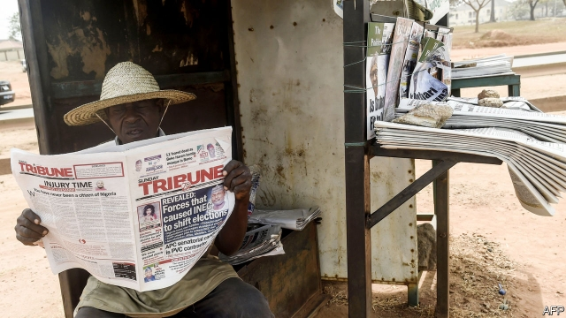

###### Don’t gag me

# An attack on free speech in Nigeria 

 

> print-edition iconPrint edition | Middle East and Africa | Jun 15th 2019 

NIGERIA’S PRESIDENT, Muhammadu Buhari, once described press freedom as a “sound democratic ideal”. At the time he was on the presidential campaign trail, keen to prove himself a democrat and to jettison the baggage of his 20 months as military ruler in the 1980s. He told bosses of media companies that, if elected, he would uphold the constitution and respect freedom of speech. 

Four years on—and just weeks into his second term in office—that promise is wearing thin. Earlier this month the Nigerian Broadcasting Commission (NBC) switched off transmission from Nigeria’s oldest private television channel and from radio stations owned by Raymond Dokpesi, a member of the opposition People’s Democratic Party, for “inciting broadcasts and media propaganda against the government”. Within 24 hours they were back on air after a federal high court overturned the suspension. 

Mr Buhari has not commented, but one of his aides praised the blackout. “Kudos to the NBC,” she tweeted. Mr Buhari’s supporters insist the suspension had nothing to do with politics. Critics note that the head of the NBC, who was appointed by Mr Buhari, is a member of the ruling party. 

The brouhaha is an uncomfortable reminder of Decree Number 4, a media-gagging rule imposed by Mr Buhari when he was a military ruler. It criminalised the publication of “any message, rumour, report or statement” that brought the government or any public officer “to ridicule or disrepute”—ie, any journalism feistier than a weather report. 

Nigeria has vibrant and critical media. And unlike several other African leaders, Mr Buhari has never tried to shut down the internet to silence critics. But repression is on the rise. The Nigerian Guild of Editors called the closure of the stations a “barbaric crackdown” on free speech and pointed out that the government has closed several other radio and television stations over the past year. In January soldiers raided the offices of one of the country’s leading newspapers, the Daily Trust, and arrested reporters. In March a journalist who had previously been held without access to a lawyer for two years was rearrested. In both cases, national security was cited as justification. The Committee to Protect Journalists, a watchdog in New York, has also recorded multiple instances in which security forces have beaten and arrested journalists, including an attack on a reporter by police on June 5th. 

The lyrics of a musician Mr Buhari’s old military regime once jailed, the late Fela Kuti, still resonate as powerfully as ever. “Je’nwi temi” (“Don’t gag me”), he crooned in Yoruba. ◼ 
<<<<<<< HEAD

-- 

 单词注释:

1.gag[gæg]:n. 箝口物, 箝制言论, 讨论终结 vt. 阻塞, 压制言论自由, 使窒息, 使呕吐, 插科打浑, 欺骗 vi. 窒息, 作呕, 欺骗, 插科打浑 

2.Nigeria[nai'dʒiriә]:n. 尼日利亚 

3.Jun[dʒʌn]:六月 

4.buhari[]:[网络] 布哈里 

5.presidential[.prezi'denʃәl]:a. 总统制的, 总统的, 首长的, 统辖的 [法] 总统的, 议长的, 总经理的 

6.democrat['demәkræt]:n. 民主人士, 民主主义者, 民主党党员 [经] 民主党 

7.jettison['dʒetisәn]:n. 投弃, 投弃货物 [经] 抛弃, 船货投海 

8.uphold[ʌp'hәuld]:vt. 支撑, 赞成, 鼓励, 举起, 坚持 [法] 确认, 赞成, 支持 

9.Nigerian[nai'dʒiriәn]:n. 尼日利亚人 

10.NBC[]:全国广播公司(美国) 

11.raymond['reimɔnd]:n. 雷蒙德（男子名） 

12.opposition[.ɒpә'ziʃәn]:n. 反对, 敌对, 相反, 在野党 [医] 对生, 对向, 反抗, 反对症 

13.incite[in'sait]:vt. 刺激, 激励, 引诱 [法] 鼓动, 煽动 

14.propaganda[.prɒpә'gændә]:n. 宣传, 宣传活动 [医] 宣传 

15.overturn[.әuvә'tә:n]:n. 倾覆, 破灭, 革命 vt. 推翻, 颠倒 vi. 翻倒 

16.aide[eid]:n. 助手, 副官 [计] 数据输入的可说明性 

17.blackout['blækaut]:n. 灯火管制, 暂时的意识丧失, 灯火熄灭, 删除 [计] 电网掉电 

18.kudo['kju:dәu]:n. 奖赏, 光荣, 荣誉 

19.tweet[twi:t]:vi. 啁啾 n. 小鸟叫声 

20.supporter[sә'pɒ:tә]:n. 支持者, 后盾, 迫随者, 护身织物 [法] 支持者, 赡养者, 抚养者 

21.politic['pɒlitik]:a. 精明的, 明智的, 策略的 

22.brouhaha[bru:'hɑ:hɑ:]:n. 吵闹, 骚动 

23.reminder[ri'maindә]:n. 提醒的人, 暗示 [经] 催单 

24.decree[di'kri:]:n. 法令, 判决, 天意 vt. 颁布, 判决 vi. 发布命令 

25.criminalise['krimənəlaiz]:vt. [主英国英语] =criminalize 

26.ridicule['ridikju:l]:n. 嘲笑, 愚弄, 笑柄 vt. 嘲笑, 嘲弄, 愚弄 

27.journalism['dʒә:nәlizm]:n. 新闻业, 报章杂志 [法] 报刊, 新闻业, 新闻出版 

28.feisty['faisti]:a. 激动的, 活跃的, 好争吵的, 坐立不安的 

29.vibrant['vaibrәnt]:a. 振动的, 战栗的, 响亮的, 活跃的 

30.repression[ri'preʃәn]:n. 抑制, 压抑, 制止 [医] 压抑, 抑制 

31.guild[gild]:n. 团体, 协会, 行业协会 [经] 同业公会 

32.closure['klәuʒә]:n. 关闭 vt. 使终止 

33.barbaric[bɑ:'bærik]:a. 野蛮的, 粗野的 

34.crackdown['krækdaun]:n. 制裁, 镇压, 痛击 

35.rearrest[ri:ә'rest]:vt. 重新逮捕, 重新扣留, 重新拘留 [法] 再拘捕, 再拘留; 再拘捕, 拘留 

36.cite[sait]:vt. 引用, 引证, 表彰 [建] 引证, 指引 

37.justification[.dʒʌstifi'keiʃәn]:n. 辩护, 证明正当, 释罪 [计] 调整 

38.watchdog['wɒtʃdɒg]:n. 看门狗, 监察人 [化] 监控设备; 监视器 

39.york[jɔ:k]:n. 约克郡；约克王朝 

40.lyric['lirik]:n. 抒情诗, 歌词 a. 抒情的 

41.regime[rei'ʒi:m]:n. 政权, 当权期间, 政体, 社会制度, 体制, 情态 [医] 制度, 生活制度 

42.fela[]:abbr. Federal Employers Liability Act 联邦雇主义务法; free electron laser amplifier 自由电子激光放大器 

43.kuti[]: [地名] [加纳] 库蒂 

44.resonate['rezәneit]:v. (使)共鸣, (使)共振 

45.powerfully[]:adv. 强有力, 强大, 效力大, 有权威, 权力大, 有影响, 很多, 相当, 非常 

46.temi[]:[网络] 单晶片能力认证；单晶片系统发展协会；限量款 

47.croon[kru:n]:v. 低声歌唱, 低唱, 低吟 n. 低唱, 低吟, 轻哼 

48.Yoruba['jɑ:rubә, 'jɔru'bɑ:]:n. (非洲)约鲁巴人[语] 
=======
>>>>>>> 50f1fbac684ef65c788c2c3b1cb359dd2a904378

