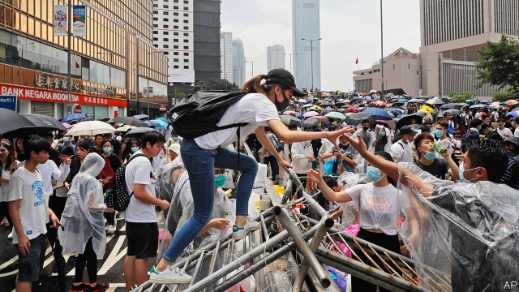
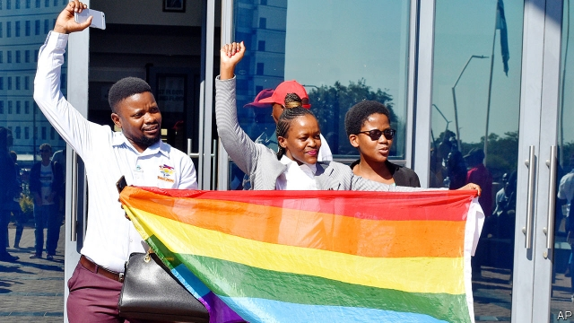

###### People v power

# Politics this week 

 

> Jun 15th 2019 

Police in Hong Kong used rubber bullets, tear gas and water hoses on crowds demonstrating against a proposed law that would allow people to be extradited to the Chinese mainland. Three days earlier, perhaps 1m marchers thronged the streets, worried that the law would make anyone in Hong Kong, citizens and visiting businessfolk alike, vulnerable to prosecution in Chinese courts, which are under the thumb of the Communist Party. See article. 

For the third time, a court in New Zealand prevented the government from extraditing a murder suspect to China. It asked the government to consider whether China could be relied upon to adhere to the human-rights treaties it has signed and whether a trial would be free from political interference. 

Tsai Ing-wen, the president of Taiwan, survived a primary challenge from Lai Ching-te, her former prime minister. She will face the winner of the opposition Kuomintang’s primary at the polls in January. 

Kassym-Jomart Tokayev was confirmed as Kazakhstan’s president in an election in which he won 71% of the vote—somewhat less than the 98% that his predecessor and patron, Nursultan Nazarbayev, won in 2015. Observers said both votes were unfair. Police arrested hundreds of peaceful demonstrators. See article. 

The government of the Australian state of Queensland issued the final approvals for the proposed Carmichael coal mine, to be built by Adani, an Indian conglomerate. Environmentalists oppose the mine, arguing that coal threatens the climate and the Great Barrier Reef. 

Mauricio Macri made a surprising selection for his running-mate in Argentina’s presidential election in October: Miguel Ángel Pichetto, who leads the Peronist bloc in the senate. The other presidential ticket will be all-Peronist, including Cristina Fernández de Kirchner, a former president. Previous Peronist regimes have borrowed and splurged with unusual recklessness. 

Jair Bolsonaro, Brazil’s president, contradicted the country’s central bank when he claimed a plan to create a monetary union with Argentina was under consideration. The central bank was further ruffled when Mr Bolsonaro said that a single currency could one day be used throughout South America. 

Donald Trump dropped his threat to raise tariffs on goods from Mexico, after its government promised to do more to stop migrants from Central America illegally crossing the border into the United States. In Mexico the deal was hailed for averting a potential crisis. Mr Trump’s critics said that some of the details were not, in fact, new. See article. 

Mr Trump claimed executive privilege (again) in withholding details from Congress about the procedure used for placing a question on the next census about citizenship. The House oversight committee recommended that the attorney-general and commerce secretary be held in contempt for refusing to co-operate. 

The New York Times decided to end political cartoons in its international edition, following the publication in April of a “clearly anti-Semitic and indefensible” caricature of Binyamin Netanyahu, Israel’s prime minister, as a dog leading a yarmulke-wearing Mr Trump. Presumably if the paper ever publishes a reprehensible article, it will thereafter have to distribute only blank pages. 

Dozens of people, including several children, were killed in a Dogon village in central Mali. The murders were blamed on a Fulani militia and are the latest in a series of tit-for-tat ethnic killings. In March a Dogon militia slaughtered more than 150 Fulani villagers. 

A child became the first person in Uganda to die of Ebola, a deadly virus that has infected more than 2,000 people in the Democratic Republic of Congo next door. The boy had travelled to Uganda from Congo with family members, some of whom are also infected; his grandmother also died. Uganda’s system for containing epidemics is far more effective than Congo’s. 

Protesters in Sudan called off a general strike and agreed to resume talks with the junta that took charge after the fall of the country’s dictator, Omar al-Bashir, in April. Negotiations over who would lead a transitional government had collapsed when security forces murdered at least 100 demonstrators on June 3rd. See article. 

 

Botswana’s high court legalised gay sex, striking down a colonial-era prohibition. Half of young people in Botswana now say they would not object to a gay neighbour, a marked increase in tolerance from previous generations. See article. 

Oil prices jumped after two tankers were reportedly damaged in a suspected attack off the coast of Oman. America has blamed Iran for several recent attacks on shipping. 

A Saudi Arabian teenager faces possible execution for taking part in a demonstration when he was ten years old. The boy, now 18, has been held for four years. 

Ivan Golunov, a Russian journalist who exposes corruption, was arrested after police claimed to have found drugs in his possession. Photos purporting to show a drug lab in his flat turned out to have been taken somewhere completely different. After huge protests, which included the front pages of normally quiescent newspapers, at his obvious framing, the authorities released him. See article. 

In Moldova police surrounded government buildings after a rival administration declared itself in charge. The pro-Russian president, who supports the new team, was sacked by the old team. See article. 

Ten candidates jostled to become leader of Britain’s Conservative Party, and thus the country’s next prime minister. Boris Johnson is the bookies’ favourite, but not Europe’s. See article. 

The British government amended the Climate Change Act to set a target of eliminating Britain’s net emissions of greenhouse gases by 2050. The “net zero” target is the first in any G7 country. There are two wrinkles: it is unclear whether the target will include emissions from aviation and shipping; and policies adopted to reach the target may make use of international offsets. 

Norway’s parliament voted to require the country’s sovereign-wealth fund, the world’s largest, to divest from fossil-fuel companies. Energy giants that have invested heavily in renewables, such as BP and Shell, are excluded. 
<<<<<<< HEAD

-- 

 单词注释:

1.V[vi:]:[计] 溢出, 变量, 向量, 检验, 虚拟, 垂直 [医] 钒(23号元素) 

2.politic['pɒlitik]:a. 精明的, 明智的, 策略的 

3.Jun[dʒʌn]:六月 

4.hong[hɔŋ]:n. （中国、日本的）行, 商行 

5.kong[kɔŋ]:n. 含锡砾石下的无矿基岩；钢 

6.hose[hәuz]:n. 水管, 橡皮软管, 长统袜 vt. 用水管浇 

7.marcher[]:n. 边界地区居民, 行进者, 游行者, 行军者 

8.businessfolk[]:[网络] 商务人士 

9.vulnerable['vʌlnәrәbl]:a. 易受伤害的, 有弱点的, 易受影响的, 脆弱的, 成局的 [医] 易损的 

10.prosecution[.prɒsi'kju:ʃәn]:n. 执行, 经营, 起诉 

11.zealand['zi:lәnd]:n. 西兰岛（丹麦最大的岛） 

12.tsai[]:n. 蔡（姓氏） 

13.taiwan['tai'wɑ:n]:n. 台湾 

14.lai[lai]:abbr. 意大利航空公司（Linee Aeree Italiane） 

15.opposition[.ɒpә'ziʃәn]:n. 反对, 敌对, 相反, 在野党 [医] 对生, 对向, 反抗, 反对症 

16.les[lei]:abbr. 发射脱离系统（Launch Escape System） 

17.predecessor[.predi'sesә]:n. 前任, 先辈, 前身 [医] 初牙, 前辈, 祖先 

18.patron['peitrәn]:n. 赞助人, 顾客, 保护人 [法] 保护人, 庇护人, 赞助人 

19.nursultan[]:[网络] 努苏坦 

20.nazarbayev[]:[网络] 纳扎尔巴耶夫；总统纳扎尔巴耶夫；哈萨克的纳扎尔巴耶夫 

21.demonstrator['demәnstreitә]:n. 论证者, 证明者, 指示者, 示威者 [医] 示教者 

22.Queensland['kwi:nzlәnd]:[经] 昆士兰 

23.Carmichael[]:n. 卡米高（地区名）；卡迈克尔（人名） 

24.Adani[]:[地名] 阿达尼 ( 尼日利 ) 

25.conglomerate[kәn'glɒmәrit]:a. 聚成球形的, 砾岩性的 n. 集成物, 混合体, 砾岩 v. (使)凝聚成团 

26.environmentalist[in,vaiәrәn'mentlist]:n. 环保人士 

27.reef[ri:f]:n. 暗礁, 礁, 缩帆 v. 缩(帆) 

28.Mauricio[]:n. 毛利西奥（男子名） 

29.macri[]: [人名] 麦克里 

30.presidential[.prezi'denʃәl]:a. 总统制的, 总统的, 首长的, 统辖的 [法] 总统的, 议长的, 总经理的 

31.Miguel[mi'gel]:n. 米格尔（男子名） 

32.Peronist[pә'rәjnist]:a. (阿根廷总统)庇隆的,庇隆主义的, 庇隆主义者的 

33.bloc[blɒk]:n. 集团 

34.Cristina[]:n. 克里斯蒂娜（电视剧中的人物） 

35.de[di:]:[化] 非对映体过量 [医] 铥(69号元素铥的别名,1916年Eder离得的假想元素) 

36.kirchner[]:柯克纳（人名） 

37.regime[rei'ʒi:m]:n. 政权, 当权期间, 政体, 社会制度, 体制, 情态 [医] 制度, 生活制度 

38.splurge[splә:dʒ]:n. 炫耀, 夸示 vi. 炫耀, 卖弄, 挥霍 vt. 挥霍 

39.recklessness[]:[法] 鲁莽, 粗心大意 

40.jair[]:[网络] 睚珥；贾伊尔；睢珥 

41.monetary['mʌnitәri]:a. 货币的, 金钱的 [经] 货币的, 金融的 

42.Argentina[.ɑ:dʒәn'ti:nә]:n. 阿根廷 

43.ruffle['rʌfl]:n. 皱褶, 波纹, 生气, 混乱 vt. 弄皱, 触怒, 洗(牌), 连续轻擂(鼓) vi. 起皱, 发脾气, 连续轻擂 

44.tariff['tærif]:n. 关税, 关税表, 价格表, 收费表 vt. 课以关税 [计] 价目表 

45.migrant['maigrәnt]:n. 候鸟, 移居者 [法] 移居者 

46.illegally[]:[法] 非法地, 不合法地, 违法地 

47.hail[heil]:n. 冰雹, 致敬, 欢呼, 招呼 vt. 向...欢呼, 致敬, 招呼, 使象下雹样落下 vi. 招呼, 下雹 interj. 万岁, 欢迎 

48.avert[ә'vә:t]:vt. 转开, 避免, 防止 

49.withhold[wið'hәuld]:vt. 使停止, 扣留, 保留, 拒给 vi. 克制, 忍住 

50.census['sensәs]:n. 户口普查 vt. 实施统计调查 

51.citizenship['sitizәnʃip]:n. 国籍, 市民权, 市民的身份 [法] 公民权, 公民资格, 公民身分 

52.oversight['әuvәsait]:n. 勘漏, 失察, 失败, 照料 [经] 监督权 

53.york[jɔ:k]:n. 约克郡；约克王朝 

54.indefensible[.indi'fensәbl]:a. 不能防卫的, 无辩护余地的 

55.caricature['kærikәtʃә]:n. 讽刺画, 漫画, 漫画手法 vt. 画成漫画讽刺 

56.binyamin[]:本雅明 

57.Netanyahu[]:n. 内塔尼亚胡（人名） 

58.reprehensible[.repri'hensәbl]:a. 应斥责的, 应该谴责的 [法] 应受严责的, 应受指责的, 应受申斥的 

59.thereafter[.ðєәr'æftә]:adv. 其后, 从那时以后 

60.dogon['dəuɡɔn]:n. 多贡（马里中部山区）；多贡人 

61.Mali['mɑ:li]:n. 马里 

62.Fulani['fu:lɑ:ni]:富拉尼人(即富尔贝人) 

63.militia[mi'liʃә]:n. 义勇军, 民兵组织, 国民军 

64.sery[]:n. (Sery)人名；(俄)谢雷；(科特)塞里 

65.ethnic['eθnik]:a. 人种的, 种族的 [医] 人种的 

66.killing['kiliŋ]:n. 谋杀, 杀戮 a. 杀害的, 疲惫的, 迷人的 

67.slaughter['slɒ:tә]:n. 残杀, 屠杀, 杀戮 vt. 残杀, 屠杀, 亏本出售 

68.Uganda[ju(:)'^ændә, u:'^ændә]:n. 乌干达 

69.ebola[i'bəulə]:n. 埃博拉病毒 

70.Congo['kɔŋ^әu]:n. 刚果, 刚果河, 工夫茶 [建] 刚果, 直接刚果红 

71.epidemic[.epi'demik]:n. 传染病, 流行病 a. 流行的, 传染性的 

72.protester[]:n. 抗议者, 持异议者, 拒付者 [经] 反对者 

73.Sudan[su:'dæn]:n. 苏丹 [化] 苯偶氮间苯二酚; 苏丹 

74.junta['dʒʌntә]:n. 以武力政变上台的(军)政府, 私党, 阴谋小集团, 政务会 

75.dictator['dikteitә]:n. 命令者, 独裁者 

76.omar['әjmɑ:(r)]:n. 奥马尔（男子名） 

77.negotiation[ni.gәuʃi'eiʃәn]:n. 谈判, 磋商, 交涉 [经] 谈判, 协商 

78.transitional[træn'siʒәnl]:a. 变迁的, 过渡期的 [医] 转变的, 过渡的; 过渡型单核白细胞 

79.legalise['li:^әlaiz]:vt. 使合法化, 使成为法定, 法律上认可 

80.prohibition[.prәuhi'biʃәn]:n. 禁令, 禁止 

81.botswana[bɔt'swɑ:nә]:n. 博茨瓦纳（非洲中南部国家） 

82.reportedly[ri'pɒ:tidli]:adv. 根据传说, 根据传闻, 据报道 

83.Oman[әu'mɑ:n]:n. 阿曼 

84.Iran[i'rɑ:n]:n. 伊朗 

85.saudi['sajdi]:a. 沙乌地阿拉伯（人或语）的 

86.execution[.eksi'kju:ʃәn]:n. 实行, 完成, 执行, 死刑 [计] 执行 

87.demonstration[.demәn'streiʃәn]:n. 示范, 实证 [医] 示教, 实物教授 

88.ivan['aivәn]:n. 伊凡（男子名） 

89.corruption[kә'rʌpʃәn]:n. 腐败, 堕落, 贪污 [计] 论误 

90.purport['pә:pɒ:t]:n. 意义, 要旨, 目的 vt. 意味着, 声称, 打算 

91.quiescent[kwai'esnt]:a. 静止的, 不活动的, 寂静的 [医] 静息的, 静止的 

92.Moldova[mɔl'dɔvɑ:]:n. 摩尔多瓦 

93.jostle['dʒɒsl]:n. 推挤, 冲撞 vi. 推挤, 冲撞 vt. 推, 挤, 煽动 

94.boris['bɔris]:n. 鲍里斯（男子名） 

95.johnson['dʒɔnsn]:n. 约翰逊（姓氏） 

96.amend[ә'mend]:vt. 修改, 改善, 改良 vi. 改过自新 

97.emission[i'miʃәn]:n. 发射, 射出, 发行 [医] 发射, 遗精 

98.unclear[.ʌn'kliә]:a. 不易了解的, 不清楚的, 含混的 

99.offset['ɒ:fset]:n. 抵消, 把...并列, 旁系, 支管, 用胶印法印 vt. 弥补, 抵消, 胶印 vi. 装支管 n. 偏移量 [计] 偏移量 

100.divest[dai'vest]:vt. 使摆脱, 使脱去, 夺去 [经] 取消权力 

101.renewable[ri'nju(:)әbl]:a. 可更新的, 可恢复的, 可继续的, 可换新的, 可重复的, 可重说的 [计] 可更新, 可再生的 

102.bp[]:[化] 碱基对 
=======
>>>>>>> 50f1fbac684ef65c788c2c3b1cb359dd2a904378

