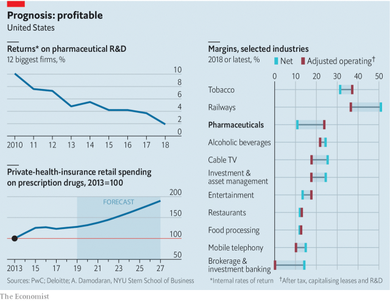

###### Profit warning

# American drugmakers are raising prices. Again 

 

> print-edition iconPrint edition | Business | Jun 22nd 2019 

“IF YOU THINK the cost of your drug will scare people from buying your drugs, then lower your prices.” That blunt warning was issued recently by Alex Azar, America’s health secretary, to global pharmaceutical giants. A new report by UBS, an investment bank, finds that Americans spent nearly two-thirds of all money spent globally on new drugs from 2012 to 2017. On June 14th Bluebird Bio unveiled a gene therapy to treat an inherited blood disorder that will cost nearly $1.8m per treatment. Shortly before, Novartis, a Swiss giant, priced its gene therapy for spinal muscular atrophy at $2.1m, making it the world’s most expensive medication. 

Outrage over such headlines is a rare thing to unite President Donald Trump and his Democratic detractors. Many cheered the administration’s latest effort to force drugmakers to disclose the list price of drugs in television advertisements. 

On June 14th Big Pharma struck back. Amgen, Merck and Eli Lilly sued Mr Azar (who used to work at Eli Lilly) and his department in order to block the rule. They argue that buyers seldom pay the full list price, since insurers and other middlemen wrest hefty (and often secret) discounts. 

Working out how profitable drug firms are is not a simple matter. Their net margins of 11%, less than restaurants and one-fifth those of railways, do not exactly scream price gouging. But a fairer picture can be reached by adding back interest costs, adjusting for leases and, crucially, by also treating research and development expenses as an investment that is depreciated gradually over time. According to a recent study by Aswath Damodaran of New York University’s Stern School of Business, on this basis drug firms’ margins are 24%, higher than most other sectors (see chart). 

 

Drug firms retort that the returns on that R&D investment will not be as good as they used to be. They have to spend ever more prospecting for blockbuster molecules. The alternative is to pay top dollar to acquire biotechnology firms which have already identified them. On June 17th Pfizer said it would pay $11.4bn for Array BioPharma, which has developed therapies for cancer. In April Bristol-Myers Squibb approved a $74bn purchase of Celgene. 

Whatever the true level of pharmaceutical firms’ financial returns, they could become juicier again. Although in the past four years spending on drugs by patients and private insurers has barely budged, an annual report published on June 20th by PwC, a consultancy, forecasts that it is about to rise again. Most of the increase will be the result of higher prices. 

Peter Bach of Memorial Sloan Kettering, a leading cancer hospital in New York, thinks the million-dollar price tags are unjustified. Novartis, he argues, cherry-picked health-economic studies that supported its pricing. In 2012, his hospital refused to offer patients a new cancer drug from Sanofi after his analysis showed its high price was not justified by better outcomes. The French firm reduced it—just as Mr Azar would counsel. ◼ 

-- 

 单词注释:

1.drugmaker['drʌ^,meikә(r)]:制药者 

2.Jun[dʒʌn]:六月 

3.blunt[blʌnt]:a. 钝的, 坦率的, 麻痹的 

4.Alex[]:[计] 开放网络文件系统 

5.azar[]:n. (Azar)人名；(阿拉伯、土、葡、哈萨、塔吉、吉尔、土库、阿塞、乌兹)阿扎尔；(英)阿扎；(西)阿萨尔 

6.pharmaceutical[,fɑ:mә'sju:tikәl]:a. 药学的, 制药的, 药用的, 药物的, 药剂师的, 药师的 n. 药品, 成药, 药剂 

7.UB[]:[计] 上限 

8.globally[]:[计] 全局地 

9.bluebird['blu:bә:d]:n. 蓝色鸣鸟(北美产) 

10.bio['baiәu]:n. 个人简历, 小传 

11.unveil[.ʌn'veil]:vt. 揭开, 揭幕, 除去...的面纱 vi. 显露, 除去面纱 

12.therapy['θerәpi]:n. 治疗 [医] 疗法, 治疗 

13.novartis[]: 诺华公司总部所在地：瑞士主要业务：制药 

14.spinal['spainl]:a. 针的, 尖刺的, 尖刺状突起的, 脊骨的 [医] 棘折; 脊柱的 

15.muscular['mʌskjulә]:a. 强壮的, 肌肉发达的, 有力的 [医] 肌的; 肌肉发达的 

16.atrophy['ætrәfi]:n. 萎缩, 萎缩症 [医] 萎缩 

17.medication[.medi'keiʃәn]:n. 药物治疗, 药物处理, 医药 [医] 药疗法, 投药法 

18.outrage['autreidʒ]:n. 暴行, 侮辱, 愤怒 vt. 凌辱, 虐待, 触犯 

19.detractor[di'træktә(r)]:n. 毁损者, 贬低者 

20.pharma[]:n. 制药公司 

21.amgen[]: [医]阿目金（药厂名） 

22.merck[]:n. 默克公司（财富500强公司之一, 部所在地美国, 主要经营制药） 

23.eli[]:n. 伊莱（男子名） 

24.lilly[]:n. 莉莉（女子名）；丽莱（香港时装公司） 

25.sue[su:]:vt. 控告, 起诉, 请求 vi. 提出诉讼, 提出请求 

26.buyer['baiә]:n. 买主, 买方 [经] 买主, 买方, 买手 

27.insurer[in'ʃuәrә]:n. 保险公司 [法] 保险人, 承保人, 保险公司 

28.middleman['midlmæn]:n. 中间人 [法] 调解人, 中间人, 中人 

29.wrest[rest]:n. 扭, 拧 vt. 夺取, 猛扭, 歪曲, 费力取得 

30.hefty['hefti]:a. 重的, 肌肉发达的 

31.les[lei]:abbr. 发射脱离系统（Launch Escape System） 

32.gouge[gaudʒ]:n. 圆凿, 用圆凿凿成的槽, 挖, 掘 vt. 用圆凿削, 挖出, 欺骗 

33.lease[li:s]:n. 租约, 租期, 租 vt. 出租, 租出, 租得 

34.crucially[ˈkru:ʃɪəlɪ]:adv. 至关重要地, 关键地 

35.depreciate[di'pri:ʃieit]:vi. 贬值 vt. 降价, 贬低 

36.Damodaran[]:[网络] 达莫达兰；达摩达兰；达摩德兰 

37.york[jɔ:k]:n. 约克郡；约克王朝 

38.sector['sektә]:n. 扇形, 部门, 部分, 函数尺, 象限仪, 段, 区段 vt. 把...分成扇形 [计] 扇面; 扇区; 段; 区段 

39.retort[ri'tɒ:t]:n. 反驳, 顶嘴, 蒸馏器, 曲颈甑 vi. 反驳, 回嘴, 反击 vt. 反击, 反驳, 蒸馏 

40.blockbuster['blɒkbʌstә]:n. 巨型炸弹 

41.biotechnology[.baiәutek'nɔlәdʒi]:n. 生物工艺学；生物技术 

42.pfizer[]:n. 辉瑞（美国制药公司） 

43.array[ә'rei]:n. 排列, 衣服, 大批, 军队 vt. 布署, 打扮, 排列 [计] 数组; 阵列 

44.biopharma[]:[网络] 生物制药；生物制药分析；睾酮素 

45.squibb[]: [人名] [英格兰人姓氏] 斯奎布可能是绰号，爱嘲讽的人，来源于早期现代英语，含义是“讽刺诗文”(lampoon) 

46.celgene[]:[网络] 塞尔基因；赛尔基因；新基 

47.budge[bʌdʒ]:vi. 微微移动 vt. 推动 n. 羔羊皮 

48.PWC[]:abbr. 印刷线路卡（Printed Wiring Card） 

49.consultancy[]:n. 商量, 协商, 磋商, 会诊, 与...商量, 咨询, 请教, 找(医生)看病, 查阅, 考虑 [经] 咨询业务, 咨询服务 

50.peter['pi:tә]:vi. 逐渐消失, 逐渐减少 

51.bach[bætʃ]:n. 单身汉 vi. 过独身生活 

52.sloan[slәun]:n. 斯隆（姓氏）；麻省理工学院斯隆商学院 

53.kettering[]:n. 凯特灵（姓氏） 

54.unjustified[]:[计] 未经调整的, 未对齐的 

55.sanofi[]:[网络] 赛诺菲；赛诺菲集团；法国赛诺菲 

56.counsel['kaunsәl]:n. 商议, 忠告, 法律顾问 v. 商议, 劝告 

