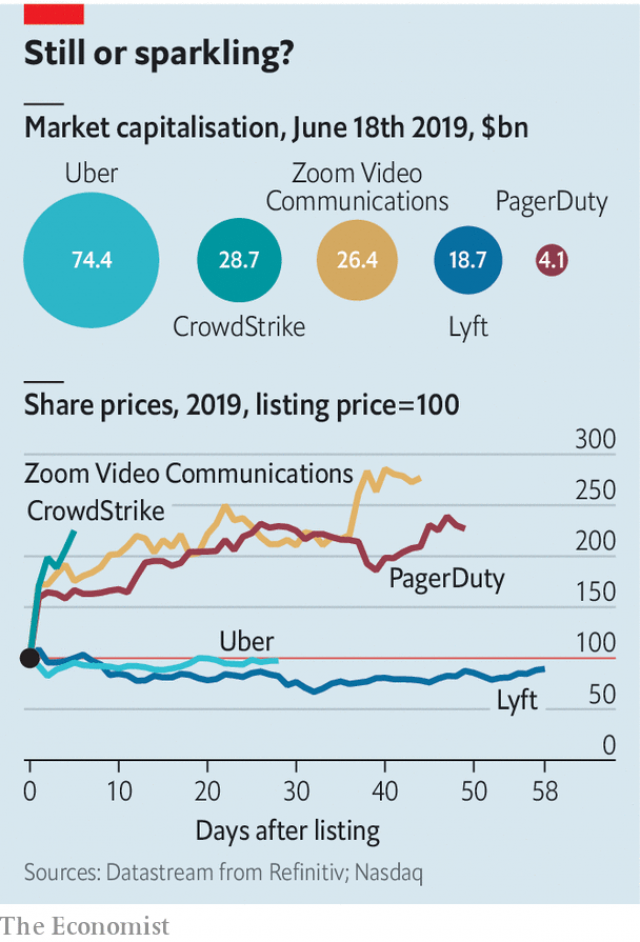
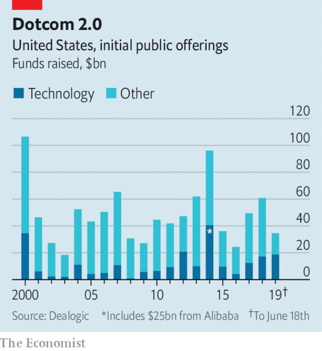

###### Let’s try this again

# Business services like Zoom and Slack make for better listings 

 

> print-edition iconPrint edition | Business | Jun 22nd 2019 

IN TECHNOLOGY, AS  in life, history doesn’t repeat itself. But it does rhyme. The share price of Chewy, an online pet-food retailer which has just listed in New York, shot up by more than 50% on June 14th, its first day of trading. To seasoned investors it brought back memories of Pets.com, Chewy’s ill-fated predecessor, which collapsed nine months after it debuted on the Nasdaq exchange in February 2000. It became emblematic of the first dotcom bubble, when loss-making startups fetched stratospheric valuations—until they didn’t. 

Today the tech listings are fewer, startups’ losses bigger and investors a bit more cautious than 20 years ago. True, technology firms have raised a total of $19bn through initial public offerings this year, the most since 2000 for the same period, and gained roughly 30% in value on average, according to Dealogic, a data-provider. The tech-heavy Nasdaq has risen by just 19%. But several big initial public offerings, notably of ride-hailing giants, have flopped. Lyft’s share price languishes 12% below its opening price and Uber’s fell by nearly 20% before recovering. 

The sparky overall performance owes a lot to a bevy of lower-profile IPOs. CrowdStrike, a cyber-security firm which went public on June 12th, has seen its share price double. So has PagerDuty, which helps clients deal with disruptions in their computer systems and listed in April. Shares in Zoom, a video-conferencing service, have gained 176% since its IPO two months ago. Analysts predict another hit in the much-anticipated listing on June 20th, after The Economist went to press, of Slack, a corporate-messaging service. 

Make no mistake: these companies aren’t lucrative. The best of the lot, Zoom, eked out earnings of three cents per share in the first quarter. But in contrast to Lyft or Uber, it is easier to see how they may one day turn a profit. Rather than peddling cheap rides or pet food to millions of fickle individuals, the likes of Zoom, PagerDuty and Slack sell higher-margin subscriptions to tens of thousands of business customers. Revenues of all three are growing in the high double digits or more, year on year. 

 

Corporate software did not feature prominently in the original dotcom mania. Before the advent of cloud computing, selling and installing such programs was tedious and labour-intensive. Big firms like Oracle and SAP dominated the market with bundled products which had to be customised to meet a customer’s needs. Today cloud-based “software-as-a-service” (SaaS) lets business-to-business startups focus on doing one thing well. They can lure clients with free trials that, since adding an extra customer requires little more than a tweak to a database, is near costless. And they don’t sell “vapourware”, says Jennifer Tejada, boss of PagerDuty, referring to programs, common during the internet bubble, which existed only in press releases. 

Slack stands to benefit doubly from this trend. It is a poster child for SaaS, as well as a venue where other such services come together. Few speak the same digital language; Slack provides translation and integration. Investors love such “platforms”, which explains its juicy valuation of $16bn or so, not far off Lyft’s market value. 

 

Admittedly, Slack and the others have so far had an easy ride. They have, in effect, outsourced marketing and sales to tech-obsessed early adopters who proselytise in their workplace until management too becomes a convert and signs a deal. That explains why Slack is hugely popular among startups but not yet among bigger firms. Attracting them requires costly investment in marketing and a proper sales force. The company lost $32m in the first quarter, 28% more than the year before, mainly trying to do just that. 

To be sure, business-facing startups are less prone than an Uber to burn cash in a single-minded quest for scale. But if investors see hints of Uberification in Slack’s earnings reports, its listing too could disappoint. That in turn may give pause to other startups preparing to go public, including WeWork, an office-rental company seeking a $47bn valuation despite recently posting a quarterly loss of $264m. Today’s dotcom boom may fizzle before it bursts.◼ 

-- 

 单词注释:

1.slack[slæk]:n. 松弛, 松懈, 淡季, 闲散, 家常裤 a. 松弛的, 不流畅的, 疏忽的, 无力的, 呆滞的, 软弱的, 漏水的 adv. 马虎地, 缓慢地 vt. 放松, 使缓慢 vi. 松懈, 减弱, 松弛 

2.listing['listiŋ]:[计] 列表, 清单, 编目 [经] 挂牌, 上市, 编表 

3.Jun[dʒʌn]:六月 

4.chewy['tʃu:i]:a. 需要多嚼的, 难嚼的 

5.online[]:[计] 联机 

6.retailer['ri:teilә]:n. 零售商人, 传播的人 [经] 零售商 

7.york[jɔ:k]:n. 约克郡；约克王朝 

8.investor[in'vestә]:n. 投资者 [经] 投资者 

9.predecessor[.predi'sesә]:n. 前任, 先辈, 前身 [医] 初牙, 前辈, 祖先 

10.debute[]:[网络] 首次演出；初次露面 

11.nasdaq['næz,dæk]:abbr. 全国证券交易商自动报价系统协会（National Association of Securities Dealers Automated Quotation） 

12.emblematic[,embli'mætik]:a. 象征的, 典型的 

13.dotcom['dɒtkɒm]:n. 网站 

14.startup[]:[计] 启动 

15.stratospheric[.strætәu'sferik]:a. 同温层的 

16.tech[tek]:n. 技术学院或学校 

17.offering['ɒfәriŋ]:n. 提供, 奉献物, 牲礼, 上市的股票(或证券等) [经] 出售物 

18.Dealogic[]:[网络] 迪罗基；迪罗基公司；商迪罗基 

19.notably['nәjtbәli]:adv. 显著地, 著名地, 尤其, 特别 

20.flop[flɒp]:n. 砰然落下, 拍击声, 失败 vi. 笨重地摔, 猛落 vt. 笨拙地抛下 adv. 噗通 

21.languish['læŋgwiʃ]:vi. 憔悴, 凋萎, 苦思 

22.sparky[ˈspɑ:ki]:a. 活泼的, 充满活力的 

23.bevy['bevi]:n. 一群 

24.ipo[]:abbr. 首次公开募股（Initial Public Offerings）；初次公开发行（Initial Public Offering） 

25.client['klaiәnt]:n. 客户, 顾客, 委托人 [计] 客户, 客户机, 客户机程序 

26.disruption[dis'rʌpʃәn]:n. 分裂, 崩溃, 瓦解 

27.ipo[]:abbr. 首次公开募股（Initial Public Offerings）；初次公开发行（Initial Public Offering） 

28.analyst['ænәlist]:n. 分析者, 精神分析学家 [化] 分析员; 化验员 

29.economist[i:'kɒnәmist]:n. 经济学者, 经济家 [经] 经济学家 

30.lucrative['lu:krәtiv]:a. 有利益的, 获利的, 合算的 

31.EK[]:柯达公司 

32.earning['ә:niŋ]:n. 收入（earn的现在分词） 

33.lyft[]:[网络] 散落 

34.uber['ju:bә]:[医] 乳房 

35.peddle['pedl]:vi. 挑卖, 沿街叫卖, 游荡, 闲混 vt. 叫卖, 兜售, 散播 

36.fickle['fikl]:a. 变幻无常的, 浮燥的, 薄情的 

37.subscription[sәb'skripʃәn]:n. 捐献, 订金, 订阅, 签署, 同意 [化] 订购 

38.tens[]:十位 

39.digit['didʒit]:n. 数字, 位数, 指头 [计] 数位; 位 

40.corporate['kɒ:pәrit]:a. 社团的, 合伙的, 公司的 [经] 团体的, 法人的, 社团的 

41.prominently['prɔminәntli]:adv. 显著地 

42.mania['meiniә]:n. 狂躁, 热衷, 狂热 [医] 躁狂, 狂 

43.advent['ædvәnt]:n. 来到, 来临 

44.computing[kәm'pju:tiŋ]:[计] 计算 

45.oracle['ɒ:rәkl]:n. 神谕, 神谕处, 预言 

46.sap[sæp]:n. 树液, 体液, 活力, 坑道, 消弱, 警棍 vt. 使排出体液, 使伤元气, 使衰竭, 挖坑道逼近, 逐渐侵蚀 vi. 挖坑道, 消弱 [计] 共享汇编程序, 结构分析程序, 符号汇编程序, 服务器广告协议 

47.customise['kʌstәmaiz]:vt.<主英>=customize 

48.Saas[]:[网络] 软件即服务；软体即服务；软件运营服务 

49.lure[luә]:n. 饵, 诱惑 vt. 引诱, 诱惑 

50.tweak[twi:k]:n. 拧, 扭, 焦急 vt. 扭, 开足马力 

51.costless[]:a. 没有成本的, 不需花钱的 

52.vapourware[]: 雾件（已做广告但尚未上市的计算机程序或产品） 

53.jennifer['dʒenifә]:n. 詹尼弗（女子名） 

54.tejada[]:[网络] 特哈达 

55.doubly['dʌbli]:adv. 加倍地, 双重地 [计] 双地 

56.venue['venju:]:n. 犯罪地点, 审判地, 发生地点 

57.integration[.inti'greiʃәn]:n. 综合, 与环境协调的行为, 集成 [化] 集成; 整合 

58.valuation[.vælju'eiʃәn]:n. 评价, 估价, 价值判断 [经] 估价, 计价, 评价 

59.admittedly[әd'mitidli]:adv. 公认地, 诚然 

60.outsourced[autˈsɔ:st]:v. 外购（指从外国供应商等处获得货物或服务）； 外包（工程）( outsource的过去式和过去分词 ) 

61.marketing['mɑ:kitiŋ]:n. 行销, 买卖 [经] 推销, 在市场买卖, 销售 

62.adopter[]:[法] 领养人, 收养人, 采用者 

63.proselytise['prɔsilitaiz]:v. <主英>=proselytize 

64.hugely['hju:dʒli]:adv. 巨大地, 非常地 

65.les[lei]:abbr. 发射脱离系统（Launch Escape System） 

66.prone[prәun]:a. 俯伏的, 面向下的, 有...倾向的 [医] 旋前的, 伏的, 俯的 

67.quest[kwest]:n. 探索, 寻求, 调查 v. 寻找, 找, 追寻猎物 

68.fizzle['fizl]:n. 嘶嘶声, 失败 vi. 发嘶嘶声, 失败 

