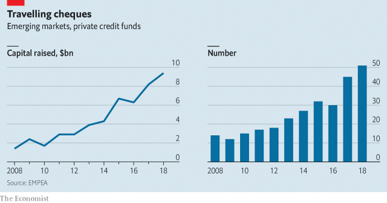

###### Loan away from home

# Buy-out firms are the new banks in emerging markets 

 

> print-edition iconPrint edition | Finance and economics | Jun 22nd 2019 

ENERGY PRODUCERS have long had India over a barrel. It is the world’s third-largest oil importer, yet its pipeline density is a quarter of the global average. It aims to add 15,000km by 2022, awarding projects through strict online tenders. The few groups able to qualify can hope for sweet profits—if they can first find financing. 

This is at last becoming easier. In emerging markets, a new breed of lenders has begun acting as credit supermarkets, offering anything from working capital to multi-year debt. They look and quack like banks, but are in fact buy-out firms investing mostly rich-world money. As demand for financing surges in fast-growing countries, they will proliferate, says Kanchan Jain of Baring Private Equity Asia. Her firm is nearing a four-year debt investment in a business that lays pipes in India. 

The surge reflects investors’ continuing hunt for yield. Ultra-low interest rates since the financial crisis have depressed returns in the West, nudging them towards economies with more alluring prospects. After stocks, bonds and private equity, private credit is their latest target. Last year over 50 emerging-market private-debt funds closed, having reached their funding target, up from 14 a decade ago. They raised $9.4bn in total, a sevenfold rise since 2008. Michael Casey of Portico, an advisory firm, says fundraising volumes could easily double again without flooding the market. 

Funds are filling a void left by Western banks, which have shunned faraway borrowers since post-crisis regulators asked for more capital to be held against exotic bets. Local rivals can lack firepower: the top 20 sub-Saharan banks together have less capital than one of Europe’s big lenders. 

 

Investors are also seeking pastures new to evade fierce competition in developed markets, where buy-out firms’ efforts to take over from banks have already reached a peak. They now manage $770bn in “alternative” debt assets. But credit supply is running ahead of demand: over $300bn raised by funds in recent years has yet to be spent. Competition for deals has crushed margins and caused a decline in “covenants”—clauses requiring borrowers to keep overall debt levels under control. Less mature markets, oddly, are starting to look safer: taking no chances, funds lending there insist on robust covenants. Borrowers also tend to be half as leveraged, and funds themselves seldom carry any debt (many do in the West). 

The asset class is also winning converts away from private equity. Finding acquisition targets can be tough in emerging markets, as owners of growing businesses, often families, are loth to give up control. Exiting them is even trickier. Prospective buyers are rare and thin capital markets complicate IPOs. All this hard work erodes returns to investors, says Holger Rothenbusch of CDC Group, the British government’s overseas-investment arm. By contrast, debt investments, which rarely dilute shareholders, tend to be self-liquidating. Most also produce regular cash flows. That pleases liability-driven investors like insurers. Returns can be juicy: low teens for senior loans, higher for distressed debt. 

There are pitfalls. Lending to a company rarely gives firms a board seat, making it harder to spot problems and scold management than if funds held an equity stake. And when things do go wrong, creditors’ ability to enforce agreements or seize collateral can be weak. “I’ve had to try to bring things to an Indian court,” says a former fund manager. “It’s basically impossible.” Some try to protect themselves by booking capital offshore; others limit themselves to high-quality borrowers and sponsors. 

Another issue is currency risk. With liabilities in dollars, most funds want to be paid in the same currency. But few companies earning in an emerging-market currency can afford to buy multi-year dollar hedges. That often restricts funds’ investable market to infrastructure projects backed by government guarantees, or companies pricing their wares in dollars, such as exporters or oil producers. To fuel a real investor frenzy, the asset class needs a stronger pipeline of deals. ◼ 

-- 

 单词注释:

1.Jun[dʒʌn]:六月 

2.producer[prә'dju:sә]:n. 生产者, 制作者, 制作人 [化] 发生器; (炉煤气)发生炉; 制气炉; 生产者 

3.importer[im'pɒ:tә]:n. 输入者, 进口商 [法] 进口商, 输入者 

4.online[]:[计] 联机 

5.lender['lendә]:n. 出借人, 贷方 [经] 出借者, 贷方, 贷款人 

6.quack[kwæk]:n. 鸭叫声, 冒牌医生, 冒充内行之人 a. 冒牌医生的 v. 嘎嘎叫, 当冒牌医生, 夸大广告 

7.surge[sә:dʒ]:n. 巨涌, 汹涌, 澎湃 vi. 汹涌, 澎湃, 颠簸, 猛冲, 突然放松 vt. 使汹涌奔腾, 急放 [计] 电压尖峰 

8.proliferate[prәәu'lifәreit]:vi. 增殖, 激增, 扩散 vt. 使激增 

9.kanchan[]:[网络] 坎钱；主战坦克上安装的坎钱；田寒平和菅美菜子 

10.Jain[dʒain]:n. 耆那教徒 a. 耆那教的, 耆那教徒的 

11.equity['ekwiti]:n. 公平, 公正 [经] 权益, 产权 

12.nudge[nʌdʒ]:n. 用肘轻推, 推动, 讨厌家伙 

13.allure[ә'luә]:vt. 引诱, 吸引 n. 魅力, 诱惑力 

14.equity['ekwiti]:n. 公平, 公正 [经] 权益, 产权 

15.sevenfold[]:a. 七倍, 七重 adv. 七倍, 七重 

16.michael['maikl]:n. 迈克尔（男子名） 

17.casey['keisi]:n. 凯西（男子名） 

18.portico['pɒ:tikәu]:n. 门廊 

19.advisory[әd'vaizәri]:a. 顾问的, 咨询的, 劝告的 [法] 劝告的, 忠告的, 咨询的 

20.fundraising['fʌndˌreɪzɪŋ]:n. 筹款, 募款 a. 筹款的 

21.void[vɒid]:n. 空虚, 空间, 空白, 空隙, 空虚感 a. 空的, 无效的, 无人的, 没有的, 无用的 [计] 脱墨; 空白点 

22.shun[ʃʌn]:vt. 避开, 规避, 避免 

23.faraway['fɑ:rәwei]:a. 遥远的, 恍惚的, 出神的 

24.borrower['bɒrәuә]:n. 借用人, 剽窃者 [经] 借款人, 借用人 

25.regulator['regjuleitә]:n. 调整者, 校准者, 校准器, 调整器, 标准钟 [化] 调节剂; 调节器 

26.exotic[ig'zɒtik]:a. 异国的, 外来的 n. 外来人, 外来物, 舶来品 

27.les[lei]:abbr. 发射脱离系统（Launch Escape System） 

28.investor[in'vestә]:n. 投资者 [经] 投资者 

29.pasture['pæstʃә]:n. 牧场, 草地, 牧草 vt. 放牧 vi. 吃草 

30.evade[i'veid]:v. (巧妙地)逃脱, 规避, 逃避 

31.asset['æset]:n. 资产, 有益的东西 

32.oddly['ɒdli]:adv. 奇怪地 

33.robust[rәu'bʌst]:a. 健康的, 强健的, 要用力气的, 坚定的, 粗野的 [计] 健壮性 

34.covenant['kʌvәnәnt]:n. 契约, 盟约 v. 立契约, 缔结盟约 

35.loth[lәuθ]:a. 不愿意的, 厌恶的 

36.tricky['triki]:a. 狡猾的, 机敏的 

37.prospective[prәs'pektiv]:a. 预期的, 将来的 [经] 预期的, 未来的 

38.buyer['baiә]:n. 买主, 买方 [经] 买主, 买方, 买手 

39.ipo[]:abbr. 首次公开募股（Initial Public Offerings）；初次公开发行（Initial Public Offering） 

40.erode[i'rәud]:vt. 腐蚀, 侵蚀 vi. 受腐蚀 

41.holger[]:霍尔格（男名） 

42.cdc[]:abbr. 疾病防治中心（Centers for Disease Control）；（美）市民民防团（Citizens ' Defense Corps）；控制数据公司（Control Data Corp） 

43.dilute[dai'lju:t]:vt. 冲淡, 稀释 a. 淡的, 稀释的 

44.shareholder['ʃєә.hәuldә]:n. 股东 [法] 股东, 股票持有人 

45.insurer[in'ʃuәrә]:n. 保险公司 [法] 保险人, 承保人, 保险公司 

46.teen[ti:n]:n. 愤怒, 悲哀 

47.pitfall['pitfɒ:l]:n. 陷阱, 诱惑, 阴谋, 易犯的错误, 意想不到的困难 

48.collateral[kә'lætәrәl]:a. 并行的, 附随的, 旁系的 n. 旁系亲属, 担保品 

49.liability[laiә'biliti]:n. 责任, 债务, 倾向 [经] 责任, 义务, 负债 

50.investable[in'vestәbl]:a. 可供投资的 

51.infrastructure['infrәstrʌktʃә]:n. 基础结构, 基础设施 [经] 基础设施 

52.ware[wєә]:n. 物品, 器具, 货物, 商品, 陶器 vt. 留心, 小心 a. 知道的, 意识到的, 留神的 

53.exporter[ik'spɒ:tә]:n. 出口商, 输出者, 出口公司 [经] 出口商, 输出者 

54.frenzy['frenzi]:n. 疯狂, 狂暴, 狂怒 [医] 暴怒, 狂乱 

