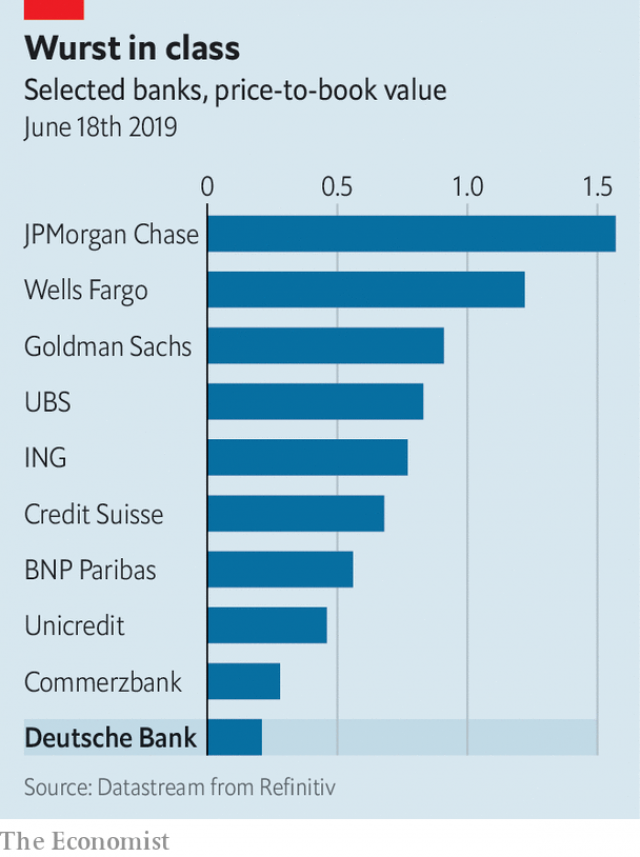

###### Slasher flick

# Can Germany’s biggest lender survive on its own? 

 

> print-edition iconPrint edition | Finance and economics | Jun 22nd 2019 

EARLIER THIS month, following the collapse of merger talks with Commerzbank in April, Deutsche Bank’s share price hit the lowest point of its 149-year history. Fitch, a credit-rating agency, cut the bank’s rating to two notches above junk. In May Christian Sewing, its chief executive, promised “tough cutbacks” in the ailing investment-banking business, with plans to be laid out alongside half-year results on July 24th. But on June 16th a leak in the Financial Times revealed the outlines. 

The cuts (which Deutsche has not confirmed) go well beyond its investment-banking arm. Its rates and equities trading business outside Europe will be trimmed, and a “bad bank” created to hold non-core assets that generate little or no revenue. At up to €50bn ($56bn), that is a sizeable chunk of Deutsche’s risk-weighted assets. Cuts to the underperforming trading operations had been expected, but the idea of a non-core unit is new. Like several other big banks, Deutsche had shoved €128bn of debts into a bad bank in the wake of the financial crisis. After years of restructuring, it is hard to see how on earth it still has dud assets on its books. But apparently so. 

Can the moribund Teutonic giant be shaken back into life? After the leak its share price rose 2%, only swiftly to sink again. Investors fear the changes are too little, too late. Deutsche’s biggest problems are a failing investment-banking arm, high funding costs and the lack of a reliable profit generator, such as the private-wealth management units that keep Swiss banks going through lean years. Mr Sewing’s restructuring plan does little to address any of these except the first. 

Moreover, they are harder without profits. The firm cannot take big upfront losses. “Deutsche Bank cannot afford radical change,” says Daniele Brupbacher at UBS, a Swiss bank (and rival to Deutsche). Under Germany’s strong labour laws, slashing headcount would mean stiff social-insurance payments. Offloading dud assets is expensive, too. Deutsche’s post-crisis bad bank made losses of €14bn. 

 

The retrenchment marks a definitive end to Deutsche’s aspirations to become Europe’s Goldman Sachs. Now it would settle for being a German version of BNP Paribas, a French universal bank with most of its activities in Europe. As well as a slimmed-down corporate and investment bank, Deutsche will still have Germany’s biggest retail bank (plus retail operations in Italy and Spain) and DWS, a solidly performing asset manager. But it is quite a comedown from the 1990s, when it took on Wall Street and, for a short time, became a big player in global investment banking. 

Many in Germany see the plans as a last-gasp effort to remain independent. UBSand ING of the Netherlands have already signalled their interest in merging with Deutsche. A takeover by a foreigner would be a big blow to German pride. 

A lot will depend on how fast Mr Sewing can put his proposals into action. The leak is likely to force him to come clean about the details earlier than he had planned. They will probably include yet another purge of senior managers. According to the Frankfurter Allgemeine Zeitung, a daily, he might start by firing Garth Ritchie, the boss of Deutsche’s investment-banking unit. In the new cost-conscious era Mr Sewing could take over—and run the sickliest division of an ailing bank. That may be an even more difficult task than it sounds. ◼ 

-- 

 单词注释:

1.slasher['slæʃә]:n. 猛砍者, 乱砍者, 好殴斗者, 恃强欺弱的人, 刀, 泥刀, 剃刀片, 剑, 浆纱机 

2.flick[flik]:n. 快速的轻打, 轻打声, 弹开 v. 轻弹, 轻轻拂去, 忽然摇动 

3.lender['lendә]:n. 出借人, 贷方 [经] 出借者, 贷方, 贷款人 

4.Jun[dʒʌn]:六月 

5.merger['mә:dʒә]:n. 合并, 归并 [经] 购并 

6.commerzbank[]: 德国商业银行公司总部所在地：德国主要业务：银行 

7.deutsche[]:n. 德意志联邦共和国马克 

8.fitch[fitʃ]:n. 艾鼬, 艾鼬毛皮 

9.notch[nɒtʃ]:n. 刻痕, 等级, 峡谷 vt. 刻凹痕, 用刻痕计算, 赢得 

10.cutback['kʌtbæk]:n. 情节倒叙, 减少, 短截植物 [经] 减少 

11.ailing['eiliŋ]:a. 生病的 [医] 患病的, 病痛的 

12.equity['ekwiti]:n. 公平, 公正 [经] 权益, 产权 

13.asset['æset]:n. 资产, 有益的东西 

14.sizeable['saizәbl]:a. 相当大的, 可观的 

15.chunk[tʃʌŋk]:n. 大块, 矮胖的人(或物) [经] 定样 

16.underperform[,ʌndәpә'fɔ:m]:vi.表现不佳,工作不如预期(或同行) vt.(股票等)运作差于(一般市场价格) 

17.shove[ʃʌv]:n. 推, 挤 vt. 推挤, 猛推, 强使 vi. 推 

18.restructuring[]:[计] 重构的 

19.dud[dʌd]:n. 衣服, 哑弹, 无用物 a. 无用的 

20.apparently[ә'pærәntli]:adv. 表面上, 清楚地, 显然地 

21.moribund['mɒ:ribʌnd]:a. 垂死的 n. 垂死的人 

22.Teutonic[tju:'tɒnik]:a. 条顿人的, 日耳曼人的 n. 日耳曼语 

23.swiftly['swiftli]:adv. 很快地, 即刻 

24.investor[in'vestә]:n. 投资者 [经] 投资者 

25.cannot['kænɒt]:aux. 无法, 不能 

26.upfront[ˌʌpˈfrʌnt]:a. 正直的, 坦率的; 最前面的, 首要的; 在前面的; 预先的 adv. 在最前面; 提前支付（工资） 

27.Daniele[]:n. (Daniele)人名；(意)达妮埃莱；(法)达妮埃尔 

28.UB[]:[计] 上限 

29.slash[slæʃ]:v. 猛砍, 乱砍 n. 猛砍, 乱砍, 删减 [计] 斜线 

30.headcount[ˈhedkaʊnt]:n. 点人头数总人数, 职员总数 

31.offload['ɔflәjd, ɔf'lәjd; (?@) 'ɔ:flәjd]:v. 卸下, 卸货 

32.retrenchment[ri'trentʃmәnt,ri:-]:n. 紧缩, 节省, 删节 [医] 赘余组织切除术 

33.definitive[di'finitiv]:n. 限定词 a. 限定的, 决定性的 

34.aspiration[.æspә'reiʃәn]:n. 热望, 志向, 渴望 [医] 吸入; 吸[引], 吸引术 

35.goldman[]:n. 高曼（姓氏） 

36.Sachs[zaks]:n. 萨克斯（汽车零配件生产厂商） 

37.BNP[]:abbr. 英国国家党（British National Party）；巴黎国民银行（Banque Nationale de Paris）；脑利钠肽 

38.paribas[]:n. 巴黎银行 

39.corporate['kɒ:pәrit]:a. 社团的, 合伙的, 公司的 [经] 团体的, 法人的, 社团的 

40.Spain[spein]:n. 西班牙 

41.dws['di:d'əbəlju:'es]:abbr. double white silk 双白丝; double wound silk 双丝包的（导线）; drinking-water standards 饮用水标准 

42.solidly[]:adv. 坚硬地；坚固地；团结一致地 

43.comedown['kʌmdaun]:n. 衰落, 失望, 落魄 

44.ing[]:abbr. 惯性导航与制导（Inertial Navigation and Guidance）；强中子发生器（Intense Neutron Generator） 

45.Netherlands['neðәlәndz]:n. 荷兰 

46.merge[mә:dʒ]:vt. 使合并, 使消失, 吞没 vi. 合并, 渐渐消失 [计] 合并 

47.takeover[]:n. 接管, 接收 [经] 接收 

48.purge[pә:dʒ]:n. 净化, 清除, 泻药 v. (使)净化, 清除, (使)通便 [计] 服务器文件删除实用程序 

49.frankfurter['fræŋk,f\\:tә(r)]:n. 法兰克福香肠 

50.Allgemeine[]:[医] 全身疲劳 

51.zeitung[]:[网络] 日报 

52.garth[gɑ:θ]:n. 中庭, 庭院 

53.ritchie['ritʃi]:n. 里奇（姓氏） 

54.sickly['sikli]:a. 病弱的, 令人不快的, 无精打采的 adv. 病态地 vt. 使现病容 

