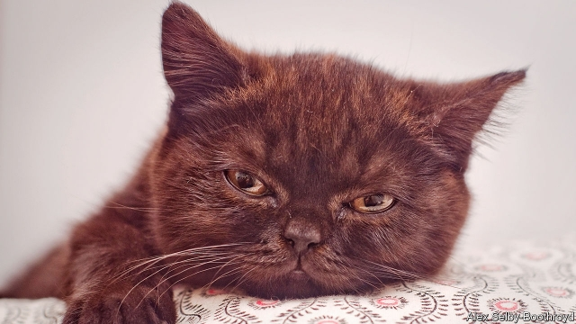

###### Canis sapiens

# Pets have gained the upper paw over their so-called owners 

 

> print-edition iconPrint edition | Leaders | Jun 22nd 2019 

THERE IS A range of theories about how Homo sapiens came to rule the planet. Opposable thumbs, cranial size, altruism and cooking all played a part, but central to the naked ape’s success was its ability to dominate other species. Bovids, equids and, in particular, canids, were put to work by H. sapiens; felids always took a slightly different view of the matter, but were indulged for their rodent-catching talents. 

As humanity has got richer, animals’ roles have changed. People need their services less than before. Fewer wolves and bandits meant less demand for dogs for protection; the internal-combustion engine made horses redundant; modern sanitation kept rats in check and made cats less useful. No longer necessities, domestic animals became luxuries. Pet-keeping seems to kick in en masse when household incomes rise above roughly $5,000. It is booming (see article). 

The trend is not a new one. Archaeologists have found 10,000-year-old graves in which dogs and people are buried together. Some cultures—such as in Scandinavia, where canines have long been both working dogs and companions—have kept pets for millennia. But these days the pet-keeping urge has spread even to parts of the world which have no tradition of snuggling up on a comfy chair with a furry creature. 

In parts of Asia where people used to regard the best place for man’s best friend as not the sofa but the stewing-pot, along with some onions and a pinch of seasoning, and where cats were made into tonics, norms are changing fast. The South Korean president, Moon Jae-in, has a rescue dog, and the mayor of Seoul has promised to shut down dog butchers. China, where dogs were once rounded up and slaughtered on the ground that keeping pets was bourgeois, has gone mad for cutesy breeds like Pomeranians, whose wolfish ancestors would have swallowed them whole for elevenses. Traditionalists attending the annual dog-meat festival in Guangxi now find themselves under attack by packs of snarling animal-lovers. 

The pet business is growing even faster than pet numbers, because people are spending more and more money on them. No longer are they food-waste-recyclers, fed with the scraps that fall from their masters’ tables. Pet-food shelves groan with delicacies crafted to satisfy a range of appetites, including ice cream for dogs and foods for pets that are old, diabetic or suffer from sensitive digestion; a number of internet services offer bespoke food, tailored to the pet’s individual tastes. 

In the business this is called “pet humanisation”—the tendency of pet owners to treat their pets as part of the family. This is evident in the names given to dogs, which have evolved from Fido, Rex and Spot to—in America—Bella, Lucy and Max. It is evident in the growing market for pet clothing, pet grooming and pet hotels. It is evident in the demand for breeds such as the French bulldog, which, tellingly, looks a bit like a human baby. 

People still assume that pets must be working for humanity in some way, perhaps making people healthier or less anxious. But the evidence for that is weak. Rather, new research suggests that canines have evolved those irresistible “puppy-dog eyes” precisely to manipulate human emotions. It has worked. The species that once enslaved others now toils to pay for the care of its pets, which lounge on the sofa waiting to be taken to the grooming salon. Sentimental Americans often refer to themselves not as cat-owners but as the cat’s “mommy” or “daddy”. South Koreans go one further, describing themselves as cat “butlers”, pandering to every feline whim. Watch a hapless dog-walker trailing “his” hound, plastic bag in hand to pick up its mess, and you have to wonder: who’s in charge now?◼ 

-- 

 单词注释:

1.Canis['keinis]:n. 犬属 

2.sapien[]:n. 智慧 

3.Jun[dʒʌn]:六月 

4.HOMO['hәumәu]:[化] 最高占据轨道; 最高占据分子轨道; 最高已占分子轨道 [医] 人属 

5.opposable[ә'pәuzәbl]:a. 可反对的, 可对抗的, 可对立的 

6.cranial['kreiniәl]:a. 头盖的, 颅侧的 [医] 颅的, 颅侧的 

7.altruism['æltruizm]:n. 利他主义, 利他 

8.specie['spi:ʃi]:n. 硬币 [经] 硬币 

9.bovid['bәuvid]:a. 牛科的 

10.equid['ekwid]:n. 马科动物(包括马,驴等) 

11.canid['kænid]:n. [动]犬科动物(包括家犬、狼、狐等) 

12.H[eitʃ]:[计] 硬件, 高度, 水平, 主机 [医] 氢(1号元素), 亨[利](电感单位) 

13.felid['fi:lid]:n. 猫科动物, 猫 

14.alway['ɔ:lwei]:adv. 永远；总是（等于always） 

15.indulge[in'dʌldʒ]:vt. 纵情于, 使高兴, 放任, 迁就 vi. 沉溺 

16.humanity[hju:'mæniti]:n. 人性, 人类, 博爱 

17.les[lei]:abbr. 发射脱离系统（Launch Escape System） 

18.bandit['bændit]:n. 强盗 

19.redundant[ri'dʌndәnt]:a. 多余的, 过多的, 冗长的 [医] 过多的, 多余的 

20.sanitation[sæni'teiʃәn]:n. (环境)卫生, 环境卫生的提倡/维持, 卫生设备, 下水道设施, 卫生设施 [医] 环境卫生 

21.en[en]:n. 字母N, (铅字)半方 prep. 在...中, 作为 

22.masse[mæ'sei]: [体]竖直挫球 

23.archaeologist[.ɑ:ki'ɒlәdʒist]:n. 考古学家 

24.Scandinavia[,skændi'neivjә, -viә]:n. 斯堪的纳维亚(半岛) 

25.canine['keinain]:n. 犬齿, 犬 a. 犬的, 似犬的, 犬科的 

26.millennia[mi'leniә]:一千年, 千年周年纪念日, 千年庆典, 千年期, (喻)太平盛世, 想象中的黄金时代 

27.snuggle['snʌgl]:vi. 偎依 vt. 使舒适温暖, 紧抱 

28.comfy['kʌmfi]:a. 舒服的,轻松的 

29.furry['fә:ri]:a. 毛皮的, 盖着毛皮的, 似毛皮的 

30.seasoning['si:zniŋ]:n. 调味品, 作料, 佐料, 锻练 [化] 天然时效 

31.tonic['tɒnik]:n. 补药, (音乐)主调音或基音 a. 滋补的, 声调的, 使精神振作的 

32.norm[nɒ:m]:n. 基准, 模范, 标准, 准则, 平均数 [化] 定额 

33.Korean[kә'riәn]:n. 朝鲜人, 朝鲜语 a. 朝鲜人的, 朝鲜语的 

34.Seoul[sәul]:n. 汉城 

35.slaughter['slɒ:tә]:n. 残杀, 屠杀, 杀戮 vt. 残杀, 屠杀, 亏本出售 

36.bourgeois[buә'ʒwɑ:]:n. 中产阶级分子, 商人, 资产阶级 a. 中产阶级的, 平庸的 n. 九点活字 

37.cutesy['kju:tsi]:a. 矫揉造作的,忸怩作态的 

38.Pomeranian[.pɒmә'reiniәn]:a. 波美拉尼亚的 n. 波美拉尼亚人, 波美拉尼亚种小狗 

39.wolfish['wulfiʃ]:a. 狼似的, 贪得无厌的, 残暴的 

40.traditionalist[]:n. 传统主义者, 因循守旧者 

41.Guangxi['^wɑ:ŋ'si:]:广西(位于中国南部) 

42.snarl[snɑ:l]:vi. 吼叫, 怒骂, 缠结 vt. 咆哮着说, 搞乱, 使缠结 n. 咆哮, 吼叫, 怒骂, 缠结, 混乱 

43.scrap[skræp]:n. 碎片, 残余物, 些微, 片断, 铁屑, 吵架 vt. 扔弃, 敲碎, 拆毁 vi. 互相殴打 a. 零碎拼凑成的, 废弃的 

44.delicacy['delikәsi]:n. 细软, 精致, 精美的食品, 娇气, 微妙, 棘手, 娇弱, 灵敏, 灵巧 

45.diabetic[daiә'betik]:a. 糖尿病的 n. 糖尿病患者 

46.digestion[di'dʒestʃәn]:n. 消化力, 领悟 [化] 消化; 消化作用; 蒸煮; 蒸煮作用; 煮解; 浸提; 陈化 

47.bespeak[bi'spi:k]:vt. 预约, 订, 表示 n. 预约 

48.fido[faidәu]:n. 有铸造缺陷的硬币；燃油加热驱雾器 

49.rex[reks]:n. 雷克斯（男子名）；国王；君主 

50.lucy['lu:si]:n. 露西（女子名） 

51.MAX[mæks]:[计] 最大 

52.groom[gru:m]:n. 马夫, 新郎, 男仆 vt. 喂马, 使...整洁, 推荐 vi. 打扮, 穿戴 

53.bulldog['bjldɔ^]:n. 喇叭狗 

54.tellingly['teliŋli]:adv. 有效地；显著地 

55.irresistible[.iri'zistәbl]:a. 不可抵抗的, 不能压制的 [经] 不可抗力 

56.precisely[pri'saisli]:adv. 精确地, 明确地, 刻板地, 拘泥地, 正好, 恰恰, 对, 正是如此, 确实如此, 不错 

57.manipulate[mә'nipjuleit]:vt. 操纵, 利用, 操作, 巧妙地处理, 假造 

58.enslave[in'sleiv]:vt. 奴役, 束缚, 使受控制, 征服 

59.toil[tɒil]:n. 辛苦, 苦工, 网, 罗网, 圈套 vi. 苦干, 跋涉 

60.salon['sælɔ:ŋ]:n. 大会客室, 大厅, 客厅, 交谊室, 沙龙, 美术展览馆, 画廊, 美容院, 发廊 

61.sentimental[.senti'mentl]:a. 感伤的, 感情用事的 

62.mommy['mɒmi]:n. 妈咪 

63.daddy['dædi]:n. 爸爸 

64.Korean[kә'riәn]:n. 朝鲜人, 朝鲜语 a. 朝鲜人的, 朝鲜语的 

65.butler['bʌtlә]:n. 男管家, 司膳总管 

66.pander['pændә]:vi. 勾引, 怂恿, 卑劣地迎合 n. 拉皮条者, 怂恿者, 助恶者 

67.feline['fi:lain]:a. 猫的, 猫科的, 猫一样的 n. 猫, 猫科动物 

68.whim[hwim]:n. 一时的兴致, 冲动, 怪念头, 绞盘 

69.hapless['hæplis]:a. 倒霉的, 不幸的 

70.hound[haund]:n. 猎犬 vt. 带猎犬狩猎, 追捕, 激励, 使追逐 

