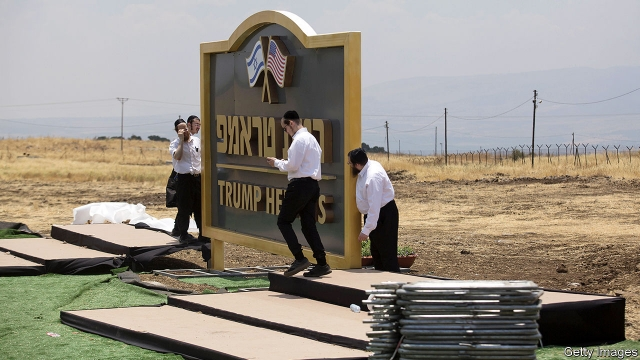

###### The height of flattery

# Trump Heights, Binyamin Netanyahu’s tribute to America’s president 

 

> print-edition iconPrint edition | Middle East and Africa | Jun 22nd 2019 

IF THE PAST is any guide, there is nothing Donald Trump likes more than seeing his name in big gold letters on a real-estate project. Predictably, then, America’s president was pleased when Israel’s prime minister, Binyamin Netanyahu, unveiled the gilded sign for Trump Heights (pictured) on June 16th. The supposedly new town in the Golan Heights is named in honour of Mr Trump. It has no plan or budget. 

Mr Netanyahu wanted to thank Mr Trump for recognising Israel’s sovereignty over the Golan Heights, which it captured from Syria in the six-day war of 1967. No other country accepts Israel’s claim to the territory. But the Trump administration said Israel needed the land to protect itself from Syria and the Iranian-backed forces inside the country. The timing of the decision, two weeks before Israel’s election in April, also seemed aimed at boosting the campaign of Mr Netanyahu, whom Mr Trump considers an ally. 

Many foreign leaders have realised that Mr Trump enjoys vacuous flattery. But even by the standards of the past two-and-a-half years, the inauguration of Trump Heights is a particularly empty gesture. Not only is it an illegal settlement under international law, it isn’t even a new one. An Israeli village called Brukhim was established on the land in 1991, but did not attract many residents. Since Mr Netanyahu failed to form a government after the election in April, he leads on an interim basis—without the legal authority to allocate land or money for Trump Heights. The project has no timetable. About all the government can do is erect a fancy sign. 

On June 25th the Trump administration is expected to present elements of a long-delayed peace plan for Israel and the Palestinians at a conference in Bahrain. Ever since he was elected, Mr Trump has promised to deliver “the ultimate deal”. But the Palestinians have shunned him since he recognised the disputed city of Jerusalem as Israel’s capital in 2017. They will not attend the conference. Nor will Israeli officials, whom the Americans did not invite, perhaps to lower expectations. Saudi and Emirati leaders may show up, no doubt to praise both the plan and Mr Trump. 

An American official admits that the entire peace plan will probably not be unveiled until after Israel’s election in September. Another official says it will probably wait for Mr Trump’s second term—assuming he wins one. If not, the developers of Trump Heights might consider investing in a new sign. 

-- 

 单词注释:

1.flattery['flætәri]:n. 谄媚, 阿谀, 巴结 

2.binyamin[]:本雅明 

3.tribute['tribju:t]:n. 贡物, 礼物, 颂辞 

4.Jun[dʒʌn]:六月 

5.predictably[]:adv. 可预言地 

6.Netanyahu[]:n. 内塔尼亚胡（人名） 

7.unveil[.ʌn'veil]:vt. 揭开, 揭幕, 除去...的面纱 vi. 显露, 除去面纱 

8.gild[gild]:vt. 镀金, 虚饰, 装饰, 供给钱 

9.supposedly[sә'pәuzidli]:adv. 想象上, 看上去像, 被认为是, 恐怕, 按照推测 

10.golan['^әj'lɑ:n]:Heights戈兰高地[叙利亚西南部](1967年被以色列占领) 

11.sovereignty['sɒvrәnti]:n. 主权, 独立国 [法] 主权, 主权国家, 统治权 

12.Syria['siriә]:n. 叙利亚 [经] 叙利亚 

13.Israel['izreil]:n. 以色列, 以色列后裔, 犹太人 

14.timing['taimiŋ]:n. 时间选择, 时间测定, 定时, 调速 [计] 定时器时钟 

15.ally['ælai. ә'lai]:n. 同盟者, 同盟国, 助手 vt. 使联盟, 使联合, 使有关系 vi. 结盟 

16.vacuous['vækjuәs]:a. 空的, 空虚的, 没有思想的 

17.inauguration[i,nɔ:^ju'reiʃәn]:n. (美)总统就职, 开幕仪式, 就职典礼, 开始, 开辟, 开创, 为...举行开幕式 [法] 就职, 就职典礼, 创造 

18.Israeli[iz'reili]:a. 以色列的, 以色列人(语)的 n. 以色列人 

19.interim['intәrim]:a. 暂时的, 临时的, 间歇的 n. 过渡时期 

20.Palestinian[,pælis'tiniәn]:[经] 巴勒斯坦的 

21.Bahrain[]:n. 巴林岛 

22.shun[ʃʌn]:vt. 避开, 规避, 避免 

23.Jerusalem[dʒә'ru:sәlәm]:n. 耶路撒冷 

24.saudi['sajdi]:a. 沙乌地阿拉伯（人或语）的 

25.Emirati[]:n. (Emirati)人名；(意)埃米拉蒂 

26.developer[di'velәpә]:n. 开发者 [计] 显影器 

