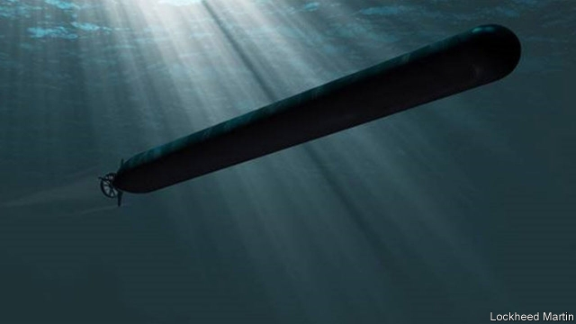

###### Clandestine warfare

# Submarine-launched drone platoons will soon be emerging from the sea 

 

> print-edition iconPrint edition | Science and technology | Jun 22nd 2019 

USING SUBMARINES to land spies and launch raids is nothing new, but America’s navy is planning to add a twist to the idea by employing drones as the spies and commandos in question. Heterogeneous Collaborative Unmanned Systems (HCUS), as these drones will be known, would be dropped off by either a manned submarine or one of the navy’s big new Orca robot submersibles. They could be delivered individually, but will more often be part of a collective system called an encapsulated payload. Such a system will then release small underwater vehicles able to identify ships and submarines by their acoustic signatures, and also aerial drones similar to the BlackWing reconnaissance drones already flown from certain naval vessels. 

Once the initial intelligence these drones collect has been analysed, a payload’s operators will be in a position to relay further orders. They could, for example, send aerial drones ashore to drop off solar-powered ground sensors at specified points. These sensors, typically disguised as rocks, will send back the data they collect via drones of the sort that dropped them off. Some will have cameras or microphones, others seismometers which detect the vibrations of ground vehicles, while others still intercept radio traffic or Wi-Fi. 

HCUS will also be capable of what are described as “limited offensive effects”. Small drones like BlackWing can be fitted with warheads powerful enough to destroy an SUV or a pickup truck. Such drones are already used to assassinate the leaders of enemy forces. They might be deployed against fuel and ammunition stores, too. 

A week-long demonstration of HCUS is planned for later this year. It will test covert deployment, the transfer of data, automatic recharging and the placing of ground sensors. It will culminate in a “remote operator on-demand offensive attack on a simulated target”. 

Unmanned systems such as HCUS thus promise greatly to expand the scope of submarine-based spying and special operations. Drones are cheap, expendable and can be deployed with no risk of loss of personnel. They are also “deniable”. Even when a spy drone is captured it is hard to prove where it came from. Teams of robot spies and saboteurs launched from submarines, both manned and unmanned, could thus become an important feature of the black-ops of 21st-century warfare.◼ 

-- 

 单词注释:

1.clandestine[klæn'destin]:a. 偷偷摸摸的 [法] 秘密的, 暗中的 

2.warfare['wɒ:fєә]:n. 战争, 战斗, 交战, 斗争, 竞争 [法] 战事, 作战, 交战 

3.drone[drәun]:n. 雄蜂, 懒惰者, 嗡嗡的声音, 无人驾驶飞机(或船) vi. 嗡嗡作声, 混日子 vt. 低沉地说 

4.platoon[plә'tu:n]:n. 排, 一组, 一群人 

5.Jun[dʒʌn]:六月 

6.commando[kә'mɑ:ndәu]:n. 突击队, 突击队员, (南非)布尔人部队 

7.heterogeneous[.hetәrәu'dʒi:njәs]:a. 异种的, 异质的, 由不同成分形成的 [医] 不均匀的, 多相的, 异质的 

8.collaborative[kә'læbәreitiv]:a. 合作的, 协作的 

9.unman[.ʌn'mæn]:vt. 使失去男子气概, 使怯懦, 使气馁 

10.hcus[]:[网络] 液压缸单元 

11.orca[ɔ:kә]:n. 逆戟鲸,类逆戟鲸,魔鬼,兽人 

12.submersible[sәb'mә:sәbl]:a. 能沉入水中的, 能潜水的 

13.individually[.indi'vidʒuәli]:adv. 以个人身分, 各个地, 独特地 

14.encapsulate[in'kæpsәleit]:vt. 装入胶囊, 封进内部, 压缩 vi. 做成胶囊 

15.payload['peilәud]:n. 商务载重, 工资负担, 净载重量, 有效负荷, 弹头 [化] 负荷量 

16.underwater['ʌndә'wɒ:tә]:a. 在水中的 adv. 在水下 

17.acoustic[ә'ku:stik]:a. 听觉的, 声学的, 音响的 [医] 听的; 声学的 

18.aerial['єәriәl]:a. 空中的, 航空的, 空气的, 空想的 n. 天线 

19.blackwing[]: [医]龙氏文鳐鱼 

20.reconnaissance[ri'kɒnisәns]:n. 侦察, 勘察队 [电] 勘查 

21.ashore[ә'ʃɒ:]:adv. 向岸, 在岸上 

22.sensor['sensә]:n. 传感器 [计] 检测器 

23.typically['tipikәli]:adv. 代表性地；作为特色地 

24.datum['deitәm]:n. 论据, 材料, 资料, 已知数 [医] 材料, 资料, 论据 

25.seismometer[saiz'mɒmitә]:n. 地震检波器 

26.intercept[.intә'sept]:n. 截取, 妨碍, 截距 vt. 拦截, 阻止, 截取 

27.offensive[ә'fensiv]:a. 令人不快的, 侮辱的, 攻击性的 [法] 攻击的, 进攻的, 冒犯的 

28.warhead['wɒ:hed]:n. 弹头 

29.suv[]:abbr. 多功能车（SportsUtilityVehicle）；小型单层水泡（small unilamellar vesicles） 

30.pickup['pikʌp]:n. 拾起, 加速, 刺激, 猎物的收集, 好转, 恢复健康, 搭车者, 兴奋剂, 电视摄像 [电] 拾音器 

31.assassinate[ә'sæsineit]:vt. 暗杀, 行刺 [法] 暗杀, 行刺, 中伤 

32.deploy[di'plɒi]:v. 展开, 配置 

33.ammunition[.æmju'niʃәn]:n. 军火, 弹药 [机] 弹药 

34.demonstration[.demәn'streiʃәn]:n. 示范, 实证 [医] 示教, 实物教授 

35.covert['kʌvәt. 'kәuvәt]:a. 隐蔽的, 偷偷摸摸的, 隐密的 n. 树丛, 隐藏处 

36.deployment[]:[计] 展开 

37.recharge[ri:'tʃɑ:dʒ]:vt. 再充电, 再装填, 再控告, 再袭击 vi. 再袭击 n. 再袭击, 再装填 

38.culminate['kʌlmineit]:vi. 到绝顶, 达于极点, 达到高潮 vt. 使到绝顶, 使达到高潮 

39.simulate['simjuleit]:vt. 模拟, 假装, 模仿 [法] 伪装的, 模拟的; 假装的, 伪装的, 冒充 

40.expendable[iks'pendәbl]:a. 可消费的, 消耗性的, 可牺牲的, 值得消耗的, 可消耗的 n. 消耗物, 可牺牲的人, 可牺牲的物 

41.deniable[di'naiәbl]:a. 可否认的, 可否定的, 可拒绝的 

42.saboteur[.sæbә'tә:]:n. 从事破坏活动者, 阴谋破坏者 [法] 破坏者, 破坏份子, 怠工者 

