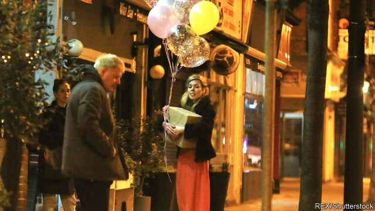

###### Monsieur Boris

# Boris Johnson, Britain’s first French prime minister? 

 

> print-edition iconPrint edition | Britain | Jun 29th 2019 

“ET ALORS?” So responded François Mitterrand, then president of France, when asked about a child from an extra-marital relationship. His curt “So what?” summed up the way in which the private lives of French politicians are generally off-limits to nosy journalists, and of little concern to French voters. Criticism of François Hollande, another president caught having an affair, focused on the fact that he had turned up to his illicit liaisons on an unpresidential scooter. How Boris Johnson must have wished that similar attitudes prevailed in Britain when an argument with his girlfriend became front-page news on June 21st, after the police were called to her flat in south London. 

Mr Johnson is attempting to become Britain’s first French prime minister, with an impregnable barrier between his public and (rather vibrant) private life. “I do not talk about stuff involving my family, my loved ones,” he garbled this week. “And there’s a very good reason for that. If you do, you drag them into things that, really, is, in a way that is not fair on them.” 

Unfortunately for Mr Johnson, the British take a keen interest in the personal lives of their politicians. More than half of voters think Mr Johnson’s private life is relevant to his ability to be prime minister, according to a poll taken by Survation after last week’s domestic row was splashed all over the press. One in three voters said the episode—in which Mr Johnson’s partner, Carrie Symonds, was recorded screaming “Get off me!” and “Get out of my flat!” before labelling Mr Johnson “spoilt”—would make them less likely to support him. Happily for Team Johnson, half suggested it would make no difference. 

It made for a chaotic start to the leadership race by Mr Johnson, who nonetheless remains the favourite. While noisily stating that he would not comment on Mr Johnson’s private life, Jeremy Hunt, the foreign secretary, who is running against him, labelled his opponent a coward for ducking out of a head-to-head debate. Mr Johnson’s team had attempted to launch a “submarine” assault on Downing Street, in which their gaffe-prone candidate would surface only occasionally. But following criticism of his invisibility Mr Johnson changed tactics, giving a flurry of interviews in which he discussed everything from his plan to leave the EU by October 31st (“come what may, do or die”) to his hobby of painting buses on old wine boxes—anything other than his love life. 

Yet the topic may re-emerge in the remaining month of the contest. Basic questions about Mr Johnson, such as how many children he has, are unanswered. Judges have, in general, upheld the right of journalists to stick their beaks in. When in 2013 the mother of one of Mr Johnson’s children tried to stop newspapers from naming him as the father, the courts ruled against her, declaring that it was “a public interest matter which the electorate was entitled to know when considering [Mr Johnson’s] fitness for high public office”. 

Following the latest fireworks, one poll suggested that Mr Johnson had lost his lead to Mr Hunt among the general public. His victory looks a little less certain than a week ago. But Conservative voters still prefer him—and the decision lies with party members, who are particularly enthusiastic backers of his hard line on Brexit. A majority say they would be willing to seriously damage the economy or even lose Scotland in order to leave the EU (see Bagehot). Just as Brexit has superseded the party’s attitudes to business and the union, so too it may override its attitude to family values. Mr Johnson’s team is banking on the hope that Conservative Party members will greet any topic other than Brexit with a Gallic “Et alors?” ◼ 

-- 

 单词注释:

1.Monsieur[mә'sjә:]:n. 先生, 绅士 

2.boris['bɔris]:n. 鲍里斯（男子名） 

3.johnson['dʒɔnsn]:n. 约翰逊（姓氏） 

4.Jun[dʒʌn]:六月 

5.Et['i:ti:]:[化] 乙基 

6.Mitterrand[]:[经] 密特朗 

7.curt[kә:t]:a. 简略的, 简短的, 生硬的 

8.nosy['nәuzi]:a. 大鼻子的, 好管闲事的, 爱打听的 n. 大鼻者 

9.voter['vәutә]:n. 选民, 投票人 [法] 选民, 选举人, 投票人 

10.hollande[]:[网络] 法国总统候选人奥朗德；欧兰德总统；总统获选人奥兰德 

11.illicit[i'lisit]:a. 不法的, 不正当的, 禁止的 [法] 违法的, 违禁的, 被禁止的 

12.liaison[li:'eizɒn]:n. 联络 

13.unpresidential[]:[网络] 很没有总统样子 

14.scooter['sku:tә]:n. 小型摩托车, 踏板车 [机] 机车 

15.girlfriend[]:n. 女朋友 

16.impregnable[im'pregnәbl]:a. 无法攻取的, 坚强不屈的, 驳不倒的 

17.vibrant['vaibrәnt]:a. 振动的, 战栗的, 响亮的, 活跃的 

18.garble['gɑ:bl]:vt. 断章取义, 混淆 [电] 曲解 

19.carrie['kæri]:n. 卡丽（女名, Caroline的昵称） 

20.SYMONDS['saimәndz, 'simәndz]:西蒙兹(姓氏) 

21.les[lei]:abbr. 发射脱离系统（Launch Escape System） 

22.chaotic[kei'ɒtik]:a. 混乱的, 无秩序的 [法] 混乱的, 混沌的 

23.nonetheless[,nʌnðә'les]:conj. 然而, 尽管, 不过 adv. 不过, 仍然, 尽管如此, 然而 

24.jeremy['dʒerimi]:n. 杰里米（男子名） 

25.assault[ә'sɒ:t]:n. 攻击, 袭击 vt. 袭击, 攻击 vi. 发动攻击 

26.invisibility[in.vizә'biliti]:n. 看不见, 难觉察的, 看不见的东西 

27.tactic['tæktik]:n. 一项战术, 一条策略 a. 战术的, 顺序的, 排列的 

28.flurry['flә:ri]:n. 疾风, 飓风, 慌张 vt. 使恐慌, 使激动 vi. 慌张 

29.EU[]:[化] 富集铀; 浓缩铀 [医] 铕(63号元素) 

30.unanswered[.ʌn'ɑ:nsәd]:a. 未答复的, 无反应的 

31.uphold[ʌp'hәuld]:vt. 支撑, 赞成, 鼓励, 举起, 坚持 [法] 确认, 赞成, 支持 

32.beak[bi:k]:n. 鸟嘴, 喙 [医] 嘴, 喙 

33.electorate[i'lektәrit]:n. 选民, 有选举权者, 选区 [法] 选民, 选举团, 选区 

34.fitness['fitnis]:n. 适合, 合宜, 合理, 恰当, 健康 [医] 适合性, 适应性 

35.backer['bækә]:n. 援助者, 支持者 [经] 背书人, 支持人 

36.Brexit[]:[网络] 英国退出欧盟 

37.Bagehot[ˈbædʒət]:白芝浩；巴杰特（人名） 

38.supersede[.sju:pә'si:d]:vt. 代替, 取代, 接替 [法] 替代, 替换, 充任 

39.override[.әuvә'raid]:vt. 推翻, 无视, 对...有最后发言权, 制服, 践踏, 奔越过 [经] 代理佣金, 代销佣金 

40.gallic['gælik]:a. 瘿的, 镓的 

41.Et['i:ti:]:[化] 乙基 

