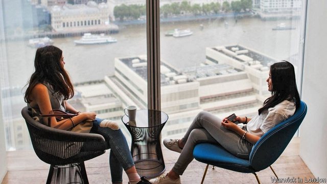

###### Degrees south

# Seeking students and status, regional universities set up in London 

 

> print-edition iconPrint edition | Britain | Jun 29th 2019 

THE 13TH AND 17TH floors of the Shard, towering over south London, make an improbable home for the University of Warwick. Stranger still, a mile or so away, next to the Ministry of Sound nightclub, lies the University of the West of Scotland. In the east of the city Loughborough University, known for its sporting expertise, has established itself in the former press centre at the Olympic Park. 

Since the early 2000s British university outposts have sprung up across the globe, from Lagos to Johor Bahru. But the most popular place is closer to home. At least 15 regional universities have campuses in the capital, compared with none a decade or so ago. University administrators expect more to arrive soon. 

The reason for the rush is simple. For institutions in remote or unfashionable bits of the country, setting up shop in the capital “is a good way to get students who wouldn’t normally consider you”, explains Paul Woodgates of PA Consulting, whose clients include universities. That is especially true of foreign students who, if they are from outside the European Union, pay fees two or three times higher than their British peers. Many universities’ London campuses offer English-language teaching alongside academic study. At Loughborough’s outpost in the capital, 85% of students come from beyond the EU, with China the main source. 

Opening an embassy in London also helps to raise the profile of the institution more broadly, says Tony Edwards, the Loughborough campus’s incoming head. His university sometimes makes the top ten in British rankings, but suffers in international ones, which put more weight on the views of academics in other countries who may not have made it to the East Midlands. 

London outposts typically offer courses in vocational subjects, like business or management, which are cheap to teach. In some cases they forge links with businesses that would be hard to replicate back at base. But not always. “It is quite striking how often the proximity to big, prestigious employers is flagged up, as if geographical proximity would be enough to improve employment outcomes,” says Rachel Brooks, a sociologist at the University of Surrey (which does not yet have a London branch). She and Johanna Waters of UCL found that academics at London offshoots had fewer qualifications than those at their parent campuses, and often had professional rather than academic experience. 

And though the bright lights of the city may appeal, an administrator at one university thinking of setting up a campus confesses he worries about the student experience. Facilities in the capital can be cramped and, with few students on campus, opportunities for sports teams and student unions are limited. Universities hope that the central location makes up for a somewhat stripped-back education. As more outposts open, that idea will be put to the test.◼ 

-- 

 单词注释:

1.statu[]:[网络] 状态查看；雕像；特级雪花白 

2.regional['ri:dʒәnәl]:a. 地方的, 地域性的 [医] 区的, 部位的 

3.Jun[dʒʌn]:六月 

4.shard[ʃɑ:d]:n. 陶瓷碎片, 鞘翅, 薄硬壳 

5.improbable[im'prɒbәbl]:a. 不大可能的, 不象发生的, 荒谬可笑的 [法] 未必会的, 不大可能发生的, 未必确实的 

6.warwick['wɔrik]:n. 沃里克（英国英格兰中部沃里克郡城市）；沃里克（美国罗德岛州东部城市, 为纺织业中心）；沃里克（姓氏） 

7.nightclub['naitklʌb]:n. 夜总会 

8.Loughborough[]:n. 拉夫伯勒（英国一城镇） 

9.expertise[.ekspә:'ti:z]:n. 专家意见, 专门技术 [法] 专门知识, 专家意见 

10.outpost['autpәust]:n. 前哨, 前哨部队, 前哨基地 

11.Lagos['lɑ:gәs]:n. 拉各斯(尼日利亚的首都) 

12.Johor[]:n. 柔佛（位于马来西亚西部的最南端） 

13.Bahru[]:[网络] 巴鲁 

14.administrator[әd'ministreitә]:n. 管理人, 行政官 [经] 遗产管理人员 

15.unfashionable[.ʌn'fæʃәnәbl]:a. 不流行的, 不时髦的, 过时的 

16.paul[pɔ:l]:n. 保罗（男子名） 

17.woodgate[]: [人名] 伍德盖特 

18.PA[pɑ:]:私人秘书, (露天)扩音系统 [计] 程序存取, 程序地址, 程序分析 

19.client['klaiәnt]:n. 客户, 顾客, 委托人 [计] 客户, 客户机, 客户机程序 

20.peer[piә]:n. 同等的人, 匹敌, 贵族 vi. 凝视, 窥视, 费力地看, 隐现 vt. 与...同等, 封为贵族 

21.EU[]:[化] 富集铀; 浓缩铀 [医] 铕(63号元素) 

22.profile['prәufail]:n. 侧面, 轮廓, 传略 vt. 描绘...轮廓, 写...的传略 [计] 提问档; 剖面图法; 剖面法 

23.broadly['brɒ:dli]:adv. 宽广地, 明白地, 无礼貌地 

24.tony['tәuni]:a. 高贵的, 时髦的 

25.edward['edwәd]:n. 爱德华（男子名） 

26.incoming['inkʌmiŋ]:a. 进来的, 刚开始的, 新来的 n. 进来 

27.ranking['ræŋkiŋ]:n. 等级, 地位 a. 上级的, 头等的, 超群的 

28.midland['midlәnd]:n. 中部地方, 内地 

29.typically['tipikәli]:adv. 代表性地；作为特色地 

30.vocational[vәu'keiʃәnl]:a. 职业的 [法] 职业上的, 天职的 

31.forge[fɒ:dʒ]:n. 熔炉, 铁工厂 vt. 打制, 锻造, 伪造 vi. 锻造, 伪造 

32.replicate['replikeit]:vt. 折叠, 折转, 复制 n. 复现试验, 复制品, 高八度音 a. 复现的, 复制的, 折转的, 弯回的 

33.alway['ɔ:lwei]:adv. 永远；总是（等于always） 

34.proximity[prɒk'simiti]:n. 接近, 亲近 

35.prestigious[pre'stidʒiәs]:a. 享有声望的 

36.geographical[dʒiә'græfikl]:a. 地理学的, 地理的 

37.rachel['reitʃәl]:n. 雷切尔（女子名） 

38.sociologist[.sәusi'ɒlәdʒist]:n. 社会学家 [法] 社会学家 

39.surrey['sʌri]:n. 四轮双座轻便游览马车 

40.johanna[dʒәj'hænә]:n. 约翰娜（女子名, 等于Joanna） 

41.UCL[]:[化] 上控制限 

42.offshoot['ɒ:fʃu:t]:n. 分支, 旁系, 衍生事物 

43.cramp[kræmp]:n. 痉挛, 腹部绞痛, 铁夹钳 a. 狭窄的, 难认的 vt. 使抽筋, 以铁箍扣紧, 束缚 

