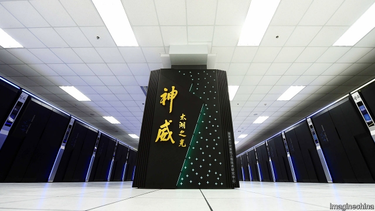

###### The balance of processing power

# An American ban hits China’s supercomputer industry 

 

> print-edition iconPrint edition | Business | Jun 29th 2019 

IN 2000 CHINA had two supercomputers ranked among the world’s fastest 500. Ten years later a machine named Tianhe-1A topped the global league table. It was, though, based on Intel chips. So when in 2015 America barred its giant chipmaker from selling to four Chinese supercomputer labs—fearing that the machines were being used to simulate nuclear blasts—it might have expected China’s progress in the field to slow. Instead, China unveiled another supercomputer, Sunway TaihuLight, that led that ranking in 2016 and 2017—this time powered entirely by home-grown microprocessors. The latest American sanctions will nevertheless bite. 

On June 21st America’s Commerce Department blacklisted another five Chinese supercomputing entities on the grounds that they too pose a threat to national security. The export ban prohibits American firms from selling them chips and “interconnects” that allow chips to talk to each other. An army-led institute that designed chips for the latest world-beating machine is on the list, as is Sugon, which has built a third of China’s 100 fastest ones. 

So is Hygon, born of a joint venture in 2016 between Sugon and Advanced Micro Devices (AMD), an American semiconductor firm. Intel chips dominate high-powered computing in desktops, servers and supercomputers. But AMD makes advanced ones compatible with Intel’s technology. The $293m arrangement gave Hygon the ability to make slightly slower near-replicas of AMD’s designs—and China a domestic manufacturer of crucial components. 

The latest ban chokes off practically all of AMD’s dealings with Hygon. Transfer of intellectual property and technical support are proscribed. The manufacturer of the copycat chips, GlobalFoundries, is American, so it too is banned from working with Hygon. Finding an alternative foundry would require onerous tweaks to the chips’ design. AMD has carefully transferred only as much knowledge as Hygon needs to copy but not reverse-engineer them. 

A blow, for sure—but perhaps not a knockout. Last year new American computers ended China’s dominance; it will be pouring money into reclaiming it. Jack Dongarra, a supercomputing expert at the University of Tennessee who has scrutinised Sunway’s chip, calls it “very impressive”. Rumours have spread of a big new supercomputer powered by AMD’s licensed chips whirring in a Chinese lab. 

To China the blacklisting, days before President Donald Trump is to meet his Chinese counterpart, Xi Jinping, at the G20 summit in Japan, smacks of a negotiating ploy in the two countries’ trade war. In May Mr Trump said he could ease export restrictions that had been placed the previous week on Huawei, a Chinese telecoms giant. Even if he doesn’t, Intel and Micron, another chipmaker, are already circumventing the Huawei ban in ways they claim are legal, according to the New York Times.FedEx is suing America’s government over the “impossible” job of inspecting parcels to blacklisted Chinese firms. Chipping away at Chinese computing progress is tough. ◼ 

-- 

 单词注释:

1.supercomputer[,sju:pәkәm'pju:tә]:[计] 巨型计算机, 巨型机, 超级计算机 

2.Jun[dʒʌn]:六月 

3.intel[]:n. 美国英特尔公司（财富500强公司之一, 以生产CPU芯片著称） 

4.chip[tʃip]:n. 屑片, 薄片, 碎片 vt. 削, 切, 削成碎片, 使摔倒, 凿 vi. 削下屑片 [计] 孔屑; 组件; 晶片; 芯片 

5.chipmaker[t'ʃɪpmeɪkə]:n. 芯片制造商 

6.simulate['simjuleit]:vt. 模拟, 假装, 模仿 [法] 伪装的, 模拟的; 假装的, 伪装的, 冒充 

7.unveil[.ʌn'veil]:vt. 揭开, 揭幕, 除去...的面纱 vi. 显露, 除去面纱 

8.sunway[]:[网络] 双威；双威集团；双威学院 

9.entirely[in'taiәli]:adv. 完全, 全然, 一概 

10.microprocessor[.maikrәu'prәusesә]:n. 微处理器 [计] 微处理器; 微处理机 

11.sanction['sæŋkʃәn]:n. 核准, 制裁, 处罚, 约束力 vt. 制定制裁规则, 认可, 核准, 同意 

12.blacklist['blæklist]:n. 黑名单 

13.supercomputing[]:[计] 超级计算 

14.entity['entiti]:n. 实体, 实存物, 存在 [计] 实体 

15.interconnect[.intәkә'nekt]:vt. 使互相连接 

16.micro[]:[计] 表示"小","微","微量","百分之一" 

17.amd[]:abbr. 超微半导体公司（Advanced Micro Devices） 

18.computing[kәm'pju:tiŋ]:[计] 计算 

19.desktop['desktɔp]:n. 桌面 [计] 桌面 

20.server['sә:vә]:n. 服伺者, 上菜用具, 发球员 n. 服务器 [计] 服务器, 服务器启动程序, 服务台程序 

21.compatible[kәm'pætәbl]:a. 能共处的, 可并立的, 适合的 [计] 相容的; 兼容的 

22.dealing['di:liŋ]:n. 经营行为, 行为, 交易 [法] 待遇, 处置, 行为 

23.proscribe[prәu'skraib]:vt. 剥夺...的公民权, 使失去法律保护, 把...充军, 把...放逐, 排斥, 禁止 

24.copycat['kɒpikæt]:n. 模仿者 

25.GlobalFoundries[]:[网络] 格罗方德；全球晶圆；格罗方德半导体 

26.foundry['faundri]:n. 铸造, 铸造厂, 铸造类 [机] 铸造厂, 铸造 

27.onerous['ɒnәrәs]:a. 繁重的, 负有法律责任的 [法] 负有义务的, 艰巨的, 繁重的 

28.tweak[twi:k]:n. 拧, 扭, 焦急 vt. 扭, 开足马力 

29.carefully['kєәfuli]:adv. 小心地, 谨慎地 

30.knockout['nɔ'kaut]:n. (拳击)击倒对方, 被击倒, 击倒, (非正式)令人倾慕的人/物, 轰动的事物 a. 击倒的, 引人注目的, 轰动的, 使昏迷的 

31.dominance['dɔminәns]:n. 优势, 显性, 统治, 控制, 支配 [计] 控制, 扰势 

32.reclaim[ri'kleim]:vt. 开垦, 改造, 感化, 纠正, 回收 vi. 喊叫, 抗议 

33.jack[dʒæk]:n. 插座, 千斤顶, 男人 vt. 抬起, 提醒, 扛举, 增加, 提高, 放弃 a. 雄的 [计] 插座 

34.Tennessee[.teni'si:]:n. 田纳西州 

35.scrutinise[]:vt.vi. 细看, 仔细检查, 审查, 细阅 [经] 详细检查, 细细地看 

36.whir[hwә:]:n. 呼呼声, 飕飕声 vi. 作呼呼声, 发飕飕声 vt. 使呼呼响 

37.counterpart['kauntәpɑ:t]:n. 副本, 复本, 配对物, 相应物 [经] 副本, 正副二份中之一 

38.smack[smæk]:n. 风味, 滋味, 少量, 拍击声, 咂嘴声, 小渔船, 海洛因 vi. 有味道, 咂嘴, 发出拍击声 vt. 拍, 打, 掴, 咂, 出声地吻 adv. 啪地一声, 猛然 

39.ploy[plɒi]:n. 手段, 活动, 玩乐 

40.huawei[]: 华为 

41.telecom['telәkɔm]:telecommunication 电信 

42.micron['maikrɒn]:n. 微米 [计] 微米 

43.circumvent[.sә:kәm'vent]:vt. 绕行, 陷害, 包围, 智取 

44.york[jɔ:k]:n. 约克郡；约克王朝 

45.sue[su:]:vt. 控告, 起诉, 请求 vi. 提出诉讼, 提出请求 

