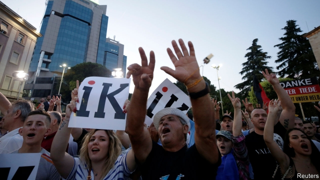

###### All blocked

# Albania is a mess 

 

> print-edition iconPrint edition | Europe | Jun 29th 2019 

CHINESE LANTERNS painted with the word “Ik” drift across the evening sky. Waving red Albanian flags emblazoned with its double-headed black eagle, as well as European Union and American ones, the crowd chants “Rama Ik! Rama Ik! Rama Ik!” Since February, in a series of mass protests, the opposition has been demanding that Edi Rama, the prime minister, must—in one word—go. During such raucous demonstrations, firecrackers and paint bombs are regularly hurled at his office. Lulzim Basha, leader of the opposition Democratic Party, which has led the protests, tells his supporters: “I won’t let this country slip into eastern despotic ways!” But as chaos in parliament and on the streets persists, Albania’s chances of being embraced by the EU are dwindling. 

A year ago the EU laid out a string of conditions before negotiations to join the club could begin. On May 29th a European Commission report recommended that they should go ahead. But on June 18th several EU countries slammed on the brakes. It was a bitter blow, though the Albanian government had expected it. Mr Rama insisted that his country’s efforts to join the EU would continue, and blamed governments pandering to populist parties for keeping it out. North Macedonia, which has made better progress towards meeting the EU’s requirements, was also rebuffed. 

But its chaotic politics mean that Albania looks increasingly ill-qualified to join the club. On June 30th elections for mayors and municipal councils are meant to take place. Mr Rama says they will go ahead, though President Ilir Meta has said he has cancelled them because of the situation. The electoral college backs the government but Mr Basha says the elections are illegal and is boycotting them. Mr Basha had banked on international approval of his protests and boycott of parliament, but has failed to get it. Attacks by his supporters on places where the polls are due to be held have been met by rebukes from foreign governments. 

If the elections do go ahead, Mr Basha’s party will lose the jobs and patronage that local government confers. At the same time the parliament, in which Mr Rama’s Socialist Party has a narrow majority, has begun moves to impeach President Meta. The law, says Erion Veliaj, the Socialist mayor of Tirana, the capital, is “very clear. If you try to stop people voting, you go to jail.” 

Mr Basha has been trying to prove that Mr Rama was helped by organised-crime bosses to win the last general election, in 2017. Mr Rama denies it and says he will sue the journalist who is making the allegations in a German paper. On June 17th Mr Basha was in his turn called to answer allegations about illegal party financing. Mr Basha says the charges are false. 

In 1997 there was a complete collapse of law and order in Albania when citizens seized tanks and forced the then president, Sali Berisha, Mr Basha’s mentor, to resign. Democracy has enough of a foothold to make this very unlikely to happen again; all the same, politics in Albania is a nasty business. The main parties are tied to clans with unsavoury connections. Mr Basha claims that the enemies of organised-crime bosses allied to the Socialists have made overtures to him, which he has rebuffed. “It is not the collusion of government and organised crime, it is a fusion,” he says. But Mr Rama says that if such accusations were true the European Commission would not have recommended the opening of EU accession talks, albeit that EU leaders decided to postpone them. 

However chaotic the current situation, at least Albania’s courts, under the aegis of the European Commission, are being cleaned up a bit. Judges and prosecutors are being screened for unexplained wealth, links to organised crime and general proficiency. Out of 140 screened so far, only 53 have been given the all-clear. ◼ 

-- 

 单词注释:

1.Albania[æl'beiniә]:n. 阿尔巴尼亚 

2.Jun[dʒʌn]:六月 

3.ik[]:abbr. 钾电流；反向动力学（Inverse Kinematics） 

4.albanian[æl'beinjәn]:n. 阿尔巴尼亚人 

5.emblazon[im'bleizn]:vt. 用纹章装饰, 盛饰, 颂扬 

6.rama['rɑ:mә]:n. 罗摩（印度教神名） 

7.sery[]:n. (Sery)人名；(俄)谢雷；(科特)塞里 

8.opposition[.ɒpә'ziʃәn]:n. 反对, 敌对, 相反, 在野党 [医] 对生, 对向, 反抗, 反对症 

9.EDI[]:[计] 电子数据交换 

10.raucous['rɒ:kәs]:a. 沙哑的, 粗声的, 喧闹的 

11.demonstration[.demәn'streiʃәn]:n. 示范, 实证 [医] 示教, 实物教授 

12.firecracker['faiәkrækә]:n. 爆竹, 鞭炮 [化] 爆竹; 鞭炮 

13.hurl[hә:l]:n. 用力的投掷 vt. 用力投掷, 发射, 愤慨地说出, 丢下 vi. 猛投, 猛掷 

14.basha['bɑ:ʃә]:n. (印度的)茅顶竹舍 

15.despotic[de'spɒtik]:a. 专制的, 专横的, 暴虐的 [法] 专制的, 专横的 

16.chao[]:n. 钞（货币） 

17.EU[]:[化] 富集铀; 浓缩铀 [医] 铕(63号元素) 

18.dwindle['dwindl]:vi. 减少, 缩小, 衰落 vt. 使缩小 

19.negotiation[ni.gәuʃi'eiʃәn]:n. 谈判, 磋商, 交涉 [经] 谈判, 协商 

20.pander['pændә]:vi. 勾引, 怂恿, 卑劣地迎合 n. 拉皮条者, 怂恿者, 助恶者 

21.Populist['pɔpjulist]:n. 民粹派的成员 

22.Macedonia[,mæsi'dәunjә]:n. 马其顿 

23.rebuff[ri'bʌf]:n. 断然拒绝, 严厉拒绝, 漠不关心 vt. 严厉拒绝 

24.chaotic[kei'ɒtik]:a. 混乱的, 无秩序的 [法] 混乱的, 混沌的 

25.politic['pɒlitik]:a. 精明的, 明智的, 策略的 

26.municipal[mju:'nisipl]:a. 市政的, 自治区的, 内政的 [经] 市政的, 市的 

27.ilir[]: [地名] [俄罗斯] 伊利尔 

28.meta[]:[计] 元的 

29.electoral[i'lektәrәl]:a. 选举人的, 选举的, (有关)选举的 [法] 选举的, 选举人的, 由选举人组成的 

30.supporter[sә'pɒ:tә]:n. 支持者, 后盾, 迫随者, 护身织物 [法] 支持者, 赡养者, 抚养者 

31.rebuke[ri'bju:k]:n. 指责, 谴责, 非难 vt. 斥责, 指责, 制止 

32.patronage['pætrәnidʒ]:n. 赞助, 恩赐态度, 光顾, 任免权, 保护人的身分 [经] 光顾, 资助, 赞助 

33.confer[kәn'fә:]:vt. 授予, 带来 vi. 协商 

34.impeach[im'pi:tʃ]:vt. 控告, 怀疑, 检举, 弹劾 [法] 控告, 检举, 弹劾 

35.erion[i'riɔn]:绵状毛 

36.tirana[]:n. 地拉那（阿尔巴尼亚的首都） 

37.sue[su:]:vt. 控告, 起诉, 请求 vi. 提出诉讼, 提出请求 

38.allegation[.æli'geiʃәn]:n. 断言, 主张, 申辩 [法] 声明, 事实陈述, 断言 

39.sali[]:abbr. surface analysis by laser ionization 激光电离表面分析法 

40.berisha[]:[网络] 贝里沙；贝里夏；总理贝礼夏 

41.mentor['mentɔ:]:n. 指导者, 良师益友 

42.foothold['futhәuld]:n. 立足处, 据点, 根据地 

43.clan[klæn]:n. 氏族, 宗族, 集团 [医] 支 

44.unsavoury[,ʌn'seivәri]:a. 没有味道的, 没有香味的, 难吃的, 难闻的, 令人不快的, 不可接受的 

45.ally['ælai. ә'lai]:n. 同盟者, 同盟国, 助手 vt. 使联盟, 使联合, 使有关系 vi. 结盟 

46.overture['әuvә.tʃuә]:n. 主动表示, 事件的开端, 序言, 提议, 提案, 初步交涉 vt. 提议, 为...奏前奏曲 

47.collusion[kә'lu:ʃәn]:n. 共谋, 勾结 [经] 勾结, 串通, 串同舞弊 

48.fusion['fju:ʒәn]:n. 熔合物, 结合, 熔合 [化] 熔融; 熔化; 聚变 

49.accusation[ækju:'zeiʃәn]:n. 控告, 指控, 指责 [法] 控告, 起诉, 告发 

50.accession[æk'seʃәn]:n. 到达, 即位, 增加, 同意, 发作, 正式接受 vt. 登记入册 

51.albeit[ɔ:l'bi:it]:conj. 尽管, 虽然 

52.aegis['i:dʒis]:n. 羊皮盾, 保护, 庇护, 赞助, 支持 [法] 庇护, 保护 

53.prosecutor['prɒsikju:tә]:n. 实行者, 告发者, 公诉人 [法] 原告, 起诉人, 检举人 

54.unexplained[]:[法] 未经说明的, 未经解释的 

55.proficiency[prә'fiʃәns]:n. 精通, 熟练, 精练 

