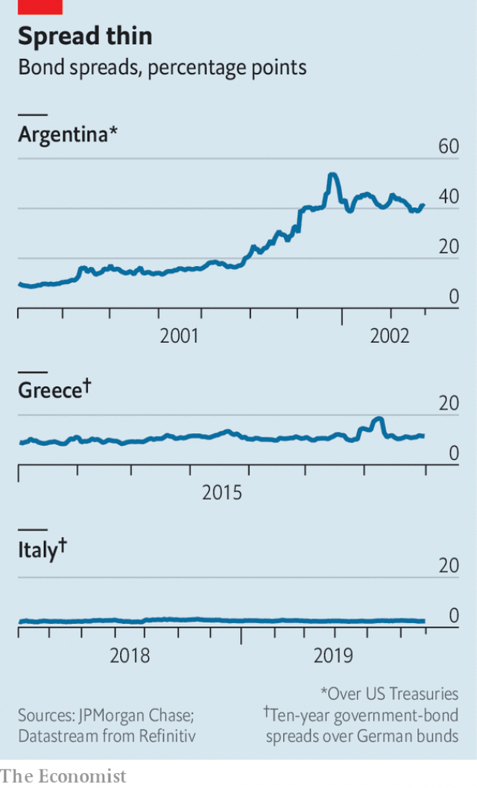

###### Funny money

# An idea for a parallel currency resurfaces in Italy 

 

> print-edition iconPrint edition | Finance and economics | Jun 29th 2019 

GOVERNMENTS IN FISCAL distress sometimes find creative ways to pay the bills. Revolutionary France sold bonds secured against land confiscated from the Catholic church; America used paper bills to fund its war of independence. In 2001 Argentina issued IOUs, as did California in 2009. During Greece’s sovereign-debt crisis Yanis Varoufakis, then its finance minister, toyed with plans for a parallel currency. 

Not the most desirable of clubs, then, yet some in Italy are eager to join. So-called mini-BOTs, originally hatched by eurosceptics to replace the euro, made it onto the ruling coalition’s manifesto last year. Mini-BOTs (Buoni Ordinari del Tesoro, or ordinary treasury bonds) would be used to settle the government’s bills with commercial suppliers. Recipients could use them to pay taxes, or for public services. Devised by Claudio Borghi, an economist of the Northern League, one of Italy’s ruling parties, they would be low-denomination bills (up to €500, or $569) that bear no interest. 

They would not be legal tender—that would break EU law. But Mr Borghi would like them to circulate widely, eventually being used in shops to price goods. He has written that mini-BOTs would enable a quick exit from the euro, though ministers say they have no such plan. 

On May 28th the lower house of parliament passed a non-binding motion calling on the government to bring down arrears, and to study mini-BOTs in detail. The latter clause was reportedly tagged on at the last minute: some lawmakers did not realise what they were voting for. As investors became uneasy Giovanni Tria, the finance minister, said mini-BOTs were not an option. But Matteo Salvini, the League’s leader, says he will press ahead with mini-BOTs in the absence of “a smarter way”. 

In truth, they would bring little gain. Though the government’s stock of unpaid bills is the euro area’s largest, at around €50bn, or 3% of GDP, the Bank of Italy reckons this has halved since 2012. And Mr Tria says the government is now settling bills more quickly. Mario Draghi, the boss of the European Central Bank, has opined that as mini-BOTs are not legal tender, they would add to Italy’s stock of debt. So the government might as well resort to conventional bonds. Though the spread between Italian and German yields has widened since the populist coalition was formed, it is far lower than in countries that have issued temporary IOUs, or “scrip” (see chart). Italy is nowhere near shut out of bond markets. In fact, ultra-loose monetary policy means bond yields are low in historical terms. 

 

History suggests such dire measures are not generally successful. Governments are tempted to over-issue scrip, as in 18th-century America. As they are less trusted and less liquid than official currency, their value slumps. In California banks eventually refused to accept IOUs. Argentines hoarded pesos, spending scrip as fast as possible (an illustration of Gresham’s law, that bad money drives out good). If much of their income becomes denominated in scrip, the government and private sector would struggle to pay back debt, which is still denominated in the official currency. 

The danger is compounded by Italy’s membership of a currency union. If mini-BOTs’ sole purpose were to pay off arrears, investors would worry that the true intention was to leave the euro overnight. On June 6th Moody’s, a credit-rating agency, said it would consider them as the first step towards preparing for an exit; even Mr Varoufakis concurs. Investors would sell off government bonds and residents would pull their euros out of banks, destabilising the public finances and banking system. 

That explains why the technocratic Mr Tria wants to squash the idea, and opposition lawmakers say they would not support it. But Mr Salvini is reluctant to take it off the table just yet. A confrontation with the European Commission over Italy’s public debt is looming. He might hope that considering mini-BOTs signals the country’s willingness to take drastic steps to introduce fiscal stimulus. If it is a threat, the gun is pointing the wrong way. ◼ 
<<<<<<< HEAD

-- 

 单词注释:

1.resurface[ri:'sә:fis]:vi. 重铺路面 vi. 重新露面 

2.Jun[dʒʌn]:六月 

3.fiscal['fiskәl]:a. 财政的, 国库的 [经] 财政上的, 会计的, 国库的 

4.confiscate['kɒnfiskeit]:vt. 没收, 把...充公, 查抄 a. 被没收的 

5.Argentina[.ɑ:dʒәn'ti:nә]:n. 阿根廷 

6.IOU['aiәu'ju:]:借据, 借条 

7.California[.kæli'fɒ:njә]:n. 加利福尼亚 

8.yanis[]:[网络] 亚尼斯；上帝的礼物；黑道无间 

9.Varoufakis[]:[网络] 瓦鲁法克斯 

10.originally[ә'ridʒәnli]:adv. 本来, 原来, 最初, 就起源而论, 独创地 

11.eurosceptic[ˌjʊərəʊ'skeptɪk]:n. 欧洲统一怀疑论者；反对英国亲近欧盟的人 

12.euro['juәrәu]:n. 欧元（欧盟的统一货币单位） 

13.manifesto[.mæni'festәu]:n. 宣言, 声明 

14.DEL[del]:[计] 数据输入语言, 作废; DOS内部命令:从磁盘上删除一个或多个文件 

15.tesoro[]: [地名] [古巴、危地马拉] 特索罗 

16.treasury['treʒәri]:n. 国库, 宝库, 财政部, 国库券 [经] 库存, 国库, 金库 

17.supplier[sә'plaiә]:n. 供应者, 供给国, 供应商 [化] 承制厂; 供应厂商 

18.recipient[ri'sipiәnt]:a. 领受的, 容易接受的, 感受性强的 n. 领受者, 容纳者, 容器 

19.Claudio[]:n. 克劳迪奥（男子名） 

20.borghi[]:[网络] 博尔吉；博基 

21.economist[i:'kɒnәmist]:n. 经济学者, 经济家 [经] 经济学家 

22.EU[]:[化] 富集铀; 浓缩铀 [医] 铕(63号元素) 

23.arrear[ә'riә]:n. 逾期债款, 欠帐, 未做之事, 储备物 

24.clause[klɒ:z]:n. 子句, 条款 [计] 子句 

25.reportedly[ri'pɒ:tidli]:adv. 根据传说, 根据传闻, 据报道 

26.lawmaker[lɒ:'meikә]:n. 立法者 

27.investor[in'vestә]:n. 投资者 [经] 投资者 

28.Giovanni[dʒo'vanni]:n. 乔瓦尼（人名） 

29.tria[]:[医] 试验 

30.matteo[]:马泰奥（人名） 

31.salvini[]:[网络] 索氏丽体鱼；萨尔维尼 

32.unpaid[.ʌn'peid]:a. 未付款的, 不支薪水的 [经] 未付的, 未缴纳的 

33.reckon['rekәn]:vt. 计算, 总计, 估计, 认为, 猜想 vi. 数, 计算, 估计, 依赖, 料想 

34.halve[hɑ:v]:vt. 二等分, 对半分享, 把...减半 

35.quickly['kwikli]:adv. 很快地 

36.mario['mæriәj, 'mɑ:-]:n. 马里奥（男子名） 

37.Draghi[]:[网络] 行长德拉吉；总裁德拉吉；欧洲央行德拉吉 

38.opine[әu'pain]:v. 想, 以为 

39.Populist['pɔpjulist]:n. 民粹派的成员 

40.coalition[.kәuә'liʃәn]:n. 结合体, 结合, 联合 [经] 联合, 联盟 

41.scrip[skrip]:n. 便条, 纸条, 纸片 [经] 股票临时收据, 临时凭单, 代价券 

42.monetary['mʌnitәri]:a. 货币的, 金钱的 [经] 货币的, 金融的 

43.dire[daiә]:a. 可怕的, 悲惨的, 阴沉的, 极端的 

44.les[lei]:abbr. 发射脱离系统（Launch Escape System） 

45.slump[slʌmp]:n. 暴跌, 垂头弯腰的姿态 vi. 猛然掉落, 陷入, 衰落(经济等) 

46.argentine['ɑ:dʒәntain]:n. 银, 银白色金属, 银白色鱼鳞, 阿根廷人 a. 银的, 银色的, 阿根廷的 

47.hoard[hɒ:d]:n. 贮藏物, 密藏的金钱 v. 囤积, 贮藏 

48.peso['peisәu]:n. 比索 [经] 比索 

49.denominate[di'nɒmineit]:vt. 命名 

50.sector['sektә]:n. 扇形, 部门, 部分, 函数尺, 象限仪, 段, 区段 vt. 把...分成扇形 [计] 扇面; 扇区; 段; 区段 

51.membership['membәʃip]:n. 会员的资格, 全体会员, 会员数目 [法] 会员资格, 成员资格, 会籍 

52.concur[kәn'kә:]:vi. 同意, 一致, 同时发生 [法] 同时发生, 并发, 同意 

53.destabilise[di:'steɪbɪlaɪz]:vt. 破坏政府的稳定 

54.technocratic[ˌteknə'krætɪk]:a. 由技术专家官员组成的；受技术官僚影响的 

55.squash[skwɒʃ]:n. 挤压, 压碎的东西, 南瓜属植物, 拥挤的人群 vt. 压扁, 镇压, 压制 vi. 被压扁, 发溅泼声, 挤入 

56.opposition[.ɒpә'ziʃәn]:n. 反对, 敌对, 相反, 在野党 [医] 对生, 对向, 反抗, 反对症 

57.confrontation[.kɔnfrʌn'teiʃәn]:n. 对抗；对质；面对 

58.loom[lu:m]:n. 织布机, 若隐若现的景象 vi. 朦胧地出现, 隐约可见, 可怕地出现 

59.drastic['dræstik]:a. 激烈的 [医] 峻泻药, 剧烈的 

60.fiscal['fiskәl]:a. 财政的, 国库的 [经] 财政上的, 会计的, 国库的 

61.stimulus['stimjulәs]:n. 刺激, 激励, 刺激品 [医] 刺激特, 刺激 
=======
>>>>>>> 50f1fbac684ef65c788c2c3b1cb359dd2a904378

