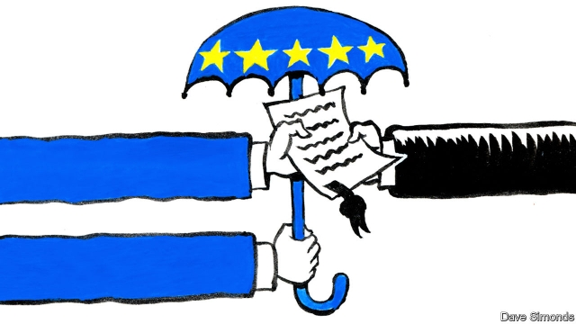

###### On investments, New York, pensions, English, Latin, the Conservatives

# Letters to the editor 

> Jun 29th 2019 

 

You appear to suggest that American and Swiss investors in central European member states of the EU may be worse off following a judgment by the European Court of Justice in a case concerning Achmea, a Dutch insurer, and Slovakia (“Treaty or rough treatment”, June 8th). However, this is not so, as that judgment only concerns cases by EU investors against EU member states. In such cases, the court held that EU law precludes arbitration before international tribunals. 

The judgment was issued in March 2018. Since then more than a dozen arbitral decisions held that they were not bound by that judgment. This included a claim by Vattenfall, a Swedish energy company, against Germany over the objections of that country, which had argued that following the judgment the tribunal did not have jurisdiction. And while the European Commission supported efforts to end intra-EU bilateral investment treaties, ultimately all EU countries undertook to terminate these treaties by the end of this year. 

If the ECJ judgment contributes to improving the functioning of national court systems in the EU, then the long-term benefits will vastly outweigh any perceived shortcomings in the near future. Full disclosure: I was lead counsel for Slovakia in the said proceedings before the ECJ. 

MARKUS BURGSTALLERPartnerHogan Lovells InternationalLondon 

You described the International Centre for the Settlement of Investment Disputes as “an obscure court across the Atlantic”. It is neither a court nor across the Atlantic; ICSID is an arbitration institution administering hearings across the globe. Nor is it the sole legal framework for investment-treaty disputes. A significant portion of cases are heard outside the ICSID regime, which makes disputes susceptible to domestic court supervision; the Achmea case is one example of this. Moreover, the evidence is decidedly mixed on a causal link between investment treaties and investment flows. 

JOEL DAHLQUIST CULLBORGUppsala UniversityUppsala, Sweden 

 

“Potters’ fields” (June 15th), an article on burying New York’s poor and unclaimed, said that there is only space for eight to ten more years at the City Cemetery on Hart Island. That pertains to land that has not yet been used. The city has recycled common graves on Hart Island for a long time, which is why over 1m bodies have been interred there since 1869 (private cemeteries cannot reuse graves, but common graves in public cemeteries can be re-employed). As a result of the recycling, which began in 1933, Hart Island is now the largest natural burial ground in the United States and offers a sustainable and ecological solution for burying unclaimed bodies, as required in New York state. 

MELINDA HUNTPresidentHart Island ProjectNew York 

 

Notwithstanding the conceptual and practical merits of the Chilean pension system, there is a serious problem that has not received proper attention: the risk-reward profile of the investment options (“Will you still feed me?”, June 8th). One recent study showed that the risk-return profile of Chilean pension funds is completely at odds with the regulator’s desire. In short, the most conservative investment option has outperformed the most risk-taking for most of the time. 

Mexican pension funds, however, over a similar time period exhibited almost perfect risk-return profiles. The reason? The Mexican regulator incorporates the value-at-risk metric; the Chilean one relies only on asset-class limits. Regulators of the world, beware: you might be creating a monster. 

ARTURO CIFUENTESClapes UC/Santiago 

BERNARDO PAGNONCELLIUniversidad Adolfo IbanezSantiago, Chile 

 

Charlemagne thinks that promoting English as the European Union’s sole official language would allow for “the sort of unity that is only possible with a common tongue” (June 15th). What is the evidence for such a claim? Britain and America share a common language and yet the present governments are far apart on reaching a consensus in many policy areas. 

The EU has not needed to promote a single official language because the unique form of monolingual ideology that has taken hold in Western Anglo nations is internationally atypical. Switzerland (an example cited by Charlemagne) does indeed have German, French, Italian and Rumantsch strongholds, but official business can, and does, take place in all four. 

Perhaps if we as a society were more understanding of the benefits inherent in multilingual operations, we would not be experiencing a national languages-skills gap that is estimated by the British Academy to be costing the economy £48bn ($61bn) a year. 

JONATHAN KASSTANLecturer in French and linguisticsUniversity of WestminsterLondon 

ALICE CORRDepartment of Modern LanguagesUniversity of Birmingham 

 

 

 

 

 

 

Cambridge 

To Charlemagne’s observations on the advantages of English in Europe can be added the long-standing acceptance by Anglophones of different groups who speak their language in different ways. The French and German languages are shaped by academies and committees that try to define from the top down what is or is not correct language. The Anglophone tradition relishes differences of region, register and class as a semantic stratum that conveys a wealth of meaning, not about what is said but about who is saying it. 

In origin, English is simply French spoken by Germans. Let us look forward to a day when Geordie, Scouse, Received Pronunciation and Cockney can hold out a hand in friendship and understanding to Europeans speaking fluent Freutsch. 

PAUL BEARDMORELondon 

 

Latin is the parent of several languages, as pointed out by Johnson (June 8th), but none of them has matched its compact beauty. The gladiators’ greeting as they entered the Coliseum: “Morituri te salutant” (“Those who are about to die salute thee”) is but one memorable phrase. An even more notable example was “Speramus meliora; resurget cineribus” (“We hope for better things; it will rise from the ashes”)—four words replacing 11. 

ANDRZEJ DERKOWSKIOakville, Canada 

 

To clarify Bagehot’s contention that the Canadian conservative party was “wiped out” in the election of 1993 (June 15th), two conservatives survived that drubbing and were returned as members of Parliament: Mrs Elsie Wayne and Mr Jean Charest. Some wag observed the party was now an endangered species and perhaps faced extinction, given it had been reduced to but a single breeding pair. 

WILLIAM MACGREGORHalifax, Canada 

-- 

 单词注释:

1.york[jɔ:k]:n. 约克郡；约克王朝 

2.Jun[dʒʌn]:六月 

3.investor[in'vestә]:n. 投资者 [经] 投资者 

4.EU[]:[化] 富集铀; 浓缩铀 [医] 铕(63号元素) 

5.judgment['dʒʌdʒmәnt]:n. 裁判, 宣告, 判决书 [医] 判断 

6.Dutch[dʌtʃ]:n. 荷兰人, 荷兰语 a. 荷兰的 

7.insurer[in'ʃuәrә]:n. 保险公司 [法] 保险人, 承保人, 保险公司 

8.Slovakia[slәu'vækiә]:n. 斯洛伐克 

9.preclude[pri'klu:d]:vt. 预先排除, 预防, 阻止, 妨碍 [法] 预防, 排除, 消除 

10.arbitration[.ɑ:bi'treiʃәn]:n. 仲裁, 公断 [计] 仲裁 

11.tribunal[trai'bju:nl]:n. 法庭, 法官席, 裁决 [法] 法庭, 裁判所, 裁判 

12.arbitral['ɑ:bitrәl]:a. 仲裁的 [法] 可仲裁的, 仲裁的, 公断的 

13.vattenfall[]:[网络] 瑞典；瀑布能源公司；瓦腾福 

14.Swedish['swi:diʃ]:n. 瑞典人, 瑞典语 a. 瑞典的, 瑞典人的, 瑞典语的 

15.jurisdiction[.dʒuәris'dikʃәn]:n. 司法权, 审判权, 管辖权 [经] 法律管辖权, 审判权 

16.bilateral[bai'lætәrәl]:a. 有两边的, 双边的, 双方的 [医] 两侧的 

17.terminate['tә:mineit]:a. 有结尾的, (可)结束的 vi. 结束, 终止, 满期 vt. 使停止, 使结束, 使终止 [计] 终止 

18.ecj[]:abbr. Erie County Jail (Buffalo) 伊利县监狱（布法罗）; European Court of Justice 欧洲审判法院 

19.vastly['vɑ:stli]:adv. 广大地, 许多, 巨大 

20.outweigh[.aut'wei]:vt. 比...重, 比...重要, 比...有价值 

21.counsel['kaunsәl]:n. 商议, 忠告, 法律顾问 v. 商议, 劝告 

22.proceeding[prәu'si:diŋ]:n. 进行, 程序, 行动, 诉讼程序, 事项 [化] 会议论文集 

23.MARKUS[]:n. 马库斯（姓氏） 

24.lovell['lʌvәl]:n. 洛弗尔（男子名） 

25.icsid[]:abbr. International Center for the Settlement of Investment Disputes 国际解决投资争端中心; International Council of Societies of Industrial Design 国际工业设计学会理事会 

26.administer[әd'ministә]:vt. 管理, 料理, 执行 vi. 执行遗产管理人的职责, 给予帮助 

27.regime[rei'ʒi:m]:n. 政权, 当权期间, 政体, 社会制度, 体制, 情态 [医] 制度, 生活制度 

28.susceptible[sә'septәbl]:a. 易受影响的, 易感动的, 容许...的 [法] 易感的, 易受影响的, 容许 

29.supervision[.sju:pә'viʒәn]:n. 监督, 管理 [经] 监督, 管理 

30.decidedly[di'saididli]:adv. 决定了, 坚决, 明显, 显而易见, 显然, 明确, 果断, 毫无疑问 

31.causal['kɒ:zәl]:a. 原因的, 因果关系的, 表示原因或理由的 n. 表示原因的连词 

32.Joel['dʒәuәl]:n. 约珥(<<圣经>>人物), <<约珥书>> 

33.dahlquist[]:[网络] 达尔基斯特 

34.Sweden['swi:dn]:n. 瑞典 

35.unclaimed[.ʌn'kleimd]:a. 无人认领的, 未经要求的, 无人领取的 [经] 没有人来领取的 

36.cemetery['semitәri]:n. 墓地, 公墓 [法] 公墓, 墓地 

37.hart[hɑ:t]:n. 雄赤鹿, 雄鹿 

38.pertain[pә'tein]:vi. 从属于, 关于, 涉及, 附属, 适合, 相称 [法] 属于, 从属, 附属 

39.inter[in'tә:]:vt. 埋葬 prep. 在中间 

40.cemetery['semitәri]:n. 墓地, 公墓 [法] 公墓, 墓地 

41.cannot['kænɒt]:aux. 无法, 不能 

42.recycling[]:[电] 再循环 

43.sustainable[sә'steinәbl]:a. 足可支撑的, 养得起的, 可以忍受的 

44.ecological[.i:kә'lɒdʒikәl]:a. 生态学的, 主张生态保护的 [法] 生态的, 生态学的 

45.melinda[mә'lindә]:n. 梅林达（女子名） 

46.notwithstanding[.nɒtwiθ'stændiŋ]:adv. 虽然, 尽管 prep. 尽管 conj. 虽然 

47.conceptual[kәn'septʃuәl]:a. 概念的 [医] 概念的 

48.Chilean['tʃiliәn]:n. 智利人, 智利讲的西班牙语 a. 智利文化的, 智利人的, 智利的 

49.profile['prәufail]:n. 侧面, 轮廓, 传略 vt. 描绘...轮廓, 写...的传略 [计] 提问档; 剖面图法; 剖面法 

50.odds[ɒdz]:n. 可能性, 几率, 机会, 胜算, 不平等 

51.outperform[.autpә'fɔ:m]:vt. 胜过；做得比……好 

52.regulator['regjuleitә]:n. 调整者, 校准者, 校准器, 调整器, 标准钟 [化] 调节剂; 调节器 

53.incorporate[in'kɒ:pәreit]:a. 合并的, 组成公司的, 一体化的 vt. 吸收, 合并, 使组成公司, 体现 vi. 合并, 混合, 组成公司 

54.monster['mɒnstә]:n. 怪物, 恶人, 巨物 [医] 畸胎 

55.Arturo[]:n. 阿图罗（男子名） 

56.Bernardo[]:伯纳多（人名） 

57.Adolfo[]:阿道夫(人名) 

58.Chile['tʃili]:n. 智利 [化] 番椒; 辣椒 

59.Charlemagne['ʃɑ:lә'mein]:查理曼大帝(742-814, 世称 Charles the Great或Charles I, 768-814为法兰克王, 800-814为西罗马帝国皇帝) 

60.monolingual[.mɒnәu'liŋgwәl]:a. 单语的, 仅用一种语言的 

61.ideology[.aidi'ɒlәdʒi]:n. 思想体系, 意识形态, 观念学, 空论 [医] 观念学, 观念形态 

62.anglo['æŋ^lәj]:n. 英国人 

63.internationally[.intә'næʃәnәli]:adv. 国际性地, 在国际间 

64.atypical[.ei'tipikl]:a. 非典型的 [医] 非典型的, 不标准的 

65.cite[sait]:vt. 引用, 引证, 表彰 [建] 引证, 指引 

66.Rumantsch[]:[网络] 莱托罗曼语；里托罗曼斯文；罗曼什语 

67.stronghold['strɒŋhәuld]:n. 要塞, 堡垒, 大本营 

68.inherent[in'hiәrәnt]:a. 固有的, 与生俱来的 [医] 固有的, 生来的 

69.multilingual[.mʌlti'liŋgwәl]:a. 多语言的 

70.jonathan['dʒɔnәθәn]:n. 乔纳森（男子名） 

71.ALICE['ælis]:[计] 应用语言接口转换与扩充 

72.Birmingham['bә:miŋәm]:n. 伯明翰 

73.Cambridge['keimbridʒ]:n. 剑桥 

74.anglophone['æŋ^lәufәun]:n. 母语是英语者 

75.anglophone['æŋ^lәufәun]:n. 母语是英语者 

76.relish['reliʃ]:n. 滋味, 风味, 美味, 爱好, 食欲, 调味品 vt. 调味, 喜欢, 玩味 vi. 有味道 

77.semantic[si'mæntik]:a. 语义的 [计] 语义 

78.stratum['streitәm]:n. 层, 地层, 阶层 [医] 层 

79.geordie['dʒɔ:di]:n. 基尼(英国昔金币单位), 运煤帆船 

80.scouse[skaus]:n. （海员常吃的）炖杂烩（肉和蔬菜和饼干等混成的炖菜） 

81.Cockney['kɒkni]:n. 伦敦东区佬, 东伦敦话, 伦敦腔 a. 伦敦人的, 东伦敦话的 

82.paul[pɔ:l]:n. 保罗（男子名） 

83.johnson['dʒɔnsn]:n. 约翰逊（姓氏） 

84.compact[kәm'pækt]:a. 紧凑的, 紧密的, 简洁的 vt. 使紧密结合, 压缩 vi. 变坚实 

85.morituri[]:[网络] 谍舰；代号莫里图里；摩利特里 

86.Te[ti:]:[医] 碲(52号元素); 破伤风 

87.thee[ði:]:pron. 你 

88.memorable['memәrәbl]:a. 值得纪念的, 难忘的 

89.notable['nәutәbl]:n. 著名人士, 值得注意之事物 a. 值得注意的, 显著的 

90.meliora[]: [人名] 梅莉奥拉 

91.andrzej[]:n. (Andrzej)人名；(波)安杰伊 

92.contention[kәn'teinʃәn]:n. 争论, 争辩, 所持的论点 [计] 争用 

93.drubbing['drʌbiŋ]:n. 殴打, 痛击 

94.Mr['mistә(r)]:先生 [计] 存储器回收程序, 多重请求 

95.elsie[]:n. 埃尔希（女子名） 

96.wayne[wein]:n. 韦恩（男子名） 

97.charest[]: [人名] 查尔斯特 

98.endanger[in'deindʒә]:vt. 危及 [法] 使危险, 危及 

99.specie['spi:ʃi]:n. 硬币 [经] 硬币 

100.extinction[ik'stiŋkʃәn]:n. 消失, 消灭, 废止 [化] 消光; 熄灭 

101.william['wiljәm]:n. 威廉（男子名）；[常作W-][美俚]钞票, 纸币 

