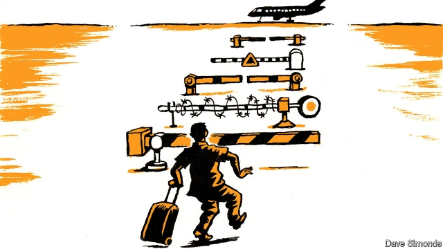

###### Where security is a misnomer

# How airports explain the Arab world 

 

> print-edition iconPrint edition | Middle East and Africa | Jun 29th 2019 

IN MOST AIRPORTS, going through security checks is a streamlined if soulless passage into a hermetically sealed, sanitised zone. Not so in much of the Arab world. Reaching your departure lounge is a mental as well as physical obstacle course which reveals much about the regime—or regimes—in charge. 

Some airports have competing security services. Beirut’s main airport is mostly controlled by Hizbullah, the Shia militia that dominates southern Lebanon. But as befits the country’s tortuously sectarian system of government, various groups have a foothold. Security agencies controlled by Sunni Muslims and Maronite Christians have their own X-ray machines and lines of control. The ensuing duplication leads to one of the airport’s hallmarks: gridlocked queues. 

At Mitiga, the sole airport still serving Tripoli, Libya’s capital, Islamist militiamen peruse Western passports with an air of contempt. But other competing security forces conduct checks, too. In their varying uniforms, the guards are more concerned to secure their bit of the airport than to protect passengers. 

Iraq’s airports also replicate the plethora of checkpoints that punctuate its roads. To reach Baghdad’s main airport, you pass through a series of concentric rings, starting many kilometres before the terminal. Passengers offload their luggage numerous times, first onto airport buses, then onto trolleys. Sniffer dogs, x-ray machines and officials, all from different factions, scrutinise your contents several times over—and you feel none the safer. 

Here and there across the Arab world, private VIP services, often in cahoots with official security chiefs, sell fast-track passage to bypass the rigmarole faced by hoi polloi. In Cairo baksheesh is the simplest way to cut through the airport’s tangle of red tape. And the equipment is only as good as its operators, who often seem more focused on their mobile-phone screens than their x-ray monitors. Semi-literate police at Egypt’s airports let passengers through only if they present a valid ticket—or something that looks like one. An old rental-car reservation recently sufficed. 

At the airport serving Khartoum, Sudan’s capital, notices recently said that no one could leave the terminal once he or she had passed through security checks. No one paid the slightest attention, happily walking in and out.◼ 
<<<<<<< HEAD

-- 

 单词注释:

1.misnomer[mis'nәumә]:n. 取名不当 [法] 叫错姓名, 用词不当, 使用不适名称 

2.Jun[dʒʌn]:六月 

3.streamline['stri:mlain]:n. 流线, 流线型 vt. 使成流线型, 使合理化 

4.soulless['sәullis]:a. 没有精神的, 没有灵魂的, 泄气的 

5.hermetically[h\\:'metikәli]:adv. 奥妙, 密封, 不透气, 不漏气, 与外界隔绝 [计] 密封的 

6.sanitise['sænitaiz]:vt. 采取卫生措施使其安全；给…消毒（等于sanitize） 

7.hizbullah[]:n. 真主党 

8.shia[]:n. 什叶；什叶派（等于Shiah） 

9.militia[mi'liʃә]:n. 义勇军, 民兵组织, 国民军 

10.Lebanon['lebәnәn]:n. 黎巴嫩 

11.befit[bi'fit]:vt. 适合于, 适宜于 

12.tortuously['tɔ:tjuəsli]:adv. 弯曲地；欺骗地；居心叵测地；转弯抹角地 

13.sectarian[sek'tєәriәn]:a. 宗派的, 党派的, 偏狭的 n. 宗派成员, 闹宗派的人 

14.foothold['futhәuld]:n. 立足处, 据点, 根据地 

15.Sunni['suni:]:n. 〈伊斯兰〉逊尼派教徒 

16.Muslim['mjzlim; (?@) 'mʌzlem]:n. 伊斯兰教, 伊斯兰教教徒 

17.Maronite['mærәnait]:n. [宗]( 流行于黎巴嫩的天主教教派) 马龙派教徒 

18.ensuing[]:a. 接著发生的 

19.duplication[.dju:pli'keiʃәn]:n. 副本, 复制 [医] 重迭, 双折, 复制 

20.gridlock[ˈgrɪdlɒk]:n. 交通全面大堵塞; 僵局 v. （交通等）堵塞 

21.tripoli['tripәli]:n. 硅藻土 [医] 硅藻岩 

22.Islamist[iz'lɑ:mist]:n. 伊斯兰教主义者；回教教徒 

23.militiaman[mi'liʃәmәn]:n. 国民兵, 民兵 

24.peruse[pә'ru:z]:vt. 熟读, 精读, 阅读, 仔细研究 

25.replicate['replikeit]:vt. 折叠, 折转, 复制 n. 复现试验, 复制品, 高八度音 a. 复现的, 复制的, 折转的, 弯回的 

26.plethora['pleθәrә]:n. 过多, 过剩, 多血症 [医] 多血[症] 

27.checkpoint['tʃekpɒint]:n. 检查站 [计] 检查点 

28.sery[]:n. (Sery)人名；(俄)谢雷；(科特)塞里 

29.concentric[kɒn'sentrik]:a. 同中心的, 同轴的 [医] 同心的, 共心的 

30.offload['ɔflәjd, ɔf'lәjd; (?@) 'ɔ:flәjd]:v. 卸下, 卸货 

31.trolley['trɒli]:n. 电车, 手推车, 台车 vt. 用手推车运 vi. 乘电车 

32.sniffer['snifә]:n. 嗅探器 

33.faction['fækʃәn]:n. 小派系, 内讧 [法] 宗派, 派别, 小集团 

34.scrutinise[]:vt.vi. 细看, 仔细检查, 审查, 细阅 [经] 详细检查, 细细地看 

35.VIP[]:n. 要人, 大人物 [化] 血管活性肠肽 

36.cahoot[kә'hu:t]:n. 合谋, 同伙 

37.bypass['baipɑ:s]:n. 旁路 vt. 省略, 绕过, 忽视, 回避 

38.rigmarole['rigmәrәul]:n. 冗长的废话, 繁琐费时的手续 a. 冗长的, 无条理的 

39.hoi[]:abbr. 钢铁雄心（游戏名, Hearts of Iron）；高阶接口（High Order Interface） 

40.polloi['pɔlɔi]:<希>n.= hoi polloi 

41.Cairo['kaiәrәu]:n. 开罗 

42.baksheesh['bækʃi:ʃ]:n. 津贴, 小费 

43.tangle['tæŋgl]:n. 缠结, 纠结的一团, 困惑, 纠纷, 混乱 vt. 使缠结, 缠住 vi. 缠结, 乱作一团 

44.suffice[sә'fais]:vi. 足够, 有能力 vt. 满足 

45.Khartoum[ka:'tu:m]:n. 喀土穆（苏丹首府） 
=======
>>>>>>> 50f1fbac684ef65c788c2c3b1cb359dd2a904378

