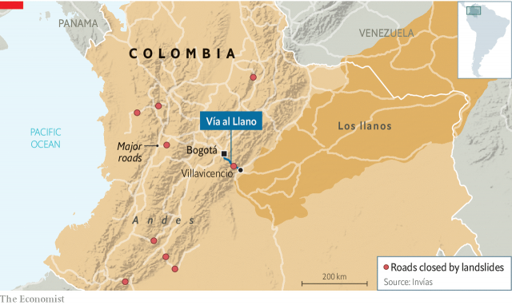

###### Lost llanos

# A blocked road cuts Colombia in two 

 

> print-edition iconPrint edition | The Americas | Jun 29th 2019 

VILLAVICENCIO, A SHABBY city of half a million people, considers itself the gateway to los llanos, Colombia’s eastern plains. Now and for the next few months few people will be passing through it. Mudslides since May have blocked the main highway, the Vía al Llano, which connects the city to Bogotá, Colombia’s capital, 86km (53 miles) away (see map). More rocks and mud threaten workers trying to unblock the road, along which two-thirds of domestically produced goods are transported. Colombia’s government says this could take up to three months. 

This has cut off from the rest of the country a region of 1.7m people which produces much of Colombia’s oil and food. Residents of Villavicencio and the surrounding plains are beginning to feel the consequences. Potatoes, garlic and eggs have become scarce in grocery stores. Shoppers hunt through produce bins to find the few tomatoes and carrots that have not rotted. More than 90% of hotel reservations in the plains region, newly popular with tourists, have been cancelled. Bistronomy, Villavicencio’s fanciest restaurant, ran out of Club Colombia, its most popular beer, on a recent evening. The politicians and landowners who dine there had to settle for Andina, a new brew. 

Goods can get through on two smaller toll roads, but these are not fully paved. Some farmers have sold their products at a loss to pay the cost of shipping to Bogotá, which has jumped by 40%. Rice growers fear they will lose their harvest in July, when about a sixth of the crop is picked. According to Villavicencio’s chamber of commerce, the blocked road is costing the region more than $15m a day. State governors are asking the national government to declare a state of economic emergency and suspend sales and income taxes. Prices might rise in Bogotá, too. 

Colombia is a road-builder’s nightmare. The Andes split into three ranges at the southern border. The mountains can climb to 4,000 metres (13,000 feet) from sea level in less than 100km. Colombia gets more rain than any other country in the world, which makes maintenance difficult. Currently 12 major roads are blocked by mudslides. In a ranking of 137 national road networks by the World Economic Forum, Colombia’s comes 110th. 

Short of cash, the government has given private firms concessions to build roads. Vía al Llano, among the earliest projects built under concession, has been accident-prone. Recently a crater opened up in Guayabetal, near the site of the biggest mudslide. Under the terms of the contract the government, not the concessionaire, is responsible for carrying out the work needed to prevent mudslides. It will now have to do that, expensively. 

To relieve los llanos’s isolation in the meantime, Satena, a state-owned airline, and EasyFly have announced more flights between Bogotá and Villavicencio. The government has suspended passenger fees on flights between the cities. Tolls on the two alternative roads will be halved. But what the plains need most is a road that can cope with Colombia’s treacherous, rain-soaked topography. That goes for much of the rest of the country.◼ 

-- 

 单词注释:

1.llano['lɑ:nәu]:n. 大草原 

2.Colombia[kә'læmbiә]:n. 哥伦比亚 

3.Jun[dʒʌn]:六月 

4.Villavicencio[]:[地名] 比亚维森西奥 ( 哥伦、古 ) 

5.gateway['geitwei]:n. 门, 通路 [计] 网关 

6.los[lɔ:s]:abbr. 月球轨道航天器（Lunar Orbiter Spacecraft）；视线（Line of Sight） 

7.mudslide['mʌdslaid]:[地](沿缓坡而下的)徐缓黏滞泥流, 泥流 

8.AL[]:[计] 算法语言, 字母, 汇编语言 [医] 铝(13号元素) 

9.llano['lɑ:nәu]:n. 大草原 

10.unblock['ʌn'blɔk]:[计] 解锁, 解块 [经] 解冻 

11.domestically[dәu'mestikli]:adv. 家庭式地, 国内地 

12.Villavicencio[]:[地名] 比亚维森西奥 ( 哥伦、古 ) 

13.shopper['ʃɒpә]:n. 购物者 [经] 顾客, 购物的人 

14.bin[bin]:n. (贮存谷物等的)容器, 箱子 [计] 二进制, 商业信息网 

15.bistronomy[]:[网络] 小酒馆美食 

16.landowner['lændәunә]:n. 地主 [法] 土地所有人, 地主 

17.andina[]:n. (Andina)人名；(西)安迪纳 

18.brew[bru:]:n. 酿造酒, 酝酿 v. 酿造, 酝酿 

19.toll[tәul]:n. 通行费, 代价, 钟声 vt. 征收, 敲钟, 鸣钟, 勾引, 引诱 vi. 征税, 鸣钟 

20.fully['fuli]:adv. 十分地, 完全地, 充分地 

21.grower['grәuә]:n. 栽培者, 生长物 

22.nightmare['naitmєә]:n. 梦魇, 恶梦, 可怕的事物(或情景、人物) [医] 梦魇, 恶梦 

23.Andes['ændi:z]:n. 安第斯山脉 

24.les[lei]:abbr. 发射脱离系统（Launch Escape System） 

25.currently['kʌrәntli]:adv. 现在, 当前, 一般, 普通 [计] 当前 

26.forum['fɒ:rәm]:n. 论坛, 公开讨论的广场, 法庭, 讨论会 [法] 讨论会, 专题讨论, 公共论坛 

27.concession[kәn'seʃәn]:n. 特许, 让步, 认可 [经] 核准, 许可, 特殊(权) 

28.crater['kreitә]:n. 火山口, 环行山, 弹坑 [化] 焊口; 火山石; 弧坑; 焰口 

29.concessionaire[kәn,seʃә'neә]:n. 让受人, 特许权所有人 [经] 让受人, 特许权所有人 

30.expensively[]:adv. 昂贵地；乱花钱地 

31.isolation[.aisә'leiʃәn]:n. 隔绝, 孤立, 隔离 [化] 分离; 生物分离 

32.halve[hɑ:v]:vt. 二等分, 对半分享, 把...减半 

33.treacherous['tretʃәrәs]:a. 不可信任的, 危险的, 背叛的, 不可靠的 [法] 奸诈的, 背叛的, 背信弃义的 

34.topography[tә'pɒgrәfi]:n. 地志, 地形学, 地势, 局部解剖学 [医] 局部解剖, 局部记载 

