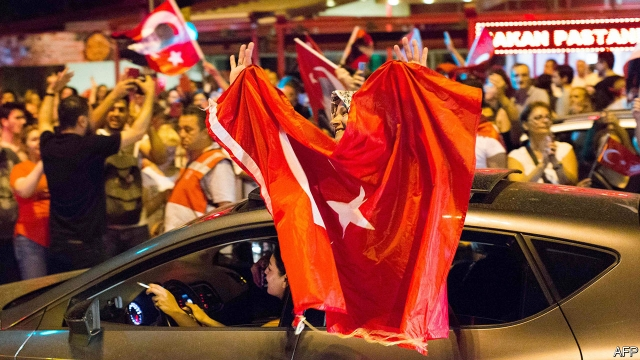
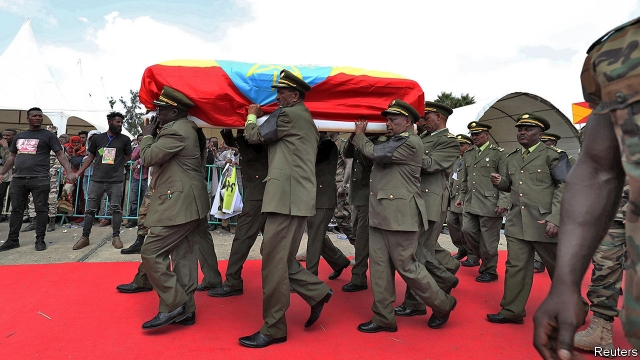

###### How to contain Iran

# Politics this week 

 

> Jun 29th 2019 

Turkey’s president, Recep Tayyip Erdogan, was humiliated by voters, as his attempt to reverse the mayoral election in Istanbul, which his party had lost, backfired spectacularly. At his behest, the electoral board ordered a re-run, but this week the opposition challenger, Ekrem Imamoglu, won by a much larger margin than in March: 54% to 45%. See article. 

After three weeks of talks that followed an election, Denmark’s Social Democrats won the backing of smaller parties on the left to form a minority government headed by Mette Frederiksen as prime minister. The smaller parties agreed to support Ms Frederiksen only after she promised to water down the hard-line policies on immigration that her party had touted during the election. 

Ukraine responded angrily to the decision of the Council of Europe, which is separate from the EU, to restore Russia’s voting rights. But supporters of the move said this would ensure that Russian citizens could lodge claims against their government at the European Court of Human Rights, a body of the council. 

Dozens of schools were closed in France; temperatures there and other European countries have soared above 40°C. 

Boris Johnson and Jeremy Hunt emerged as the final two in the race to lead Britain’s Conservative Party and thus become prime minister. Mr Johnson is the favourite, but his bumbling style seems odd at a time of crisis. In an effort to revive his stumbling campaign he declared that Britain must leave the EU on October 31st, “do or die”. That went down well with Tory party members. See article. 

Scattered protests, drawing as many as several thousand people, continued in Hong Kong over legislation that would allow the extradition of criminal suspects to mainland China. The government has shelved the bill, but protesters want it to be scrapped. See article. 

Hong Kong’s Supreme Court overturned the conviction of the territory’s former chief executive, Donald Tsang, for misconduct. His original sentence in 2017 was 20 months in prison. 

North Korean media reported that the country’s dictator, Kim Jong Un, had received an “excellent” letter from Donald Trump. In mid-June Mr Trump said that he had received a “beautiful” letter from Mr Kim. The exchange suggests that talks between the pair on nuclear disarmament are making progress again. 

The Australian Broadcasting Corporation said it would petition the courts to void a warrant that authorised the Australian police to raid its offices and seize documents related to a report it published in 2017 about abuses by Australian special forces in Afghanistan. 

Jared Kushner unveiled the first half of the White House’s peace plan for Israel and Palestine. It proposes $50bn worth of investment in Palestine and neighbouring countries, but offers no solutions to the underlying conflict (those are expected later). Neither the Israelis nor the Palestinians attended a conference in Bahrain showcasing the plan. See article. 

Mr Trump imposed new sanctions on Iran’s leadership. This came after he ordered and then called off air strikes on military installations in the country in response to Iran’s downing of an American spy drone. Ali Khamenei, Iran’s supreme leader, said the sanctions marked the “permanent closure of the path of diplomacy”. 

 

The chief of Ethiopia’s army and the president of the Amhara region were killed along with several other people in two incidents in what the government called an attempted coup. The government blamed the head of security in Amhara for the attacks. He was subsequently killed by the army. See article. 

Zimbabwe reintroduced its currency, the Zimbabwe dollar, amid a deepening economic crisis. It had abandoned the notes in 2009 after their value was destroyed by hyperinflation and instead adopted American dollars. The finance minister said the move would give the central bank more flexibility. 

Robert Mueller agreed to testify at an open session to Congress on July 17th. Evidence from the man who investigated Russian influence in the Trump campaign will make it the most eagerly awaited congressional hearing in years. 

Republicans in Oregon’s state Senate refused to show up for work, thus denying a quorum for a vote on a bill that would introduce a carbon cap-and-trade system. The Democratic governor asked state troopers to find the absconders. 

A photograph of a father from Guatemala and his 23-month-old daughter who both drowned trying to cross the Rio Grande intensified America’s debate on illegal immigration. Reports also emerged of 300 children being held in squalid conditions at a border station. The House of Representatives and the Senate passed competing packages on aid for the border to cope with the surge of migrants. 

Mexico sent 15,000 troops to its border with the United States. It is the largest deployment to control migration that Mexico has ever undertaken. Donald Trump has demanded that Mexico do more to stop illegal immigration, mainly by Central Americans, or face export tariffs. Mexico had already sent 2,000 national guardsmen to help police its southern border. 

At least three people were killed in protests against Honduras’s president, Juan Orlando Hernández. Doctors and teachers are demonstrating against plans to restructure the ministries of education and health, which they say will lead to privatisation. 

Authorities in Spain arrested a Brazilian sergeant who flew in on a presidential plane carrying 39kg of cocaine. The aircraft was on its way to the G20 summit in Japan. Brazil’s president, Jair Bolsonaro, who was travelling on another aircraft, normally extols the armed forces. In this case he demanded “severe punishment” for the smuggler. 

-- 

 单词注释:

1.Iran[i'rɑ:n]:n. 伊朗 

2.politic['pɒlitik]:a. 精明的, 明智的, 策略的 

3.Jun[dʒʌn]:六月 

4.recep[]:n. (Recep)人名；(土)雷杰普 

5.tayyip[]:[网络] 塔伊普 

6.erdogan[]:[网络] 埃尔多安；土耳其总理埃尔多安；艾尔多安 

7.humiliate[hju:'milieit]:vt. 使丢脸, 使蒙羞, 屈辱 

8.voter['vәutә]:n. 选民, 投票人 [法] 选民, 选举人, 投票人 

9.mayoral['mєәrәl]:a. 市长的 

10.Istanbul[.istæn'bu:l]:n. 伊斯坦布尔 

11.backfire[.bæk'faiә]:n. 逆火, 回火, 放火 vi. 放逆火, 预先放火, 发生意外 

12.spectacularly[]:adv. 引人注目地；壮观地 

13.behest[bi'hest]:n. 命令 

14.electoral[i'lektәrәl]:a. 选举人的, 选举的, (有关)选举的 [法] 选举的, 选举人的, 由选举人组成的 

15.opposition[.ɒpә'ziʃәn]:n. 反对, 敌对, 相反, 在野党 [医] 对生, 对向, 反抗, 反对症 

16.challenger['tʃælindʒә]:n. 挑战者 [经] 申请回避的人 

17.ekrem[]:n. (Ekrem)人名；(芬、土、塞)埃克雷姆 

18.democrat['demәkræt]:n. 民主人士, 民主主义者, 民主党党员 [经] 民主党 

19.mette[]:n. (Mette)人名；(中非)梅泰；(德、俄、意、芬、捷、丹)梅特 

20.frederiksen[]:[网络] 弗雷泽里克森 

21.tout[taut]:vi. 招徕顾客, 兜售物品 vt. 招徕, 刺探...情报 n. 兜售者, 侦查者 

22.ukraine[ju(:)'krein]:n. 乌克兰（原苏联一加盟共和国, 现已独立） 

23.angrily['æŋgrili]:adv. 愤怒地 

24.EU[]:[化] 富集铀; 浓缩铀 [医] 铕(63号元素) 

25.supporter[sә'pɒ:tә]:n. 支持者, 后盾, 迫随者, 护身织物 [法] 支持者, 赡养者, 抚养者 

26.soar[sɒ:]:n. 高扬, 翱翔 vi. 往上飞舞, 高耸, 翱翔 

27.boris['bɔris]:n. 鲍里斯（男子名） 

28.johnson['dʒɔnsn]:n. 约翰逊（姓氏） 

29.jeremy['dʒerimi]:n. 杰里米（男子名） 

30.bumble['bʌmbl]:vi. 结结巴巴地说, 犯大错, 踉跄, 跌倒 

31.revive[ri'vaiv]:vt. 使苏醒, 使复兴, 使振奋, 回想起, 重播 vi. 苏醒, 复活, 复兴, 恢复精神 

32.Tory['tɒ:ri]:n. 托利党党员, 保守党员, 亲英分子 a. 保守分子的 

33.hong[hɔŋ]:n. （中国、日本的）行, 商行 

34.kong[kɔŋ]:n. 含锡砾石下的无矿基岩；钢 

35.extradition[.ekstrә'diʃәn]:n. 引渡逃犯, 亡命者送还本国 [法] 引渡 

36.shelve[ʃelv]:vt. 放置架子上, 搁置 vi. 渐渐倾斜 

37.protester[]:n. 抗议者, 持异议者, 拒付者 [经] 反对者 

38.scrap[skræp]:n. 碎片, 残余物, 些微, 片断, 铁屑, 吵架 vt. 扔弃, 敲碎, 拆毁 vi. 互相殴打 a. 零碎拼凑成的, 废弃的 

39.overturn[.әuvә'tә:n]:n. 倾覆, 破灭, 革命 vt. 推翻, 颠倒 vi. 翻倒 

40.conviction[kәn'vikʃәn]:n. 定罪, 信服, 坚信 [法] 定罪, 证明有罪, 判罪 

41.tsang[]:n. 曾（姓氏）；后藏 

42.misconduct[.mis'kɒndʌkt]:vt. 办错, 使行为不端 n. 办错, 渎职, 通奸 

43.Korean[kә'riәn]:n. 朝鲜人, 朝鲜语 a. 朝鲜人的, 朝鲜语的 

44.dictator['dikteitә]:n. 命令者, 独裁者 

45.kim[]:n. 金姆（人名） 

46.jong[jɔŋ]:n. 小伙子；（旧时的）青年男奴 

47.UN[ʌn]:pron. 家伙, 东西 [经] 联合国 

48.disarmament[dis'ɑ:mәmәnt]:n. 裁军 [法] 裁军, 解除军备 

49.petition[pi'tiʃәn]:n. 请愿, 诉状, 陈情书, 申请, 祈求, 祷文 v. 正式请求, 恳求, 请愿 

50.void[vɒid]:n. 空虚, 空间, 空白, 空隙, 空虚感 a. 空的, 无效的, 无人的, 没有的, 无用的 [计] 脱墨; 空白点 

51.warrant['wɒ:rәnt]:n. 授权, 正当理由, 根据, 证明, 批准, 凭证, 令状, 委任状 vt. 授权给, 保证, 担保, 批准, 使有正当理由 

52.authorise['ɔ:θәraiz]:vt. 授权；批准；允许；委任（等于authorize） 

53.Afghanistan[æf'gænistæn]:n. 阿富汗 

54.jare[]:abbr. Japanese Antarctic Research Expedition 日本南极科学考察队 

55.kushner[]: [人名] 库什纳 

56.unveil[.ʌn'veil]:vt. 揭开, 揭幕, 除去...的面纱 vi. 显露, 除去面纱 

57.Israel['izreil]:n. 以色列, 以色列后裔, 犹太人 

58.Palestine['pælәstain]:n. 巴勒斯坦 

59.underlie[.ʌndә'lai]:vt. 位于...之下, 成为...的基础 

60.Israeli[iz'reili]:a. 以色列的, 以色列人(语)的 n. 以色列人 

61.Palestinian[,pælis'tiniәn]:[经] 巴勒斯坦的 

62.Bahrain[]:n. 巴林岛 

63.showcase['ʃәukeis]:n. 陈列橱 [经] 商品陈列所, 货物陈列架 

64.sanction['sæŋkʃәn]:n. 核准, 制裁, 处罚, 约束力 vt. 制定制裁规则, 认可, 核准, 同意 

65.drone[drәun]:n. 雄蜂, 懒惰者, 嗡嗡的声音, 无人驾驶飞机(或船) vi. 嗡嗡作声, 混日子 vt. 低沉地说 

66.ALI[]:[计] 异步线路接口 

67.Khamenei[]:n. (Khamenei)人名；(伊朗)哈梅内伊 

68.closure['klәuʒә]:n. 关闭 vt. 使终止 

69.diplomacy[di'plәumәsi]:n. 外交, 外交手腕, 交际手段 [法] 外交, 外交手腕, 权谋 

70.Amhara[ɑ:m'hɑ:rɑ:]:阿姆哈拉(埃塞俄比亚 一地区) 

71.coup['ku:]:n. 砰然的一击, 妙计, 出乎意料的行动, 政变 [医] 发作, 中, 击 

72.subsequently['sʌbsikwәntli]:adv. 后来, 随后 

73.Zimbabwe[zim'bɑ:bwei]:n. 津巴布韦 

74.reintroduce[ri:intrә'dju:s]:vt. 再引进, 再介绍 

75.amid[ә'mid]:prep. 在其间, 在其中 [经] 在...中 

76.hyperinflation[,haipәrin'fleiʃәn]:n. 恶性通货膨胀 

77.flexibility[.fleksi'biliti]:n. 弹性, 适应性 [计] 灵活性; 适应性 

78.Robert['rɔbәt]:[法] 警察 

79.Mueller[]:米勒（人名） 

80.testify['testifai]:v. 证明, 作证, 声明, 表明 

81.eagerly[]:adv. 渴望, 热衷于, 热切 

82.congressional[kәn'greʃәnl]:a. 会议的, 议会的, 国会的 [法] 代表大会的, 大会的, 议会的 

83.quorum['kwɒ:rәm]:n. 法定人数, 挑选出的一组人 [经] 法定决议票数, 法定人数 

84.trooper['tru:pә]:n. 骑兵, 骑警, 伞兵 

85.absconder[]:[法] 潜逃者, 逃亡者 

86.Guatemala[.gwɑ:tә'mɑ:lә]:n. 危地马拉 

87.rio[]:n. 里约（巴西共和国的旧首都） 

88.grande[^rɑ:nd]:a. 重大的, 显要的 

89.intensify[in'tensifai]:vt. 加强 vi. 强化 

90.squalid['skwɒlid]:a. 污秽的, 肮脏的, 悲惨的, 可怜的, 卑劣的 

91.surge[sә:dʒ]:n. 巨涌, 汹涌, 澎湃 vi. 汹涌, 澎湃, 颠簸, 猛冲, 突然放松 vt. 使汹涌奔腾, 急放 [计] 电压尖峰 

92.migrant['maigrәnt]:n. 候鸟, 移居者 [法] 移居者 

93.deployment[]:[计] 展开 

94.migration[mai'greiʃәn]:n. 移民, 移往, 移动 [计] 迁移 

95.tariff['tærif]:n. 关税, 关税表, 价格表, 收费表 vt. 课以关税 [计] 价目表 

96.guardsman['gɑ:dzmәn]:n. 卫兵, (英)近卫兵, (美)国民警卫队士兵 

97.juan[hwɑ:n]:n. 胡安（男子名） 

98.orlando[ɔ:'lændәu]:n. 奥兰多（美国城市名, 男子名） 

99.restructure[ri:'strʌktʃә]:vt. 更改结构, 重建, 调整 

100.privatisation[ˌpraɪvətaɪ'zeɪʃən]:n. 私有化, 非国营化（将国营企业转为民营） 

101.Spain[spein]:n. 西班牙 

102.Brazilian[brә'ziljәn]:n. 巴西人 a. 巴西的, 巴西人的 

103.sergeant['sɑ:dʒәnt]:n. 警察小队长, 军士 

104.presidential[.prezi'denʃәl]:a. 总统制的, 总统的, 首长的, 统辖的 [法] 总统的, 议长的, 总经理的 

105.cocaine[kә'kein]:n. 可卡因, 古柯碱 [化] 可卡因; 古柯碱 

106.jair[]:[网络] 睚珥；贾伊尔；睢珥 

107.extol[ik'stәul]:vt. 颂扬, 称赞, 吹捧 

108.smuggler['smʌglә]:n. 走私者, 走私船 [经] 走私者, 走私船 

