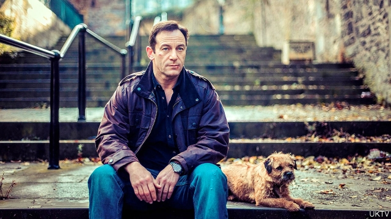

###### Seaside rock

# Jackson Brodie returns in “Big Sky” 

 

> print-edition iconPrint edition | Books and arts | Jul 6th 2019 

Big Sky. By Kate Atkinson. Little, Brown; 400 pages; $28. Doubleday; £20. 

SINCE HER previous book featuring Jackson Brodie was published in 2010, Kate Atkinson’s irascible detective has appeared in his own television series, “Case Histories” (starring Jason Isaacs, pictured above); his creator has published a series of acclaimed but unrelated novels. Now, in “Big Sky”, the fifth Brodie mystery, Ms Atkinson moves the scene of her crimes from Leeds to the picturesque Yorkshire coast. Cold cases are reopened, and characters from Brodie’s past (and the earlier books) reappear, bent either on villainy or on avenging some terrible wrong. 

Ms Atkinson has been on the trail of lost children (particularly girls) since her very first novel, “Behind the Scenes at the Museum”, published in 1995. “Big Sky” duly features a sex-trafficking and paedophile ring set up by a grim trio who refer to themselves as the Three Musketeers. Posing as a recruitment agency for the British hospitality sector, they lure in young women from eastern Europe to the Philippines with the promise of lucrative hotel jobs, only to imprison them in Silver Birches, a hideaway from hell, where they are forcibly injected with drugs before being sold on. 

In the depiction of this despicable business, as in all Ms Atkinson’s fiction, she supplies gruesome discoveries and a strong helping of violence, all nevertheless relayed with a deft and witty touch. Her Brodie novels recall a line from “The Importance of Being Earnest”: “The good end happily, the bad unhappily. That is what Fiction means.” A literary champion of justice, she lines up a colourful cast of unlikely good guys: glamorous Crystal, the kind-hearted, secretly traumatised second wife of a shady millionaire businessman; Vince, the down-on-his-luck golfing partner of the Three Musketeers, whose life declines from bad to worse; Reggie, a returnee from previous yarns who has grown up into a literature-quoting copper; and Bunny Hopps, an elderly drag artist ensconced for the summer season at a local theatre. 

Last, there is Brodie himself, who is now to be found working uninspiring cases as a private detective, while awkwardly spending time with his adolescent son. For their part, the bad guys run a gamut from hapless to pure evil. They include Barclay Jack, an ageing stand-up comedian, and whoever it was who bludgeoned Vince’s highly dislikeable estranged wife. 

“Big Sky” has all the sizzle of a British fry-up; Ms Atkinson’s evocation of the beauty and desolation of faded seaside resorts is unerring. As in the other Brodie novels, several stories are woven into a seamless plot, with the help of credible-seeming twists of fate. And there is just enough unfinished business to leave readers impatient for his next outing. ◼ 
<<<<<<< HEAD

-- 

 单词注释:

1.jackson['dʒæksn]:n. 杰克逊（男子名）；杰克逊（美国密西西比州的城市） 

2.Brodie['brәudi]:失败, 倒下 

3.Jul[]:七月 

4.kate[keit]:n. 凯特（女子名, 等于Catherine） 

5.Atkinson[]:n. 阿特金森（姓氏） 

6.Doubleday[]:道布尔迪 

7.irascible[i'ræsәbl]:a. 易怒的, 暴躁的 

8.sery[]:n. (Sery)人名；(俄)谢雷；(科特)塞里 

9.jason[]:n. 詹森（男子名） 

10.isaac['aizәk]:n. 艾萨克（男人名）；以撒（希伯来族长, 犹太人的始祖亚伯拉罕和萨拉的儿子） 

11.Creator[kri:'eitә(r)]:n. 上帝, 创造者, 创作者 

12.acclaim[ә'kleim]:n. 喝彩, 欢呼, 赞同 v. 欢呼, 喝彩, 称赞 

13.unrelated[]:[法] 无关的 

14.LEED[]:[化] 低能电子衍射 

15.picturesque[.piktʃә'resk]:a. 生动的, 如画的, 独特的, 别致的, 栩栩如生的 

16.Yorkshire['jɔ:kʃә]:n. 约克郡, 约克王朝 

17.reopen[.ri:'әupәn]:v. 重开, 再开始, 再开 

18.reappear[.ri:ә'piә]:vi. 再出现 

19.villainy['vilәni]:n. 坏事, 恶行, 罪恶 [法] 卑鄙, 丑恶, 邪恶 

20.avenging[ә'vendʒiŋ]:a. 复仇的 

21.duly['dju:li]:adv. 恰当地, 充分地, 适当地, 及时地 

22.paedophile[ˈpi:dəʊfaɪl]:n. 恋童癖者 

23.grim[grim]:a. 冷酷的, 坚强的, 残忍的, 可怕的, 讨厌的 

24.trio['tri:әu]:n. 三重唱 

25.musketeer[.mʌski'tiә]:n. 火枪车, 步兵 

26.recruitment[ri'kru:tmәnt]:n. 新兵征召 [医] 募集[反应], 募集[现象](生理), 复聪(耳科) 

27.hospitality[.hɒspi'tæliti]:n. 款待, 亲切, 殷勤 

28.sector['sektә]:n. 扇形, 部门, 部分, 函数尺, 象限仪, 段, 区段 vt. 把...分成扇形 [计] 扇面; 扇区; 段; 区段 

29.lure[luә]:n. 饵, 诱惑 vt. 引诱, 诱惑 

30.Philippine['filipi:n]:a. 菲律宾(群岛)的, 菲律宾人的 

31.lucrative['lu:krәtiv]:a. 有利益的, 获利的, 合算的 

32.birch[bә:tʃ]:n. 桦树, 桦木, 桦条 [医] 桦 

33.hideaway['haidә.wei]:n. 隐匿处, 潜伏处, 退隐处 

34.forcibly['fɒ:sәbli]:adv. 强制地, 用力地 

35.inject[in'dʒekt]:vt. 注射, 注入, 使入轨 [医] 注射 

36.depiction[di'pikʃәn]:n. 描写, 叙述 

37.despicable['despikәbl]:a. 可鄙的, 卑劣的 

38.gruesome['gru:sәm]:a. 可怕的, 令人毛骨悚然的, 阴森的 

39.deft[deft]:a. 敏捷熟练的, 灵巧的 

40.witty['witi]:a. 富于机智的, 诙谐的 

41.unhappily[.ʌn'hæpili]:adv. 不幸福地, 不幸地 

42.colourful['kʌlәful]:a. 颜色丰富的, 鲜艳的, 艳丽的, 多色的, 丰富多彩的, 吸引人的, 引人入胜的 [计] 有色的 

43.glamorous['glæmәrәs]:a. 富有魅力的, 迷人的 

44.secretly['si:kritli]:adv. 秘密地, 背地里 

45.traumatise['trɒmeˌtaɪz]:vt. 使受精神创伤; 使受外伤 

46.vince[vins]:n. 文斯（男子名, Vincent的昵称） 

47.golfing[ˈgɒlfɪŋ]:n. 打高尔夫球 vi. 打高尔夫球(golf的ing形式) 

48.Reggie[]:n. 雷吉（男子名） 

49.returnee[ri.tә:'ni:]:n. 回国人员, 返回者 

50.yarn[jɑ:n]:n. 纱, 纱线, 故事 [化] 纱 

51.bunny['bʌni]:n. 兔子 

52.hopp[]: [医][=hepatic occluded portal pressure]肝闭塞性门脉压, 肝门脉阻断压 

53.ensconce[in'skɒns]:vt. 安顿下来, 安置, 使隐藏 

54.uninspiring[ˌʌnɪnˈspaɪərɪŋ]:a. 引不起兴趣的, 无鼓舞作用的, 无指望的 

55.awkwardly[]:adv. 笨拙地；无技巧地 

56.gamut['gæmәt]:n. 音阶, 整个范围, 全部, 音域 

57.hapless['hæplis]:a. 倒霉的, 不幸的 

58.barclay['bɑ:kli]:n. 巴克利（姓氏, 男子名） 

59.jack[dʒæk]:n. 插座, 千斤顶, 男人 vt. 抬起, 提醒, 扛举, 增加, 提高, 放弃 a. 雄的 [计] 插座 

60.comedian[kә'mi:djәn]:n. 喜剧演员 

61.bludgeon['blʌdʒәn]:n. 大头棒 [法] 棍, 棍打 

62.dislikeable[dis'laikәbl]:a. 可厌的,可憎的,使人厌恶的 

63.estrange[i'streindʒ]:vt. 使疏远, 离间, 使离开 

64.sizzle['sizl]:vi. 发出嘶嘶声 vt. 烧灼 n. 咝咝声 

65.evocation[.evә'keiʃәn]:n. 唤出, 招魂, 唤起 [医] 启发作用(唤起形态形成的潜势力) 

66.desolation[desә'leiʃәn]:n. 荒芜, 荒废, 荒凉 

67.unerring[.ʌn'ә:riŋ]:a. 不犯错误的, 无过失的, 没有打歪的 [法] 无过失的, 无错误的, 正确的 

68.seamless['si:mlis]:a. 无缝的, 无缝合线的 [医] 无缝的 

69.unfinished[.ʌn'finiʃt]:a. 未完成的 
=======
>>>>>>> 50f1fbac684ef65c788c2c3b1cb359dd2a904378

