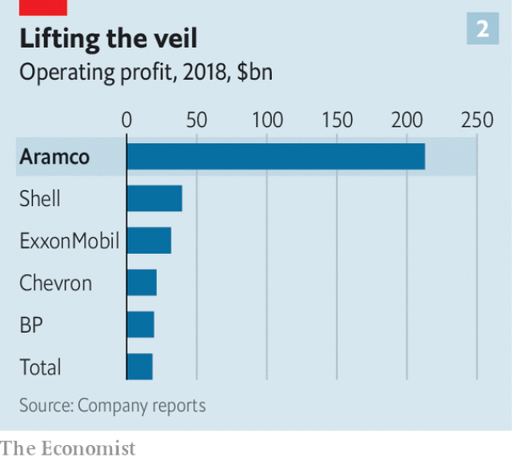

###### Saudi Aramco

# The world’s biggest potential IPO may be on again 

 

> print-edition iconPrint edition | Business | Jul 6th 2019 

BETWEEN THE end of Ramadan in early June and the start of the scorching summer holidays, a window for dealmaking has opened in Saudi Arabia. Swarming through it are some big-hitting investment bankers. They are hoping for a second chance to play a role in a potentially historic initial public offering (IPO): that of Saudi Aramco, the world’s biggest oil company. 

So far, the Aramco IPO has been more mirage than money-spinner. Muhammad bin Salman, the crown prince, announced it with fanfare (and scant forethought) in 2016, hoping for a $2trn valuation that would dwarf any other public company on the planet. Last year the process ran into the ground, amid differences between Prince Muhammad, Aramco and its legal advisers about whether the main listing should be in New York, London or elsewhere, and whether the $2trn was remotely achievable. The killing of Jamal Khashoggi, a Saudi journalist, in the kingdom’s consulate in Istanbul in October cast an even darker cloud over its prospects. 

Yet recently three things have changed the mood, and momentum to list Aramco as early as next year is picking up, say advisers. The first is Aramco’s so far successful $70bn acquisition of 70% of Sabic, the kingdom’s biggest petrochemical company. This needs to be approved by global antitrust regulators before a listing can take place, but that is considered a fairly safe bet. The acquisition is set to make Aramco the world’s biggest downstream producer of refined products and chemicals, as well as the biggest upstream firm. 

 

Second, Aramco’s first international bond offering in April attracted orders of $100bn for a $12bn issue, a staggering vote of confidence despite Khashoggi’s murder. Yields trade roughly in tandem with international oil majors (see chart 1), auguring well for further exposure to the capital markets. The offering was accompanied by Aramco’s first disclosures of drilling costs and profits that put the company in a league of its own (see chart 2). The experience is said to have reassured sceptics in the kingdom that it is safe to open the crown jewel to outsiders. 

 

Third, Aramco is building on that openness by promising to hold its first earnings call in August. This could be good preparation for the interaction with investors that would be required of a listed company. 

High hurdles remain. Aramco’s lawyers are against listing it in New York for fear district attorneys will hound it over allegations that the kingdom provided support to the perpetrators of the September 11th 2001 terrorist attacks. Though the London Stock Exchange has courted Aramco assiduously, the City is becoming more ambivalent about oil and gas investments for environmental reasons. Saudi Arabia’s Tadawul exchange is too small to handle potential stock trades of trillions of dollars. Ultimately the whereabouts of the listing may be a geopolitical call. If President Donald Trump cajoles Prince Muhammad into listing in New York, he may oblige. But the valuation remains in the lap of the gods. ◼ 

-- 

 单词注释:

1.saudi['sajdi]:a. 沙乌地阿拉伯（人或语）的 

2.aramco[]:abbr. 沙特阿美石油公司（Arabian-American Oil Company） 

3.ipo[]:abbr. 首次公开募股（Initial Public Offerings）；初次公开发行（Initial Public Offering） 

4.Jul[]:七月 

5.Ramadan[,ræmә'dɑ:n]:n. 斋戒月 

6.scorch[skɒ:tʃ]:n. 烧焦, 枯萎 v. 烧焦, 拷焦, (使)枯萎, 讽刺 

7.dealmaking[]:[网络] 交易；交易促成；交易撮合 

8.Arabia[ә'reibiә]:n. 阿拉伯半岛 

9.banker['bæŋkә]:n. 银行家, 庄家 [经] 银行业者, 银行家 

10.potentially[pә'tenʃәli]:adv. 可能地, 潜在地 

11.historic[hi'stɒrik]:a. 历史上著名的, 有历史性的 

12.mirage['mirɑ:ʒ]:n. 海市蜃楼, 幻景, 妄想 

13.muhammad[]:n. 穆罕默德 

14.bin[bin]:n. (贮存谷物等的)容器, 箱子 [计] 二进制, 商业信息网 

15.Salman[]:n. 萨尔曼（男子名） 

16.fanfare['fænfєә]:n. 喇叭边(或号角)嘹亮吹奏声, 吹牛 

17.scant[skænt]:a. 不充分的, 不足的 vt. 减少, 吝啬, 限制, 藐视, 忽略 

18.forethought['fɒ:θɒ:t]:n. 事先的考虑, 事先的筹划, 深虑, 先见 [法] 预谋 

19.valuation[.vælju'eiʃәn]:n. 评价, 估价, 价值判断 [经] 估价, 计价, 评价 

20.dwarf[dwɒ:f]:n. 矮子, 侏儒 v. (使)变矮小 

21.amid[ә'mid]:prep. 在其间, 在其中 [经] 在...中 

22.adviser[әd'vaizә]:n. 顾问, 劝告者, 指导教师 [法] 顾问, 劝告者 

23.york[jɔ:k]:n. 约克郡；约克王朝 

24.remotely[]:adv. 极小地, 极细微地 

25.achievable[ә'tʃi:vәbl]:a. 做得成的, 可完成的, 可有成就的 

26.Jamal[]:n. 贾马尔（男子名） 

27.khashoggi[]:卡舒吉 

28.consulate['kɒnsjulit]:n. 领事, 领事任期, 领事馆 [经] 领事馆 

29.Istanbul[.istæn'bu:l]:n. 伊斯坦布尔 

30.momentum[mәu'mentәm]:n. 动力, 动量 [化] 动量 

31.SABIC[]:[网络] 沙特基础工业公司(Saudi Basic Industries Corporation)；沙特基础工业(Saudi Basic Industries Corp)；沙特阿拉伯 

32.petrochemical[.petrәu'kemikәl]:a. 石化的, 石化制品的, 岩石化学的 n. 石化产品 

33.antitrust[.ænti'trʌst]:a. 反托拉斯的 [法] 反托拉斯的 

34.regulator['regjuleitә]:n. 调整者, 校准者, 校准器, 调整器, 标准钟 [化] 调节剂; 调节器 

35.downstream['daun'stri:m]:adv. 下游地 a. 下游的 

36.producer[prә'dju:sә]:n. 生产者, 制作者, 制作人 [化] 发生器; (炉煤气)发生炉; 制气炉; 生产者 

37.upstream['ʌp'stri:m]:adv. 向上游, 逆流地 a. 向上游的, 逆流而上的 

38.stagger['stægә]:n. 蹒跚, 踌躇 vi. 蹒跚, 犹豫 vt. 使摇摆, 使踌躇, 交错, 错开 a. 交错的, 错开的 

39.tandem['tændәm]:adv. 一前一后地, 纵排地 a. 纵排的, 串联的 n. 纵列两匹马拉的马车, 前后纵列的两匹马, 串座双人自行车 

40.augure[]:[网络] 占卜鸟 

41.disclosure[dis'klәuʒә]:n. 揭发, 泄露, 揭发(或暴露)的事实 [经] 揭示, 披露 

42.reassure[.ri:ә'ʃuә]:vt. 使...安心, 向...再保证 [法] 重新保证, 再保险, 使清除疑虑 

43.sceptic['skeptik]:n. 怀疑论者 

44.outsider[' aut'saidә]:n. 外人, 局外人, 非会员, 外行, 门外汉, 比赛中获胜可能性不大的选手 [经] 外船公司 

45.openness['әupәnnis]:n. 公开；宽阔；率真 

46.earning['ә:niŋ]:n. 收入（earn的现在分词） 

47.investor[in'vestә]:n. 投资者 [经] 投资者 

48.hurdle['hә:dl]:n. 障碍, 跳栏, 临时活动篱笆 vt. 用篱笆围, 越过, 克服 

49.attorney[ә'tә:ni]:n. 代理人, 律师 [经] 律师, 代理人 

50.hound[haund]:n. 猎犬 vt. 带猎犬狩猎, 追捕, 激励, 使追逐 

51.allegation[.æli'geiʃәn]:n. 断言, 主张, 申辩 [法] 声明, 事实陈述, 断言 

52.perpetrator[]:n. 作恶者, 犯罪者, 行凶者 [法] 作恶者, 行凶者, 犯罪者 

53.terrorist['terәrist]:n. 恐怖分子 [法] 恐怖份子, 恐怖主义 

54.assiduously[ə'sidʒuəsli]:adv. 刻苦地；勤勉地 

55.ambivalent[æm'bivәlәnt]:a. 矛盾的, 模棱两可的 [医] 矛盾情绪的 

56.environmental[in.vaiәrәn'mentәl]:a. 周围的, 环境的 [经] 环境的, 环保的 

57.trillion['triljәn]:n. 大量 [经] 兆 

58.whereabout['hwεәrә.baut]:n. 行踪；下落 

59.geopolitical[,dʒi(:)әupә'litikәl]:[计] 地理的 

60.cajole[kә'dʒәul]:vt. 以甜言蜜语哄骗, 勾引 

