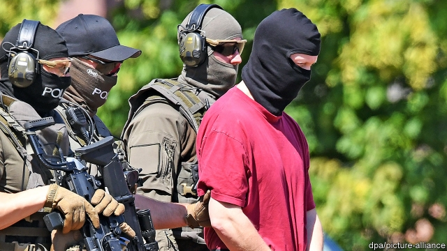

###### Xenophobic extremism

# German soul-searching after the murder of a champion of refugees 

 

> print-edition iconPrint edition | Europe | Jul 6th 2019 

FOR THE first time since the days of the Weimar Republic a German politician has been murdered by a xenophobic extremist. In June 1922 a group of anti-Semitic right-wingers appalled the German establishment by assassinating Walther Rathenau, the foreign minister, in his car on the streets of Berlin. This year, on June 2nd, Stephan Ernst, a neo-Nazi from Kassel with a history of violence against immigrants, allegedly shot Walter Lübcke, the Kassel district president, in the head outside his house in Wolfhagen, in central Germany. Mr Ernst confessed in detail at the end of June. On July 2nd he is said to have retracted his confession. 

The crime has shocked Germany more than any of the 195 murders by right-wing extremists since reunification because the victim was a representative of the state. “Never in our republic’s 70 years has democracy been challenged from the right as it is nowadays,” said Armin Laschet, the state premier of North Rhine-Westphalia, who, like Mr Lübcke, is a member of Chancellor Angela Merkel’s Christian Democratic Union (CDU) and supports her refugee policies. On Thursday June 27th more than 10,000 people took to the streets of Kassel to march against right-wing violence. 

Seventy-four years after Hitler’s death, many Germans are haunted by the spectre of resurgent neo-Nazi violence and wonder whether enough is being done to fight it. Thomas Haldenwang, head of the federal office for the protection of the constitution, responsible for Germany’s domestic security, admitted that his agency has yet to expunge the threat of right-wing extremism. Frank-Walter Steinmeier, the president, said it was shameful that Germany could not protect Mr Lübcke. 

Not enough is done to try to deradicalise neo-Nazis, says Dierk Bostel of Dortmund University, an expert on the extreme right. The police, the federal prosecutor’s office and Mr Haldenwang’s agency are being urged to work more closely together. More, it is said, must be done to monitor neo-Nazi networks and hate speech on the web. Mr Ernst, an aficionado of online Nazi propaganda, should have been closely watched ever since he nearly killed an immigrant in a train-station toilet in 1992. 

Far-right extremism surged during the refugee crisis in 2015 and has not come down. One manifestation is the rising popularity of the Alternative for Germany (AfD), which started as a Eurosceptic protest party in 2013 but has turned into a hard-right outfit akin to Austria’s Freedom Party. “The AfD are enablers of right-wing terror,” says Hajo Funke, a specialist in xenophobic extremism at the Free University of Berlin. The party’s radical wing has got the upper hand. Even though the AfD talks about expelling extremists such as Björn Höcke or Andreas Kalbitz, its ultranationalist leaders in Thuringia and Brandenburg, it has never actually kicked anyone out. 

The AfD’s reaction to the Lübcke tragedy seemed to confirm the party’s reputation. In Bavaria’s parliament, an AfD politician refused to stand for a minute’s silence in Mr Lübcke’s honour. Wolfgang Gedeon, an AfD deputy in Baden-Württemberg’s state parliament, belittled far-right terrorism as “birdshit” compared with the threat posed by the far left and radical Islamists. 

This was too much for Annegret Kramp-Karrenbauer, the CDU party leader, who said any politician hoping that her party might join a coalition government with the AfD in the future “should close their eyes and think of Walter Lübcke”. Her resolve will be tested in the autumn, when Saxony, Brandenburg and Thuringia vote in state elections. Polls show the AfD tied for first place in the first two and being supported by around 20% in Thuringia. ◼ 
<<<<<<< HEAD

-- 

 单词注释:

1.xenophobic[,zenәj'fәjbik,,zi:-]:a. 畏惧和憎恨外国人的 [法] 仇外的, 恐惧外国人的 

2.extremism[ik'stri:mizm]:n. 极端倾向, 极端论, 过激主义 

3.refugee[.refju'dʒi:]:n. 难民, 流亡者 [法] 避难者, 流亡者, 难民 

4.Jul[]:七月 

5.Weimar['vaimɑ:]:魏玛 

6.xenophobic[,zenәj'fәjbik,,zi:-]:a. 畏惧和憎恨外国人的 [法] 仇外的, 恐惧外国人的 

7.extremist[iks'tri:mist]:[经] 偏激份子 

8.appall[ә'pɒ:l]:vt. 使丧胆, 使惊骇 

9.assassinate[ә'sæsineit]:vt. 暗杀, 行刺 [法] 暗杀, 行刺, 中伤 

10.walther['vɑ:ltə]:n. 沃尔特（男子名） 

11.rathenau[]:[网络] 拉特瑙；拉兹诺；拉特那 

12.Berlin[bә:'lin]:n. 柏林, (软质)柏林毛线 

13.Stephan[]:n. 斯蒂芬（男子名） 

14.Ernst[ɛrnst]:n. 恩斯特（人名）；艾伦斯特（人名） 

15.Kassel['kæsәl, 'kɑ:s-]:卡塞尔[德意志联邦共和国东部城市] 

16.allegedly[ә'ledʒidli]:adv. 依其申述 

17.Walter['wɔ:ltә(r)]:n. 沃尔特（男子名） 

18.Wolfhagen[]:[地名] 沃尔夫哈根 ( 德 ) 

19.retract[ri'trækt]:v. 缩回, 收回, 取消, 撤消 

20.confession[kәn'feʃәn]:n. 承认, 坦白, 招供 [法] 自白, 招供, 自认有罪 

21.reunification[,ri:ju:nifi'keiʃәn,ri:,ju:-]:n. 使重新统一, 使重新团结 

22.armin['ɑ:min]:[医] 阿明, 乙基磷酸对硝基苯乙酯(缩瞳及治青光眼药) 

23.chancellor['tʃɑ:nsәlә]:n. 大臣, 总理, 首相, 大使馆/领事馆的一等秘书, 司法官, 大学校长 

24.angela['ændʒilә]:n. 安吉拉（女子名） 

25.CDU[]:abbr. 中央显示器（Central Display Unit）；海防搜索潜艇雷达（Coast Defense radar for detecting U-boats） 

26.haunt[hɒ:nt]:n. 常到的地方, 生息地 vt. 常到, 出没于, 萦绕于 vi. 出没, 作祟 

27.spectre['spektә]:n. 幽灵, 妖怪, 凶兆 

28.resurgent[ri'sә:dʒәnt]:a. 复生的, 复活的 n. 复活者 

29.thoma[]:n. (Thoma)人名；(阿尔巴、阿拉伯)索玛；(英、德、罗、匈、捷、塞、瑞典)托马 

30.Haldenwang[]:[地名] 哈尔登旺 ( 德 ) 

31.expunge[ik'spʌndʒ]:vt. 擦掉, 删掉, 除去 

32.steinmeier[]:[网络] 施泰因迈尔；德国外交部长史当麦尔；德国外长史坦麦尔 

33.shameful['ʃeimful]:a. 可耻的, 丢脸的, 不道德的, 淫猥的, 猥亵的, 不体面的 

34.deradicalise[di:'rædikəlaiz]:vt. [主英国英语]=deradicalize 

35.dortmund['dɔ:tmәnd]:n. 多特蒙得（德意志联邦共和国城市） 

36.aficionado[ә.fisjә'nɑ:dәu]:n. 狂热爱好者, 迷 

37.online[]:[计] 联机 

38.Nazi['nɑ:tsi]:n. 纳粹党人 a. 纳粹党的 

39.propaganda[.prɒpә'gændә]:n. 宣传, 宣传活动 [医] 宣传 

40.surge[sә:dʒ]:n. 巨涌, 汹涌, 澎湃 vi. 汹涌, 澎湃, 颠簸, 猛冲, 突然放松 vt. 使汹涌奔腾, 急放 [计] 电压尖峰 

41.manifestation[.mænifes'teiʃәn]:n. 显示, 证明, 示威运动 [医] 表现, 表示 

42.popularity[.pɒpju'læriti]:n. 名声, 受大众欢迎, 流行 

43.afd[]:abbr. 自动装填装置（Automatic Feeding Device） 

44.eurosceptic[ˌjʊərəʊ'skeptɪk]:n. 欧洲统一怀疑论者；反对英国亲近欧盟的人 

45.outfit['autfit]:n. 用具, 配备, 机构 vt. 配备, 供应 vi. 得到装备 

46.akin[ә'kin]:a. 同类的, 同族的, 同源的 

47.enabler[]:n. 使能器, 使能者；促成者, 赋能者 

48.hajo[]:[网络] Heavily Annotated Java Object; 汉乔; 德国 

49.funke[]:n. (Funke)人名；(瑞典、德、西、俄、葡)丰克；(英)芬克 

50.andrea['ændriә,ɑ:n'dreiә]:n. 安德里亚（男子名） 

51.ultranationalist[,ʌltrә'næʃәnәlist]:n. 极端民族主义者, 狭隘民族主义者 [法] 极端民族主义份子 

52.Thuringia[θjjә'rindʒiә]:图林根州[德意志联邦共和国州名] 

53.Brandenburg['brændənbə:ɡ]:n. 勃兰登堡（德国城市） 

54.wolfgang['wulf^æŋ]:n. 沃尔夫冈（男子名） 

55.gedeon[]:[网络] 热德雍 

56.belittle[bi'litl]:vt. 轻视, 贬低 

57.terrorism['terәrizm]:n. 恐怖主义, 恐怖统治, 恐怖状态 [法] 胁迫, 暴政, 恐怖政治 

58.birdshit['b\\:dʃit]:n. <美俚>=chickenshit 

59.Islamist[iz'lɑ:mist]:n. 伊斯兰教主义者；回教教徒 

60.coalition[.kәuә'liʃәn]:n. 结合体, 结合, 联合 [经] 联合, 联盟 

61.Saxony['sæksәni]:n. 光毛呢 
=======
>>>>>>> 50f1fbac684ef65c788c2c3b1cb359dd2a904378

