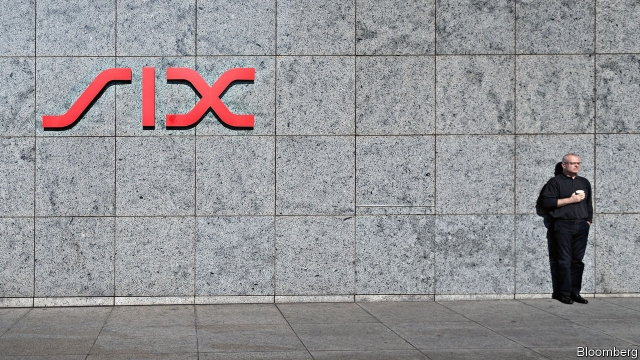

###### Raising the stakes

# Swiss stocks are collateral damage in a worsening trade row 

 

> print-edition iconPrint edition | Finance and economics | Jul 6th 2019 

IT IS A country famed for avoiding conflict. Yet on July 1st, in a serious escalation of a trade spat with the European Union, Switzerland barred the trading of Swiss-listed companies’ shares on EU platforms. Last December the trade bloc had given Switzerland an ultimatum: sign up to a revamped deal replacing the patchwork of 120 bilateral agreements that governs trade relations between the two by June 30th, or lose stockmarket “equivalence”—a status bestowed by the EU that allows seamless trading of shares across borders. Rather than fold, Switzerland retaliated. 

Before the ban traders based in the EU accounted for 60-80% of trading in Swiss shares by volume, some of that on Swiss exchanges and some on multilateral trading platforms in EU countries. Now those platforms have suspended trading in Swiss shares, as have the London Stock Exchange and Deutsche Börse. Swiss shares are available only on Swiss exchanges—and on far-distant ones, such as American and Asian trading hubs. 

This does not mean that Swiss giants such as Nestlé, Novartis and Roche have suddenly become untradeable from within the EU. Though the bloc usually requires its traders to trade on its own venues, or those it recognises as equivalent, it makes an exception when too few of a company’s shares would be available. So EU traders keen to buy Swiss shares can use Swiss exchanges. But the Swiss retaliation has nonetheless caused uncertainty: there is no formal definition of how few is too few. “It is up to individual trading venues to assess how to adjust their operations,” said a spokesman for the European Commission. 

Straight after the ban it was business as usual for SIX, Switzerland’s biggest stock exchange, and big Swiss firms saw no unusual trading activity. But unless the row is quickly resolved, Swiss shares will become less liquid. The harm to the Swiss stockmarket could be significant, says Charlotte de Montpellier, an economist with ING, a big Dutch bank. Trading costs are likely to rise and, in the long term, some Swiss companies may choose to go public outside Switzerland on exchanges with greater competition and more liquidity. 

The row could ripple out into the wider economy. Switzerland is integrated with the EU not only in its trade and capital markets, but also in other areas such as research funding and electricity markets. 

The Swiss federal government wants to close the deal, says André Simonazzi of the Swiss Federal Council. But it has asked the EU for clarification on provisions that have aroused domestic opposition, including on state subsidies and protections for wages and working conditions. Without tweaks the deal would probably be rejected by Swiss citizens in a referendum. Federal elections due in October make a speedy resolution less likely: no party wants to be seen as giving in to the EU. 

A no-deal Brexit might break the logjam. Many EU traders and trading platforms are based in London, which could arrange equivalence with Switzerland itself after leaving. But Brexit is also a cause of the impasse. The EU is using Switzerland to signal to Britain’s next prime minister that it is no longer willing to tolerate a pick-and-mix relationship like that it has long had with the Swiss—and that it is prepared to follow through on threats. The result, says Ms de Montpellier, is that both Switzerland and the EU are losers. “The EU can survive without Switzerland economically, but it is damaging a relationship with a reliable and stable trading partner.” ◼ 

-- 

 单词注释:

1.collateral[kә'lætәrәl]:a. 并行的, 附随的, 旁系的 n. 旁系亲属, 担保品 

2.worsen['wә:sn]:vt. 使更坏, 使恶化 vi. 变得更坏, 恶化 

3.Jul[]:七月 

4.famed[feimd]:a. 著名的, 闻名的 

5.escalation[.eskә'leiʃәn]:n. 扩大, 增加 [经] 调查, 价格调整 

6.EU[]:[化] 富集铀; 浓缩铀 [医] 铕(63号元素) 

7.bloc[blɒk]:n. 集团 

8.revamp[ri:'væmp]:vt. 换新鞋面, 修理, 修补, 修改 [经] 整修, 补, 修改 

9.patchwork['pætʃwә:k]:n. 拼缝物, 拼凑物 

10.bilateral[bai'lætәrәl]:a. 有两边的, 双边的, 双方的 [医] 两侧的 

11.stockmarket[s'tɒkmɑ:kɪt]: 证券市场; 证券交易所; 证券行情 

12.statu[]:[网络] 状态查看；雕像；特级雪花白 

13.bestow[bi'stәu]:vt. 授予, 使用, 贮藏, 留宿 

14.seamless['si:mlis]:a. 无缝的, 无缝合线的 [医] 无缝的 

15.retaliate[ri'tælieit]:vt. 报复, 回敬 vi. 报复, 以牙还牙 

16.trader['treidә]:n. 商人, 商船 [经] 交易者, 商船 

17.multilateral[.mʌlti'lætәrәl]:a. 多边的, 多国的 [经] 多边的, 涉及多方的 

18.deutsche[]:n. 德意志联邦共和国马克 

19.hub[hʌb]:n. 毂, 木片, 中心 [计] 插座; 插孔; 集线器, 集中器, 连接器, 中继站 

20.novartis[]: 诺华公司总部所在地：瑞士主要业务：制药 

21.roche[]:n. 瑞士罗氏（制药企业） 

22.untradeable[]:[网络] 不可交换 

23.venue['venju:]:n. 犯罪地点, 审判地, 发生地点 

24.retaliation[ri.tæli'eiʃәn]:n. 报复 [法] 报仇, 报复, 回敬 

25.nonetheless[,nʌnðә'les]:conj. 然而, 尽管, 不过 adv. 不过, 仍然, 尽管如此, 然而 

26.spokesman['spәuksmәn]:n. 发言人, 代言者 

27.quickly['kwikli]:adv. 很快地 

28.les[lei]:abbr. 发射脱离系统（Launch Escape System） 

29.charlotte['ʃɑ:lәt]:n. 水果奶油布丁 

30.de[di:]:[化] 非对映体过量 [医] 铥(69号元素铥的别名,1916年Eder离得的假想元素) 

31.Montpellier[mjŋpe'ljei]:蒙彼利埃[法国南部城市] 

32.economist[i:'kɒnәmist]:n. 经济学者, 经济家 [经] 经济学家 

33.ing[]:abbr. 惯性导航与制导（Inertial Navigation and Guidance）；强中子发生器（Intense Neutron Generator） 

34.Dutch[dʌtʃ]:n. 荷兰人, 荷兰语 a. 荷兰的 

35.liquidity[li'kwiditi]:n. 流动性, 流畅 [经] 流动性 

36.ripple['ripl]:n. 涟波, 涟漪, 波纹, 粗钢梳 vt. 使起涟漪 vi. 起微波, 起潺潺声 

37.clarification[.klærifi'keiʃәn]:n. 澄清, 净化 [计] 澄清报告; 澄清 

38.opposition[.ɒpә'ziʃәn]:n. 反对, 敌对, 相反, 在野党 [医] 对生, 对向, 反抗, 反对症 

39.tweak[twi:k]:n. 拧, 扭, 焦急 vt. 扭, 开足马力 

40.referendum[.refә'rendәm]:n. （就重大政治或社会问题进行的）全民公决，全民投票 

41.speedy['spi:di]:a. 快的, 迅速的 [经] 快的, 迅速的 

42.Brexit[]:[网络] 英国退出欧盟 

43.logjam['lɒgdʒæm]:n. 拥挤, 行不通, 为许多圆木材所阻 

44.equivalence[i'kwivәlәns]:n. 同等, 等价, 等值 [计] 等价 

45.impasse['impɑ:s]:n. 难局, 僵局, 死路, 死胡同 

46.loser['lu:zә]:n. 失败者, 遗失者 [法] 失败者, 失物者, 遗失者 

47.economically[i:kә'nɔmikәli]:adv. 节约地, 不浪费地, 节省地, 节俭地, 在经济上, 在经济学上 

