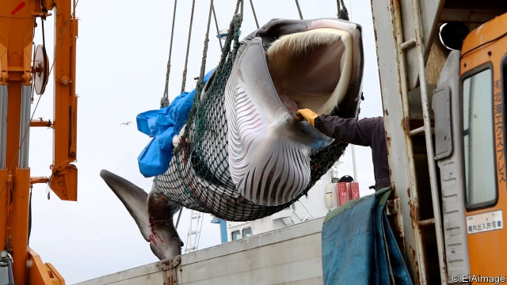

###### Conservation

# Japan resumes commercial whaling 

 

> print-edition iconPrint edition | Science and technology | Jul 6th 2019 

ON JULY 1st, to the fury of conservationists around the world, Japanese whalers landed their first commercial kill for more than 30 years, a minke whale (pictured above). In 1986 the countries of the International Whaling Commission, of which Japan was one, had agreed to a moratorium on whaling. This allowed the animals to recover to sustainable numbers after several species had been driven to the brink of extinction by untrammelled hunting. Exceptions were permitted, though, for indigenous groups of hunters, such as aboriginal Alaskans, who had an established culture of whaling, and for scientists studying whale biology—a loophole Japan has exploited ever since. 

Japanese whalers have killed between 200 and 1,200 of the animals every year since the moratorium, under the banner of research. Few outsiders, though, have believed that banner to be anything other than cover for trading in whale meat—a belief fostered by the fact that most of the catch has subsequently been sold for human consumption. 

In December 2018 Japan’s government lost patience with the moratorium altogether and announced that it was pulling out at the end of the following June. It has set this year’s quota at 227, with minke, Bryde’s and sei whales as the permitted targets. It is worth noting that of these, only sei whales are listed as endangered on the International Union for Conservation of Nature’s Red List—and their numbers are increasing. 
<<<<<<< HEAD

-- 

 单词注释:

1.Jul[]:七月 

2.fury['fjuri]:n. 愤怒, 狂暴, 狂怒的人 [医] 狂乱, 狂暴, 狂怒 

3.conservationist[,kәnsә'veiʃәnist]:n. 自然资源保护论者 

4.whaler['hweilә]:n. 捕鲸者, 捕鲸船 

5.minke[]: 小须鲸 

6.moratorium[.mɒrә'tɒ:riәm]:n. 延期偿付, 暂停 [法] 延期偿付, 延缓履行, 延期偿还期 

7.sustainable[sә'steinәbl]:a. 足可支撑的, 养得起的, 可以忍受的 

8.specie['spi:ʃi]:n. 硬币 [经] 硬币 

9.brink[briŋk]:n. 边缘, 陡岸 

10.extinction[ik'stiŋkʃәn]:n. 消失, 消灭, 废止 [化] 消光; 熄灭 

11.untrammelled[]:a. 不受限制的, 自由自在的, 不受妨碍的 

12.indigenous[in'didʒinәs]:a. 本土的, 国产的, 固有的 [医] 原产的, 本土的 

13.aboriginal[.æbә'ridʒәnәl]:a. 原始的, 土著的 n. 土著居民, 土生生物 

14.alaskan[ә'læskәn]:a. 阿拉斯加的；阿拉斯加州的 

15.loophole['lu:phәul]:n. 枪眼, 小窗, 换气孔 

16.outsider[' aut'saidә]:n. 外人, 局外人, 非会员, 外行, 门外汉, 比赛中获胜可能性不大的选手 [经] 外船公司 

17.foster['fɒstә]:a. 收养的, 养育的 vt. 养育, 抚育, 培养, 鼓励, 抱(希望) 

18.subsequently['sʌbsikwәntli]:adv. 后来, 随后 

19.quota['kwәutә]:n. 配额, 限额 [化] 定额 

20.sei[sei. sai]:n. 大须鲸；鰛鲸 

21.endanger[in'deindʒә]:vt. 危及 [法] 使危险, 危及 
=======
>>>>>>> 50f1fbac684ef65c788c2c3b1cb359dd2a904378

