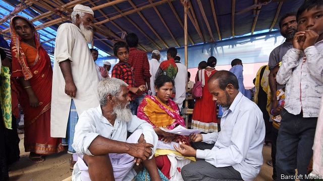
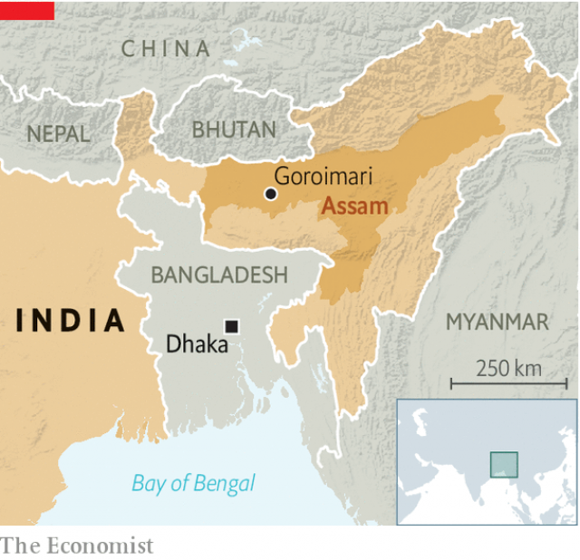

###### Madness in the hills

# India is declaring millions of its citizens to be foreigners 

 

> print-edition iconPrint edition | Asia | Jul 13th 2019 

IT IS HOTTER than Prague. It does not have the Czech capital’s cobbled squares or narrow streets but instead tin-roofed houses and paddies hemmed with palms and mango trees. Yet Franz Kafka would have felt quite at home in Assam. Since 2016 this hilly tea-growing state in India’s north-eastern corner has been compiling a National Register of Citizens (NRC). Billed as a scientific method for sorting pukka Indians from a suspected mass of unwanted Bangladeshi intruders, the seemingly banal administrative procedure has instead encoiled millions of people in a cruelly absurdist game. 

Rather than find and prosecute illegal immigrants, Assam has instead tasked its 33m people, many of them poor and illiterate, with proving to bureaucrats that they deserve citizenship. Those who fail risk being locked up. Some 1,000 people currently moulder in Assam’s six existing detention centres for “foreigners”. The Indian public has lately been shocked by stories of people, such as a decorated war hero and a 59-year-old widow, who have found themselves jailed for failing to prove their Indian-ness. But the state of Assam is clearly expecting a lot more to come. Ten purpose-built camps are planned. 

The current phase of the NRC game is set to stop on July 31st, the deadline for publishing the completed citizens’ register. After that, those left off the list will have to wait for Foreigners’ Tribunals, special parallel courts with no right of appeal, to hear their cases. There is no telling how many there may be. When a draft NRC was issued last year, it left out some 4m of Assam’s 33m people. In June 100,000 more were deemed suspected foreigners. The majority of the losers are Bengali speakers, some of them Hindu but mostly Muslim; other Assamese were automatically included in the register because they have obvious local pedigrees or belong to recognised “native” tribes. 

Not surprisingly, some 93% of those excluded have petitioned for inclusion, presenting evidence that they are Indian-born. But the bureaucratic machinery, primed by Assamese chauvinists aligned with the Bharatiya Janata Party (BJP), which rules both the state and the country, has been incentivised to reject as many as possible. Indeed, the national government is preparing to declare the exercise a great success. It wants to extend the NRC and Foreigners’ Tribunals to the rest of the country. Muslims, who are 14% of India’s 1.3bn people, fear that they may find themselves, as in Assam, disproportionately sifted into the reject bin. They are right to be worried. 

In the hamlets around Goroimari, a largely Bengali-speaking village in the lush flatness of the Brahmaputra valley, it takes little effort to coax out NRC nightmares. Take the case of Somiron Nisa, a recent high-school graduate. Everyone in her family appeared on draft NRC lists as proper citizens, and in the first draft she did, too. But beside her name on the latest draft it says “declared foreigner”. NRC officers told her family this was because she has been tagged a “D” or doubtful voter by the state’s election commission, which means she will automatically have to defend herself at a Foreigners’ Tribunal. When it was pointed out that Ms Nisa is the only “foreigner” in her family, and is also too young to have ever registered to vote, the officers shrugged. 

 

Or listen to Shamas Uddin, 93, an illiterate farmer. He was born in this village when it had just a handful of houses, he says. His name appeared on all the NRC drafts but then, in March, a certain Debajit Goswami officially objected to his inclusion. Mr Uddin does not know his accuser. No one in the village does, and indeed lawyers with a local NGO failed to track down Mr Goswami at his registered address. Nor did he show up at either of the NRC hearings to which Mr Uddin was summoned, in two different towns 150km apart. 

Perhaps this is because Mr Goswami’s name appears on hundreds of “objection” letters, demanding the removal of suspected foreigners from the NRC. Under rules set by India’s Supreme Court, no less, such individuals were given licence to denounce any number of fellow citizens, and also excused from appearing to face those they accuse. In this district alone, a suspiciously small number of objectors, all believed linked to Assamese nativist groups, somehow gained access to a local NRC database and together penned 30,000 such objection certificates. Across the state, some 220,000 such poisoned letters were filed before a deadline in May. Indigenous activists in other parts of north-eastern India, in turn, have begun to waylay migrant workers from Assam, demanding to see proof that they are on the NRC and turning away those who cannot provide it. 

“No one here is from Bangladesh,” scoffs Rahum Ali, one of Mr Uddin’s neighbours. “Where would they settle? There is no land. Brothers are fighting over land.” Mr Ali is 70 but was not included in the NRC drafts, although three brothers and two sisters were. Summoned to an NRC office, he was told his case is PFT or “pending Foreigners’ Tribunal”. He was subsequently summoned four more times, to offices in different towns, each time wondering if he would be thrown in jail, only to be told the same thing. But although he is told there is a case, no case number is cited, so he has no idea which out of some 100 Foreigners’ Tribunals he should appear before. A local lawyer says that 46 people in the village are similarly PFT and being “driven mad” by repeated summonses. 

How did this Kafkaesque situation arise? As so often in India the blame lies partly with British rule and partly with toxic Indian politics. Under the Raj millions of Bengalis, mostly Muslim, were encouraged to settle in Assam. With independence, local politicians thrived by playing up the “threat” that intruders posed to native language and culture. With the rise of Hindu nationalism, the religious component has been magnified and the threat recast as one to India’s national security. 

As a result, claims of ever bigger numbers of supposed illegal migrants have been bandied about. With Assamese chauvinists repeatedly asserting that 5m or even 8m “infiltrators” have invaded their state, right-wing politicians have scented the possibility of erasing much of the typically left-leaning Muslim “vote bank” from the rolls. They are substantiating the baseless estimates by declaring millions to be “foreigners”. “It’s like Chernobyl,” says a lawyer, “They are trying to hide a lie at the cost of disaster.” 

No one seems to know what the ultimate fate of Assam’s “foreigners” will be. They cannot be deported; Bangladesh flatly rejects the whole exercise as an internal Indian matter. Millions of people cannot be shunted to some other part of India, either. The BJP has offered a solution for some: cocking a snook at the secular constitution, it is pushing an amendment to citizenship laws that will allow refugees who are Hindu, Buddhist, Sikh or Christian to apply for citizenship, but specifically ban Muslims. Nani Gopal Mahanta, chair of political science at Assam’s Gauhati University and a BJP supporter, has some suggestions for those who still fall foul. He thinks that the Foreigners’ Tribunals may not act very quickly, taking perhaps 20 years to sort through their case load. Those declared non-citizens need not be made stateless, but could simply be stripped of civil rights, perhaps for a limited time. “Citizenship, whether you like it or not, is not a very democratic concept,” he says. Kafka would certainly have agreed.  
<<<<<<< HEAD

-- 

 单词注释:

1.madness['mædnis]:n. 疯狂, 愚蠢的行为 [医] 狂, 疯狂 

2.Jul[]:七月 

3.Prague[prɑ:g]:n. 布拉格 

4.Czech[tʃek]:n. 捷克人, 捷克语 a. 捷克的, 捷克语的, 捷克人的 

5.cobble['kɒbl]:n. 圆石, 鹅卵石 vt. 铺鹅卵石, 修, 粗粗地修补 

6.paddy['pædi]:n. 稻, 谷, 爱尔兰人, 警察 [法] 警察 

7.hem[hem]:n. 边缘, 折边, 哼声 vt. 缝边, 包围, 关闭 vi. 做折边, 发哼声 interj. 哼 

8.mango['mæŋgәu]:n. 芒果 [化] 芒果Mangifera indica 

9.franz[frɑ:nts]:n. 弗朗茨（Francis Ferdinand的德文名） 

10.kafka[]:n. 卡夫卡（奥地利小说家） 

11.Assam[ә'sæm]:n. 阿萨姆邦(印度地名) 

12.NRC[]:国家研究委员会 

13.pukka['pʌkә]:a. 份量充足的, 纯良的 

14.unwanted[.ʌn'wɒntid]:a. 没人要的, 不需要的, 多余的 

15.Bangladeshi[-ʃi]:n. 孟加拉国人 a. 孟加拉国(人)的 

16.intruder[in'tru:dә]:n. 侵入者, 干扰者, 妨碍者 [计] 入侵者 

17.seemingly['si:miŋli]:adv. 看来似乎, 表面上看来 

18.banal[bә'nɑ:l]:a. 平凡的, 陈腐的 

19.administrative[әd'ministrәtiv]:a. 管理的, 行政的 [法] 行政的, 管理的, 遗产管理的 

20.cruelly['kru:әli]:adv. 残忍地, 残酷地, 极 

21.absurdist[әb'sә:dist]:n. 荒诞主义者 

22.prosecute['prɒsikju:t]:vt. 告发, 起诉, 彻底进行, 执行, 从事 vi. 告发, 起诉, 作检察官 

23.illiterate[i'litәrәt]:n. 文盲 a. 目不识丁的, 没受教育的 

24.bureaucrat['bjuәrәukræt]:n. 官僚作风的人, 官僚, 官僚主义者 [法] 官僚, 官僚作风的人 

25.citizenship['sitizәnʃip]:n. 国籍, 市民权, 市民的身份 [法] 公民权, 公民资格, 公民身分 

26.currently['kʌrәntli]:adv. 现在, 当前, 一般, 普通 [计] 当前 

27.moulder['mәuldә]:n. 制模工 vi. 腐朽, 衰退 vt. 使腐朽, 使衰退 

28.detention[di'tenʃәn]:n. 阻止, 监禁, 拘留 [医] 隔离, 拘留, 滞留, 停滞 

29.tribunal[trai'bju:nl]:n. 法庭, 法官席, 裁决 [法] 法庭, 裁判所, 裁判 

30.deem[di:m]:v. 认为, 相信 

31.loser['lu:zә]:n. 失败者, 遗失者 [法] 失败者, 失物者, 遗失者 

32.Bengali[beŋ'^ɔ:li]:n. 孟加拉人 a. 孟加拉的 

33.Hindu['hindu:]:a. 印度教教徒的 n. 印度教教徒 

34.Muslim['mjzlim; (?@) 'mʌzlem]:n. 伊斯兰教, 伊斯兰教教徒 

35.Assamese[.æsә'mi:z]:a. 阿萨姆人的, 阿萨姆的 

36.pedigree['pedigri:]:n. 血统, 家谱, 名门世系 [法] 家系, 出身, 血统 

37.petition[pi'tiʃәn]:n. 请愿, 诉状, 陈情书, 申请, 祈求, 祷文 v. 正式请求, 恳求, 请愿 

38.inclusion[in'kluʒәn]:n. 包含, 内含物 [计] 蕴含 

39.machinery[mә'ʃi:nәri]:n. 机器, 机械装置, 机构 [化] 机械 

40.chauvinist['ʃәuvinist]:n. 沙文主义者, 沙文主义组织 a. 沙文主义的 

41.align[ә'lain]:vi. 排列, 排成一行, 结盟 vt. 使结盟, 使成一行, 校正 

42.Bharatiya[]:[网络] 巴拉蒂亚 

43.Janata['dʒʌnətɑ:]:n. （印度）人民团体；人民党（印度联合政党） 

44.bjp[]: [医][=Bence Jones protein]本周（氏）蛋白，凝溶蛋白 

45.incentivised[]:[网络] 褒扬 

46.Muslim['mjzlim; (?@) 'mʌzlem]:n. 伊斯兰教, 伊斯兰教教徒 

47.disproportionately[]:adv. 不匀称, 不相称 

48.sift[sift]:vt. 筛, 过滤, 撒, 详查 vi. 筛, 被筛下, 精选 

49.bin[bin]:n. (贮存谷物等的)容器, 箱子 [计] 二进制, 商业信息网 

50.hamlet['hæmlit]:n. 小村, 部落 

51.lush[lʌʃ]:a. 苍翠繁茂的, 多青草的, 丰富的 n. 酒, 酒鬼 v. 饮 

52.flatness['flætnis]:n. 平坦, 平滑 [化] 平直度; 平整度; 平面度 

53.Brahmaputra[,brɑ:mә'pu:trә]:n. 雅鲁藏布江(发源于西藏) 

54.coax[kәuks]:vt. 哄, 诱骗, 耐心地摆弄 vi. 哄骗 [计] 同轴电缆 

55.nightmare['naitmєә]:n. 梦魇, 恶梦, 可怕的事物(或情景、人物) [医] 梦魇, 恶梦 

56.nisa[]:n. (Nisa)人名；(意、西、塞、葡)尼萨 

57.voter['vәutә]:n. 选民, 投票人 [法] 选民, 选举人, 投票人 

58.tribunal[trai'bju:nl]:n. 法庭, 法官席, 裁决 [法] 法庭, 裁判所, 裁判 

59.shama['ʃɑ:mə]:n. 尚明居；莎玛（公司名） 

60.uddin[]:n. (Uddin)人名；(瑞典)乌丁 

61.goswami[]:[网络] 戈斯瓦米；哥斯瓦米；斯瓦米上校 

62.officially[ә'fiʃәli]:adv. 作为公务员, 职务上, 官方地 

63.accuser[ә'kju:zә]:n. 控诉者, 指责者 [法] 原告, 指控人, 控告者 

64.ngo[]:abbr. 民间组织；非政府组织（Non-Governmental Organization） 

65.summon['sʌmәn]:vt. 召唤, 召集, 号召, 振奋, 唤起, 鼓起 [经] 传唤, 传讯 

66.les[lei]:abbr. 发射脱离系统（Launch Escape System） 

67.denounce[di'nauns]:vt. 告发, 抨击, 谴责 [法] 谴责, 斥责, 告发 

68.suspiciously[]:adv. 猜疑地；怀疑地 

69.objector[әb'dʒektә]:n. 反对者, 提出异议的人 [法] 反对者, 表示异议者 

70.nativist['neitivist]:n. 先天论者, 乡土主义者, 本土主义者 

71.indigenous[in'didʒinәs]:a. 本土的, 国产的, 固有的 [医] 原产的, 本土的 

72.activist['æktivist]:n. 激进主义分子 

73.waylay[wei'lei]:vt. 伏击, 埋伏 [法] 挡路抢劫, 挡路, 挡截 

74.migrant['maigrәnt]:n. 候鸟, 移居者 [法] 移居者 

75.cannot['kænɒt]:aux. 无法, 不能 

76.Bangladesh[,bɑ:ŋ^lә'deʃ]:n. 孟加拉国 [经] 孟加拉共和国 

77.scoff[skɒf]:n. 嘲笑, 愚弄, 笑柄, 食品 v. 嘲笑, 嘲弄, 贪吃, 狼吞虎咽地吃 

78.ALI[]:[计] 异步线路接口 

79.pft[]:abbr. Portable Flame Thrower 背囊式喷火器 

80.pending['pendiŋ]:a. 未决定的, 待决的, 行将发生的, 向外伸出的 prep. 在等待...之际, 直到...时为止, 在...期间, 在...过程中 

81.subsequently['sʌbsikwәntli]:adv. 后来, 随后 

82.cite[sait]:vt. 引用, 引证, 表彰 [建] 引证, 指引 

83.summons['sʌmәnz]:n. 召唤, 传唤, 召集, 传票 vt. 传唤, 唤出, 传到 

84.Kafkaesque[,kɑ:fkə'esk]:a. 卡夫卡式；受压抑和恶梦般的 

85.toxic['tɒksik]:a. 有毒的, 中毒的 [医] 中毒的, 毒物的 

86.politic['pɒlitik]:a. 精明的, 明智的, 策略的 

87.raj[rɑ:dʒ]:n. 主权, 统治 [法] 统治, 支配, 主权 

88.Bengali[beŋ'^ɔ:li]:n. 孟加拉人 a. 孟加拉的 

89.nationalism['næʃәnәlizm]:n. 民族主义, 民族特性 

90.magnify['mægnifai]:vt. 放大, 扩大, 赞美, 夸大 vi. 有放大能力 

91.recast[.ri:'kɑ:st]:vt. 重铸, 重作, 改造 n. 重铸, 改换角色 

92.bandy['bændi]:a. 向外弯曲的 vt. 打来打去, 谈论, 往复投掷 

93.assert[ә'sә:t]:vt. 主张, 坚称, 断言 [法] 宣称, 断言, 维护 

94.infiltrator['infiltreitә(r),in'fil-]:n. 渗入者 

95.erase[i'reis]:vt. 抹去, 擦掉 [计] 清洗; 擦除; 抹除; DOS内部命令:从磁盘上删除一个或多个文件 

96.typically['tipikәli]:adv. 代表性地；作为特色地 

97.substantiate[sәb'stænʃieit]:vt. 使实体化, 证实 [经] 确证 

98.baseless['beislis]:a. 无根据的 

99.Chernobyl[tʃiә'nɔ:bil]:[经] 车诺比 

100.deport[di'pɒ:t]:vt. 举止, 驱逐出境 [法] 放逐, 驱逐, 递解 

101.flatly['flætli]:adv. 枯燥无味地, 完全地, 直截了当地, 毅然地, 断然地 

102.shunt[ʃʌnt]:vt. 使转轨, 使分流, 回避讨论, 推延 vi. 转向一边, 转轨, 往返 n. 转轨, 分流 

103.snook[snu:k. snuk]:n. [口]大拇指按鼻端, 其余四指张开以示轻蔑的手势 

104.secular['sekjulә]:n. 修道院外的教士 a. 世俗的, 现世的, 长期的 

105.amendment[ә'mendmәnt]:n. 修订, 改善, 改良, 改正 [化] 调理剂; 修正 

106.refugee[.refju'dʒi:]:n. 难民, 流亡者 [法] 避难者, 流亡者, 难民 

107.sikh[si:k]:n. 锡克教教徒 

108.specifically[spi'sifikli]:adv. 特定地, 明确地, 按特性 

109.nani[]:n. 纳尼（曼联足球运动员） 

110.gopal[]:戈帕尔（人名） 

111.mahanta[]:n. (Mahanta)人名；(印)马汉塔；(尼)马汉塔 

112.Gauhati[]:[网络] 高哈蒂；印度高哈蒂；古瓦哈提 

113.supporter[sә'pɒ:tә]:n. 支持者, 后盾, 迫随者, 护身织物 [法] 支持者, 赡养者, 抚养者 

114.foul[faul]:a. 污秽的, 邪恶的, 恶臭的, 肮脏的, 恶劣的, 淤塞的 vt. 弄脏, 妨害, 污蔑, 犯规, 淤塞 vi. 腐烂, 犯规, 缠结 adv. 违反规则地, 不正当地 n. 犯规, 缠绕 

115.quickly['kwikli]:adv. 很快地 

116.stateless['steitlis]:a. 没有国家的 [法] 无国籍的, 无国家主权的 

117.citizenship['sitizәnʃip]:n. 国籍, 市民权, 市民的身份 [法] 公民权, 公民资格, 公民身分 
=======
>>>>>>> 50f1fbac684ef65c788c2c3b1cb359dd2a904378

