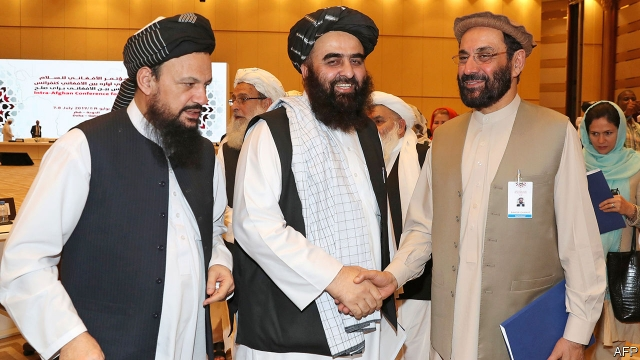

###### Happy talk

# The Taliban negotiates with Afghan officials for the first time 

 

> print-edition iconPrint edition | Asia | Jul 13th 2019 

IT WAS A breakthrough, albeit only by the forlorn standards of the 40-year conflict in Afghanistan. After two days of talks with Afghan officials at a posh hotel in Qatar, envoys of the Taliban promised that their insurgents would not attack schools, hospitals or bazaars. The Afghan government, too, said it would try to stop killing civilians. But more important than their woolly resolutions was the fact that the two sides were speaking at all. Officially, the Taliban insists that the Afghan government is an illegitimate puppet regime; it was only “in a personal capacity” that its envoys met Afghan officials, alongside politicians and representatives of NGOs. 

The meeting was partly to break the ice and partly to brainstorm over a “road map for peace”. In addition to the resolution about avoiding civilian casualties, the vague, non-binding declaration also provided an outline of sorts for future negotiations on a peace deal. Women’s rights, the Taliban agreed, would be protected, albeit within an “Islamic framework”. By the same token, “institutionalising an Islamic system”, the delegates decided, would not involve dissolving government institutions such as the army. 

The American government, which is hoping to find a face-saving formula to withdraw from Afghanistan, has long called for such a meeting. With the Afghan government sidelined, talks between America and the Taliban had naturally focused on America’s chief concern: how to withdraw its forces without allowing Afghanistan to become any more of a haven for international terrorists, such as Islamic State and al-Qaeda. Yet a deal between the Taliban and America is not enough to secure peace in Afghanistan. Even before American troops invaded in 2001, the country was aflame. To allow American troops to depart without leaving chaos and bloodshed in their wake, the Taliban must find a way to rub along with the Afghan groups they once fought and persecuted. 

Discrepancies in the translation of the declaration agreed in Qatar give an idea of the difficulties. The English version did not mention an American withdrawal. The Pushtu version reportedly had no mention of protecting women’s rights. Under the Taliban, women have been unable to leave home without a chaperone and have been denied work or education. 

Filling in the details will be contentious. Who, for example, will decide what is acceptably Islamic? “People will accept concessions, but they are not going to accept an emirate,” says one Western official. Under the Taliban’s interpretation of democracy, only people with sufficient Islamic knowledge should be allowed to vote. “As you can imagine, all those people are men with white beards.” 

The Taliban’s delegation to the talks was indeed a collection of men with white beards—some of them former detainees at the American military prison in Guantánamo Bay in Cuba. The Afghan officials included several women, most notably the country’s first female governor. 

Taliban fighters in the field often say they cannot negotiate for anything less than a strictly Islamic system. “Without that Islamic regime, a deal for me personally would offend and dishonour those thousands of Taliban and leaders we sacrificed,” says a commander in Ghazni, a town 150km south of Kabul, the capital. 

The Taliban also refuse the main demand of the Afghan government: a ceasefire. While vowing to protect civilians, the Taliban nonetheless say the war must continue. It is the pressure of war, they say, that has led to negotiations, so they must keep it up. In the past week the Taliban have attacked government buildings in Ghazni and Kabul, wounding scores of children in schools nearby. By the same token, an Afghan commando raid on a hospital in the province of Wardak, just west of Kabul, reportedly killed at least two of its staff. 

The Taliban and America are in the middle of their seventh round of talks. There have been hints of progress on a timetable for an American withdrawal and on assurances that the Taliban will not harbour terrorists. Talks among Afghans will be longer and messier. But they are the only way to end the country’s decades of agony.  

-- 

 单词注释:

1.Taliban[]:塔利班 

2.Afghan['æfgæn]:a. 阿富汗的, 阿富汗人的 n. 阿富汗人, 阿富汗语, 阿富汗毛毯 

3.Jul[]:七月 

4.albeit[ɔ:l'bi:it]:conj. 尽管, 虽然 

5.forlorn[fә'lɒ:n]:a. 孤独的, 悲惨的, 凄凉的 

6.Afghanistan[æf'gænistæn]:n. 阿富汗 

7.posh[pɒʃ]:a. 豪华的, 漂亮的, 优雅的, 极好的 interj. 呸 

8.Qatar['kɑ:tәr]:n. 卡塔尔 

9.envoy['envɒi]:n. 外交使节, 特使 [法] 使者, 代表, 使节 

10.insurgent[in'sә:dʒәnt]:a. 谋叛的, 起义的, 澎湃的 n. 起义者, 叛乱者 

11.bazaar[bә'zɑ:]:n. 集市, 市场, 义卖市场 

12.woolly['wuli]:a. 羊毛制的, 模糊的, 似羊毛的, 蓬乱的 

13.officially[ә'fiʃәli]:adv. 作为公务员, 职务上, 官方地 

14.illegitimate[.ili'dʒitimәt]:a. 不法的, 私生的, 不合规则的, 不合理的, 不符合习惯的 n. 无合法身份的人 vt. 宣告...为非法, 证明...为私生 

15.regime[rei'ʒi:m]:n. 政权, 当权期间, 政体, 社会制度, 体制, 情态 [医] 制度, 生活制度 

16.ngos[]:abbr. non-government organization 非政府组织，非政府机构 

17.brainstorm['breinstɒ:m]:n. 灵机一动 v. 集体讨论 

18.casualty['kæʒjuәlti]:n. 意外事故, 伤亡, 受害者 [化] 事故 

19.declaration[.deklә'reiʃәn]:n. 宣告, 说明, 宣布 [计] 说明 

20.negotiation[ni.gәuʃi'eiʃәn]:n. 谈判, 磋商, 交涉 [经] 谈判, 协商 

21.Islamic[iz'læmik]:a. 伊斯兰教的, 穆斯林的 

22.token['tәukәn]:n. 表征, 记号, 代币 a. 象征的, 表意的 [计] 记号 

23.institutionalise[,insti'tju:ʃәnәlaiz]:v. <主英>= institutionalize 

24.sideline['saidlain]:n. 副业, 旁线, 界线, 兼职, 旁观者看法 vt. 使退出比赛场地 

25.haven['heivn]:n. 港, 避难所, 安息所 vt. 安置...于港中, 庇护, 入港 

26.terrorist['terәrist]:n. 恐怖分子 [法] 恐怖份子, 恐怖主义 

27.aflame[ә'fleim]:a. 燃烧中的, 火一般红的, 激动的 adv. 燃烧中 

28.chao[]:n. 钞（货币） 

29.bloodshed['blʌdʃed]:n. 流血 

30.persecute['pә:sikju:t]:vt. 迫害, 虐待, 困扰, 同...捣乱 [法] 迫害, 虐待, 烦扰 

31.discrepancy[dis'krepәnsi]:n. 不符合, 差异, 不相符之处 [化] 不符值; 偏差值 

32.withdrawal[wið'drɒ:l]:n. 提款, 撤退, 退回, 撤消, 退隐, 戒毒过程 [医] 戒除, 脱瘾 

33.Pushtu['pʌʃtu:]:a. 普什图语的 

34.reportedly[ri'pɒ:tidli]:adv. 根据传说, 根据传闻, 据报道 

35.chaperone['ʃæpәrәun]:n. 年长女伴 vt. 伴护 

36.contentious[kәn'tenʃәs]:a. 好争吵的, 爱争论的, 有异议的 [法] 诉讼的, 争执的, 引起争论的 

37.acceptably[әk'septәbli]:adv. 可欣然接受地, 承受得住地, 能合人意地 

38.concession[kәn'seʃәn]:n. 特许, 让步, 认可 [经] 核准, 许可, 特殊(权) 

39.emirate[e'miәrit]:n. 埃米尔的地位, 酋长国 

40.detainee[.di:tei'ni:]:n. 被拘留者, 被扣押者 [法] 被扣扣者, 被拘留者 

41.Cuba['kju:bә]:n. 古巴 

42.notably['nәjtbәli]:adv. 显著地, 著名地, 尤其, 特别 

43.cannot['kænɒt]:aux. 无法, 不能 

44.les[lei]:abbr. 发射脱离系统（Launch Escape System） 

45.Ghazni['ɡɑ:zni]:n. 加慈尼（阿富汗城市） 

46.Kabul['kɑ:bәl]:n. 喀布尔(阿富汗首都) 

47.ceasefire[ˈsi:sfaɪə(r)]:n. （通常指永久性的）停火, 停战; 停火命令 

48.vow[vau]:n. 誓约, 誓言, 许愿 vi. 起誓, 发誓, 郑重宣言 vt. 立誓, 起誓要, 郑重地宣布 

49.nonetheless[,nʌnðә'les]:conj. 然而, 尽管, 不过 adv. 不过, 仍然, 尽管如此, 然而 

50.commando[kә'mɑ:ndәu]:n. 突击队, 突击队员, (南非)布尔人部队 

51.wardak[]:n. 瓦尔达克（省），阿富汗 

52.assurance[ә'ʃuәrәns]:n. 保证, 把握, 信心, 保险 [经] 保证, 担保, 保险 

53.Afghan['æfgæn]:a. 阿富汗的, 阿富汗人的 n. 阿富汗人, 阿富汗语, 阿富汗毛毯 

