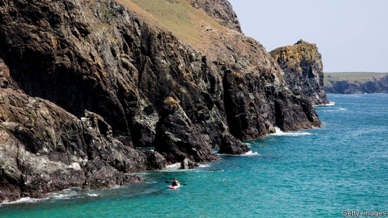

###### A sea change

# Telling Britain’s story from its “ocean-gouged fringe” 

 

> print-edition iconPrint edition | Books and arts | Jul 13th 2019 

The Frayed Atlantic Edge. By David Gange.William Collins; 400 pages; £18.99. 

FOR A KAYAKER caught in heavy swells, the world is all sea. Waves tower. Land is lost. The coastline vanishes to a thin strip, glimpsed for a moment before it veers drunkenly behind the next wave. 

If this seems an unusual environment for a historian, David Gange’s book suggests otherwise. “The Frayed Atlantic Edge” is an account of a year-long kayak voyage that he made down the western seaboard of the British Isles, from the northernmost tip of Shetland to the most southerly point of Cornwall. It is also an argument for a different, more personal sort of history. Mr Gange’s subject is the “archipelagic world” of Britain: an interlinked constellation of Atlantic-facing settlements, which are scattered geographically but bound by shared cultures and language. He turns conventional records of the British Isles inside out. Instead of rooting his story in metropolises such as London, he tells it from the “tattered ocean-gouged fringe”. 

This is an apposite moment for his project. Over the past few decades, there has been a revival of Gaelic culture and language—led largely by the kind of coastal communities that were previously overlooked. Institutions such as the University of the Highlands and Islands, which has a campus in the Outer Hebrides, have overseen a surge of vigour and confidence. The depopulations that in the 18th and 19th centuries afflicted the outer islands of the archipelago—such as Fair Isle and Foula in Shetland—are being reversed. Young people are staying, Mr Gange observes, and newcomers arriving. There and elsewhere, localism has become a point of pride. 

The strength of Mr Gange’s account is his generosity. His own wry persona never overshadows the voices of past and present inhabitants. Artists and writers are his principal guides: Rob Donn, an 18th-century crofter-chronicler, sits companionably alongside the modern Scottish poet Robin Robertson, their writing harmonising across time. The references are democratic, familiar names such as Virginia Woolf and Walter Scott keeping company with lesser-known figures, who are nonetheless noteworthy in their own ways. Mr Gange considers a meditation on Bardsey Island, off the coast of Wales, by the poet Christine Evans, and the eerie seascapes of Peter Lanyon, a Cornish painter. 

In this way he presents the landscapes that he traverses anew—not just as beautiful wildernesses, but as the by-product of human history, an occasionally troubled braiding of people and place. The craft of the historian, he thinks, lies in “interpreting the intertwining”. 

It helps that Mr Gange’s prose is itself poetic and precise. The hills and lochs of Assynt, for instance, tessellate in shapes “like Euclidian art”. He conveys the experience of kayaking through mountainous “scarps of sea”; his enthusiasm for snoozing in soggy sleeping bags is infectious. By the end, his book makes a persuasive case for chronicling the history of regions through the experiences and voices of the people who call them home. A dunking in the freezing sea, off the coast of County Mayo, leaves the author shivering but “ignited, elated”. Surfacing from his book, the reader is invigorated, too.  
<<<<<<< HEAD

-- 

 单词注释:

1.fringe[frindʒ]:n. 边缘, 端, 流苏, 穗, 初步 vt. 加穗于, 加饰边于 a. 边缘的, 附加的 

2.Jul[]:七月 

3.fray[frei]:n. 磨损, 打架, 争论 vt. 使磨损 vi. 被磨损 

4.david['deivid]:n. 大卫；戴维（男子名） 

5.collins['kɒlinz]:n. 柯林斯酒 

6.kayaker[]:n. （用帆布或塑料做的类似因纽特人独木舟的）小划艇(kayak的变形) 

7.coastline['kәustlain]:n. 海岸线 

8.veer[viә]:vi. 转向 vt. 使转向 n. 转向 

9.drunkenly[]:adv. 酒醉地, 常喝醉地 

10.historian[hi'stɒ:riәn]:n. 历史学家, 记事者 

11.kayak['kaiæk]:n. 爱斯基摩人划子 

12.seaboard['si:bɒ:d]:n. 海岸, 沿海地带 a. 海边的 

13.isle[ail]:n. 小岛, 群岛 vt. 使成为岛状 vi. 住在岛屿上 

14.northernmost['nɒ:ðәnmәust]:a. 最北的 

15.Shetland['ʃetlәnd]:n. 设得兰群岛(英国苏格兰东北部一郡) 

16.southerly['sʌðәli]:a. 向南的, 来自南方的 n. 南风 adv. 向南, 从南面 

17.cornwall['kɔ:nwɔ:l]:n. 康沃尔（英格兰西南部一郡, 加拿大城市名） 

18.archipelagic[,ɑ:kipә'lædʒik]:a. 群岛的, 多岛海的 

19.interlink[.intә'liŋk]:vt. 把...互相连结 n. 连环 

20.constellation[.kɒnstә'leiʃәn]:n. 星座, 荟萃 [化] 构象 

21.geographically[]:[计] 自通地 

22.metropolis[mi'trɒpәlis]:n. 大都市, 重要中心, 首府 [医] 产地, 生地 

23.tattered['tætәd]:a. 破烂的, 褴褛的 

24.apposite['æpәuzit]:a. 贴切的, 合适的 

25.revival[ri'vaivl]:n. 复兴, 复活, 恢复精神, 苏醒 [医] 复苏, 回生, 精神重振 

26.Gaelic['geilik]:n. 盖尔语 a. 盖尔人的 

27.coastal['kәustәl]:a. 海岸的, 沿海的, 沿岸的 [法] 海岸的, 沿海的 

28.highland['hailәnd]:n. 高地, 苏格兰高地 

29.Hebrides['hebridi:z]:赫布里底群岛[英国苏格兰西部]( 被小明奇海峡分为内赫布里底群岛) 

30.oversee[.әuvә'si:]:vt. 向下看, 了望, 监督, 偷看到 [法] 监察, 监督, 俯瞰 

31.surge[sә:dʒ]:n. 巨涌, 汹涌, 澎湃 vi. 汹涌, 澎湃, 颠簸, 猛冲, 突然放松 vt. 使汹涌奔腾, 急放 [计] 电压尖峰 

32.vigour['vigә]:n. 精力, 活力, 力量, 效力, 气势 

33.depopulation[]:[经] 人口下降 

34.afflict[ә'flikt]:vt. 使苦恼, 折磨 

35.isle[ail]:n. 小岛, 群岛 vt. 使成为岛状 vi. 住在岛屿上 

36.Foula[]:[地名] 富拉岛 ( 英 ) 

37.gange[^ændʒ]:v. 以细铁丝保护 

38.newcomer[nju:'kʌmә]:n. 新来者 

39.localism['lәukәlizm]:n. 有地方色彩, 土话, 方言, 地方主义 [法] 地方主义, 地方观念 

40.generosity[.dʒenә'rɒsiti]:n. 慷慨, 宽大 

41.wry[rai]:a. 扭歪的, 歪曲的, 歪斜的 v. 扭曲, 扭歪 

42.persona[pә:'sәunә]:n. 人, 人物, 角色, 外表印象, 人格面具 [医] 伪装人格 

43.overshadow[.әuvә'ʃædәu]:vt. 遮阴, 使阴暗, 使失色, 使相形见绌, 使蒙上阴影 

44.Donn[]:唐 Dunn的变体 

45.companionably[kəm'pænɪənəblɪ]:adv. 和善地 

46.robin['rɒbin]:n. 旅鸫 [医] 刺槐毒素 

47.robertson['rɔbәtsn]:n. 罗伯森（姓氏） 

48.harmonise['hɑ:mәnaiz]:vi.vt. 以和声歌唱/演奏, (使)协调, (使)一致, (使)相称, (使)调和 

49.Virginia[vә'dʒinjә]:n. 弗吉尼亚 

50.woolf[wulf]:n. 伍尔夫（英国作家）；伍尔夫（姓氏） 

51.Walter['wɔ:ltә(r)]:n. 沃尔特（男子名） 

52.scott[skɔt]:n. 斯科特（男子名） 

53.nonetheless[,nʌnðә'les]:conj. 然而, 尽管, 不过 adv. 不过, 仍然, 尽管如此, 然而 

54.noteworthy['nәutwә:ði]:a. 值得注目的, 显著的 

55.meditation[.medi'teiʃәn]:n. 沉思, 冥想 

56.Bardsey[]:[地名] 巴德西 ( 英 ) 

57.wale[weil]:n. 隆起的伤痕, 鞭痕, 凸条纹, 精华, 选择 vt. 在...上留下鞭痕, 织成棱纹, 挑选, 撑住 vi. 挑选 

58.christine['kristi:n]:n. 克莉丝汀（女子名） 

59.evan['evən]:n. 埃文（男子名） 

60.eerie['iәri]:a. 怪诞的, 可怕的, 奇异的, 令人迷惑不解的 

61.seascape['si:skeip]:n. 海景, 海景画 

62.peter['pi:tә]:vi. 逐渐消失, 逐渐减少 

63.lanyon[]: [人名] 兰尼恩 

64.cornish['kɔ:niʃ]:a. 康沃尔人的；康沃尔郡的 

65.landscape['lændskeip]:n. 风景, 山水, 风景画 vi. 从事景观美化 vt. 美化...景观 [计] 横向 

66.traverse['trævә:s]:n. 越过, 横贯, 横断物, 屏障, 否认, 反驳 vt. 横过, 穿过, 经过, 详细研究, 反对, 在...来回移动 vi. 横越, 横断, 旋转, 来回移动 a. 横亘的, 横贯的 

67.wilderness['wildәnis]:n. 荒野, 荒地, 大量 

68.braid[breid]:n. 辫子, 穗带 vt. 编成辫, 镶边 

69.intertwine[.intә'twain]:v. (使)纠缠, (使)缠绕 

70.prose[prәuz]:n. 散文 v. 写散文 a. 散文的, 平凡的 

71.poetic[pәu'etik]:a. 诗的, 诗意的, 诗人的 

72.loch[lɒk]:n. 湖, 海湾 

73.Assynt[]:[地名] 阿辛特 ( 英 ) 

74.tessellate['tesileit]:vt. 把(路面)镶嵌作花纹状 

75.Euclidian[ju:'klidiәn]:a. (古希腊数学家)欧几里得的, 欧几里得几何学的 

76.scarp[skɑ:p]:n. 悬崖 vt. 使成陡坡 

77.snooze[snu:z]:vi. 小睡, 打盹儿 vt. 懒散地打发日子 n. 打盹儿, 小睡 

78.soggy['sɒgi]:a. 浸水的, 沉闷的 [化] 欠硫; 硫化不足 

79.infectious[in'fekʃәs]:a. 有传染性的, 易传染的 [医] 传染性的 

80.persuasive[pә'sweisiv]:a. 有说服力的, 劝诱的, 劝导性的 

81.chronicle['krɒnikl]:n. 年代记, 记录, 编年史 vt. 把...载入编年史 

82.dunk[dʌŋk]:vt. 浸一浸, 泡一泡 

83.mayo['meiәu]:n. [口]蛋黄酱（等于mayonnaise） 

84.ignite[ig'nait]:vt. 点燃, 使灼热, 使兴奋 

85.elate[i'leit]:vt. 使兴高采烈, 使得意 

86.invigorate[in'vigәreit]:vt. 使精力充沛, 鼓舞, 搞活, 使健壮 
=======
>>>>>>> 50f1fbac684ef65c788c2c3b1cb359dd2a904378

