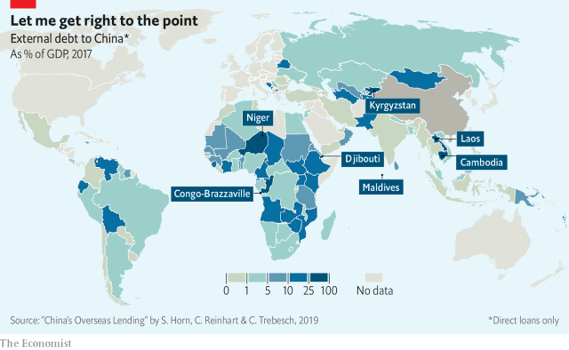

###### Hey, big lender

# A new study tracks the surge in Chinese loans to poor countries 

> print-edition iconPrint edition | Finance and economics | Jul 13th 2019 

 

LOAN TALKS with Belarus; funding for bridges in Liberia; a possible gas project in Timor-Leste; accusations of exploitation in Tanzania; a corporate dispute in India; pledges to support the Rwandan private sector. And that was just the past few weeks. Such is the frenetic pace of China’s overseas lending that its outstanding loans have risen from almost nothing in 2000 to more than $700bn today. It is the world’s largest official creditor, more than twice as big as the World Bank and IMF combined. Yet tracking the money is hard because of limited transparency in its disclosures. 

A new study by Sebastian Horn and Christoph Trebesch of the Kiel Institute for the World Economy and Carmen Reinhart of Harvard University offers the most comprehensive picture yet of China’s official credit flows (including state-owned banks). It adds to concern about whether China has sowed the seeds for debt problems abroad. They find that nearly half of China’s lending to developing countries is “hidden”, in that neither the World Bank nor the IMF has data on it. 

The problem is most severe for the most vulnerable borrowers: the authors conclude that in its reporting to the Bank for International Settlements, an organisation of central banks, China has disclosed no loans to Iran, Venezuela or Zimbabwe, despite giving them plenty in the past 15 years. They speculate that China avoids cross-border claims by disbursing loans directly to Chinese contractors, so that recipient governments will not misuse funds. 

According to the authors, the 50 biggest recipients now have debts with China worth about 17% of their GDP on average (see map), up from 1% in 2005. Strikingly, many were granted debt relief by wealthy creditors in the early 2000s after a wave of defaults. But thanks to China’s largesse they are now on track to reach the same level of debt that they had before the crisis. 

Whereas the norm for other official creditors is to lend at concessional terms, about 60% of Chinese loans are extended at higher interest rates and shorter maturities. They often have commodity revenues as collateral. China has started to talk about making its loans more sustainable, but there is little evidence of that so far. 

Though China is often depicted as an unforgiving lender, the study finds that it has engaged in at least 140 restructurings and write-offs of external debt since 2000. Moreover, the boom could soon tail off. Chinese economic growth and capital outflows are closely correlated. As China slows its lending floodwaters might recede. 

-- 

 单词注释:

1.lender['lendә]:n. 出借人, 贷方 [经] 出借者, 贷方, 贷款人 

2.surge[sә:dʒ]:n. 巨涌, 汹涌, 澎湃 vi. 汹涌, 澎湃, 颠簸, 猛冲, 突然放松 vt. 使汹涌奔腾, 急放 [计] 电压尖峰 

3.Jul[]:七月 

4.Belarus['belərəs]:n. 白俄罗斯, 白俄罗斯共和国 

5.Liberia[lai'biәriә]:n. 利比里亚 [经] 利比利亚 

6.accusation[ækju:'zeiʃәn]:n. 控告, 指控, 指责 [法] 控告, 起诉, 告发 

7.exploitation[.eksplɒi'teiʃәn]:n. 开发, 开采, 剥削 [经] 开发, 剥削, 宜传 

8.Tanzania[.tænzә'ni:ә]:n. 坦桑尼亚 

9.corporate['kɒ:pәrit]:a. 社团的, 合伙的, 公司的 [经] 团体的, 法人的, 社团的 

10.pledge[pledʒ]:n. 诺言, 保证, 誓言, 抵押, 信物, 保人, 祝愿 vt. 许诺, 保证, 使发誓, 抵押, 典当, 举杯祝...健康 

11.Rwandan[rj'ɑ:ndәn, -'æn-]:a. 卢旺达的 

12.sector['sektә]:n. 扇形, 部门, 部分, 函数尺, 象限仪, 段, 区段 vt. 把...分成扇形 [计] 扇面; 扇区; 段; 区段 

13.frenetic[fri'netik]:a. 发狂的, 狂热的 n. 发狂者 

14.oversea['әuvә'si:]:adv. 海外, 向国外, 向海外, 国外 a. 外国的, 在国外的, 在海外的, 舶来的 

15.creditor['kreditә]:n. 债权人 [法] 债权人, 债主, 贷方 

16.IMF[]:国际货币基金组织 [经] 国际货币基金 

17.transparency[træns'pærәnsi]:n. 透明, 透明度, 透过性, 透明物, 清晰 [计] 透明性; 透明 

18.disclosure[dis'klәuʒә]:n. 揭发, 泄露, 揭发(或暴露)的事实 [经] 揭示, 披露 

19.sebastian[si:'bæstjәn]:n. 塞巴斯蒂安（男子名） 

20.Christoph[]:克里斯托夫（人名） 

21.kiel[ki:l]:n. 基尔（联邦德国港市） 

22.carman['kɑ:mәn]:n. 运货马车的车夫, 电车司机 

23.reinhart[]: [人名] 莱因哈特 

24.Harvard['hɑ:vәd]:n. 哈佛大学 

25.datum['deitәm]:n. 论据, 材料, 资料, 已知数 [医] 材料, 资料, 论据 

26.vulnerable['vʌlnәrәbl]:a. 易受伤害的, 有弱点的, 易受影响的, 脆弱的, 成局的 [医] 易损的 

27.organisation[,ɔ: ^әnaizeiʃən; - ni'z-]:n. 组织, 团体, 体制, 编制 

28.Iran[i'rɑ:n]:n. 伊朗 

29.Venezuela[,vene'zweilә]:n. 委内瑞拉 

30.Zimbabwe[zim'bɑ:bwei]:n. 津巴布韦 

31.speculate['spekjuleit]:vi. 深思, 推测, 投机 [经] 投机 

32.disburse[dis'bә:s]:vt. 支付, 支出, 分配 [经] 支付, 支出, 偿付 

33.contractor['kɒntræktә]:n. 立契约的人, 承包商 [化] 承包者; 承包工厂 

34.recipient[ri'sipiәnt]:a. 领受的, 容易接受的, 感受性强的 n. 领受者, 容纳者, 容器 

35.misuse[.mis'ju:z]:n. 误用, 滥用 vt. 误用, 滥用, 虐待 

36.strikingly[]:adv. 显著地, 惊人地, 引人注目地 

37.default[di'fɒ:lt]:n. 违约, 不履行责任, 缺席, 默认值 v. 疏怠职责, 缺席, 拖欠, 默认 [计] 默认; 默认值; 缺省值 

38.largesse[lɑ:'dʒes]:n. 慷慨的赠与, 慷慨赠与物, 慷慨的赏钱 

39.norm[nɒ:m]:n. 基准, 模范, 标准, 准则, 平均数 [化] 定额 

40.concessional[kәn'seʃәnl]:a. 让步的, 容许的 [法] 让步的, 特许的, 优惠的 

41.maturity[mә'tjuәriti]:n. 成熟, 完备, 到期 [医] 成熟, 成熟期, 发育期 

42.commodity[kә'mɒditi]:n. 农产品, 商品, 有用的物品 [经] 商品, 货物, 日用品 

43.collateral[kә'lætәrәl]:a. 并行的, 附随的, 旁系的 n. 旁系亲属, 担保品 

44.sustainable[sә'steinәbl]:a. 足可支撑的, 养得起的, 可以忍受的 

45.depict[di'pikt]:vt. 描述, 描写 

46.unforgiving[.ʌnfә'giviŋ]:a. 不宽恕人的, 不原谅人的 

47.restructuring[]:[计] 重构的 

48.outflow['autflәu]:n. 流出, 流出物 [医] 流出, 传出, 流出物 

49.correlate['kɒrәleit]:n. 有相互关系的东西, 相关物 vt. 使有相互关系 vi. 相关 

50.floodwater['flʌdwɒ:tә]:n. 洪水 

51.recede[ri'si:d]:vi. 向后退, 退却, 收回, 降低, 减弱 [医] 退缩 

