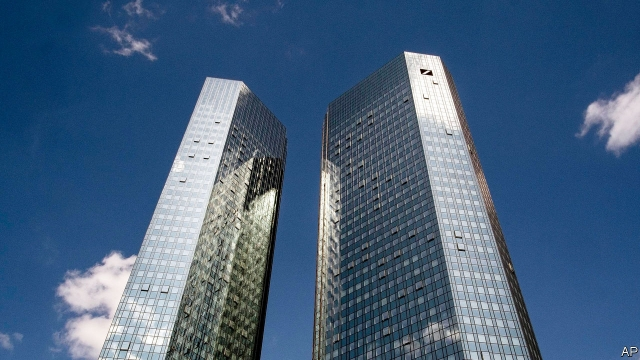

###### A threadbare lender’s new style

# Recognising reality at Deutsche Bank 

 

> print-edition iconPrint edition | Finance and economics | Jul 13th 2019 

“THE MOST fundamental transformation of Deutsche Bank in decades.” So Christian Sewing described his refashioning of the chronically unprofitable firm, announced on July 7th. Germany’s biggest lender is trimming its investment bank—and excising the trading of shares altogether. Mr Sewing, chief executive since April 2018, intends to cut costs by €5.8bn ($6.7bn) a year, a quarter of the total, by 2022. Eighteen thousand jobs, a fifth of the payroll, will go. Some equity traders were shown the door on July 8th. 

The restyling has taken five months to plan (during which time Deutsche also pondered and dismissed a merger with its Frankfurt neighbour, Commerzbank). It looks bold. Yet it is also a belated recognition of reality. For years after the financial crisis, Deutsche clung to the hope that it would again strut alongside Wall Street’s most glamorous names, as it had for a heady 20 years. Mr Sewing has binned the last threads of that ambition. The remodelled Deutsche—150 years old next year—will look a lot more like the sober servant of international companies it originally was. 

Mr Sewing is reshaping the bank around four lines. At the centre will be a corporate bank, chiefly providing European businesses with cash management, trade finance, foreign exchange and so forth: dull-sounding work but steady. A substantial investment bank remains, bringing in 30% of revenue, but geared to the needs of corporate clients, by arranging issues of securities and advising on mergers. The third element is Germany’s biggest retail bank, combining an eponymous posh brand and the dowdier Postbank, and the fourth is DWS, its biggest asset manager, of which Deutsche owns 80%. Mr Sewing is stuffing €74bn of risk-weighted assets he wants to discard into a “capital-release unit” (he balks at the term “bad bank” but may have to live with it). 

Restructuring will cost Deutsche €7.4bn, of which €5.1bn will land in 2019, entailing a fourth net loss in five years. Mr Sewing also plans to spend €13bn on sharper technology and €4bn on improving internal controls. Deutsche has been in legal hot water too often. According to the Wall Street Journal, America’s Justice Department is investigating whether Deutsche broke laws in its work for 1MDB, a Malaysian state development fund. Yet he intends to raise no new equity. By 2022 he expects Deutsche to be returning 8% on tangible equity and starting to pay shareholders a bounty of up to €5bn. 

The restructuring is a start in itself. The four core businesses notionally returned 1.7% last year and the bad bank, much of which Deutsche hopes to run off briskly, lost 6%. A more stable business model should mean lower funding costs. Still, an 8% return might be the bare minimum that shareholders expect. According to the European Banking Authority, a supervisor, four-fifths of European banks estimate their cost of equity to be above that mark. Even at a spruced-up Deutsche, costs will soak up 70% of revenues. That beats today’s 90%-plus, but the best banks do far better. 

The targets may also be hard to hit. Granted, Deutsche has met Mr Sewing’s cost-cutting goals so far; and he says his projection for revenue growth is “conservative”, just 2% a year. But European banking is far from lucrative. Interest rates are rock-bottom and growth is slow. Worse, in Germany an army of public-sector and co-operative banks tussle for the custom of savers and companies. Michael Rohr of Moody’s notes that Deutsche’s revenues have dropped since its last strategic revamp, in 2015. Quitting equity trading, he adds, makes Deutsche’s investment bank even more reliant on fixed income, where fee pools have been shrinking. 

Sensible as Mr Sewing’s plan looks, because Deutsche has fallen short so often investors will take some convincing. After it was unveiled, the share price fell to new lows, of just a fifth of net book value. “It is different this time,” Mr Sewing told journalists on July 8th. It has to be. 
<<<<<<< HEAD

-- 

 单词注释:

1.threadbare['θredbeә]:a. 衣服磨薄了的, 穿旧了的, 衣着褴褛的, 俗套的, 乏味的 

2.deutsche[]:n. 德意志联邦共和国马克 

3.Jul[]:七月 

4.refashion[.ri:'fæʃәn]:vt. 再做, 重制 [经] 再做, 重制 

5.chronically['krɒnikli]:adv. 慢性地, 长期地, 习惯性地 

6.unprofitable[.ʌn'prɒfitәbl]:a. 无利益的, 不赚钱的, 不上算的 [法] 无利可图的, 无益的 

7.lender['lendә]:n. 出借人, 贷方 [经] 出借者, 贷方, 贷款人 

8.excise[ek'saiz]:n. (烟、酒等)消费税, 货物税, 国产税 vt. 切除 

9.payroll['peirәul]:n. 工资名单, 饷金名单, 发放的工资总额 [计] 工资表, 工资单 

10.equity['ekwiti]:n. 公平, 公正 [经] 权益, 产权 

11.trader['treidә]:n. 商人, 商船 [经] 交易者, 商船 

12.restyle[ri:'stail]:vt.改变…的风格(或格调),改变…的式样[款式] 

13.ponder['pɒndә]:v. 沉思, 考虑 

14.merger['mә:dʒә]:n. 合并, 归并 [经] 购并 

15.frankfurt['fræŋkfәt]:n. 牛肉香肠, 猪牛肉混合香肠 

16.commerzbank[]: 德国商业银行公司总部所在地：德国主要业务：银行 

17.belated[bi'leitid]:a. 迟来的 [法] 过了期的, 落后了的 

18.cling[kliŋ]:vi. 粘紧, 附着, 紧贴, 坚持 

19.strut[strʌt]:n. 高视阔步, 支柱, 压杆 vi. 趾高气扬地走, 肿胀 vt. 用支柱支撑, 炫耀 

20.glamorous['glæmәrәs]:a. 富有魅力的, 迷人的 

21.heady['hedi]:a. 顽固的, 任性的, 性急的, 猛烈的 

22.bin[bin]:n. (贮存谷物等的)容器, 箱子 [计] 二进制, 商业信息网 

23.remodel[ri:'mɒdl]:vt. 改造, 改型, 改变 

24.originally[ә'ridʒәnli]:adv. 本来, 原来, 最初, 就起源而论, 独创地 

25.reshape[ri:'ʃeip]:vt. 改造, 使成新的形状, 打开新局面 vt. 整形 vi. 整形 [计] 整形 

26.corporate['kɒ:pәrit]:a. 社团的, 合伙的, 公司的 [经] 团体的, 法人的, 社团的 

27.chiefly['tʃi:fli]:adv. 主要地 

28.client['klaiәnt]:n. 客户, 顾客, 委托人 [计] 客户, 客户机, 客户机程序 

29.eponymous[i'pɒnimәs]:a. 齐名的 

30.posh[pɒʃ]:a. 豪华的, 漂亮的, 优雅的, 极好的 interj. 呸 

31.dowdy['daudi]:a. 过时的, 懒散的 n. 懒散女人, 邋遢女人 

32.Postbank[]:[网络] 邮政银行；德国邮政银行；信贷银行德国邮政银行 

33.dws['di:d'əbəlju:'es]:abbr. double white silk 双白丝; double wound silk 双丝包的（导线）; drinking-water standards 饮用水标准 

34.asset['æset]:n. 资产, 有益的东西 

35.balk[bɒ:k]:n. 障碍, 错误, 失败 vt. 阻止, 错过, 推诿 vi. 逡巡不前 

36.restructuring[]:[计] 重构的 

37.entail[in'teil]:vt. 使成为必需, 需要, 使承担, 遗传给 n. 限定继承 

38.Sharpe['ʃa:p]:n. 夏普指数；夏普指标；夏普（人名） 

39.Malaysian[mә'leiziәn]:a. 马来西亚的 n. 马来西亚人 

40.tangible['tændʒәbl]:n. 可触知的东西, 有形资产 a. 可触摸的, 有实体的, 非相像的, 有形的, 明确的 

41.shareholder['ʃєә.hәuldә]:n. 股东 [法] 股东, 股票持有人 

42.bounty['baunti]:n. 慷慨, 宽大, 礼物 [经] 奖励金, 补贴 

43.restructuring[]:[计] 重构的 

44.notionally['nəuʃənəli]:adv. 想象地 

45.briskly['briskli]:adv. 活泼地, 精神勃勃地 

46.supervisor[.sju:pә'vaizә]:n. 管理者, 监督者, 指导者, 视导员 [计] 管理程序 

47.projection[prә'dʒekʃәn]:n. 发射, 计划, 突出部分, 设计, 推测 [计] 投影 

48.lucrative['lu:krәtiv]:a. 有利益的, 获利的, 合算的 

49.tussle['tʌsl]:n. 扭打, 争斗, 论争 vi. 扭打, 打斗 

50.saver['seivә]:n. 节省...的器具, 节约装置, 省俭的人 [化] 回收器; 收集器 

51.michael['maikl]:n. 迈克尔（男子名） 

52.rohr[]:罗尔（人名） 

53.revamp[ri:'væmp]:vt. 换新鞋面, 修理, 修补, 修改 [经] 整修, 补, 修改 

54.reliant[ri'laiәnt]:a. 依赖的, 信赖的 

55.investor[in'vestә]:n. 投资者 [经] 投资者 

56.unveil[.ʌn'veil]:vt. 揭开, 揭幕, 除去...的面纱 vi. 显露, 除去面纱 
=======
>>>>>>> 50f1fbac684ef65c788c2c3b1cb359dd2a904378

