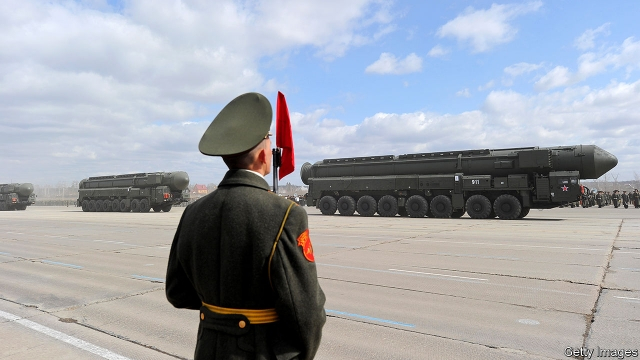
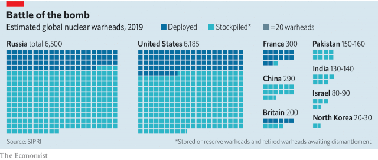

###### Nuclear diplomacy

# Donald Trump risks undoing decades of nuclear arms control 

 

> print-edition iconPrint edition | United States | Jul 11th 2019 

ON JUNE 30TH, when President Donald Trump took a few paces inside North Korean territory with Kim Jong Un at Panmunjom, the symbolism suggested a determined new push towards easing nuclear tensions. Talks between America and North Korea, stalled since an unsuccessful summit in Hanoi in February, were due to resume in Berlin this week. Away from the world’s cameras, however, the broader picture on nuclear arms control looks very different. Things are heading not forwards but backwards, at an accelerating rate. 

After the Cuban missile crisis in 1962 took America and the Soviet Union to the brink, they grew serious about nuclear negotiations. In 1972 they signed an agreement capping the number of each other’s strategic delivery systems, and a treaty to limit defences against ballistic missiles. Over the next four decades they mustered seven other big nuclear deals. Their combined destructive potential dropped from the equivalent of 1.3m Hiroshima bombs in 1973-74 to about 80,000 Hiroshimas now—less obscene, if still horrendous. 

Yet nuclear deals are now unravelling. Mr Trump pulled America out of the multiparty one with Iran, known as the Joint Comprehensive Plan of Action (JCPOA), hoping to press that country into a bigger, better accord, but so far producing only heightened tensions. Iran has now breached the deal’s limit for stockpiles of low-enriched uranium and gone above the 4% level of enrichment allowed. Last October Mr Trump abruptly declared that America would withdraw from the treaty on Intermediate-range Nuclear Forces (INF), citing Russia’s violation of its ban on ground-launched missiles with a range of 500-5,500km (300-3,400 miles). The treaty, signed by Ronald Reagan and Mikhail Gorbachev in 1987, is set to expire on August 2nd. Its demise could open the way for a new arms race in missiles, whether nuclear or conventional, whose time to target is mere minutes. 

That still leaves in place one big nuclear treaty between America and Russia: New START, signed by Presidents Barack Obama and Dmitry Medvedev in 2010. It limits each country to 1,550 deployed nuclear warheads across 700 delivery systems; its verification regime includes 18 on-site inspections each year and copious data exchanges. But New START will lapse in 19 months’ time unless both countries agree to a five-year extension, which their leaders can do without congressional approval. The prospects are not good: Russia is keen; America appears not to be. “There’s no decision”, Mr Trump’s national security adviser, John Bolton, told Free Beacon, a website, last month, “but I think it’s unlikely.” 

For an extension to be agreed upon, some differences would have to be settled. The Americans worry about Russia’s plans for new weapons, such as the Avangard hypersonic boost-glide system; the Russians have concerns over the way the Americans got within START’s limits, converting nuclear delivery systems into conventional ones rather than destroying them. President Vladimir Putin bemoans the absence of practical moves from the Americans, despite Mr Trump’s earlier expressions of interest. Talks need to start now, Mr Putin told the Financial Times last month, to settle matters in time. If the treaty ceases to exist, he said, “there would be no instrument in the world to curtail the arms race.” 

Worse, each side would be left blind. Without a START extension America and Russia “will be without on-the-ground insight into each other’s nuclear forces for the first time in about 50 years, which is incredibly dangerous”, says Alexandra Bell of the Centre for Arms Control and Non-Proliferation, a think-tank. The verification regime enables policymakers to plan with confidence. A former official involved in negotiating the treaty says it would cost “multiple billions of dollars per year” to gather the intelligence by other means. 

Why would Mr Trump give this up? It is not for lack of interest in arms control. As far back as 1986 he is said to have wanted to ask Reagan to let him negotiate a nuclear deal and quickly end the cold war. Now he sees an Obama accord and believes he can do better. He envisages not just a bilateral deal with Russia, but a broader one involving China and perhaps others, embracing all weapons systems. He has asked his administration to explore this. 

In theory this makes sense. Bilateral nuclear deals had a logic during the cold war, but Mr Bolton has argued that in today’s multipolar nuclear world that is “conceptually completely backward”. American officials expect China’s arsenal to double over the next decade. Arms-control advocates agree that hypersonic weapons and cyber capabilities pose new threats. “We’re facing an international security crisis in the arms-control arena as technologies are outpacing the diplomatic and legal frameworks that in the past served us well in nuclear and chemical and biological weapons,” says Daryl Kimball, director of the Arms Control Association in Washington, DC. 

In practice, though, Mr Trump’s approach looks hopeless. For one thing, China shows no interest in it. It has a nuclear arsenal of only 290 warheads, compared with America’s 6,185 and Russia’s 6,500, according to the Stockholm International Peace Research Institute. It sees no reason to submit to limits just yet. And if numbers fell much more Russia would want French and British weapons included in the mix. 

 

Arms-control experts doubt that the Trump administration has the bandwidth to conduct serious negotiations with the Russians, Chinese and North Koreans at the same time. (The State Department office responsible for handling nuclear disarmament has shrunk from 14 people to four during Mr Trump’s presidency, the Guardian recently reported.) They detect no strategy for conducting such a complex negotiation. Besides, they view Mr Bolton as a wily operator who hates arms control, which he sees as constraining America. Under George W. Bush in 2001 he helped to pull America out of the Anti-Ballistic Missile Treaty; in his current role he has seen off the Iran deal and the INF treaty. The suspicion is that he is using the idea of a bigger deal as a diversion to kill New START. 

Some would like to see New START extended first, thus retaining its precious verification provisions, before moving on to a broader arms-control effort, which could take years. They believe both sides’ concerns over an extension could be quickly sorted out if there was clear political direction from the top (on that Mr Bolton agrees: “if you really want to negotiate, you can do it fast,” he told Free Beacon). Pressure is starting to come from Congress. In May leaders of the House Foreign Affairs Committee introduced a bipartisan bill urging the Trump administration to retain the limits on Russia’s nuclear forces until 2026. Mr Trump could yet find himself vulnerable to attack on the nuclear issue by Democratic candidates for his job. 

He also risks a rough ride at the five-yearly review conference, next spring, of the Nuclear non-Proliferation Treaty (NPT). It will be an acrimonious affair if the nuclear powers are not seen to be doing their bit to contain the spread of weapons. There is already a deep split over the Treaty on the Prohibition of Nuclear Weapons, approved by the UN General Assembly in 2017, which seeks to delegitimise nukes. “If the United States and Russia can’t show up in 2020 and at least say we’ve extended New START, and hopefully say we’ve extended and are engaged in further discussion, we’re going to be in bad shape,” says Lynn Rusten of the Nuclear Threat Initiative, an advocacy group in Washington, DC. 

Erosion of the NPT could give more countries an excuse to join the nuclear club. The number of nukes in the world has come down, but could swell again in the absence of controls or trust. Alexey Arbatov, from the Institute of World Economy and International Relations in Moscow, bemoans a lack of understanding of the history of nuclear arms control among the world’s leaders today. That could result in miscalculation. “Saving the INF treaty and START while there is still time would be much easier and more productive than searching for palliatives after their demise,” he concludes in the current issue of Survival, the journal of the International Institute for Strategic Studies. 

Time, though, is running out. Finding a way to re-engage with Russia before it is too late will not be easy. But it would probably matter more than those steps across the border at Panmunjom. 
<<<<<<< HEAD

-- 

 单词注释:

1.diplomacy[di'plәumәsi]:n. 外交, 外交手腕, 交际手段 [法] 外交, 外交手腕, 权谋 

2.Jul[]:七月 

3.Korean[kә'riәn]:n. 朝鲜人, 朝鲜语 a. 朝鲜人的, 朝鲜语的 

4.kim[]:n. 金姆（人名） 

5.jong[jɔŋ]:n. 小伙子；（旧时的）青年男奴 

6.UN[ʌn]:pron. 家伙, 东西 [经] 联合国 

7.Panmunjom[,pɑ:n,mun'dʒʌm]:板门店[朝鲜中西部一村庄] 

8.symbolism['simbәlizm]:n. 象征主义, 符号论 [医] 象征主义 

9.Korea[kә'riә]:n. 朝鲜, 韩国 

10.stall[stɒ:l]:n. 厩, 停车处, 牧师职位, 货摊, 托辞, 拖延 vt. 关入厩, 停顿, 推托, 支吾, 使陷于泥中 vi. 被关在厩内, 陷于泥中, 停止, 支吾 

11.hanoi[hæ'nɔi]:n. 河内（越南首都） 

12.Berlin[bә:'lin]:n. 柏林, (软质)柏林毛线 

13.backwards['bækwәdz]:adv. 向后 

14.Cuban['kju:bәn]:a. 古巴的, 古巴人的 n. 古巴人 

15.brink[briŋk]:n. 边缘, 陡岸 

16.negotiation[ni.gәuʃi'eiʃәn]:n. 谈判, 磋商, 交涉 [经] 谈判, 协商 

17.ballistic[bә'listik]:a. 弹道的 [医] 射击的, 冲击的 

18.muster['mʌstә]:n. 召集, 集合, 检阅, 清单, 花名册, 样品 vt. 召集, 集合, 应召 vi. 集合, 集中 

19.Hiroshima[,hirә'ʃi:mә]:广岛[日本本州岛西南岸港市] 

20.Hiroshima[,hirә'ʃi:mә]:广岛[日本本州岛西南岸港市] 

21.obscene[ɒb'si:n]:a. 淫秽的, 猥亵的, 讨人厌的, 可憎的 [法] 猥亵的, 海洋的, 污秽的 

22.horrendous[hɒ'rendәs]:a. 可怕的, 骇人的, 不得了的 

23.unravel[.ʌn'rævl]:vt. 阐明, 解决, 解开 vi. 散开 

24.multiparty[,mʌlti'pɑ:ti]:a. 多党的,包括多党的,包含多党党员的, 导致多党并存的选举(或政治)制度的 

25.Iran[i'rɑ:n]:n. 伊朗 

26.heighten['haitn]:vt. 增高, 提高, 加强 vi. 升高, 变大 

27.breach[bri:tʃ]:n. 裂口, 违背, 破坏, 违反, 突破, 破裂 vt. 攻破, 突破 vi. 跳出水面 

28.stockpile['stɒkpail]:n. 储蓄, 积蓄, 库存 vt. 储蓄, 贮存 

29.uranium[ju'reiniәm]:n. 铀 [化] 铀U 

30.enrichment[in'ritʃmәnt]:n. 丰富, 肥沃 [化] 富集 

31.abruptly[ә'brʌptli]:adv. 突然地, 唐突地 

32.inf[]:abbr. 中程核力量（Intermediate-range Nuclear Forces） 

33.cite[sait]:vt. 引用, 引证, 表彰 [建] 引证, 指引 

34.violation[.vaiә'leiʃәn]:n. 违反, 违背, 妨碍 [法] 违犯, 违背, 违反 

35.ronald['rɔnәld]:n. 罗纳德（男子名） 

36.reagan[]:n. 里根（姓氏） 

37.Mikhail[]:米哈伊尔（人名） 

38.Gorbachev[]:[经] 戈尔巴乔夫 

39.expire[ik'spaiә]:vi. 期满, 呼气, 断气 vt. 呼出 

40.demise[di'maiz]:n. 崩, 薨, 死亡 vt. 让渡, 遗赠, 转让 

41.barack[bɑ:'ræk]:n. 巴拉克（男子名） 

42.obama[]:n. 奥巴马(姓) 

43.Dmitry[]:n. 德米特里（俄罗斯钢琴家） 

44.Medvedev[]:n. 梅德韦杰夫（俄罗斯总统） 

45.deploy[di'plɒi]:v. 展开, 配置 

46.warhead['wɒ:hed]:n. 弹头 

47.verification[.verifi'keiʃәn]:n. 证实, 查证, 证明属实 [计] 验证 

48.regime[rei'ʒi:m]:n. 政权, 当权期间, 政体, 社会制度, 体制, 情态 [医] 制度, 生活制度 

49.copious['kәupiәs]:a. 很多的, 丰富的, 内容丰富的 

50.datum['deitәm]:n. 论据, 材料, 资料, 已知数 [医] 材料, 资料, 论据 

51.lapse[læps]:n. 过失, 流逝, 失效 vi. 犯错, 堕落, 减退, 消失, 流逝 vt. 使失效 

52.congressional[kәn'greʃәnl]:a. 会议的, 议会的, 国会的 [法] 代表大会的, 大会的, 议会的 

53.adviser[әd'vaizә]:n. 顾问, 劝告者, 指导教师 [法] 顾问, 劝告者 

54.john[dʒɔn]:n. 盥洗室, 厕所, 嫖客 

55.bolton['bәultәn]:a. 可用螺栓固定的 

56.beacon['bi:kn]:n. 烽火, 灯塔 v. 照亮 

57.avangard[]:[网络] 埃文格瑞；阿华加德；前卫家俱公司 

58.hypersonic[.haipә'sɒnik]:a. 极超音速的, 以高超声速行进的 [化] 特超声速的; 高超声速的 

59.Vladimir[vlɑ'dimɪr]:n. 弗拉基米尔（古罗斯弗拉基米尔-苏兹达里公国的古都） 

60.putin['putin]:n. 普京（人名） 

61.bemoan[bi'mәun]:vt. 哀悼, 惋惜, 认为遗憾, 哀叹 

62.curtail[kә:'teil]:vt. 缩减, 剥夺, 简略 [法] 剥夺特权 

63.incredibly[in'kredәbli]:adv. 不能相信地 

64.alexandra[,æli^'zɑ:ndrә]:n. 亚历山德拉（女子名, 义为男人的保护者） 

65.policymaker['pɔlisi.meikә]:n. 政策制定者；决策人 

66.quickly['kwikli]:adv. 很快地 

67.envisage[in'vizidʒ]:vt. 面对, 正视, 想象 

68.bilateral[bai'lætәrәl]:a. 有两边的, 双边的, 双方的 [医] 两侧的 

69.bilateral[bai'lætәrәl]:a. 有两边的, 双边的, 双方的 [医] 两侧的 

70.multipolar[.mʌlti'pәulә]:a. 多极的 [医] 多极的 

71.conceptually[kәn'septʃuәli]:adv. 概念地 

72.arsenal['ɑ:snәl]:n. 兵工厂, 军械库 [机] 兵工厂 

73.cyber['saibә]:a. 网络的, 计算机的 

74.capability[.keipә'biliti]:n. 能力, 性能, 约束力 [化] 能力 

75.arena[ә'ri:nә]:n. 角斗场, 舞台, 场地 [医] 尿沉渣, 尿沙; 脑沙 

76.outpace[.aut'peis]:vt. 超过...速度, 赶过 

77.diplomatic[.diplә'mætik]:a. 外交的, 老练的 [法] 外交的, 外交上的, 文献上的 

78.biological[.baiәu'lɒdʒikәl]:a. 生物学的 [医] 生物学的 

79.Daryl['dæril]:n. 达里尔(Darrell 的异体)(m.) 

80.kimball[]:[计] 金布尔 

81.Washington['wɒʃiŋtn]:n. 华盛顿 

82.DC[]:直流电 [计] 数据单元, 数据中心, 数据代码, 数据通信, 数据控制, 数字控制, 直流 

83.Stockholm['stɒkhәulm]:n. 斯德哥尔摩 

84.bandwidth['bændwidθ]:n. 频带宽度, 通带宽度 [计] 带宽, 频宽 

85.Korean[kә'riәn]:n. 朝鲜人, 朝鲜语 a. 朝鲜人的, 朝鲜语的 

86.disarmament[dis'ɑ:mәmәnt]:n. 裁军 [法] 裁军, 解除军备 

87.presidency['prezidәnsi]:n. 总统职权, 总裁职位 

88.guardian['gɑ:diәn]:n. 看守者, 监护人, 保护人 a. 保护的 

89.wily['waili]:a. 使用计谋的, 有诡计的, 狡猾的 

90.constrain[kәn'strein]:vt. 强迫, 限制, 关押 

91.george[dʒɔ:dʒ]:n. 乔治（男子名）；自动操纵装置；英国最高勋爵勋章上的圣乔治诛龙图 

92.W['dʌb(ә)lju:]:[计] 等待, 写, 字 [医] 钨(74号元素) 

93.diversion[dai'vә:ʒәn]:n. 转移 [医] 转向 

94.bipartisan[bai,pɑ:ti'zæn]:a. 两党连立的 

95.vulnerable['vʌlnәrәbl]:a. 易受伤害的, 有弱点的, 易受影响的, 脆弱的, 成局的 [医] 易损的 

96.npt[]:abbr. 美国标准圆锥管螺纹量规 

97.acrimonious[ækri'mәunjәs]:a. 尖刻的, 讥讽的, 激烈的 

98.prohibition[.prәuhi'biʃәn]:n. 禁令, 禁止 

99.UN[ʌn]:pron. 家伙, 东西 [经] 联合国 

100.delegitimise[]:[网络] 去合法性；非法化 

101.nuke[nju:k]:n. 核武器, 核电厂, 原子核 vt. 以核武器攻击, 把...打垮 a. 核武器的 

102.hopefully['hәjpfjli]:adv. 有希望地, 如果希望能实现的话 

103.lynn[lin]:n. 林恩（姓氏） 

104.advocacy['ædvәkәsi]:n. 拥护, 支持, 鼓吹, 辩护, 辩护术 [法] 辩护, 拥护, 提倡 

105.erosion[i'rәuʒәn]:n. 腐蚀, 冲蚀, 侵蚀 [化] 磨耗; 侵蚀 

106.alexey[]:n. (Alexey)人名；(俄)阿列克谢 

107.arbatov[]:[网络] 阿尔巴托夫 

108.miscalculation[]:n. 算错, 失算, 估计错误 [计] 计算错误, 算错 

109.palliative['pælieitiv]:a. 缓和的, 减轻的, 掩饰的 n. 辩解, 缓和物 
=======
>>>>>>> 50f1fbac684ef65c788c2c3b1cb359dd2a904378

