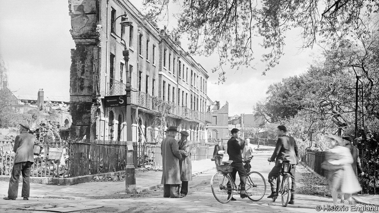

###### Dust to dust

# The vandalism of modern warfare 

 

> print-edition iconPrint edition | Books and arts | Jul 20th 2019 

“I WENT TO Exmouth,” wrote Margaret Tomlinson in February 1942, “and found they had dropped their eight bombs along the back of the one good Georgian terrace.” Tomlinson was part of the National Buildings Record (NBR), a small team of investigator-photographers hurriedly assembled during the Blitz to memorialise Britain’s bombed-out buildings. Today her negatives—often the only records of crumbled landmarks—repose in the archive of Historic England, a heritage agency. 

The story of the NBR is told at a new exhibition at the Imperial War Museum in London. “What Remains”, put on with Historic England, explores the targeting of cultural treasures in war. The NBR, it explains, was a reaction to a brutal new trend in conflict. Aerial bombing had expanded the parameters of the battlefield; techniques had been developed to target civilian architecture, along with theories that made such bombardments seem morally permissible, and militarily desirable. 

Giulio Douhet, an Italian general, had argued in 1921 that bombing distant civilian settlements could swiftly ruin a country’s morale. Hugh Trenchard, head of Britain’s nascent Royal Air Force, likewise maintained that aerial bombing could be the key to winning entire wars. He put these conjectures into practice in Iraq, where villages that rebelled against colonial rule were bombed by RAF aircraft. “Within 45 minutes”, observed a squadron leader called Arthur Harris in 1924, “a full sized village…can be practically wiped out.” As head of RAF Bomber Command, Harris oversaw devastating raids on Hamburg and Dresden during the second world war. 

As the exhibition shows, however, such carnage provokes defiance as often as it wrecks morale. “What Remains” includes displays and propaganda videos depicting the ravages inflicted by Islamic State (IS) in Mosul and Palmyra. In the end the videos rallied opposition to IS; several projects are now restoring what was lost. In 1942 Joseph Goebbels scrambled to present the Baedeker raids, in which Nazi planes attacked historic British towns, as legitimate retaliation rather than gratuitous vandalism. 

When historic buildings are destroyed, says Eyal Weizman of Forensic Architecture, a group that has documented Yazidi towns and villages that IS tried to raze, “you also destroy the culture—you destroy the communities.” Gruesome as they are, the theories that led to the creation of the NBR continue to have adherents: war is still in part an architectural endeavour. ■ 

-- 

 单词注释:

1.vandalism['vændәlizm]:n. 故意毁坏文物的行为, 破坏他人财产的行为 

2.warfare['wɒ:fєә]:n. 战争, 战斗, 交战, 斗争, 竞争 [法] 战事, 作战, 交战 

3.Jul[]:七月 

4.Exmouth[]:n. (Exmouth)人名；(英)埃克斯茅斯 埃克斯茅斯 

5.margaret['mɑ:^әrit]:n. 玛格利特（女子名） 

6.Tomlinson['tɔmlinsn]:汤姆林森(姓氏) 

7.Georgian['dʒɒ:dʒjәn]:n. 乔治亚州人, 乔治亚人 a. 乔治王时代的, 乔治王时代艺术风格的, 乔治亚的 

8.terrace['terәs]:n. 阶地, 梯田, 房屋之平顶, 阳台, 沿岸防地, 露台 a. 叠层式的 vt. 使成梯田, 使成有平台屋顶 

9.nbr[]:abbr. 腈基丁二烯橡胶（nitrile -butadiene rubber） 

10.hurriedly[]:adv. 仓促地；匆忙地 

11.blitz[blits]:n. 闪电战 vt. 以闪电战攻击 

12.memorialise[mi'mɔ: riәlaiz, - 'mәj-]:vt.<主英> = memorialize 

13.crumble['krʌmbl]:v. (使)粉碎, (使)成为碎屑, 瓦解, 崩溃, 败落 

14.archive['ɑ:kaiv]:vt. 把...存档 n. 档案馆, 档案文件 [计] 挡案库, 存档 

15.historic[hi'stɒrik]:a. 历史上著名的, 有历史性的 

16.heritage['heritidʒ]:n. 遗产, 祖先遗留物, 继承物 [医] 遗传性 

17.imperial[im'piәriәl]:a. 帝王的, 宗主国的, 至尊的, 壮丽的 n. 特等品 

18.cultural['kʌltʃәrәl]:a. 文化的, 教养的, 修养的 [医] 培养的 

19.brutal['bru:tәl]:a. 残忍的, 野蛮的, 不讲理的 

20.aerial['єәriәl]:a. 空中的, 航空的, 空气的, 空想的 n. 天线 

21.parameter[pә'ræmitә]:n. 参变数, 参变量, 参数, 参量 [计] 参量; 参数 

22.battlefield['bætlfi:ld]:n. 战场, 沙场 

23.bombardment[bɒm'bɑ:dmәnt]:n. 炮击 [化] 轰击 

24.morally['mɒrәli]:adv. 道德上, 德性上, 有道德地 

25.permissible[pә'misәbl]:a. 可允许的, 可容许程度的 [机] 容许, 允许 

26.militarily['militərili; ,mili'teәrili]:adv. 在军事上 

27.Giulio[]:n. (Giulio)人名；(法、意、葡、汤加)朱利奥 

28.Douhet[]:[网络] 杜黑；黑特 

29.swiftly['swiftli]:adv. 很快地, 即刻 

30.morale[mɒ'rɑ:l]:n. 士气, 道德 

31.hugh[hju:]:n. 休（男子名） 

32.trenchard[]: [人名] 特伦查德 

33.nascent['næsnt]:a. 发生中的, 开始存在的, 初期的 [医] 初发的, 初生的 

34.aerial['єәriәl]:a. 空中的, 航空的, 空气的, 空想的 n. 天线 

35.conjecture[kәn'dʒektʃә]:n. 推测, 猜想, 揣摩 v. 推测, 猜想, 揣摩 [计] 推测; 猜测 

36.Iraq[i'rɑ:k]:n. 伊拉克 

37.colonial[kә'lәunjәl]:a. 殖民的, 殖民地的 [法] 殖民地居民 

38.raf[]:abbr. 英国皇家空军（Royal Air Force） 

39.squadron['skwɒdrәn]:n. 骑兵营, 分遣队, 小舰队 

40.arthur['ɑ:θә]:n. 亚瑟（男子名）；亚瑟王（传说中六世纪前后英国的国王, 圆桌骑士团的首领） 

41.harris['hæris]:n. 哈里斯（英国苏格兰一地区）；哈里斯（姓氏） 

42.bomber['bɒmә]:n. 轰炸机, 投弹手 

43.oversee[.әuvә'si:]:vt. 向下看, 了望, 监督, 偷看到 [法] 监察, 监督, 俯瞰 

44.devastate['devәsteit]:vt. 毁坏 [法] 使荒废, 毁灭, 掠夺 

45.hamburg['hæmbә:^]:n. 汉堡（德国城市） 

46.Dresden['drezdәn]:n. 德累斯顿(德国城市) 

47.carnage['kɑ:nidʒ]:n. 大屠杀, 残杀 

48.provoke[prә'vәuk]:vt. 激怒, 惹起, 诱导 [法] 刺激, 煽动, 激怒 

49.defiance[di'faiәns]:n. 蔑视, 挑战 [法] 挑战, 藐视, 违抗 

50.propaganda[.prɒpә'gændә]:n. 宣传, 宣传活动 [医] 宣传 

51.depict[di'pikt]:vt. 描述, 描写 

52.ravage['rævidʒ]:n. 破坏, 蹂躏 v. 毁坏, 破坏, 掠夺 

53.inflict[in'flikt]:vt. 施以, 加害, 使承受 [法] 处, 加, 予以 

54.Islamic[iz'læmik]:a. 伊斯兰教的, 穆斯林的 

55.Mosul[mәj'su:l,'mәjsəl]:摩苏尔[伊拉克北部城市] 

56.palmyra[pæl'maiәrә]:n. [植]扇叶树头榈（等于palmyra palm） 

57.rally['ræli]:n. 重振旗鼓, 集合, 群众集会, 跌停回升 v. 重整旗鼓, 集合, 恢复精神, 团结, 挖苦, 嘲笑 

58.opposition[.ɒpә'ziʃәn]:n. 反对, 敌对, 相反, 在野党 [医] 对生, 对向, 反抗, 反对症 

59.Joseph['dʒәuzif]:n. 约瑟夫（男子名）；约瑟（圣经中雅各的第十一子） 

60.Goebbel[]:n. (Goebbel)人名；(德)格贝尔 

61.scramble['skræmbl]:n. 攀缘, 爬行, 抢夺, 混乱, 紧急起飞 vi. 攀缘, 杂乱蔓延, 争夺, 拼凑, 匆忙 vt. 攀登, 扰乱, 使混杂 

62.baedeker['beidikә]:n. 旅行指南, 入门手册 

63.Nazi['nɑ:tsi]:n. 纳粹党人 a. 纳粹党的 

64.historic[hi'stɒrik]:a. 历史上著名的, 有历史性的 

65.legitimate[li'dʒitimәt]:a. 合法的, 正当的, 婚生的 vt. 认为正当, 立为嫡嗣, 使合法 

66.retaliation[ri.tæli'eiʃәn]:n. 报复 [法] 报仇, 报复, 回敬 

67.gratuitous[grә'tju:itәs]:a. 免费的, 无理由的 [经] 无代价的 

68.eyal[]:n. (Eyal)人名；(以)埃亚勒 

69.weizman[]:[网络] 威茨曼；魏斯曼 

70.forensic[fә'rensik]:a. 辩论的, 法院的, 关于法庭的 n. 辩论练习 

71.Yazidi[]:[网络] 亚兹迪教派；亚齐德教派；亚其德人 

72.raze[reiz]:vt. 毁灭, 刮去, 把...夷为平地, 消除, 抹去, 破坏 

73.gruesome['gru:sәm]:a. 可怕的, 令人毛骨悚然的, 阴森的 

74.creation[kri:'eiʃәn]:n. 创造, 创作物, 发明 [化] 产生 

75.architectural[.ɑ:ki'tektʃәrәl]:a. 有关建筑的, 建筑学的 

76.endeavour[in'devә]:n. 努力, 力图, 尽力 vi. 努力, 力图, 尽力 

