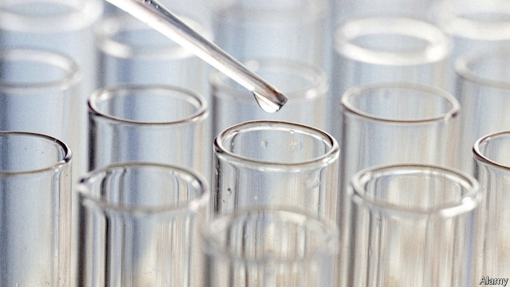

###### Watered down

# French authorities dilute homeopaths’ profits 

 

> print-edition iconPrint edition | Business | Jul 20th 2019 

FOR A NATION that regards itself as the cradle of reason, the French display a peculiar fondness for homeopathy. More than half of them have ingested homeopathic cures, based on the notion, debunked by numerous scientific studies, that water retains “memory” of active ingredients, whose healing power rises as their concentrations fall to a few molecules per dose. Now homeopaths’ profits risk being watered down after France’s health ministry ruled earlier this month that their products would no longer be refunded by social security. 

France has recognised homeopathic remedies as akin to medicine since the 1960s. In 1984 it made them eligible for partial reimbursement from the public purse. Patients there guzzle $700m-worth of the stuff a year, out of global sales of perhaps $4bn. The favourable treatment owes a lot to a vocal homeopathic-pharmaceutical lobby. The world’s biggest maker of such cures is Boiron, based outside Lyon, with total sales of €600m ($674m) last year. 

Many doctors practise homeopathy, but put its supposed benefits down to the placebo effect (which is real). At first the health minister, Agnès Buzyn, seemed to accept the case that patients who pop sugar pills might cut down on antibiotics and other pharmacology, which the French notoriously overconsume. But the advice of scientists—and the prospect of saving over €100m a year—prevailed. Reimbursement rates will decline from 30% today to nothing by 2021. 

Boiron’s bosses have described the cuts as shocking and unfair. They must fear for the health of its operating margins. At 18% these rival those of big drugmakers such as Novartis and Pfizer. Homeopaths do not command the high prices of advanced drugs but can scrimp on science. Boiron employs just 13 people in research, in a workforce of 3,700, and spends €3.8m a year, or 0.6% of sales, on innovation. By contrast, one in six employees at many big pharmaceutical firms is a researcher and drugmakers spend an average of 16% of revenue on developing new treatments (they also charge a lot more for many medicines than homeopaths do). 

Boiron’s shares have lost nearly half their value in the past year as investors priced in the health ministry’s decision. The boss of Weleda France, a rival, worried what it could mean for homeopathy in places like India and South America. Hopefully, a dilution of influence.■ 

