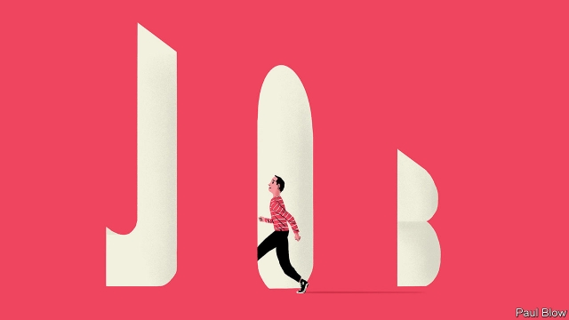

###### Bartleby

# Helping people with learning disabilities into jobs 

 

> print-edition iconPrint edition | Business | Jul 18th 2019 

CHRIS JENKINSON has posters of wrestling stars on his walls, likes to cook burgers and is about to start work in the kitchens of a Hilton hotel in Surrey, England. Emily Martin likes to cook Victoria sponge, is doing work experience at the Hinkley Point nuclear station, and eventually wants to work in a “front of house” role in hospitality.  

These may look like typical life ambitions. What makes them remarkable is that Chris has Down’s syndrome and Emily has learning difficulties. Only 6% of the 1.5m British adults with learning disabilities are in paid employment. Chris and Emily are students at the Foxes Academy in the seaside resort of Minehead, which specialises in helping young people with these conditions. 

In recent years, eight out of ten graduates from the academy have taken jobs in hospitality. Students take a three-year course which allows them to learn how to live independently and develop the skills needed to hold down a job. Bartleby was given a tour of the facilities by Cameron Corrick, a student who has cerebral palsy and is starting as a commis chef (doing food preparation work) in Devon in August. The academy has its own hotel, as well as a teaching centre and a number of hostels in the town centre. 

Early teaching focuses on basic skills. Cameron took Bartleby to a session on communication, where students learned the conversation skills that will be necessary when dealing with the public. In a hostel three girls were learning how to prepare a shopping list, buy the ingredients from a local supermarket and then cook it for lunch. They had just returned from their trip and were planning on making pasta carbonara and stuffed tacos. The students have rotas for shopping, washing and cleaning. Eventually, they will learn how to use PowerPoint to make a presentation, understand the food-hygiene laws (meat, vegetables, etc, are prepared on chopping boards in different colours) and pass exams known as national vocational qualifications.  

The students start off by doing two shifts a week at the hotel. Later on they do work experience in the local community. Fifty businesses offer placements that involve up to 16 hours a week. Other job placements occur by happenstance. J.J. Goodman, a founder of the London Cocktail Club chain, gave a talk at the academy. That inspired Tom Hawkins, a 22-year-old with Down’s syndrome, to ask Mr Goodman to help him pursue his dream of being a barman. Tom has been undergoing training and the chain hopes to offer him a permanent job, where he will be mixing piña coladas with the best of them.  

The education offered by the academy clearly has enormous benefits for the students themselves. Emily says she was bullied at school but found lots of friends when she came to the academy, and gained much confidence as a result. It was easy to see how excited the students were at the prospect of having a job.  

Employers benefit, too. One of the academy’s main supporters is the Hilton group, which has offered 21 work placements and hired nine staff. Through its charitable foundation, it has recently invested $40,000 to improve the academy’s training facilities. Steve Cassidy, Hilton’s managing director in Britain and Ireland says the scheme has gone extremely well, with benefits for the students in terms of training, and benefits for the culture and environment of the hotels themselves. He hopes the group’s hotels in other parts of the world will follow Britain’s lead. 

Lastly, getting the likes of Chris, Emily and Tom into work rather than residential care, where they would otherwise end up, saves the government a lot of money. Foxes cites estimates from Britain’s Department of Education which shows that the cumulative cost of supporting a person with a moderate learning disability throughout their adult life (from 16 to 64) is up to £3m ($3.8m). Teaching them the skills to live semi-independently and take a job reduces the bill by around a third. 

Those savings require some upfront investment. Each student is funded by their local council but local-authority budgets have been squeezed under the austerity programme of the current Conservative government. Clare Walsh, the academy’s marketing manager, says that councils are finding it more and more of a struggle to send students. 

That is a shame. Anyone who visits the academy is bound to be inspired and impressed. Chris, Emily and Cameron deserve all the support they can get. 

