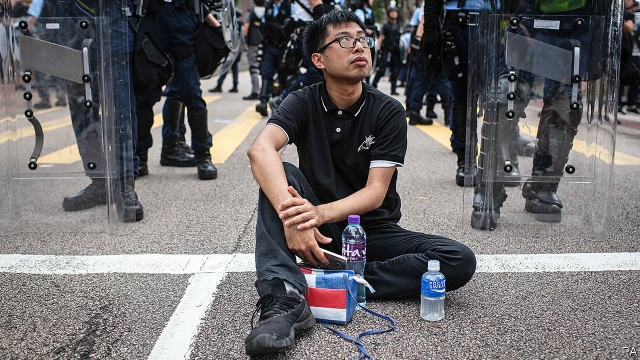

###### Pocarious position

# Taking sides in Hong Kong’s protests presents opportunities for firms 

 

> print-edition iconPrint edition | Business | Jul 18th 2019 

“SWEAT IS FUN!” insists Pocari Sweat, a Japanese soft drink loved by active types across Asia. This summer millions of Hong Kongers have taken up a new sport: marching, originally against a controversial extradition bill and increasingly in opposition to their territory’s pro-Beijing government. Many do so clutching bottles of the isotonic beverage. 

Pocari went from a source of hydration to a symbol of political resistance after a Facebook exchange on July 9th between Pocari Sweat Hong Kong and a customer revealed that it was withdrawing adverts from TVB, a local television network that pro-democracy activists say has portrayed them unfairly. In the statement Pocari Sweat said that it had taken a “proactive step” to urge TVB “to respond to public concern”. Pocari cans have since starred in dozens of revolutionary memes. 

Around the world consumer-facing companies have embraced progressive causes dear to the coveted demographic group of 20- and 30-somethings. In Hong Kong, however, corporate activism is complicated by consumer attitudes on the mainland, where anti-Beijing sentiment is often viewed as treasonous. 

Some companies side more or less openly with the protesters. Wonder Life, a Hong Kong maker of condoms, posted on Facebook that consumers’ objections about TVB had led it not to advertise on the channel. Others are more oblique. The Hong Kong arm of Cigna, an American insurer, said it would stop advertising on TVB and explained in a social-media post that “we are constantly reviewing our media planning strategies to promote our brand and our mission to be your health and well-being partner.” In June Ztore, a local e-commerce startup, tried to avert a boycott by distancing itself from a founder who backed the extradition bill. 

Just as appearing to stand up to the authorities can burnish corporate reputations, seeming to kowtow to them can do harm. Yoshinoya, a chain of Japanese restaurants which endeared itself with protesters after running a Facebook ad that seemed to mock heavy-handed Hong Kong policemen, faced a backlash when it deleted the ad and the boss of its Hong Kong franchise-owner told two newspapers that he had taken part in pro-police rallies. Online maps shared by protesters tag the chain as unfriendly to the cause. 

Some businesses fall foul of demonstrations through no clear fault of their own. Sun Hung Kai Properties is facing calls for a boycott of its 24 big shopping centres after some accused the developer, Hong Kong’s largest, of letting the police clash with protesters on its premises on July 14th. The company says it did not call the police and was unaware of the deployment. 

Firms with a presence on the mainland as well as in Hong Kong face the most delicate balancing act. Seeming to back protests may play well with Hong Kongers but backfires among mainland influencers. Last month Nike pulled a line of limited-edition trainers from being released in China after its Japanese designer’s opposition to the extradition bill prompted calls for a boycott on Chinese social media. 

Many brands are studiously trying to stay neutral. On July 10th Pizza Hut, which had stopped advertising on TVB days earlier, issued a statement to explain that its promotion had simply ended as scheduled. Three days later Tempo, which makes toilet paper, posted on Facebook, which is popular in Hong Kong, and on Weibo, the mainland’s biggest microblogging site, that it would carry on advertising with TVB, earning it plaudits from the Global Times, a Communist Party newspaper. 

Fearing a backlash Pocari’s mainland offices in Tianjin and Guangdong disassociated themselves from the Hong Kong branch. “We are two completely different entities,” they said in a statement. Headquarters in Japan has not weighed in publicly. On July 10th the Hong Kong arm posted a short statement on its Facebook page in which it apologised for any “inconvenience” caused by the conversation on July 9th. Marchers thirsting for undiluted political electrolytes may feel they are the ones who have been inconvenienced. ■ 

