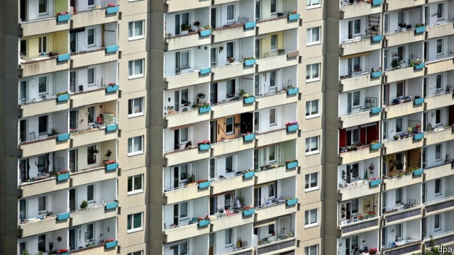

###### Thick as a brick

# Europe embraces rent controls, a policy that never works 

 

> print-edition iconPrint edition | Europe | Jul 20th 2019 

IN 1953 WORKERS in what was then East Germany protested against their Soviet overlords on Karl-Marx-Allee, a monumental boulevard in Berlin lined with Stalinist apartment blocks. The uprising was crushed. Earlier this year residents of the Allee, now yuppier, again took to the streets—to demand socialist policies. They called for big landlords’ properties to be expropriated and rents to be frozen in the capital. This time, the authorities listened. 

On June 18th legislators in Berlin voted to freeze rents for five years, excluding social housing and new-builds. The German capital thus joins a growing club of European cities implementing rent controls. Spain recently limited annual rent hikes, and Barcelona followed up with even stricter rules. Amsterdam is trying to stop investors buying up new-builds to rent them out expensively. On July 1st Paris reintroduced rent caps, which had been scrapped only in 2017. 

The proposal in Berlin is the most radical of these. Under new rules, rents that are deemed too high would be lowered. The law would be retroactive from June 18th, so that anyone who attempts to jack up prices before it is passed could be fined €500,000 ($563,000). Landlords who want to make renovations that would push up prices by more than €0.50 per square metre will have to seek approval. The decision could face challenges from the national government, but may become law early next year. 

In recent years cheap borrowing, low unemployment, an influx of foreign investment and population growth have helped to push up demand for houses across European cities. The rise of Airbnb, a home-stay site, and the relocation of companies due to Brexit, particularly to Frankfurt, Paris and Amsterdam, have accelerated the trend. Anger about gentrification and “over-tourism” may also have played a part in the Berlin proposal, as well as practices that have allowed certain rents to rise much faster than wage growth, pricing a lot of people out of the market. 

Economists warn that rent caps tend to have perverse effects. Landlords will often be tempted to skimp on repairs or may simply seek to sell their properties, as happened in Britain, where rent caps existed until the 1980s. Controls tend to deter investment in the housing market, thus aggravating the shortages that prompted them in the first place. The head of the German national housing association has already warned that member companies will build 50,000 fewer apartments over the next five years if the law is enacted. Shares in the company that is Germany’s biggest landlord tumbled on the day of the vote. In San Francisco, caps sharply decreased the supply of rental housing, driving up prices citywide by 5% after they were expanded in 1994. They encouraged landlords to demolish properties and build pricey new ones, since these were exempted, as would happen in Berlin. 

Critics argue that instead of trying to fix prices, cities should allow more homes to be built. Sebastian Czaja, an MP for the Free Democratic Party in Germany, says Berlin needs “a construction offensive”. The city has grown by about 50,000 people a year since 2011, but added only 10,000 new apartments per year. Berliners are not helping themselves: they have voted against developing a field the size of Monaco near the city centre, and halted plans to build on a huge patch of farmland nearby. Amsterdam is struggling to meet supply, too. It aims to build 1m new homes by 2030, but issued fewer than 10,000 permits last year. 

Rents in German new-builds are high partly because building regulations have become extremely stringent, says Michael Voigtländer of the German Economic Institute. Frédéric Cherbonnier of the Toulouse School of Economics says that in Paris large rent subsidies, which total 1% of GDP in France, have helped to push up prices and should be cut, since the benefits largely accrue to landlords, not renters. 

High rents are unlikely to come down soon. The European Central Bank is maintaining ultra-low interest rates, and urban migration will continue. If politicians really want to help renters, they should favour concrete-mixing, not price-fixing. ■ 

-- 

 单词注释:

1.Jul[]:七月 

2.overlord['әuvәlɒ:d]:n. 大君主, 最高君主, 霸主 [法] 霸权, 霸主地位, 封建君主 

3.monumental[.mɒnju'mentәl]:a. 纪念碑的, 做为纪念的, 不朽的 

4.boulevard['bu:lәvɑ:d]:n. 林荫大道 

5.Berlin[bә:'lin]:n. 柏林, (软质)柏林毛线 

6.Stalinist['stalinist]:n. 斯大林主义者 a. 斯大林主义的；斯大林的 

7.uprise[ʌp'raiz]:n. 升起, 起立, 上山坡, 出现 vi. 上升, 起义, 出现 

8.allee[æ'lei]:(林荫)小径 

9.expropriate[eks'prәuprieit]:vt. 剥夺, 没收, 征用 [法] 征用, 没收, 剥夺...的所有权 

10.legislator['ledʒisleitә]:n. 立法者, 立法官, 立法委员 [法] 立法者, 立法机关成员, 立法委员 

11.Spain[spein]:n. 西班牙 

12.hike[haik]:n. 徒步旅行, 远足, 涨价, 提高 vi. 步行, 徒步旅行, 上升 vt. 使高涨, 拉起 

13.Barcelona[.bɑ:si'lәunә]:n. 巴塞罗那 

14.Amsterdam[.æmstә'dæm]:n. 阿姆斯特丹(荷兰首都) 

15.investor[in'vestә]:n. 投资者 [经] 投资者 

16.expensively[]:adv. 昂贵地；乱花钱地 

17.reintroduce[ri:intrә'dju:s]:vt. 再引进, 再介绍 

18.scrap[skræp]:n. 碎片, 残余物, 些微, 片断, 铁屑, 吵架 vt. 扔弃, 敲碎, 拆毁 vi. 互相殴打 a. 零碎拼凑成的, 废弃的 

19.deem[di:m]:v. 认为, 相信 

20.retroactive[.retrәu'æktiv]:a. 反动的, 追溯的, 有追溯效力的 [经] 有追溯效力的 

21.jack[dʒæk]:n. 插座, 千斤顶, 男人 vt. 抬起, 提醒, 扛举, 增加, 提高, 放弃 a. 雄的 [计] 插座 

22.renovation[.renәu'veiʃәn]:n. 革新, 刷新, 修理 [化] 改建 

23.influx['inflʌks]:n. 流入, 河口, 汇集 [医] 注入, 流入 

24.Airbnb[]:爱彼迎（美国短租平台） 

25.relocation[.ri:lәu'keiʃәn]:n. 再布置, 变换布置 [经] 重新安置 

26.Brexit[]:[网络] 英国退出欧盟 

27.frankfurt['fræŋkfәt]:n. 牛肉香肠, 猪牛肉混合香肠 

28.gentrification[ˌdʒentrifiˈkeiʃən]:n. 中产阶级化 

29.economist[i:'kɒnәmist]:n. 经济学者, 经济家 [经] 经济学家 

30.perverse[pә'vә:s]:a. 乖张的, 故意作对的, 有悖常情的, 执迷不悟的, 歪曲的, 错误的, 不正当的 [法] 邪恶的, 罪恶的:堕落的, 不合法的 

31.skimp[skimp]:vt. 少给, 克扣 vi. 吝啬 a. 少的, 不足的 

32.deter[di'tә:]:vt. 制止, 吓住, 威慑 

33.aggravate['ægrәveit]:vt. 使恶化, 使更严重, 加重 

34.enact[i'nækt]:vt. 制定法律, 扮演, 颁布 [法] 法令, 法规, 条例 

35.san[sɑ:n]:abbr. 存储区域网（Storage Area Networking） 

36.francisco[fræn'siskәu]:n. 弗朗西斯科（男子名, 等于Francis） 

37.rental['rentl]:n. 租费, 租金收入 a. 租赁的, 收取租金的 

38.citywide['siti.waid]:a. 全市的, 全市性的 

39.demolish[di'mɒliʃ]:vt. 毁坏, 破坏, 粉碎 

40.pricey['praisi]:a. 昂贵的, 价格高的 

41.exempt[ig'zempt]:n. 免税者, 被免除义务者 a. 免除的 vt. 使免除, 豁免 

42.sebastian[si:'bæstjәn]:n. 塞巴斯蒂安（男子名） 

43.MP[]:国会议员, 下院议员 [计] 宏处理程序, 维护程序, 线性规划, 微程序, 多处理器 

44.offensive[ә'fensiv]:a. 令人不快的, 侮辱的, 攻击性的 [法] 攻击的, 进攻的, 冒犯的 

45.Berliner[bә'linә]:n. 柏林市民 

46.Monaco['mɒnәkәu]:n. 摩纳哥 

47.farmland['fɑ:mlænd]:n. 农田 

48.stringent['strindʒәnt]:a. 迫切的, 严厉的, 银根紧的 [医] 约束的, 紧迫的 

49.michael['maikl]:n. 迈克尔（男子名） 

50.cherbonnier[]:谢博尼耶 

51.toulouse[tu:'lu:z]:n. 图卢兹（法国南部城市） 

52.accrue[ә'kru:]:vi. 自然增加, 产生 [经] 应计, 产生, 出现 

53.renter['rentә]:n. 承租人, 佃户, 出租人 [经] 租赁人, 租户, 出租人 

54.migration[mai'greiʃәn]:n. 移民, 移往, 移动 [计] 迁移 

