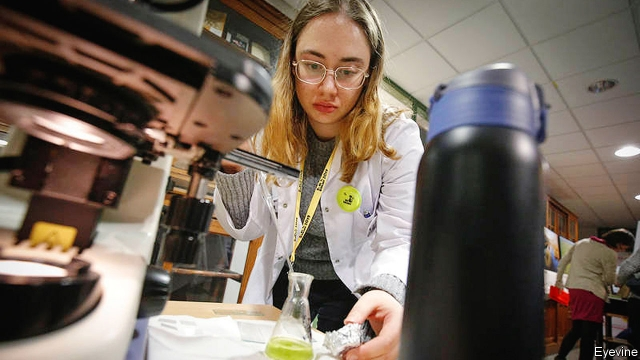

###### Ladies of the lab

# Why half the scientists in some eastern European countries are women 

 

> print-edition iconPrint edition | Europe | Jul 20th 2019 

SCIENCE IS STILL a man’s world. Since 1903, when Marie Curie first won the Nobel Prize, almost 600 blokes but only 19 women have taken home the coveted award in physics, chemistry or medicine. In the realms of more ordinary talent, just 28% of the world’s researchers are women. Even in the EU, where the sexes are more equal than in other parts of the world, a mere two-fifths of scientists and engineers are women. In Germany and Finland, it is less than one in three. 

Eastern Europe bucks the global trend, according to a recent report from Leiden University in the Netherlands. In Lithuania, 57% of scientists and engineers are women. Bulgaria and Latvia follow close behind, at 52%. Universities in Poland and Serbia were ranked among the best in the world for sexual equality in research publications. South-east Europe is roughly at parity: 49% of scientific researchers in the region are women. Some of this is a legacy of Soviet times, when communist regimes pressed both men and women into scientific careers and did not always give them a choice about it. The coercion has gone, but the habit of women working in labs has remained. 

In Europe today, campaigners to get more women into top boffin jobs complain of a “leaky pipeline”: many women end their involvement with STEM subjects (science, technology, engineering and maths) after finishing college. However, a study by Microsoft finds that female role models strongly increase girls’ interest in these subjects. 

According to the European Institute for Gender Equality, closing the gap between men and women in STEM would lead to an increase in the EU’s GDP per capita by at least 3% by 2050 and create over 1.2m jobs. Over the past decade, employment in Europe’s tech sector has grown four times faster than overall employment. But the European Commission predicts that by 2020, the region’s growth could be hampered by a shortage of 500,000 information and communications technology (ICT) workers. 

In 2017 more than half of EU businesses that tried to recruit ICT specialists had trouble filling the vacancies. Lithuania, which has Europe’s narrowest employment gap between the sexes, and Bulgaria, which has the highest proportion of women in ICT specialised jobs in the region, found it easier.■ 

-- 

 单词注释:

1.Jul[]:七月 

2.marie['mɑ:ri(:), mә'ri:]:n. 玛丽（女子名） 

3.curie['kjuәri]:n. 居里 [化] 居里(放射性强度单位) 

4.Nobel['nәubel]:n. 诺贝尔 

5.bloke[blәuk]:n. 小子, 家伙 

6.covet['kʌvit]:v. 妄想, 垂涎 

7.physic['fizik]:n. 药品, 泻药, 医学 vt. 给...服药, 治愈, 使通便 

8.EU[]:[化] 富集铀; 浓缩铀 [医] 铕(63号元素) 

9.Finland['finlәnd]:n. 芬兰 

10.les[lei]:abbr. 发射脱离系统（Launch Escape System） 

11.buck[bʌk]:n. 元, 雄鹿, 纨绔子弟, 鞍马, 培克(赌博时的庄家标志), 碱水, 自夸, 谈话 vi. 马背突然拱起, 反对, 吹牛, 闲聊 vt. 马背突然拱起将骑手摔下, 反对, 用碱水洗 a. 雄的 

12.leiden['laidən]:n. 莱顿市（荷兰西部城市）；莱顿（大学名称） 

13.Netherlands['neðәlәndz]:n. 荷兰 

14.lithuania[,liθju(:)'einjә, -niә]:n. 立陶宛 

15.Bulgaria[bʌl'^eәriә]:n. 保加利亚 [经] 保加利亚 

16.Latvia['lætviә]:n. 拉脱维亚 

17.Poland['pәulәnd]:n. 波兰 

18.serbia['sә:bjә]:n. 塞尔维亚（南斯拉夫成员共和国名） 

19.legacy['legәsi]:n. 祖先传下来之物, 遗赠物 [经] 遗产, 遗赠物 

20.regime[rei'ʒi:m]:n. 政权, 当权期间, 政体, 社会制度, 体制, 情态 [医] 制度, 生活制度 

21.alway['ɔ:lwei]:adv. 永远；总是（等于always） 

22.coercion[kәu'ә:ʃәn]:n. 强迫, 威压, 高压统治 [法] 强迫, 强制, 高压统治 

23.campaigner[kæm'peinә]:n. 从军者, 老兵, 竞选者 

24.boffin['bɒfin]:n. 研究员, 科学工作者 

25.leaky['li:ki]:a. 有漏洞的, 易泄漏秘密的, 爱哭的 [电] 漏的 

26.involvement[in'vɔlvmәnt]:n. 卷入, 牵连, 包含, 困窘 [经] 财政困难, 经济上的困窘 

27.Microsoft[]:n. (美国)微软公司 [电] 微软公司 

28.gender['dʒendә]:n. 性 vt. 产生 

29.capita['kæpitә]:[医] 头 

30.tech[tek]:n. 技术学院或学校 

31.sector['sektә]:n. 扇形, 部门, 部分, 函数尺, 象限仪, 段, 区段 vt. 把...分成扇形 [计] 扇面; 扇区; 段; 区段 

32.hamper['hæpә]:n. 食篮, 阻碍物, 食盒 vt. 阻碍, 使困累, 妨碍, 牵制 

33.ict[]:abbr. 结缔组织炎症（Inflammation of Connective Tissue）；粘土工艺学会（Ins-tit 

34.vacancy['veikәnsi]:n. 空, 空白, 空缺, 空虚, 空闲 [化] 空位 

35.specialise['speʃә,laiz]:vt. 特加指明, 列举, 使专门化, 限定...的范围 vt.vi. (使)特化, (使)专化 vi. 成为专家, 专务, 专攻, 专门研究, 逐条详述 

