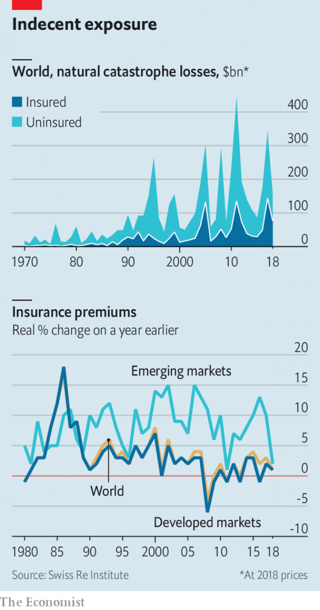

###### Run for cover

# The future of insurance is happening without insurance firms 

 

> print-edition iconPrint edition | Finance and economics | Jul 20th 2019 

EVERY MORNING, from a room in Birmingham, some of the world’s largest firms are briefed by phone on the weather in store. As continents, arrows and weather fronts flicker across their screens, meteorologists at The Weather Company (TWC) help British grocers decide whether to stock soups or salads, and Chinese energy firms when to operate wind turbines. Yet such sessions are getting rarer. Computed by 172 models crunching 400 terabytes of data—33 times the amount Twitter stores every 24 hours—most of TWC’S 25bn daily forecasts now feed directly into customers’ computer systems. 

Big data has turned weather into a big business. TWC, which was bought by IBM in 2016, serves governments, media channels and 40% of the world’s airlines. But many property insurers, whose fortunes rely on forecasting climate-induced losses, are still learning how to use the information, says Leon Brown of TWC. Their cluelessness is symptomatic of a problem for all insurance lines, including casualty, life and health. Reinsurance firms (which insure the insurers) and Asian insurance champions are almost the only innovators in an industry that is moving at a glacial pace. 

Meanwhile the risks insurers are meant to cover are becoming more severe and unpredictable. Since the 1980s average annual losses from natural disasters have more than sextupled in real terms (see chart). Other risks are variations on old themes, such as pandemics or the fallout from increasing protectionism. And new ones have emerged. Ageing populations push up health-care costs. Cyber-attacks can shut power plants, paralyse firms and siphon fortunes from banks’ coffers. 

 

Insurable assets are becoming harder to value and protect, too. In 2018 “tangibles”, such as buildings and equipment, accounted for just 16% of the value of the S&P 500. “Intangibles”, such as intellectual property and reputation, accounted for the other 84%. Meanwhile insurers’ products and processes are losing touch with 21st-century life, from the way populations work to the way they drive. A generation born digital expects speed and style, which do not come naturally to the centuries-old trade. 

Insurers say they have read the memo. AXA, the world’s second-largest by premiums written, has earmarked millions for tech upgrades and designing services that complement its policies, says Guillaume Borie, its innovation chief. But the sector comes second to last in an innovation ranking by BCG, a consultancy. No insurer ranks among the world’s top 1,000 public companies by amount invested in research and development. Insurers allocate an average of 3.6% of their revenue to computing technology—about half the share that is typical for banks. In a study of 500 innovation topics across 250 firms Ninety, a consultancy, finds that many insurers are working on the same narrow set of ideas. Some of the noisiest, such as blockchain, are the least productive. 

Digital entrepreneurs have spied an opening. The first quarter of 2019 saw a record 85 “insurtech” deals totalling $1.42bn, according to Willis Towers Watson, a broker. Some focus on the consumer, aiming to simplify quotations, make policies clearer and develop snazzy apps. Some seek to make internal processes cheaper, faster and fairer, from pricing risks to paying compensation. The most ambitious craft policies that insure against new threats, match modern lifestyles or do more than just make payouts. 

Slice, a startup in New York, offers policies to flat- or ride-sharers that cover single items for a few days. Brooklyn-based Trupo provides disability insurance to “gig” workers, from makeup artists to Uber drivers. Bought by Many, a British startup, caters to people with niche possessions, for example model railways or exotic pets. 

Small and specialist incumbents are seeking to insure businesses against new risks, such as environmental liability or terrorism. In April a group led by Beazley, a 33-year-old British firm, launched a policy covering reputational damage. Using share-price drops as the trigger, it provides compensation and a crisis-management package. It prices risk by scraping information from social media and analysing the impact of past meltdowns. On June 25th a group of underwriters at Lloyd’s of London launched a £53m ($66m) facility designed to speed up product development. 

But spotty innovation does not make up for a stagnating core. In theory, startups should provide valuable additions to insurers’ toolbox. Yet incumbents often dismiss insurtechs as “cute” little things that fail to grasp complexities, says Heidi Lawson of Cooley, a law firm. Administrative costs absorb 20-50% of incumbents’ premiums. A quote for home coverage is often a multiple-choice hell, with cascading options depending on such matters as whether you own a shed or keep bees. Businesses can wait months for a policy’s final wording. “It’s just so depressing,” says an industry veteran. 

The growing abundance of data means customers increasingly think they can do without insurance altogether. The portion of the economy that is covered is shrinking. In developed countries total non-life insurance premiums have grown by 1.2% a year on average since 2008; life has seen an average decline of 0.5%. Despite increased take-up by rising middle classes in emerging markets, global premiums grew in real terms by only 1.3% annually over the period, to $5.2trn. The world economy managed twice that. 

The result is a “protection gap”. On average, over the past ten years, only 30% of catastrophe losses were covered by insurance, according to Swiss Re, a reinsurer. The balance, worth some $1.3trn, was borne by individuals, firms and governments. According to Capgemini, a consultancy, less than a quarter of businesses feel their insurance coverage is adequate. That fell below 15% for personal lines, and even further for health, cyber- and political risks. 

A central reason for insurers’ caution is the fear that regulators will punish them for unwittingly taking on bad risks—or because some new, AI-powered underwriting method is found to be rejecting or overcharging consumers from certain ethnic groups or neighbourhoods. That creates a culture of “trying not to change anything, not to break things”, says Dan White of Ninety. Moreover, waves of consolidation mean insurers have disconnected datasets and computer systems, making it hard to innovate or to absorb successful startups. 

Other weaknesses are less excusable. Mr White describes a typical sequence. Starting from the premise that innovation is good, insurers try to make it “part of the DNA”. Facing internal resistance, those pressing for change shift to an “arm’s-length model”. Many insurers have set up innovation “labs”, “studios” or “garages” where pricey data scientists are told to come up with cool new pilots. Located separately, they operate under different rules: they have beer fridges and pool tables, and staff wear jeans and commute on scooters. 

Then staff at the parent firm get disgruntled with their rule-breaking peers—who, for their part, have not been given the budget to build anything sizeable. So the parent firm’s return on investment is poor. Eventually the labs are closed or mothballed. Firms then give their money to venture-capital funds, run internally or by third parties. But these are designed to bet on startups, not to perfect processes at lumbering giants. Three of Europe’s top six insurers have recently frozen or shrunk their main technology-investment arms. 

Insurers’ apathy is energising reinsurers to innovate in their stead. As the primary insurers that do their distribution lose touch with the market, the reinsurers feel cut off. Reinsurers are also less strangled in red tape. Munich Re, the world’s largest, is in front. It has hired 200 data scientists and trained over 100 experts internally, and crowdsources ideas from staff. Good ideas are fast-tracked; duds are killed quickly, says Tom Van den Brulle, its innovation chief. Last year it paid $250m for relayr, a startup in Berlin that uses sensors to extract data from industrial machinery. 

Reinsurers’ greatest breakthrough so far is probably “parametric insurance”. Rather than compensating for losses reported ex-post, such policies pay out a pre-agreed sum when a clearly defined parameter, such as rainfall or seismic magnitude, reaches a pre-agreed threshold. Since debuting in the 1990s, parametric insurance has mostly been confined to the reinsurance of catastrophic events. But the spread of internet-connected objects creates the potential for it to be applied to previously uninsurable risks. Gerry Lemcke of Swiss Re, which offers parametric insurance against pandemics, flight delays and hurricane damage to coral reefs, sees it as working rather like derivatives in finance, which have a strike price. Customers receive their payouts straight away; insurers save the time and cost of adjusting claims. 

Reinsurers could soon shake up the market further. In recent years third-party capital providers such as pension and sovereign-wealth funds have sought to deploy vast sums in reinsurance markets. That has prompted reinsurers to set up money-management platforms, akin to betting interfaces, where investors can punt on various classes of risk. As a result reinsurers are keen to take on a broadening range of risks directly, by seeking to work with insurtechs and cutting primary insurers out altogether. “They’re calling us,” says Ms Lawson. “They’re looking for deals.” 

Asian giants are also pulling ahead of Western peers. Pia Tischhauser of BCG reckons they are “15 years ahead” on innovative ways to price risk. In China Ping An, which in the 30 years since its founding has become the world’s most valuable insurer, employs 23,000 researchers, spends 1% of revenue on innovation and has over 12,000 patent applications. Its average underwriting time has fallen from five days to 15 minutes; it uses AI to recruit and train its 1.5m-strong army of agents, who are 50% more efficient than the competition. Yet in November its chief executive ruled out major international acquisitions, preferring to focus on domestic expansion. 

For Western incumbents, the greater risk may lie closer to home. Rumours are growing that Big Tech is gearing up to enter insurance. Amazon, Apple and Google have troves of data and idle capital; they lack underwriting skills but can easily lure talent. And they can hope for handsome profits: BCG calculates that the top quarter of insurance firms returned a median 24% to shareholders in 2018. Scaremongering, sceptics say. But an adviser to tech titans is adamant. “We’re seeing what’s happening behind the scenes. They’re on the path.” ■ 

