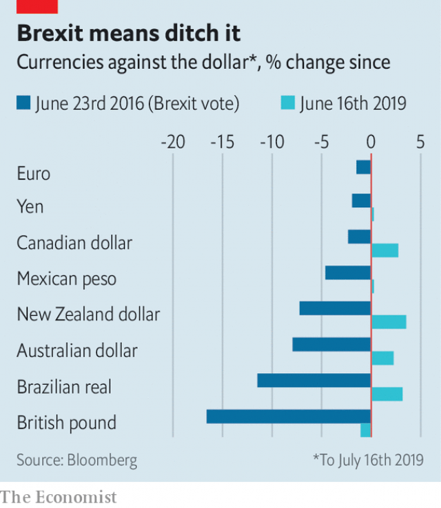

###### Global Britain

# The pound’s slide is about more than Brexit 

 

> print-edition iconPrint edition | Finance and economics | Jul 20th 2019 

IN THE WEE hours of June 24th 2016 the pound plunged. The unexpected victory of the Leave campaign in the Brexit referendum meant sterling lost 7% in a single day. Three years later the pound is falling once again. It is now at a two-year low, having fallen by 5% against the dollar since April—and 1% in the past month, the worst performance of any big currency (see chart). Many Britons ascribe any movement in the pound to the twists and turns of the Brexit saga. The cause of its recent slide is, however, more complicated. 

Sterling has been weaker since the referendum because the prospect of Brexit has led economists to cut their forecasts for economic growth. It reached a low in October 2016 when Theresa May, the prime minister, promised a “hard” Brexit. Yet it appreciated fairly steadily in 2017 and 2018. 

 

This was in part because the economy was surprisingly strong. GDP grew only slightly more slowly in 2016-18 than before the referendum. Unemployment fell to multi-decade lows. Despite Mrs May’s best efforts, traders came to believe that the most likely outcome was a “soft” Brexit—that is, a customs union with the European Union and membership of the single market—and thus less economic harm. 

The pound’s recent fall started in April, shortly after the EU agreed to delay Brexit to October 31st. Some traders worried that it would brook no further delay. Yet global factors played a greater role. Around May traders began to panic about the effect of a trade war between America and China on global economic growth. That prompted “derisking”—moving assets out of countries highly reliant on inflows of foreign capital. Britain, which runs a large current-account deficit, saw its currency depreciate. But so did Australia and New Zealand, points out Kamal Sharma of Bank of America Merrill Lynch. Both countries also run large current-account deficits. 

Since then worries about the trade war have eased—to be replaced by a fresh concern, the health of Britain’s economy. In June the statistics office alarmed analysts by revealing that GDP had fallen in April by 0.4%, although May was better. Other survey data suggest that Britain registered no economic growth in the second quarter of the year (see Britain section). Together with a series of data releases showing that measures of domestically generated inflation are soft, that makes it less likely that the Bank of England will raise interest rates. 

Sterling’s fall has accelerated in the past week, as the two contenders to replace Mrs May have vied to sound more macho on the need to leave the EU on October 31st, with or without a withdrawal deal. Even now, few if any analysts believe that a no-deal exit is the most likely outcome. But many are on the brink of changing their mind. If no-deal starts to be priced in, the pound will have much further to fall. ■ 

